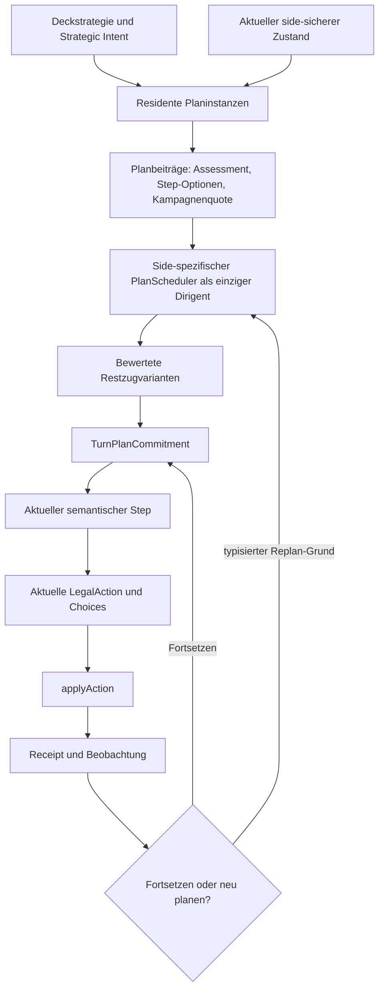

# KI-Zug- und Kampagnenplaner – Gesamtkonzept

Status: **Entwurf zur externen Architekturprüfung**

Stand: 2026-07-29

Primärer Agent:
`card-enablement-ai-knowledge-agent`

Betroffener Zielvertrag:
`docs/architecture/ai/ai-plan-layer-target-state-wip.md`

Auslösende Spielanalyse:
Match `match_9b60842fe75c0b39`, Entscheidungen D1 bis D7, insbesondere die
inkohärente Folge D3 bis D5.

## 1. Zweck

Dieses Dokument beschreibt die geplante Erweiterung der produktiven
Plan-first-KI um:

1. einen zentralen Zugplaner als alleinigen Dirigenten der Planbeiträge;
2. eine rollierende Variantenplanung für den Rest des aktuellen Zuges;
3. residente, zugübergreifende Kampagnen mit explizitem Fortsetzungswert;
4. bindende, aber revalidierbare Zugentscheidungen;
5. typisierte Gründe für Fortsetzung, Unterbrechung und Neuplanung;
6. eine klare Trennung zwischen aktuellem LegalAction-Schritt, Zugplan und
   mehrzügigem strategischem Vorhaben.

Das Dokument ist bewusst ein Konzept- und Umsetzungsartefakt. Es verändert
noch keinen Produktivcode und keine KI-Gewichte. Nach externer Prüfung sollen
die bestätigten Festlegungen in den führenden Zielvertrag übernommen und
danach paketweise implementiert werden.

## 2. Ausgangsbefund

### 2.1 Retrospektive Ausgangslage

Die Notwendigkeit eines Zug- und Kampagnenplaners war nicht von Beginn an in
dieser Schärfe sichtbar. Sie ist das Ergebnis mehrerer Entwicklungsstufen und
vollständiger Spielanalysen.

Die frühere KI musste zunächst grundlegendere Probleme lösen:

- Aktionen mussten zuverlässig aus `LegalActions` statt aus selbst
  erfundenen Befehlen gewählt werden;
- sichtbare Karten- und Aktionssemantik musste strukturiert in die Bewertung
  gelangen;
- konkrete Gefahren, Scorefenster, Runpfade, Kosten und Ziele mussten
  überhaupt erkannt werden;
- einzelne Aktionen mussten einem fachlichen Plan statt nur einem globalen
  Rohscore zugeordnet werden;
- mehrere relevante Vorhaben mussten als residentes Portfolio erhalten
  bleiben;
- Support-, Parent-, Ressourcen- und Reaktionsbeziehungen mussten eine klare
  Ownership erhalten;
- spielgleiche Decision-Checkpoints mussten nicht nur einzelne Hilfswerte,
  sondern den produktiven Chooser samt Runtime-Memory prüfen.

Solange diese Grundlagen fehlten, ließen sich viele Fehlentscheidungen
tatsächlich auf enge Ursachen zurückführen:

- falsche oder fehlende Kartensemantik;
- unvollständige Kostenquote;
- falsche Targetbewertung;
- fehlender Schutz- oder Scorebonus;
- zu breiter Draw-, Economy- oder Wiederholungsbonus;
- fehlende Parentbindung;
- unzulässiges vorzeitiges Zugende.

Diese Fehler wurden schrittweise und sinnvoll auf ihren jeweiligen Schichten
behoben. Erst nachdem die Einzelaktionen semantisch besser, die Pläne resident
und die Ausführungsautorität Plan-first geworden waren, trat deutlicher
hervor: Auch mehrere lokal korrekt bewertete Planentscheidungen ergeben nicht
automatisch einen stimmigen Zug.

### 2.2 Entwicklung der vorhandenen Architektur

Die heutige Ausgangslage lässt sich als Abfolge fachlich notwendiger Schritte
verstehen:

| Entwicklungsstufe | Gelöstes Problem | Verbleibende Grenze |
| --- | --- | --- |
| semantische Aktionsbewertung | LegalActions erhalten Kosten-, Ziel-, Karten- und Taktikbedeutung | Aktionen konkurrieren noch lokal |
| Tactical Plans und PlanMemory | mehrstufige Absichten können Aktion und Folgeaktion verbinden | nur ausgewählte Planfamilien und Sequenzen |
| PlanPortfolio und Remote-Doktrin | Vordergrund, Background, Cadence, Meilensteine und Support werden resident | Portfolio meldet mehrere sinnvolle Vorhaben, entscheidet aber noch keinen vollständigen Zug |
| Plan-first-Cutover | nur Pläne handeln; genau ein Leaf-Executor besitzt den aktuellen Step | Scheduler wählt weiterhin pro StateVersion primär den nächsten Step |
| Parent-/Need-/Ressourcenvertrag | Funding und Support werden einem exakten Root zugeordnet | die Bindung garantiert noch nicht, dass der Restzug den finanzierten Meilenstein verfolgt |
| Decision-Checkpoints | historische Situationen und Runtime-Memory werden spielgleich reproduzierbar | Einzelcheckpoints zeigen Fehlergrenzen, aber noch keine allgemeine Restzugoptimierung |
| aktuelle Sequenzhärtungen | Cadence, Funding-Revalidation, EndTurn, Score- und Defense-Folgen werden enger | viele Einzelfixes approximieren bereits Zugplanung, ohne einen gemeinsamen Zugvertrag zu besitzen |

Der vorgeschlagene Zugplaner ist damit keine Abkehr von der bisherigen
Architektur. Er ist die nächste logische Verdichtung: Die bereits vorhandenen
Planinformationen werden erstmals gemeinsam über den Rest des Zuges
koordiniert.

### 2.3 Wiederkehrende Beobachtungen aus Spielanalysen

Mehrere frühere Analysen zeigten bereits Teilaspekte des heutigen
Gesamtproblems:

| Beobachtung | Beleg im Projekt | damalige enge Korrektur | verbleibende übergreifende Frage |
| --- | --- | --- | --- |
| wiederholte Background-Economy verdrängt Zentralverteidigung | Match 7BFE/B008 und Aufbau der Decision-Checkpoint-Testzone | finite Economy gibt akuter Board-Triage den Vordergrund; Cadence wird berücksichtigt | wie vergleicht die KI die vollständige Economy- und Defense-Linie für den ganzen Zug? |
| eine Hintergrundbank wird in demselben Zug wiederholt geladen, obwohl produktive Alternativen existieren | Match 20EB | weiche Normalfrequenz und Amortisationshorizont | wie wird der Wert der ersten Aktion gegen die restlichen Aktionen desselben Zuges gerechnet? |
| ein Entwicklungs-/Fundingplan wird zu starr festgehalten und verdrängt einen dringlichen erreichbaren Run | Match 7D14, D105/D106 | enge Revalidation gegen dringlichen Run-Payoff | wann soll Kontinuität schützen und wann muss ein Challenger die Linie wirklich brechen? |
| Funding wird begonnen, aber die konkrete Konversion erfolgt nicht rechtzeitig | mehrere Runner-Funding- und Corp-Defense-Fälle; besonders Match F809 D13–D15 und D32–D34 | Same-Turn-Konvertierbarkeit, Parentbindung und konkrete Defense-Folge | wie wird schon vor dem Funding geprüft, welcher Zugendzustand nach Funding plus Konversion entsteht? |
| eine Sequenz ist einzeln korrekt, ihre Startentscheidung aber nicht ausreichend gegen Alternativen bewertet | Match F809 D37–D39 | spätere Advancement-Schritte als kohärente Fortsetzung anerkannt; Startentscheidung offen gelassen | wie bewertet man vor der Installation den vollständigen Score-Horizont samt Gegnerreaktion? |
| unvollständige Bewertung lässt produktive Aktionen verschwinden und kann vorzeitiges Zugende legitimieren | First-Turn-/EndTurn-Regression aus Match 3AAC | `unknown` darf keine Routenausschöpfung beweisen; Parent-Funding und EndTurn gehärtet | welcher positive Restzugplan soll statt bloßer Nicht-EndTurn-Sperre verfolgt werden? |
| nicht sofort rezfähiges ICE kann als Vorbereitung oder Bluff sinnvoll sein | Match F809 D45 | eng begrenztes Defense-Staging | wie wird diese Variante gegen Ansparen, andere ICE-Ziele und andere Zuglinien ganzheitlich verglichen? |
| Agenda-, Remote-, Defense- und Economy-Phasen besitzen korrekte lokale Ownership | Planportfolio-, Remote-Doktrin- und Plan-first-Verträge | Root-/Leaf-, Need- und Phasenbindung | wer entscheidet, wie lange im aktuellen Zug welcher Planbeitrag verfolgt wird? |

Führende Belegartefakte für diese Entwicklung sind insbesondere:

- `docs/architecture/ai/ai-decision-checkpoint-testzone-process-2026-07-12.md`;
- `docs/reviews/ai/ai-match-7bfe-b008-decision-checkpoint-final-review-2026-07-12.md`;
- `docs/reviews/ai/ai-match-20eb-eurocorpse-remediation-final-2026-07-17.md`;
- `docs/reviews/ai/match-7d14-runner-remediation-final-2026-07-16.md`;
- `docs/architecture/ai/ai-first-turn-end-turn-regression-process-2026-07-26.md`;
- `docs/architecture/ai/ai-planportfolio-remote-doctrine-contract.md`;
- `docs/reviews/ai/match-f809-corp-defense-remediation-final-review-2026-07-29.md`;
- `docs/architecture/ai/ai-plan-layer-target-state-wip.md`.

### 2.4 Warum die fehlende Ebene erst jetzt klar erkennbar ist

Retrospektiv wirkt ein Zugdirigent selbstverständlich. Praktisch wäre eine
frühere Einführung jedoch auf unsicheren Grundlagen aufgebaut worden:

- ohne verlässliche Action-Semantik hätte er falsche Varianten verglichen;
- ohne LegalAction- und Engine-Quotes hätte er zukünftige Regeln und Kosten
  nachbauen müssen;
- ohne residente Planinstanzen hätte er keine zugübergreifenden Ziele
  fortsetzen können;
- ohne Parent-/Need-Vertrag hätte er Funding keinem konkreten Zweck
  zugeordnet;
- ohne genaue Decision-Checkpoints wäre nicht prüfbar gewesen, ob ein
  Zugplaner wirklich besser oder nur anders entscheidet;
- ohne Plan-first-Cutover wäre ein Dirigent nur ein weiterer Override über
  einer konkurrierenden Action-Score-Ebene geworden.

Die bisherige Entwicklung hat deshalb nicht „den Zugplaner vergessen“,
sondern dessen Voraussetzungen geschaffen. Die aktuelle Lücke wird sichtbar,
weil die darunterliegenden Schichten inzwischen genug richtige Information
liefern, aber noch keine gemeinsame zeitliche Entscheidung über einen ganzen
Zug herbeiführen.

### 2.5 Verdichtete Problemthese

Die bisherigen Analysen zeigen zwei entgegengesetzte Fehlrichtungen:

1. **zu wenig Bindung:** Ein sinnvoll begonnener Plan wird ohne neue
   Information vom nächsten lokalen Sieger verdrängt.
2. **zu viel Bindung:** Ein schwach gewordener Plan wird trotz einer
   materiell besseren oder dringlicheren neuen Linie starr fortgesetzt.

Ein pauschal „sticky“ gemachter Plan löst daher das Problem ebenso wenig wie
eine vollständige Neuwahl nach jeder Aktion.

Benötigt wird eine mittlere, ausdrücklich modellierte Ebene:

- vor der ersten Aktion mehrere vollständige Restzugvarianten vergleichen;
- die ausgewählte Linie als Ziel- und Ressourcencommitment binden;
- nach jeder Aktion das tatsächliche Ergebnis prüfen;
- ohne neue materielle Information stabil fortsetzen;
- bei klar definierten Ereignissen den verbleibenden Zug neu planen;
- zugübergreifende Kampagnen am Zugende erhalten.

### 2.6 Unmittelbarer Auslöser: beobachtete Entscheidungsfolge

Im analysierten ersten Corp-Zug trat folgende Folge auf:

| Decision | Beobachtung | damaliger Planbezug | Bewertung |
| --- | --- | --- | --- |
| D1 | Setup-Choice auflösen | Pflichtfenster | verfahrensbedingt |
| D2 | Mandatory Draw | Pflichtfenster | erzwungen |
| D3 | einen Credit nehmen | Root `corp.defend_servers`, Support `corp.economy` | als Finanzierung eines konkret erkannten Defense-Bedarfs bedingt sinnvoll |
| D4 | Karte in neuem Remote installieren | `corp.ambush_and_bluff` | Bruch der gerade finanzierten Defense-Linie ohne typisierten Abbruchgrund |
| D5 | bei bereits ausgeschöpfter Handkapazität ziehen | `corp.hand_and_agenda_management`, Root `corp.score_agenda:general` | klarer Fehler; der Draw erzwingt einen Discard und verdrängt weiter die Zentralverteidigung |
| D6 | Zug beenden | kein Klick mehr | erzwungen |
| D7 | Karte abwerfen | Pflichtfolge aus D5 | nicht die primäre Fehlerursache |

D3 ist isoliert nicht der entscheidende Fehler. Der Fehler liegt in der
fehlenden Kohärenz der Folge: Die KI erkennt und finanziert einen
Defense-Bedarf, bindet diese Finanzierung aber nicht an eine bewertete
Restzuglinie. Bereits bei der nächsten freiwilligen Entscheidung erhält ein
anderer Plan die Ausführungsautorität, obwohl kein belastbarer neuer Umstand
eingetreten ist.

### 2.7 Bereits klar lokalisierte Einzelursache

Der D5-Draw besitzt zusätzlich eine lokale, klare Ursache in
`packages/ai/src/runtime/plan-first-live-runtime.ts`:

- `exactCurrentCorpScoreMaterialDrawCandidate` akzeptiert den Basic Draw,
  bevor `corpDrawCandidatePreservesHandCapacity` geprüft wird;
- die Disposition nimmt einen als `draw-for-score-material` gebundenen Draw
  anschließend von der normalen Kapazitätssperre aus;
- dadurch kann ein Basic Draw bei voller Hand als produktive
  Scorematerial-Route zugelassen werden.

Diese Einzelursache muss behoben werden. Sie erklärt aber nicht allein den
Planwechsel D3 → D4 und auch nicht das strukturelle Problem, dass mehrere
lokal plausible Pläne keinen gemeinsamen vollständigen Zug ergeben.

### 2.8 Strukturelle Ursache

Der aktuelle `PlanScheduler` führt pro Entscheidung im Kern aus:

1. Portfolio reconciliieren;
2. alle bereiten Planinstanzen bewerten;
3. genau eine Bewertung auswählen;
4. genau einen aktuellen Step materialisieren;
5. genau eine aktuelle LegalAction binden.

Das ist für Plan-first und LegalAction-Sicherheit richtig, besitzt aber noch
keinen expliziten Restzughorizont. `PlanAssessment.withinClassValue`,
`ContinuityAssessment` und residente Planinstanzen bewerten den nächsten
Schritt, nicht mehrere alternative Zugenden.

Folge:

- Pläne melden lokale Wichtigkeit;
- der Scheduler wählt lokal den momentanen Sieger;
- nach der StateVersion-Änderung beginnt ein neuer Wettbewerb;
- eine Finanzierung kann vom finanzierten Ziel getrennt werden;
- eine angefangene Linie kann ohne materiellen Replan-Grund verschwinden;
- eine mehrzügige Agenda-Vorbereitung erscheint am aktuellen Zugende
  möglicherweise schlechter als eine Aktion mit sofortigem, aber geringerem
  Nutzen.

## 3. Leitentscheidung

> Der vorhandene side-spezifische `PlanScheduler` wird zum einzigen
> Dirigenten ausgebaut. Planmodule melden Ziele, Bedarfe, mögliche Steps,
> Ressourcenansprüche, Risiken und Fortsetzungswerte. Sie wählen sich nicht
> selbst und übernehmen nie global die Ausführungsautorität.

Es wird keine zweite konkurrierende Entscheidungsautorität neben
`PlanScheduler` und `ResidentPlanPortfolio` eingeführt.

Der Scheduler entscheidet künftig auf drei verbundenen Horizonten:

1. **aktueller Step:** exakt eine aktuell vorhandene LegalAction;
2. **Rest des aktuellen Zuges:** eine bewertete, semantische Zuglinie;
3. **zugübergreifende Kampagne:** Meilensteine und inkrementeller
   Fortsetzungswert nach dem Zugende.

Die Ausführung bleibt rollierend:

1. mehrere Restzuglinien entwerfen;
2. ihre Endzustände und Kampagnenfolgen vergleichen;
3. die beste Linie binden;
4. nur den ersten aktuellen LegalAction-Schritt ausführen;
5. das echte Ergebnis beobachten;
6. die Linie fortsetzen oder aus einem typisierten Grund neu planen.

## 4. Architekturposition

Dieses Konzept erweitert den vorhandenen Plan-first-Vertrag, ersetzt ihn aber
nicht.

Unverändert bleiben:

- Rules Engine als einzige Regelautorität;
- ausschließlich aktuelle `LegalActions` als ausführbare Aktionen;
- genau ein Leaf-Executor pro freiwilliger Entscheidung;
- keine zukünftigen Action-IDs in Steps, Routes, Commitments oder Kampagnen;
- StateVersion-gebundene Revalidierung;
- residente Planinstanzen;
- harte lexikografische Prioritätsklassen;
- planlokale Choice-Auflösung;
- `applyAction` als finaler Guardrail;
- deterministische Entscheidung und Replayfähigkeit.

Ergänzt werden:

- `CampaignContinuationQuote`;
- side-sicherer abstrakter Projektionszustand;
- `TurnLineCandidate`;
- deterministische Restzugsuche;
- `TurnPlanCommitment`;
- Beobachtungs- und Replan-Klassifikation;
- Traces für Variantenvergleich und Bindungsfortsetzung.

## 5. Autoritätshierarchie



### 5.1 Was Planmodule dürfen

Ein Planmodul darf:

- eine residente Planinstanz entdecken oder reconciliieren;
- eine validierte Prioritätsforderung abgeben;
- Readiness, Blocker und Ressourcenbedarf beschreiben;
- aktuelle und zukünftige semantische Step-Optionen anbieten;
- eine side-sichere Ergebnisquote liefern;
- eine Kampagnenfortsetzung bis zu einem fachlichen Meilenstein bewerten;
- Bedingungen für Pause, Fortsetzung, Abschluss oder Aufgabe melden.

### 5.2 Was Planmodule nicht dürfen

Ein Planmodul darf nicht:

- sich selbst zum Executor erklären;
- einen anderen Plan verdrängen;
- eine globale Zuglinie festlegen;
- Action-Scores anderer Pläne überschreiben;
- zukünftige Action-IDs speichern;
- ohne Schedulerentscheidung einen Supportplan starten;
- eine niedrigere Prioritätsklasse durch viele kleine Nutzenbeiträge über eine
  höhere Klasse heben;
- nach jeder StateVersion seinen eigenen Planwechsel erzwingen.

### 5.3 Was der Scheduler entscheidet

Nur der Scheduler entscheidet:

- welches Root-Ziel den Restzug führt;
- welche Planbeiträge zu einer kohärenten Zuglinie kombiniert werden;
- welcher Supportbedarf wann ausgeführt wird;
- welche Ressourcen reserviert bleiben;
- wie ein Zugendzustand gegen einen anderen abgewogen wird;
- ob eine bestehende Linie fortgesetzt, pausiert oder aufgegeben wird;
- welcher Plan den aktuellen Step als Leaf-Executor ausführt.

## 6. Drei Planungsebenen

### 6.1 Strategischer Intent

Der Strategic Intent bleibt der langfristige, deckgestützte Prior. Er
beantwortet beispielsweise, ob eine Corp primär Glacier, Rush,
Remote-Scoring, Ambush oder Tag-/Damage-Druck verfolgt. Er ist weder Zugplan
noch Aktion.

### 6.2 Residente Kampagne

Eine Kampagne ist eine Planinstanz der Ausführungsklasse
`strategic_campaign` oder ein entsprechend qualifiziertes
`development_project`. Sie verfolgt einen zugübergreifenden Meilenstein,
beispielsweise:

- Agenda in ein belastbares Scorefenster bringen;
- Zentralverteidigung auf einen definierten Schutzboden entwickeln;
- eine Economy-Bank bis zur sinnvollen Auszahlung aufbauen;
- einen Tag-/Damage-Payoff vorbereiten;
- einen wiederholbaren R&D-Druckpfad etablieren.

Die Kampagne bleibt resident, auch wenn sie:

- auf den gegnerischen Zug wartet;
- aktuell keinen LegalAction-Step besitzt;
- vorübergehend durch eine höhere Priorität unterbrochen ist;
- für einen Teilzug einen Economy- oder Defense-Support delegiert.

### 6.3 Zugplan

Der Zugplan beschreibt eine kohärente Linie vom aktuellen Zustand bis:

- zum regulären Zugende;
- zum Erreichen eines sicheren Zugmeilensteins;
- oder zu einer Informationsgrenze, hinter der ohne neue Beobachtung keine
  belastbare weitere Festlegung möglich ist.

Er besitzt keinen eigenen strategischen Zweck. Er ordnet Steps vorhandener
Planinstanzen zu einer gemeinsamen Linie.

### 6.4 Aktueller Step

Nur der aktuelle Step wird gegen aktuelle `LegalActions` gebunden. Jede
spätere Position der Zuglinie besteht aus:

- Capability;
- Ziel;
- erwarteten Kosten- und Ergebnisintervallen;
- benötigten Ressourcen;
- Garantiegrad;
- erwarteter Beobachtungsart.

Sie enthält keine zukünftige `actionId`.

## 7. Neue Kernverträge

Die folgenden Typen zeigen den beabsichtigten Vertrag. Namen und Felder sind
Teil des Reviewgegenstands; sie sind noch nicht implementiert.

### 7.1 `CampaignContinuationQuote`

```ts
type CampaignContinuationQuote = {
  quoteId: string;
  planInstanceId: string;
  moduleId: PlanModuleId;
  stateVersion: number;
  turnKey: string;
  phase: string;
  currentMilestone: string;
  nextMilestone: CampaignMilestone;
  horizon:
    | "next_milestone"
    | "next_own_turn"
    | "next_score_window"
    | "bounded_multi_turn";
  viability: "ready" | "waiting" | "blocked" | "nonviable";
  expectedTurnsToMilestone: ValueRange;
  requiredResources: CampaignResourceRequirement[];
  protectedResources: ResourceReservationRequest[];
  opponentIntervention: OpponentInterventionEnvelope;
  continuationValue: OutcomeEnvelope;
  incrementalValueBasis: string;
  pauseConditions: PlanConditionRef[];
  abandonConditions: PlanConditionRef[];
  replanTriggers: ReplanTrigger[];
  evidenceCodes: string[];
};
```

Die Quote wird aus der residenten Planinstanz und dem aktuellen
side-sicheren Zustand abgeleitet. Sie ist keine zweite persistente
Planinstanz und besitzt keine Ausführungsautorität.

### 7.2 `ProjectedDecisionFrame`

```ts
type ProjectedDecisionFrame = {
  side: Side;
  baseStateVersion: number;
  turnKey: string;
  timingPointClass: string;
  remainingActionCapacity: ProjectedActionCapacity;
  ownCredits: ValueRange;
  ownHandCount: ValueRange;
  ownHandCapacity: number;
  ownKnownBoard: ProjectedOwnBoard;
  visibleOpponentBoard: ProjectedVisibleOpponentBoard;
  serverPostures: ProjectedServerPosture[];
  resourceLedger: ProjectedResourceLedger;
  portfolioForecasts: ProjectedPlanProgress[];
  pendingObservation?: ObservationBoundary;
  uncertainty: ProjectionUncertainty[];
};
```

Dieser Frame ist ausdrücklich kein `GameState`. Er enthält nur:

- bereits side-sicher sichtbare Daten;
- eigene bekannte Daten;
- deterministische Folgen einer hypothetischen eigenen Aktion;
- typisierte Intervalle für unsichere Folgen.

### 7.3 `TurnStepOption`

```ts
type TurnStepOption = {
  optionId: string;
  ownerPlanInstanceId: string;
  rootPlanInstanceId: string;
  capability: PlanStepCapability;
  target?: PlanTargetRef;
  currentRoute?: PlanRoute;
  projectedCost: ResourceDelta;
  projectedOutcome: ProjectedOutcomeDelta;
  progressDelta: ProjectedPlanProgress[];
  campaignQuoteDelta: CampaignQuoteDelta[];
  observationBoundary?: ObservationBoundary;
  guarantee: GuaranteeLevel;
  evidenceCodes: string[];
};
```

Nur `currentRoute` darf eine aktuelle `actionId` enthalten. Alle Optionen
hinter dem ersten Zustand werden semantisch beschrieben.

### 7.4 `TurnLineCandidate`

```ts
type TurnLineCandidate = {
  lineId: string;
  stateVersion: number;
  turnKey: string;
  rootPlanInstanceId: string;
  stepOptions: TurnStepOption[];
  projectedEnd: ProjectedDecisionFrame;
  priorityCoverage: PriorityCoverage;
  immediateValue: LineValueVector;
  continuationDelta: LineValueVector;
  risk: LineRiskVector;
  continuity: LineContinuityVector;
  rank: LexicographicLineRank;
  stopReason:
    | "turn_complete"
    | "milestone_reached"
    | "observation_boundary"
    | "no_productive_step";
};
```

### 7.5 `TurnPlanCommitment`

```ts
type TurnPlanCommitment = {
  schemaVersion: "turn-plan-commitment-v1";
  commitmentId: string;
  side: Side;
  turnKey: string;
  createdAtStateVersion: number;
  lastValidatedAtStateVersion: number;
  rootPlanInstanceId: string;
  currentLeafExecutorInstanceId: string;
  objectiveCode: string;
  targetMilestone: CampaignMilestone | TurnMilestone;
  remainingCapabilities: PlannedCapabilityRef[];
  nextCapability: PlannedCapabilityRef;
  reservedResources: AcceptedResourceReservation[];
  expectedTransition: ExpectedTransitionEnvelope;
  observationPolicy: ObservationPolicy;
  replanTriggers: ReplanTrigger[];
  status:
    | "active"
    | "awaiting_observation"
    | "completed"
    | "replanned"
    | "invalidated";
};
```

Das Commitment wird serverprivat zusammen mit dem residenten Portfolio
gespeichert. Es ist:

- stärker als ein loser Continuity-Bonus;
- schwächer als eine atomare Engine-Transaktion;
- nach jeder tatsächlichen Aktion neu zu validieren;
- beim Zugwechsel geschlossen oder in eine Kampagnenwartelage überführt;
- frei von zukünftigen Action-IDs.

## 8. Erzeugung der Zugvarianten

### 8.1 Eingangsmenge

Der Scheduler beginnt mit:

- aktuellem `PlayerView`;
- aktuellen `LegalActions`;
- aktuellen `ActionSemanticCandidates`;
- residentem Portfolio;
- validierten PlanAssessments;
- aktuellen Kampagnenquotes;
- Ressourcenledger;
- Strategic Intent und Deckstrategie;
- gegebenenfalls aktivem `TurnPlanCommitment`.

### 8.2 Planbeiträge statt globaler Aktionsliste

Jede ausführbare Planinstanz erzeugt null oder mehr `TurnStepOption`s.
Supportpläne erzeugen Optionen nur:

- für einen exakt offenen Parentbedarf;
- für einen vom Root freigegebenen Portfolio-Slice;
- oder als selbstständige Linie, wenn sie regulär als Root konkurriert.

Dadurch kann `corp.economy` nicht allgemein einen Credit anbieten und ihn
nachträglich irgendeinem Ziel zurechnen. Die Option muss bereits enthalten:

- welchen Bedarf sie schließt;
- welchem Parent sie dient;
- bis wann die Ressource benötigt wird;
- welcher Folge-Step dadurch erreichbar wird.

### 8.3 Suchverfahren

Für den aktuellen Zug wird eine deterministische Beam Search verwendet.
Eine vollständige MCTS- oder unbeschränkte Spielbaumsuche ist für den ersten
Zielstand nicht vorgesehen.

Begründung:

- normale Züge besitzen wenige Action-Capacity-Schritte;
- der große Teil der Verzweigung entsteht durch mehrere semantisch ähnliche
  LegalActions;
- nach Draw, Search, Reveal, Choice oder gegnerischer Reaktion ist ohnehin
  eine Beobachtungsgrenze erreicht;
- deterministische Reproduzierbarkeit und verständliche Traces sind wichtiger
  als tiefe stochastische Suche.

Ablauf:

1. exakte aktuelle Step-Optionen aus den LegalActions erzeugen;
2. jede Option auf einen side-sicheren Projektionsframe anwenden;
3. aus dem projizierten Frame mögliche semantische Folgeoptionen erzeugen;
4. inkompatible oder dominierte Linien verwerfen;
5. bis Zugende, Meilenstein oder Beobachtungsgrenze erweitern;
6. vollständige Linien lexikografisch bewerten;
7. beste Linie zum `TurnPlanCommitment` machen;
8. ausschließlich den ersten Step aktuell materialisieren.

### 8.4 Begrenzung

Vorgeschlagene anfängliche technische Grenzen:

- maximale Tiefe: verbleibende normale Action Capacity des Zuges;
- maximal 32 exakte Root-Optionen vor Gruppierung;
- maximal 16 nichtdominierte Linien pro Tiefe;
- höchstens 4 semantisch gleichartige Varianten je
  `Plan × Capability × Target`;
- Abbruch an jeder verpflichtenden Informationsgrenze.

Diese Zahlen sind keine Spielregel. Sie werden als zentral konfigurierte
Runtimebudgets eingeführt, in Traces ausgewiesen und anhand von
Performance- und Entscheidungsbenchmarks kalibriert.

### 8.5 Äquivalenzgruppierung

Optionen dürfen nur gruppiert werden, wenn identisch sind:

- Owner- und Root-Plan;
- Capability;
- konkretes Ziel;
- Kostenintervall;
- erwartetes Wirkungsintervall;
- Garantiegrad;
- Beobachtungsart;
- Kampagnen- und Ressourcenwirkung.

Verschiedene Server, Karteninstanzen, ICE-Positionen oder Choice-Payloads
werden nicht allein wegen desselben LegalAction-Typs zusammengelegt.

### 8.6 Dominanz

Linie A dominiert Linie B nur, wenn:

- beide dieselben harten Prioritätspflichten erfüllen;
- beide denselben oder einen kompatiblen Meilenstein verfolgen;
- A in keiner harten Ressource schlechter ist;
- A keinen höheren sichtbaren Worst-Case-Risikowert besitzt;
- A mindestens eine relevante Wertdimension strikt verbessert;
- A nicht mehr Unsicherheit oder einen früheren ungeklärten
  Beobachtungsbruch erzeugt.

Damit wird eine scheinbar billige Remote-Installation nicht automatisch
gegenüber einer Defense-Linie behalten, wenn sie den gerade finanzierten
Schutzmeilenstein aufgibt.

## 9. Bewertung der Varianten

### 9.1 Erst harte Pflichten, dann Nutzen

Die Linien werden nicht durch eine einzige addierte Zahl sortiert. Die
Reihenfolge ist:

1. LegalAction-, Side-, StateVersion- und Projektionsgültigkeit;
2. Erfüllung verpflichtender Engine-Fenster;
3. P1-Terminalpfade und Verhinderung terminaler Verluste;
4. P2-akute Survival-, Score- und irreversible Bedrohungen;
5. P3-verfallende Konversionen;
6. garantierter Worst-Case-Floor;
7. erwarteter Gesamtwert;
8. Kampagnenfortsetzung;
9. Kontinuität und Wechselkosten;
10. stabiler deterministischer Schlüssel.

Mehrere P4-/P5-Beiträge können daher nie einen nicht erfüllten P1- oder
P2-Vertrag numerisch überstimmen.

### 9.2 Wertvektor

Der side-spezifische Wertvektor enthält mindestens:

```ts
type LineValueVector = {
  winProgress: number;
  agendaProgress: number;
  centralDefense: number;
  remoteDefense: number;
  rezReadiness: number;
  economyAndLiquidity: number;
  handQuality: number;
  handCapacitySlack: number;
  boardDevelopment: number;
  opponentTempoDenied: number;
  informationValue: number;
  futureFlexibility: number;
  deckStrategyFit: number;
};
```

Die Gewichtung ist side-spezifisch und phasenabhängig. Sie wird zentral im
Corp- beziehungsweise Runner-Zugplanpolicy gehalten, nicht in einzelnen
Kartensonderfällen.

### 9.3 Risikovektor

```ts
type LineRiskVector = {
  terminalExposure: number;
  agendaExposure: number;
  centralBreachExposure: number;
  remoteContestExposure: number;
  unfundedRezLiability: number;
  handOverflowLiability: number;
  strandedResourceCost: number;
  opponentInterventionRisk: number;
  projectionUncertainty: number;
};
```

Die Bewertung nutzt einen robusten Vergleich aus:

- garantierter Mindestwirkung;
- erwarteter Wirkung;
- maximal möglicher Wirkung;
- Garantiegrad;
- sichtbarer gegnerischer Eingriffsmöglichkeit.

Eine spekulative hohe Obergrenze schlägt keinen deutlich besseren
garantierten Floor, wenn dadurch eine zentrale oder terminale Lücke entsteht.

### 9.4 Kontinuität

Kontinuität wird nicht nur als kleiner Bonus nach der Einzelplanbewertung
verwendet. Sie wird auf Linienebene berechnet:

```ts
type LineContinuityVector = {
  preservesActiveTurnCommitment: boolean;
  preservesRootObjective: boolean;
  closesFundedParentNeed: boolean;
  reachesPromisedMilestone: boolean;
  switchingCost: number;
  strandedPreparationCost: number;
  unjustifiedPlanSwitches: number;
};
```

Wenn D3 einen Credit exakt für einen Defense-Parent beschafft, enthält die
Linie danach eine geschlossene oder weiterhin reservierte
Defense-Fortsetzung. Eine D4-Alternative darf nur übernehmen, wenn:

- sie eine höhere harte Prioritätsklasse erfüllt;
- die Defense-Fortsetzung objektiv unmöglich wurde;
- eine neue Beobachtung ihre Bewertung materiell verändert;
- oder ihre gesamte Linie die definierte Wechselmarge überschreitet.

### 9.5 Hysterese

Bei gleichem Prioritätsniveau bleibt die gebundene Linie aktiv, solange ein
Challenger nicht:

- die konfigurierte Wechselmarge überschreitet;
- einen besseren garantierten Floor liefert;
- einen verfallenden Meilenstein rettet;
- oder einen expliziten Replan-Trigger erfüllt.

Die Hysterese darf keine P1-/P2-Reaktion blockieren.

## 10. Fortsetzungswert mehrzügiger Kampagnen

### 10.1 Problem

Eine reine Zugendbewertung benachteiligt mehrzügige Vorhaben. Ein Zug, der:

- ein Scoring-Remote auswählt;
- Credits und Rezreserve bindet;
- eine Agenda vorbereitet;
- aber noch nicht scort,

kann am Ende weniger unmittelbaren Wert zeigen als mehrere kurzfristige
Economy-Aktionen. Tatsächlich kann er aber den wesentlich besseren
Scorepfad für den nächsten Zug geschaffen haben.

### 10.2 Lösung

Jede relevante Kampagne liefert ihren inkrementellen Fortsetzungswert.

Für eine Linie `L` gilt konzeptionell:

```text
Gesamtwert(L)
  = unmittelbare Veränderung des projizierten Zugendzustands
  + Summe der inkrementellen Kampagnenwerte nach L
  - zukünftige Verpflichtungen
  - sichtbare Eingriffsrisiken
  - Projektionsunsicherheit
  - Wechsel- und Strandungskosten
```

Für Kampagne `C`:

```text
inkrementeller Kampagnenwert(C, L)
  = Fortsetzungswert(C nach L)
  - Fortsetzungswert(C vor L)
```

Dadurch wird derselbe bereits vorhandene Boardwert nicht doppelt gezählt.

### 10.3 Vermeidung von Doppelzählung

Es gelten drei Zuständigkeiten:

- der Stellungsbewerter bewertet, was am Zugende tatsächlich auf Board, Hand
  und Creditpool vorhanden ist;
- die Kampagnenquote bewertet nur den zusätzlichen zukünftigen Options- und
  Konversionswert;
- ein bereits realisierter Meilenstein wird aus dem Fortsetzungswert entfernt
  und nur noch als Stellungswert geführt.

Beispiel:

- installiertes ICE besitzt Stellungswert;
- die Möglichkeit, es im nächsten Zug passend zu rezz(en), besitzt nur den
  inkrementellen Zusatzwert abzüglich Finanzierungs- und Eingriffsrisiko;
- derselbe Schutzwert darf nicht in beiden Komponenten vollständig
  erscheinen.

### 10.4 Planungshorizont

Es wird ein hybrider Horizont verwendet:

1. aktueller Zug: so konkret wie side-sicher möglich;
2. bis zum nächsten Kampagnenmeilenstein: begrenzter semantischer Rollout;
3. dahinter: konservativer heuristischer `value-to-go`.

Für eine Agenda-Kampagne reicht der begrenzte Rollout typischerweise bis:

- zum vorbereiteten Scorefenster;
- über eine aggregierte sichtbare Gegnerreaktion;
- bis zum nächsten eigenen realistischen Scorefenster.

Es wird nicht versucht, beliebig viele vollständige Züge vorauszuberechnen.

### 10.5 Gegnerische Reaktion

Die Kampagnenquote darf nur verwenden:

- sichtbaren gegnerischen Boardzustand;
- öffentliche Ereignisse;
- side-sichere Beliefs;
- allgemeine, deck- und phasenbezogene Risikomodelle;
- sichtbare Zugriffs-, Credit- und Breakerfähigkeit.

Sie darf keine konkrete unbekannte gegnerische Karte voraussetzen. Gegnerische
Intervention wird als Intervall oder Szenariomenge modelliert, beispielsweise:

- keine wirksame Intervention;
- sichtbarer Standard-Contest;
- starker, aber side-sicher plausibler Contest.

## 11. Referenzkampagne `corp.score_agenda`

### 11.1 Kampagnenidentität

Eine Agenda-Kampagne wird mindestens gebunden an:

- konkrete eigene Agenda-Instanz, sobald side-sicher ausgewählt;
- beabsichtigten Scoremodus;
- Zielserver oder definierte Fast-Advance-Linie;
- aktuellen Meilenstein;
- Credits, Klicks, Advancement- und Schutzbedarf;
- erwartetes nächstes Scorefenster.

### 11.2 Meilensteine

```text
agenda_available
→ score_path_selected
→ score_resources_funded
→ scoring_remote_prepared
→ agenda_installed
→ score_window_protected
→ advancement_complete
→ agenda_scored
```

Nicht jede Linie benötigt jeden Meilenstein. Fast Advance kann
`scoring_remote_prepared` überspringen; Remote Scoring darf es nicht.

### 11.3 Kampagnenquote

Die Agenda-Quote enthält:

- Agenda-Punkte und Siegdistanz;
- frühestes plausibles Scorefenster;
- Restkosten und Action Capacity bis zum Meilenstein;
- Schutz- und Rezreserve;
- sichtbare Erreichbarkeit des Remotes;
- Risiko des Agenda-Verlusts;
- Wahrscheinlichkeit, dass die Vorbereitung nach dem Gegnerzug noch
  verwertbar ist;
- Wert eines sicheren langsameren Pfads;
- Wert eines schnelleren riskanteren Pfads;
- explizite Abbruchbedingungen.

### 11.4 Beispiel: schneller gegen sicherer Pfad

Variante A:

```text
Agenda installieren
→ zweimal advancen
→ geringe Rezreserve
→ nächster Zug früh scorefähig
```

Variante B:

```text
Credit für Rezreserve
→ schützendes ICE installieren
→ Agenda noch auf HQ halten
→ Scorefenster einen Zug später, aber besserer Worst-Case-Floor
```

Der Scheduler vergleicht nicht „Install“ gegen „Credit“, sondern die
projizierten Linien:

- wann entsteht das Scorefenster;
- wie stark ist es geschützt;
- wie groß ist Agendaexposition;
- wie viel gegnerisches Tempo wird zugelassen;
- welche Linie passt zur Deckstrategie und Spielsituation;
- welcher Fortsetzungswert bleibt nach dem Zug.

### 11.5 Verhalten über den Gegnerzug

Am Ende des Corp-Zugs wechselt die Agenda-Instanz nicht zu `abandoned`.
Sie bleibt resident, typischerweise:

```text
viability: ready oder waiting
executionState: idle
moduleState.campaignWait: awaiting_opponent_outcome
```

Während des Runnerzugs:

- Rezzes und andere legale Reaktionen sind kampagnengebundene Interrupts;
- öffentliche Runs, Zugriffe, Trashes und Creditänderungen aktualisieren die
  Quote;
- der strategische Zweck wird nicht wegen jedes Reaktionsfensters ersetzt.

Am nächsten Corp-Zug wird die Kampagne mit den tatsächlichen sichtbaren
Änderungen revalidiert.

### 11.6 Aufgabe einer Agenda-Kampagne

Aufgabe erfolgt nur mit explizitem Grund, beispielsweise:

- gebundene Agenda oder Ziel existiert nicht mehr;
- Scorepfad ist regel- oder ressourcentechnisch nicht mehr erreichbar;
- Scoring-Remote wurde materiell kompromittiert;
- Sieg- oder Verlustlage erzeugt einen höherklassigen terminalen Pfad;
- Deck-/Strategieannahme ist durch belastbare neue Evidence ungültig;
- ein anderer Plan besitzt nach Hysterese einen materiell besseren,
  robusteren Gesamtpfad.

„Ein anderer Plan hat gerade einen etwas höheren Einzelaktionswert“ ist kein
zulässiger Aufgabegrund.

## 12. Defense, ICE-Installation und Rez-Plan

### 12.1 Grundsatz

ICE-Installation und ICE-Rez werden ausschließlich innerhalb des
Defense-Plans oder als exakt gebundener Defense-Support eines anderen
Root-Plans bewertet. Es gibt keine globale ICE-Sonderregel außerhalb des
Planportfolios.

### 12.2 Nicht apodiktische Rez-Anforderung

ICE-Installation darf sinnvoll sein, obwohl das ICE aktuell nicht
finanzierbar zu rezz(en) ist.

Der Defense-Plan muss deshalb mindestens drei Fälle unterscheiden:

1. **sofort rezfähig:** Installations- und Rezreserve sind vorhanden;
2. **absehbar rezfähig:** aktuell nicht rezfähig, aber glaubwürdiger
   Fundingpfad bis zum erwarteten Runfenster;
3. **Bluff oder vorbereitende Installation:** keine sichere kurzfristige
   Rezfähigkeit, aber positiver Täuschungs-, Tempo- oder
   Installationsvorbereitungswert.

Fall 3 ist eine Möglichkeit, kein Automatismus.

### 12.3 Bewertung einer nicht sofort rezfähigen Installation

Positive Faktoren:

- hoher Schutzbedarf des Servers;
- keine sinnvollere rezfähige ICE-Alternative;
- glaubwürdiger nächster Funding-Step;
- wertvoller Bluff- oder Umleitungseffekt;
- spätere Installationskosten oder Action Capacity werden vorgezogen;
- das ICE passt nach Typ, Position und Kosten zur geplanten Serverrolle;
- der Zug besitzt sonst keine höherwertige kohärente Entwicklungslinie.

Negative Faktoren:

- kein plausibler Fundingpfad;
- akute andere Serverlücke;
- Installation bindet ein für eine andere Route deutlich besseres ICE;
- das Ziel ist ohne Payoff oder bereits ausreichend geschützt;
- die Aktion verdrängt einen verfallenden Score-, Defense- oder
  Economy-Meilenstein;
- die Hand- oder Creditlage macht die Fortsetzung voraussichtlich unmöglich;
- der Bluffwert wird wiederholt oder ohne strategische Glaubwürdigkeit
  beansprucht.

Der Bluffwert erhält eine begrenzte, diagnostizierbare Komponente. Er darf
keine beliebige schlechte Installation rechtfertigen.

### 12.4 Sequenzbindung

Wenn ein Economy-Step exakt einen Defense-Bedarf schließt:

```text
corp.defend_servers
  └─ Bedarf: 1 Credit für gewählte Install-/Rez-Linie
       └─ corp.economy nimmt Credit
```

dann enthält das `TurnPlanCommitment`:

- Defense als Root;
- Economy als aktuellen Leaf;
- geschlossenen Creditbedarf nach dem Receipt;
- nächsten Defense-Meilenstein;
- reservierte Credits;
- zulässige Replan-Gründe.

Nach der Creditaktion konkurriert der Defense-Step nicht wieder wie eine
völlig neue ungebundene P4-/P5-Idee. Er wird als Fortsetzung derselben
Zuglinie bewertet.

### 12.5 Globale ICE-Allokation innerhalb des Plans

Der Defense-Plan vergleicht `ICE × Server × Position` als planinterne
Varianten. Dabei werden mindestens berücksichtigt:

- Schutzboden von HQ und R&D;
- aktueller und erwarteter Runnerdruck;
- Agendaexposition;
- Multiaccess- und Kartenverlust-Risiko;
- ICE-Typ, Rez-Kosten und sichtbare Breakerabdeckung;
- Installationskosten und Position;
- spätere Rezreserve;
- Remote-Doktrin;
- Bluff- und Informationswert;
- Opportunitätskosten der anderweitigen ICE-Nutzung.

Erst danach meldet der Defense-Plan seine besten Step-Optionen an den
Scheduler.

## 13. Informationsgrenzen

### 13.1 Definition

Eine Informationsgrenze liegt vor, wenn der Restzug wesentlich von einem
noch nicht beobachteten Ergebnis abhängt, etwa:

- Karte ziehen;
- Karte suchen;
- verdeckte Karte aufdecken;
- zufällige Auswahl;
- Choice mit zustandsverändernder Option;
- Trace-Ausgang;
- Damage-/Prevention-Ausgang;
- Run- oder Access-Ergebnis;
- Gegnerreaktion in einem legalen Fenster.

### 13.2 Draw als bewusst geplanter erster Schritt

Ein Draw kann eine sinnvolle Zuglinie sein:

```text
Draw
→ Beobachtungsgrenze
→ Restzug mit neuer eigener Information neu planen
```

Vor dem Draw bewertet der Scheduler:

- erwarteten Informations- und Kartenwert;
- Handkapazität und wahrscheinliche Discard-Kosten;
- verbleibende Action Capacity;
- Deckzusammensetzung aus erlaubten eigenen Informationen;
- Wahrscheinlichkeit, einen offenen Planbedarf zu treffen;
- Opportunitätskosten gegenüber Linien ohne Draw.

Er plant hinter dem Draw keine konkrete Kartenidentität und keine davon
abhängige zukünftige Action-ID.

Nach dem Draw:

- aktueller Zustand und LegalActions werden neu aufgebaut;
- der Restzug wird neu gesucht;
- der Root-Zweck bleibt bevorzugt bestehen, wenn die neue Karte ihn nicht
  materiell verändert;
- eine bessere neue Linie darf nur nach den normalen Replan- und
  Hystereseregeln übernehmen.

### 13.3 Volle Hand

Ein Draw bei voller Hand muss:

- die unvermeidbare Discard-Folge als Kosten tragen;
- den Wert der voraussichtlich verdrängten Handressource berücksichtigen;
- einen konkreten Informations-, Score-, Recovery- oder Terminalbedarf
  besitzen;
- gegenüber Nicht-Draw-Linien den vollständigen Restzugvergleich gewinnen.

Ein generischer `draw-for-score-material`-Status darf die
Handkapazitätsprüfung nicht umgehen.

## 14. Revalidierung und Neuplanung

### 14.1 Zentraler Unterschied

Nach jeder StateVersion-Änderung wird neu bewertet. Neu bewerten bedeutet
nicht automatisch, den Plan zu wechseln.

Die Runtime führt nach jeder Aktion aus:

1. Receipt dem erwarteten Übergang zuordnen;
2. tatsächlichen Fortschritt klassifizieren;
3. Ressourcenledger aktualisieren;
4. aktive Kampagnenquote erneuern;
5. Replan-Trigger prüfen;
6. bestehende Linie fortsetzen oder Restzug neu planen.

### 14.2 Beobachtungsklassen

```ts
type TurnPlanObservationClass =
  | "expected_progress"
  | "expected_no_material_change"
  | "scheduled_information_boundary"
  | "material_cost_or_target_drift"
  | "material_outcome_deviation"
  | "urgent_interrupt"
  | "milestone_reached"
  | "commitment_invalidated";
```

### 14.3 Zulässige Replan-Trigger

Neuplanung ist erforderlich oder zulässig, wenn:

- der nächste Step nicht mehr legal materialisierbar ist;
- Kosten, Ziel oder verfügbare Action Capacity materiell abweichen;
- die tatsächliche Wirkung außerhalb des erwarteten Envelopes liegt;
- eine geplante Informationsgrenze erreicht wurde;
- eine gegnerische Reaktion eine neue sichtbare Lage erzeugt;
- ein P1-/P2-/P3-Interrupt entsteht;
- der Zielmeilenstein erreicht ist;
- das Root-Ziel invalidiert wurde;
- eine neue Linie die Wechselmarge unter vollständiger Bewertung
  überschreitet.

### 14.4 Keine ausreichenden Replan-Gründe

Allein nicht ausreichend sind:

- jede beliebige StateVersion-Erhöhung;
- geringfügige Scoreänderung eines anderen P4-/P5-Plans;
- eine schon vorher bekannte Alternative;
- dieselbe Faktenlage mit neuer Bewertungsreihenfolge;
- ein positiver Einzelaktionsscore;
- ein niedrigerer stabiler Tie-Break-Schlüssel.

### 14.5 Fail-closed

Ist der gebundene aktuelle Step als `executable_now` ausgewiesen, kann aber
nicht an die aktuellen LegalActions gebunden werden:

- kein stiller Wechsel zu einer freien Aktion;
- kein Rückfall auf den zweitbesten Plan innerhalb derselben Entscheidung;
- klassifizierter `PlanResolutionFailure`;
- neue Planung erst auf einem regulären neuen Entscheidungszustand.

## 15. Gegnerzug und Interrupts

### 15.1 Kampagnenpersistenz

Ein eigener Zugabschluss beendet nur das `TurnPlanCommitment`, nicht die
zugrunde liegende Kampagne.

### 15.2 Legale Reaktionsfenster

Rez-, Trace-, Prevention-, Ambush- und andere optionale Fenster werden als:

- kampagnengebundener Interrupt;
- urgent response;
- oder reguläre planlokale Reaktion

behandelt.

Sie bilden nur dann ein neues strategisches Root, wenn ihr validierter
Planvertrag das tatsächlich verlangt. Ein ICE-Rez für ein vorbereitetes
Scoring-Remote bleibt typischerweise ein Defense-Leaf derselben
Agenda-Kampagne.

### 15.3 Rückkehr

Nach dem Interrupt:

1. Outcome in die Root-Kampagne zurückführen;
2. Schutz- oder Ressourcenstatus aktualisieren;
3. Kampagne als ready, waiting, blocked, completed oder abandoned
   klassifizieren;
4. im nächsten eigenen freiwilligen Fenster neu quoten;
5. bei weiterhin gültigem Ziel Kontinuität bevorzugen.

## 16. Ressourcen und Reservierungen

Der Zugplaner nutzt den bestehenden typisierten Ressourcenvertrag und
erweitert ihn um den Restzughorizont.

Reservierbar sind mindestens:

- Credits;
- normale Klicks;
- eingeschränkte Action Capacity;
- Rezreserve;
- Advancement-Counter;
- Karten- oder ICE-Instanzen;
- Server- und Remote-Slots;
- Handkapazität;
- einmalige Fähigkeiten;
- kampagnengebundene Bankressourcen.

Jede Reservierung enthält:

- Owner-Plan;
- Root-Plan;
- Zweck;
- Mindestmenge;
- Deadline;
- Garantiegrad;
- Freigabebedingung;
- Konfliktpriorität.

Ein Supportplan darf beschaffte Credits nicht nach der Aktion wieder als frei
für einen fremden P5-Zweck behandeln, solange der Parentbedarf fortbesteht.

## 17. Determinismus und Performance

### 17.1 Determinismus

Gleiche side-sichere Eingaben, gleiche Runtimekonfiguration, gleicher Seed
und gleicher `RandomCounter` erzeugen:

- dieselbe Variantenmenge;
- dieselbe Dominanzbereinigung;
- dieselbe Rangfolge;
- dasselbe Commitment;
- dieselbe aktuelle LegalAction.

Ungeordnete Maps, Zeitstempel, Prozessreihenfolge oder Hashes ohne
Replayvertrag dürfen keine Entscheidung beeinflussen.

### 17.2 Randomisierung

Randomisierung bleibt auf zertifizierte planlokale Nahgleichstände begrenzt.
Die Turn-Line-Suche selbst verwendet keinen verdeckten Zufall. Wenn mehrere
Linien wirklich nahgleich sind:

- muss ihre Gleichwertigkeit durch einen engen Vertrag zertifiziert sein;
- müssen Root, Prioritätsklasse, Meilenstein und harte Risiken kompatibel
  sein;
- erfolgt der Draw ausschließlich atomar über die Engine;
- wird der Draw im Replay dokumentiert.

### 17.3 Performancebudget

Der Trace weist aus:

- erzeugte Root-Optionen;
- expandierte Knoten;
- verworfene Dominanzfälle;
- maximale Suchtiefe;
- Abbruchgrund;
- Laufzeit;
- Budgetüberschreitungen.

Bei Budgetüberschreitung wird die beste bereits vollständig bewertete Linie
verwendet. Existiert keine vollständig bewertete zulässige Linie, schlägt die
Entscheidung klassifiziert fail-closed fehl. Eine freie Rohscore-Aktion ist
kein Performancefallback.

## 18. Diagnostik

### 18.1 Neue Trace-Segmente

```ts
type TurnPlannerTrace = {
  stateVersion: number;
  turnKey: string;
  previousCommitmentId?: string;
  observationClass?: TurnPlanObservationClass;
  replanDecision: "continued" | "replanned" | "completed" | "invalidated";
  replanReasonCode?: string;
  campaignQuotes: RedactedCampaignQuoteTrace[];
  consideredLines: RedactedTurnLineTrace[];
  selectedLineId: string;
  selectedRootPlanInstanceId: string;
  selectedLeafExecutorInstanceId: string;
  selectedMilestone: string;
  firstStepCapability: string;
  selectedActionId: string;
  searchStats: TurnSearchStats;
};
```

### 18.2 Erforderliche Erklärbarkeit

Für jede Entscheidung muss sichtbar sein:

- welche vollständigen Linien verglichen wurden;
- welches projizierte Zugende jede Linie hatte;
- welche harten Prioritätspflichten sie erfüllte oder verletzte;
- welcher inkrementelle Kampagnenwert angesetzt wurde;
- welche Ressourcen reserviert oder freigegeben wurden;
- warum die vorherige Linie fortgesetzt oder verlassen wurde;
- welcher aktuelle Plan den Step ausführte;
- warum die konkrete LegalAction diesen Step erfüllte.

### 18.3 D3-bis-D5-Zieltrace

Nach Umsetzung muss die entsprechende Regression zeigen:

1. D3-artiger Credit:
   - Root Defense;
   - Leaf Economy;
   - konkreter geschlossener Fundingbedarf;
   - nächste Defense-Capability;
   - reservierter Credit;
2. Folgezustand:
   - `expected_progress`;
   - kein materieller Replan-Grund;
   - Fortsetzung oder bewusst dokumentierte bessere Gesamtlinie;
3. Draw-Alternative:
   - Handüberlauf und Discard-Folge im Linienwert;
   - keine Umgehung durch Scorematerial-Bindung.

## 19. Fehler- und Sicherheitsgrenzen

Die Umsetzung stoppt ohne KI-Workaround, wenn:

- eine zukünftige Capability nicht side-sicher projizierbar ist;
- der aktuelle Step keine LegalAction besitzt;
- eine erforderliche Kostenquote der Engine fehlt;
- eine Kampagnenbewertung gegnerische Hidden-Zonen benötigen würde;
- Ressourcenclaims zyklisch oder widersprüchlich sind;
- zwei Pläne dieselbe exklusive Ressource ohne Schedulerentscheidung binden;
- ein Commitment zukünftige Action-IDs enthält;
- der Projektionsframe vom autoritativen Engineergebnis abweicht und der
  Unterschied nicht typisiert behandelbar ist.

## 20. Nicht-Ziele

Nicht Teil des ersten Umsetzungsstands sind:

- vollständige perfekte Suche über mehrere komplette Züge;
- Zugriff der KI auf `GameState`;
- MCTS oder lernendes neuronales Stellungsmodell;
- neue Regeln oder neue LegalActions;
- kartennamenspezifische Sonderentscheidungen im Scheduler;
- apodiktisches Verbot nicht rezfähiger ICE-Installationen;
- automatische Aufgabe einer Kampagne am Zugende;
- Festschreiben zukünftiger Karten-, Choice- oder Action-Identitäten;
- Ersetzen aller planlokalen Fachbewertungen durch einen globalen Score.

## 21. Geplanter Codezuschnitt

### 21.1 Gemeinsamer Kernel

Neu:

- `packages/ai/src/plans/campaign-continuation-quote.ts`
- `packages/ai/src/plans/projected-decision-frame.ts`
- `packages/ai/src/plans/turn-plan-types.ts`
- `packages/ai/src/plans/turn-plan-search.ts`
- `packages/ai/src/plans/turn-plan-evaluation.ts`
- `packages/ai/src/plans/turn-plan-commitment.ts`
- `packages/ai/src/plans/turn-plan-observation.ts`

Zu erweitern:

- `packages/ai/src/plans/plan-assessment.ts`
- `packages/ai/src/plans/plan-kernel-types.ts`
- `packages/ai/src/plans/plan-scheduler.ts`
- `packages/ai/src/plans/resident-plan-portfolio.ts`
- `packages/ai/src/plans/plan-continuation.ts`
- `packages/ai/src/plans/plan-route.ts`

### 21.2 Corp-Policy und Referenzkampagnen

Neu:

- `packages/ai/src/plans/corp-turn-plan-policy.ts`
- `packages/ai/src/plans/corp-campaign-continuation.ts`
- `packages/ai/src/plans/corp-agenda-campaign-quote.ts`
- `packages/ai/src/plans/corp-defense-campaign-quote.ts`

Zu erweitern:

- `packages/ai/src/plans/corp-core-plan-modules.ts`
- `packages/ai/src/plans/corp-tactical-plan-modules.ts`
- `packages/ai/src/runtime/plan-first-live-runtime.ts`
- vorhandene Corp-Scoreline- und Defense-Projektionsmodule unter
  `packages/ai/src/runtime/`.

### 21.3 Persistenz und Checkpoints

Zu erweitern:

- serverprivate Portfolio-Persistenz um `TurnPlanCommitment`;
- `packages/ai/src/evaluation/decision-checkpoints/checkpoint-types.ts`;
- `packages/ai/src/evaluation/decision-checkpoints/checkpoint-runner.ts`;
- Runtime-Checkpoint-Schema und Capture-Tooling;
- Decision Trace und redigierte Debugprojektion.

Das `ResidentPlanPortfolio` erhält eine neue Schemanummer. Da NETGRID eine
Version-0-Umgebung ohne Legacy-Pflicht ist, wird kein unnötiger
Langzeitmigrationspfad für alte lokale Runtimezustände vorgesehen. Aktuelle
versionierte Checkpoint-Fixtures werden jedoch kontrolliert migriert und
weiterhin gegen ihre unveränderte fachliche Erwartung geprüft.

## 22. Sequenzieller Umsetzungsplan

### Paket ZK00 – Reviewabschluss und Zielvertrag

Ziel:

- dieses Konzept extern prüfen;
- Widersprüche, Lücken und unklare Begriffe bereinigen;
- bestätigte Kernentscheidungen in
  `ai-plan-layer-target-state-wip.md` übernehmen.

Done-Gate:

- Single-Authority-, Horizon-, Replan-, Kampagnen- und
  Doppelzählungsvertrag sind widerspruchsfrei;
- offene Kalibrierwerte sind klar als solche markiert;
- keine Produktivimplementierung vor Nutzerfreigabe.

Commit-Vorschlag:

```text
docs(ai): approve turn and campaign planner contract
```

### Paket ZK01 – Historische Red-Evidence

Ziel:

- die D3-bis-D5-Folge aus `match_9b60842fe75c0b39` vor dem Fix auf aktuellem
  Code spielgleich reproduzieren.

Arbeit:

- Checkpoint-Tooling-Vertrag vollständig lesen;
- D4 und D5 strikt capturen;
- D3 als Warmup- und Sequenzanker erhalten;
- positive Gegenprobe für sinnvollen Draw mit freier Handkapazität;
- positive Gegenprobe für sinnvolle nicht sofort rezfähige
  ICE-Installation;
- negative Gegenprobe gegen ICE-Bluff ohne glaubwürdigen Defensewert;
- Checkpoint für Fortsetzung des finanzierten Defense-Parents.

Done-Gate:

- Zielcheckpoint rot ausschließlich als `behavior_regression`;
- Gegenproben grün;
- keine Runtime-, Engine- oder Fixture-Drift;
- separater Red-Evidence-Commit.

Commit-Vorschlag:

```text
test(ai): capture turn coherence regressions
```

### Paket ZK02 – Kernverträge ohne Verhaltensumschaltung

Ziel:

- neue Typen, Validatoren und fail-closed Invarianten einführen.

Arbeit:

- Campaign-, Projection-, TurnLine-, Commitment- und Observation-Typen;
- keine zukünftigen Action-IDs;
- Side-/StateVersion-/TurnKey-Validierung;
- azyklische Ressourcen- und Parentbindungen;
- Portfolio-Schema;
- reine Unit-Tests.

Done-Gate:

- bestehendes Liveverhalten unverändert;
- alle neuen Validator- und Redactiontests grün;
- Typecheck grün.

Commit-Vorschlag:

```text
feat(ai): add turn and campaign planner contracts
```

### Paket ZK03 – Side-sicherer Projektionsframe

Ziel:

- aktuelle Actionwirkungen in einen abstrakten Restzugzustand projizieren.

Arbeit:

- Credits, Action Capacity, Handkapazität, Serverposture,
  Ressourcenreservierungen und Planfortschritt;
- exakte aktuelle Kosten aus LegalAction-/Engine-Quotes;
- Unsicherheitsintervalle;
- Informationsgrenzen;
- kein `GameState` im AI-Vertrag.

Done-Gate:

- Projektion stimmt für deterministische aktuelle Aktionen mit Engine-Receipts
  überein;
- unbestimmte Zukunft wird als Intervall oder Beobachtungsgrenze
  ausgewiesen;
- Hidden-Info-Äquivalenztests grün.

Commit-Vorschlag:

```text
feat(ai): add side-safe turn projection
```

### Paket ZK04 – Kampagnenquote und Agenda-Referenz

Ziel:

- `CampaignContinuationQuote` produktiv ableiten;
- `corp.score_agenda` als erste vollständige Referenzkampagne anbinden.

Arbeit:

- Meilensteine, Ressourcen, Schutzbedarf, nächstes Scorefenster;
- inkrementeller Fortsetzungswert;
- Gegnerinterventions-Envelopes;
- Pause-/Abbruchbedingungen;
- Doppelzählungstests.

Done-Gate:

- mehrzügige Agenda-Vorbereitung wird nicht wegen fehlenden Sofortscores
  systematisch entwertet;
- bereits installierter Boardwert wird nicht doppelt gezählt;
- Aufgabe nur mit typisiertem Grund.

Commit-Vorschlag:

```text
feat(ai): quote multi-turn agenda campaigns
```

### Paket ZK05 – Deterministische Restzugsuche

Ziel:

- vollständige Restzuglinien erzeugen, beschneiden und vergleichen.

Arbeit:

- TurnStepOption-Erzeugung;
- Beam Search;
- Äquivalenzgruppierung;
- Dominanz;
- lexikographische Bewertung;
- Suchbudgets und Performance-Traces.

Done-Gate:

- synthetische Variantenmatrizen wählen nachvollziehbar den besseren
  Zugendzustand;
- P1–P3 bleiben hart;
- gleiche Eingabe erzeugt dieselbe Linie;
- Budgetüberschreitung fällt nicht auf Rohscore zurück.

Commit-Vorschlag:

```text
feat(ai): plan deterministic remaining-turn lines
```

### Paket ZK06 – Bindung, Receipt und Replan

Ziel:

- ausgewählte Linie als `TurnPlanCommitment` ausführen und revalidieren.

Arbeit:

- Portfolio-Persistenz;
- aktuelle Route-Bindung;
- Receipt-Abgleich;
- Observation-Klassifikation;
- Hysterese und Wechselmargen;
- typisierte Replan-Gründe;
- Abschluss am Zugende.

Done-Gate:

- unveränderte Fakten führen zur Fortsetzung;
- Draw/Search/Reveal führen planmäßig zur Restzug-Neuplanung;
- P1-/P2-Interrupts brechen korrekt;
- unzulässiger Step bleibt fail-closed.

Commit-Vorschlag:

```text
feat(ai): persist and revalidate turn commitments
```

### Paket ZK07 – Defense- und Economy-Sequenz

Ziel:

- Funding, ICE-Installation und Rezreserve als kohärente Defense-Linien
  behandeln.

Arbeit:

- `corp.defend_servers`-Kampagnenquote;
- exakte Economy-Parentbindung;
- ICE × Server × Position-Varianten;
- sofort rezfähig, später rezfähig und Bluff/Vorbereitung;
- begrenzter Bluffwert;
- Zentralserver-Schutzböden;
- D3/D4-Regression.

Done-Gate:

- finanzierter Defense-Bedarf wird ohne Replan-Grund fortgesetzt;
- nicht rezfähiges ICE bleibt kontextabhängig eine zulässige Option;
- schlechte Bluffinstallationen werden nicht pauschal legitimiert;
- keine ICE-Sonderlogik außerhalb des Defense-Plans.

Commit-Vorschlag:

```text
feat(ai): conduct coherent defense turn lines
```

### Paket ZK08 – Handkapazität und Draw-Grenze

Ziel:

- die klare D5-Ursache schließen und Draw als Beobachtungsgrenze integrieren.

Arbeit:

- Basic-Draw-Handkapazitätsbypass entfernen;
- unvermeidbare Discard-Folge in den Linienwert aufnehmen;
- Scorematerial-Draw an konkreten Bedarf binden;
- nach Draw Restzug neu planen;
- D5-Checkpoint unverändert grün machen.

Done-Gate:

- D5 wählt keinen unproduktiven Draw bei voller Hand;
- sinnvoller Draw mit freier Kapazität bleibt möglich;
- dringender regelkonformer Draw bleibt möglich;
- Discard wird nicht isoliert als ursprünglicher Fehler behandelt.

Commit-Vorschlag:

```text
fix(ai): respect hand capacity in planned draws
```

### Paket ZK09 – Weitere Corp-Pläne

Ziel:

- Ambush, Remote, Economy, Handmanagement und Punish an denselben
  TurnLine-Vertrag anbinden.

Arbeit:

- jeder Plan liefert Step-Optionen und Kampagnenwirkung;
- Supportbeziehungen statt impliziter Übernahme;
- Remote-/Ambush-Entwicklung gegen Defense und Scorelinie vollständig
  vergleichen;
- Planwechselgründe vereinheitlichen.

Done-Gate:

- kein angebundener Corp-Plan besitzt Nebenautorität;
- jede freiwillige Corp-Aktion bleibt exakt einem Planstep zugeordnet;
- keine Action-Familie wird pauschal unterdrückt.

Commit-Vorschlag:

```text
feat(ai): integrate corp plans with turn conductor
```

### Paket ZK10 – Gegnerzug und Kampagneninterrupts

Ziel:

- Kampagnen über den gegnerischen Zug erhalten und Reaktionen korrekt
  zuordnen.

Arbeit:

- `awaiting_opponent_outcome`;
- Rez-/Trace-/Prevention-/Ambush-Interrupts;
- öffentliche Outcome-Rückführung;
- nächste-eigene-Zug-Revalidation.

Done-Gate:

- Agenda- und Defense-Kampagnen überleben den Gegnerzug;
- Reaktionen wechseln nicht grundlos die Strategie;
- Zielverlust und echte Kompromittierung beenden oder blockieren korrekt.

Commit-Vorschlag:

```text
feat(ai): preserve campaigns across opponent turns
```

### Paket ZK11 – Diagnostik und Decision-Checkpoints

Ziel:

- Variantenwahl, Kampagnenwert und Replan-Grund vollständig prüfbar machen.

Arbeit:

- TurnPlannerTrace;
- redigierte CampaignQuotes;
- Line-Comparison-Debug;
- Commitment im Runtime-Checkpoint;
- Warmup-/Driftprüfung;
- Replay- und Determinismusfelder.

Done-Gate:

- D3–D5 ist intern und fachlich vollständig erklärbar;
- Trace und Checkpoint enthalten keine nicht zulässigen Zukunftsdaten;
- gleiche Checkpoints bleiben deterministisch.

Commit-Vorschlag:

```text
feat(ai): trace turn-line and campaign decisions
```

### Paket ZK12 – Runner-Anbindung

Ziel:

- den gemeinsamen Kernel auf Runner-Züge übertragen, ohne Corp-Policy zu
  teilen.

Arbeit:

- Runner-Wert- und Risikovektor;
- Run-/Rig-/Economy-/Recovery-Kampagnenquotes;
- Run und Access als Beobachtungsgrenzen;
- bestehende RunnerRunPlan-Fortsetzungen integrieren.

Done-Gate:

- gemeinsamer Kernel, getrennte side-spezifische Fachpolicy;
- keine Regression bestehender RunPlan-Verträge;
- vollständige Runner-LegalAction-Abdeckung.

Commit-Vorschlag:

```text
feat(ai): integrate runner turn planning
```

### Paket ZK13 – Breite Verifikation und Wissenspflege

Ziel:

- produktiven Endstand verifizieren und dokumentieren.

Arbeit:

- fokussierte Decision-Checkpoints;
- vollständige AI-Tests;
- Typecheck;
- Deck-Hint-/Consumer-Gates;
- AI Behavior Baseline;
- deterministische Replays;
- Performancevergleich;
- Zielvertrag, Status, Wissen und Final Review.

Done-Gate:

- alle unveränderten historischen Erwartungen grün;
- keine neue passive oder illegale AI-Rate;
- keine Hidden-Info-, Replay-, Engine- oder LegalAction-Regression;
- Performancebudget eingehalten oder bewusst dokumentiert;
- Arbeitsbranch lokal nach `main` integriert.

Commit-Vorschlag:

```text
docs(ai): close turn and campaign planner rollout
```

## 23. Testmatrix

### 23.1 Zugkohärenz

- Funding-Step wird im nächsten Schritt zum finanzierten Parent
  zurückgeführt.
- Eine bekannte Alternative ohne neue Evidence bricht den Plan nicht.
- Ein materiell besserer Challenger überschreitet die Wechselmarge und
  übernimmt.
- P1-/P2-Interrupt unterbricht unabhängig von Hysterese.
- Nach Interrupt kehrt eine weiterhin viable Kampagne zurück.

### 23.2 Variantenbewertung

- drei Zuglinien mit unterschiedlichen Zugendständen;
- identischer Sofortwert, unterschiedlicher Fortsetzungswert;
- hoher Erwartungswert gegen besseren Worst-Case-Floor;
- dominiert versus nur andersartig;
- verschiedene Ziele dürfen nicht falsch gruppiert werden;
- gleichwertige Linien bleiben deterministisch.

### 23.3 Agenda-Kampagne

- Vorbereitung jetzt, Score im nächsten Zug;
- schneller riskanter gegen langsamen sicheren Pfad;
- Agenda bleibt über Gegnerzug resident;
- Remote kompromittiert: Kampagne blockiert oder beendet;
- Scorefenster verloren: legitime Aufgabe;
- Boardwert und Kampagnenwert werden nicht doppelt gezählt.

### 23.4 Defense und ICE

- rezfähige Zentralinstallation;
- aktuell nicht rezfähig, aber glaubwürdiger Fundingpfad;
- sinnvoller Bluff ohne bessere Installation;
- Bluff ohne Funding- und Schutzwert;
- HQ gegen R&D nach sichtbarem Druck;
- Defense-Support für Agenda-Kampagne;
- Economy-Credit bleibt für Defense reserviert;
- ICE-Entscheidung entsteht nie außerhalb des Defense-Plans.

### 23.5 Draw und Information

- freie Handkapazität und echter Bedarf;
- volle Hand ohne ausreichenden Mehrwert;
- voller Grip mit terminal notwendigem Draw;
- Draw als erster Schritt, danach gleiche Kampagne;
- Draw als erster Schritt, danach legitimer Planwechsel;
- Suche, Reveal und Choice als weitere Beobachtungsgrenzen.

### 23.6 Persistenz

- Prozessneustart stellt Portfolio und Commitment wieder her;
- Undo verwirft zustandsgebundene Zukunft und revalidiert;
- neuer Turn schließt Zugcommitment, behält Kampagne;
- abgeschlossene Kampagne wird nicht neu entdeckt;
- pausierte Kampagne wird nicht durch TTL verfrüht vergessen.

### 23.7 Sicherheit

- kein `GameState` im AI-Input;
- Hidden-Info-Äquivalenz;
- keine zukünftigen Action-IDs;
- aktuelle Action muss in `LegalActions` existieren;
- aktuelle Choices werden erneut validiert;
- deterministischer StateHash und Replay;
- Fail-closed bei Projektions- oder Bindungsfehler.

## 24. Verifikationsgates

Mindestens:

```text
fokussierte neue Vitest-Suites
historische D3–D5-Decision-Checkpoints
angrenzende Agenda-, Defense-, Portfolio- und Draw-Regressionen
corepack pnpm --filter @netgrid/ai typecheck
corepack pnpm --filter @netgrid/ai test
corepack pnpm check:ai
corepack pnpm check:ai-deck-doctrine-strategy
corepack pnpm check:proteus-ai-readiness
AI Behavior Baseline v1
git diff --check
```

Zusätzlich:

- deterministischer Replayvergleich gleicher Seeds;
- Performancevergleich vor/nach Turn-Line-Suche;
- Source-Structure-Gate;
- serverprivate Persistenz-/Restarttests;
- Decision-Trace-Redactiontests.

## 25. Einführungsstrategie

Die Einführung erfolgt nicht als unkontrollierter Big Bang.

1. Verträge und Traces ohne Verhaltensumschaltung;
2. Corp-Agenda als erste mehrzügige Referenzkampagne;
3. Corp-Restzugsuche hinter einem internen Runtime-Gate;
4. Defense-/Economy-Sequenz und klare D3–D5-Korrekturen;
5. übrige Corp-Pläne;
6. Behavior-Baseline-Vergleich;
7. Corp-Cutover;
8. Runner-Adapter und eigener Cutover.

Ein Shadow-Modus darf Varianten und erwartete Auswahl diagnostisch
berechnen, aber nicht heimlich Actionentscheidungen beeinflussen.

## 26. Messgrößen

Nach Umsetzung werden mindestens beobachtet:

- Anteil freiwilliger Entscheidungen mit vollständiger Restzuglinie;
- Anteil Linien bis Zugende, Meilenstein oder legitimer
  Beobachtungsgrenze;
- Planwechsel je Zug;
- Planwechsel ohne typisierten Grund;
- finanzierte Parentbedarfe ohne anschließende Konversion;
- Draws bei voller Hand;
- Zugenden mit gestrandeter Action Capacity;
- Kampagnenaufgaben ohne typisierten Grund;
- Scorefenster-Erzeugung und -Konversion;
- Zentralserver ohne Defense-Meilenstein;
- mittlere und maximale Suchknoten;
- p50/p95-Entscheidungszeit;
- Behavior-Baseline-Ergebnis;
- Decision-Checkpoint-Drift.

Harte Zielwerte:

- 0 Planwechsel ohne typisierten Grund;
- 0 zukünftige Action-IDs;
- 0 illegale ausgewählte Aktionen;
- 0 Hidden-Info-Äquivalenzverletzungen;
- 0 Basic Draws bei voller Hand ohne explizit bewerteten Mehrwert;
- 100 % der ausgewählten Aktionen besitzen Root, Leaf, Step und
  Turn-Line-Ursprung.

## 27. Bekannte Risiken

### 27.1 Projektionsmodell wird zu einer zweiten Rules Engine

Gegenmaßnahme:

- aktuelle Kosten und Legalität ausschließlich aus Engine/LegalAction;
- Projektionsframe nur für side-sichere Bewertungsdeltas;
- deterministische Delta-Projektionen gegen Engine-Receipts testen;
- unbekannte Regelwirkung als Boundary oder Blocker, nicht nachbauen.

### 27.2 Fortsetzungswert dominiert reale Gegenwartsgefahr

Gegenmaßnahme:

- harte P1–P3-Reihenfolge;
- Worst-Case-Floor;
- Gegnerinterventionsrisiko;
- begrenzter Horizont;
- keine unbeschränkte spekulative Zukunftsbelohnung.

### 27.3 Kampagnenwert wird doppelt gezählt

Gegenmaßnahme:

- ausschließlich inkrementeller Quote-Delta;
- klare Ownership je Wertkomponente;
- Doppelzählungs-Unit- und Szenariotests.

### 27.4 Hysterese macht die KI starr

Gegenmaßnahme:

- P1-/P2-Interrupts brechen immer;
- materielle Abweichungen lösen Replan aus;
- Wechselmarge nur innerhalb kompatibler Priorität;
- Trace jeder verhinderten und erlaubten Übernahme.

### 27.5 Suche wird zu teuer

Gegenmaßnahme:

- Äquivalenzgruppierung;
- Dominanz;
- feste Budgets;
- Abbruch an Informationsgrenzen;
- Cache rein deterministischer Quoten;
- p95-Gate vor Cutover.

### 27.6 Bluffwert legitimiert schlechte ICE-Installationen

Gegenmaßnahme:

- Bluff ausschließlich als begrenzte Defense-Komponente;
- Schutzbedarf und glaubwürdige spätere Nutzung erforderlich;
- Positiv- und Negativcheckpoint;
- keine globale Bluff-Heuristik.

## 28. Architekturentscheidungen zur Prüfung

Die externe Prüfung soll insbesondere diese Aussagen bestätigen oder
beanstanden:

1. Der vorhandene Scheduler bleibt einzige Autorität; keine neue
   Dirigentenschicht daneben.
2. Turn-Line-Suche ordnet Beiträge residenter Pläne, statt deren Fachlogik zu
   ersetzen.
3. Nur der aktuelle Step bindet eine Action-ID.
4. Nach jeder Aktion wird bewertet, aber nur bei typisiertem Grund gewechselt.
5. Draw/Search/Reveal sind geplante Beobachtungsgrenzen.
6. Kampagnen liefern inkrementellen Fortsetzungswert, nicht erneut den
   Stellungswert.
7. Der mehrzügige Rollout endet am nächsten belastbaren Meilenstein und nutzt
   danach einen konservativen `value-to-go`.
8. P1–P3 bleiben lexikografisch hart.
9. Defense besitzt alle ICE-Install-/Rez-/Bluffentscheidungen, auch wenn sie
   Support eines Agenda-Plans ist.
10. Nicht sofort rezfähiges ICE ist kontextabhängig zulässig, aber nie
    pauschal gut.
11. Ein am Zugende wartender Agenda-Plan bleibt resident.
12. Die vorgeschlagene Beam Search ist für den ersten Zielstand
    nachvollziehbarer und ausreichend gegenüber MCTS.
13. Der Projektionsframe bleibt Bewertungsmodell und wird nicht zur zweiten
    Regelautorität.
14. Die Paketfolge isoliert Contracts, Evidence, Verhalten und Cutover
    ausreichend.

## 29. Offene Kalibrierpunkte

Diese Punkte sollen nicht vor externer Prüfung als unveränderliche
Kernentscheidung gelten:

- genaue Beam-Breite und Root-Limits;
- numerische Wechselmarge je Prioritätsklasse und Spielphase;
- genaue Gewichte der Wert- und Risikovektoren;
- Szenariogewichte gegnerischer Intervention;
- maximaler Kampagnen-Rollouthorizont;
- TTL pausierter Kampagnen;
- Performancebudget p50/p95;
- exaktes Cutover-Gate für Runner.

Sie erhalten zentrale Konfigurationen, Traces und Gegenproben. Sie werden
nicht als verteilte Magic Numbers in Planmodulen implementiert.

## 30. Abschlusskriterien des Gesamtvorhabens

Das Vorhaben ist erst abgeschlossen, wenn:

- der externe Review eingearbeitet ist;
- die historischen Fehler spielgleich rot gesichert wurden;
- dieselben unveränderten Erwartungen nach dem Fix grün sind;
- die klare Draw-Ursache behoben ist;
- eine Defense-Finanzierung ihre Defense-Fortsetzung behält;
- nicht rezfähige ICE-Installationen differenziert innerhalb des
  Defense-Plans bewertet werden;
- Agenda-Kampagnen zugübergreifend resident bleiben;
- Zugvarianten nachvollziehbar und deterministisch bewertet werden;
- jeder Planwechsel einen typisierten Grund trägt;
- alle aktuellen Aktionen weiterhin aus `LegalActions` stammen;
- Replay-, Side-Safety-, Engine- und Behavior-Gates grün sind;
- Prozess-, Zielvertrags-, Wissens- und Final-Review-Artefakte den erreichten
  Stand korrekt dokumentieren.

Der zentrale Sollsatz lautet:

> Der Zugplaner optimiert den aktuellen Zug. Die Kampagnenebene liefert den
> inkrementellen Wert dessen, was nach diesem Zug noch nicht abgeschlossen
> ist. Nach jeder relevanten Beobachtung wird der verbleibende Horizont neu
> geplant, ohne residente Ziele grundlos zu vergessen.
