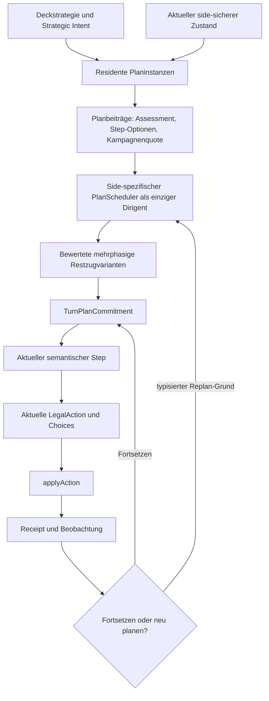

# KI-Zug- und Kampagnenplaner – Gesamtkonzept

Status: **Umgesetzt und mit ZK00 bis ZK14 abgenommen**

Version: **0.7**

Stand: 2026-08-18

Dokumentversion: `0.7`

Reviewstand:
Das externe Konzeptfeedback vom 29.07.2026 ist punktweise gegen den
aktuellen Zielvertrag und den aktuellen Code geprüft und in diesem Stand
disponiert. Die Grundarchitektur ist bestätigt; mehrere Übergangsverträge
sind geschärft. Die freigegebene Umsetzung wurde sequenziell im zugehörigen
Worktree-Paketprozess abgeschlossen. Führende Abnahme-Evidence ist
`docs/reviews/ai/ai-turn-and-campaign-planner-final-review-2026-07-30.md`.

Nachgelagerter Entscheidungsstand:
Die offenen Architekturfragen wurden anschließend einzeln mit dem Nutzer
geklärt. Abschnitt 1.3 dokumentiert die verbindlichen Ergebnisse. Verbleibende
Zahlenwerte sind Shadow-Kalibrierung, keine offenen Grundsatzentscheidungen.

Primärer Umsetzungsagent:
`release-implementation-agent`

Betroffener Zielvertrag:
`docs/architecture/ai/ai-plan-layer-target-state-wip.md`

Auslösende Spielanalyse:
Match `match_9b60842fe75c0b39`, Entscheidungen D1 bis D7, insbesondere die
inkohärente Folge D3 bis D5.

## 1. Zweck

Dieses Dokument beschreibt die geplante Erweiterung der produktiven
Plan-first-KI um:

1. einen zentralen Zugplaner als alleinigen Dirigenten der Planbeiträge;
2. eine rollierende Variantenplanung für den Rest des aktuellen Zuges;
3. residente, zugübergreifende Kampagnen mit explizitem Fortsetzungswert;
4. bindende, aber revalidierbare Zugentscheidungen;
5. typisierte Gründe für Fortsetzung, Unterbrechung und Neuplanung;
6. eine klare Trennung zwischen aktuellem LegalAction-Schritt, Zugplan und
   mehrzügigem strategischem Vorhaben.

Das Dokument bleibt als Konzept- und Umsetzungsherleitung erhalten. Die
bestätigten Festlegungen sind in den führenden Zielvertrag übernommen und
paketweise produktiv implementiert. Der aktuelle Runtime- und Gate-Stand
liegt im Abschlussreview.

### Aktueller Verfeinerungsstand (2026-08-18)

Die produktive Umsetzung bindet inzwischen auch folgende wiederkehrende
Mehrschrittfolgen an den bestehenden Turn-/Kampagnenvertrag:

- exakte Deckrestbestände statt bloßer Zonen- oder Rollenschätzungen;
- vollständige Corp-Draw-, Cleanup- und Discardfolgen;
- bekannte Full-Path-Prüfung vor Verbrauch eines Run-Events;
- persistente, typisierte und durch P1-P3 präemptierbare Credit-Meilensteine
  für Corp-Scoring und begrenzte strategische Runner-Entwicklung;
- servervariantenbezogener Corp-Economy-Payback aus Contestability,
  Auszahlungsdurchsatz und Action-Capacity-Kosten.

Die fachlichen Parents wählen weiterhin Ziel und Strategie. Economy bleibt
Support-Leaf, die Engine bleibt Kosten- und Regelautorität, und Resolver
ergänzen nur die Payload eines bereits gewählten Steps.

### 1.1 Disposition des externen Reviews

Das Review wird nicht kritiklos übernommen. Seine Punkte erhalten folgende
Disposition:

| Reviewpunkt                                      | Disposition                                            | Begründung und Integration                                                                                                                                                                                                                                                                                |
| ------------------------------------------------ | ------------------------------------------------------ | --------------------------------------------------------------------------------------------------------------------------------------------------------------------------------------------------------------------------------------------------------------------------------------------------------- |
| Planning Heads vor Executorwahl                  | **übernommen**                                         | Der aktuelle Scheduler materialisiert Routen erst nach der Executorwahl. Für den Linienvergleich sind davor konkrete, aber nicht autoritative `TurnPlanningHeadCandidate`s nötig. Nur der gewählte Head wird anschließend erneut als echte Route materialisiert.                                          |
| zukünftige semantische Optionen                  | **übernommen**                                         | Der bisherige Modulvertrag reicht dafür nicht. Planmodule erhalten eine optionale Projektionsschnittstelle; der Scheduler koordiniert, rekonstruiert aber keine Kartenlogik.                                                                                                                              |
| Hierarchie zweier Commitments                    | **übernommen und präzisiert**                          | Ein aktives validiertes `PlanCommitment` ist harter Prefix. `locked_sequence` allein ist eine Persistenzpolicy und wird erst mit ihrem Schutzvertrag hart. Danach folgt `TurnPlanCommitment`, danach normale Hysterese.                                                                                   |
| kampagnenübergreifende Doppelzählung             | **übernommen**                                         | Freie moduldefinierte Fortsetzungswerte werden durch typisierte Value Claims, Ownership Keys und zentrale Policy-Validierung ersetzt.                                                                                                                                                                     |
| neuer globaler Scoremonolith                     | **übernommen**                                         | Ein versioniertes Feature-Register definiert Einheiten, Bereiche, Ownership und Ausschlüsse. Planmodule liefern Fakten und Claims, nicht frei gewichtete globale Linienwerte.                                                                                                                             |
| mehrere Pflichten derselben Prioritätsklasse     | **übernommen**                                         | `PriorityCoverage` wird als Menge konkreter Pflicht-IDs statt als bloß höchste erreichte Klasse geführt.                                                                                                                                                                                                  |
| Beam-Pruning und Action Capacity                 | **übernommen**                                         | Schutzfronten nach Pflicht, Root und Meilenstein, Pareto-Erhalt, Upper Bounds, typisiertes Action-Capacity-Ledger und ausschließlich deterministische Budgets werden verbindlich. Beam Search bleibt Arbeitsannahme.                                                                                      |
| Informationsgrenzen und Recourse                 | **übernommen und nach Nutzerentscheidung vereinfacht** | Kontrollierte deterministische Choices sind keine Beobachtungsgrenze. Eine echte Unsicherheitsgrenze beendet den konkreten TurnPlan; das Modul bewertet nur die unmittelbare Ergebnisverteilung. Hinter der Grenze werden keine Recourse-Phasen vorgeplant.                                               |
| genau ein Root                                   | **auf Phasenebene übernommen**                         | Ein vollständiger TurnPlan darf mehrere geordnete Root-Phasen bis Zugende enthalten. Jede Phase besitzt genau ein Root; Support-Leaves bleiben diesem Root untergeordnet.                                                                                                                                 |
| Handkartennutzung                                | **teilweise übernommen**                               | `CorpHandInventoryFacts` existiert bereits und wird vor Draw-Arbitration verwendet. Es wird erweitert und planungswirksam gemacht, nicht durch eine parallele Inventur ersetzt. Cleanup- und Retention-Projektion fehlen tatsächlich und werden ergänzt.                                                  |
| Opening Rush                                     | **übernommen**                                         | Der frühe Economy–Defense–Agenda-Pfad wird eigenes Agenda-Akzeptanzszenario.                                                                                                                                                                                                                              |
| Zeitkosten mehrzügiger Werte                     | **übernommen**                                         | Jeder zukünftige Meilenstein trägt explizite Zug-, Action-Capacity- und Verzögerungskosten.                                                                                                                                                                                                               |
| effect-gebündelte ICE-Auflösung                  | **übernommen mit Ownership-Präzisierung**              | Freiwillige ICE-Allokation gehört Defense; eine von einem anderen Effekt gebündelte Resolution bleibt beim auslösenden Root und nutzt Defense nur als Fachservice.                                                                                                                                        |
| EndTurn, Coverage und Rules Profile              | **übernommen mit Ist-Anpassung**                       | NETGRID besitzt `RulesBaseline` und `formatProfileId`, keinen aktuellen allgemeinen `rulesProfileId`. Ein Planning-Rules-Fingerprint wird aus den realen Verträgen gebildet. Nur der aktuelle echte Zustand kann Turn Completion autoritativ zertifizieren; ein hypothetisches Zugende bleibt Projektion. |
| Invocation statt nur Action-ID                   | **übernommen**                                         | Routendefinierende Targets und Choices gehören vor die Linienbewertung in einen kanonischen Invocation Key. Reine Resolution-Choices bleiben nachgelagert.                                                                                                                                                |
| Randomisierung ganzer Linien                     | **nach Nutzerentscheidung eng begrenzt zugelassen**    | RNG ist einmalig und persistent zwischen fachlich vertretbarem Rush/Nicht-Rush oder zertifiziert nahgleichen Linien zulässig. Harte Pflichten, klare Dominanz und Illegalität schließen Randomisierung aus.                                                                                               |
| Fortschreibung nach erwartetem Ergebnis          | **übernommen und auf Phasen erweitert**                | Erwartete deterministische Progression führt zum nächsten Node beziehungsweise zur bereits geplanten nächsten Phase plus P1/P2-Scan. Volle Suche erfolgt nur an echten Replan-Punkten.                                                                                                                    |
| früher lokaler D5-Fix und frühe Diagnostik       | **übernommen**                                         | Der klare Draw-Bug folgt direkt auf Red Evidence. Minimaltraces entstehen vor jeder Verhaltensumschaltung.                                                                                                                                                                                                |
| vertikale Slices und vollständiges Coverage-Gate | **übernommen**                                         | Agenda und Defense/Economy werden vor allgemeiner Suche vertikal geschlossen. Teilanbindung bleibt Shadow-only.                                                                                                                                                                                           |

### 1.2 Nicht unverändert übernommene Reviewformulierungen

Vier Formulierungen des Reviews werden bewusst angepasst:

1. **Keine zweite Handinventur:** Die vorhandenen
   `CorpHandInventoryFacts` bilden bereits LegalAction-, Domain-Claim- und
   Handdruckfakten ab. Das Ziel ist ihre planungswirksame Erweiterung samt
   Cleanup-Projektion, nicht ein konkurrierender Vertrag.
2. **Kein autoritatives Zertifikat für hypothetische Zukunft:** Da zukünftige
   LegalActions nicht erfunden werden dürfen, kann ein projiziertes Zugende
   nur Annahmen und offene Coverage ausweisen. Der harte Completion-Beweis
   wird erst am tatsächlich erreichten State gegen die dann aktuellen
   LegalActions geführt.
3. **`RulesBaseline` statt erfundenem Profilbegriff:** Der Planer bindet den
   realen NETGRID-Regel-, Engine-, Format- und Policy-Stand über einen
   kanonischen Fingerprint. Ein neuer allgemeiner `rulesProfileId` wird nicht
   ohne existierenden Projektvertrag erfunden.
4. **Vorhandene Kapazitätsverträge wiederverwenden:** `ActionDemand`,
   `ActionCapacityRoute` und das Plan-Resource-Ledger existieren bereits.
   Der Turn Planner erweitert deren Horizont und Projektion, statt ein
   zweites allgemeines Ressourcenmodell einzuführen.

Diese Abweichungen beruhen auf der Prüfung des aktuellen Codes: Der
`PlanScheduler` wählt tatsächlich vor `materializeRoutes`, das vorhandene
Handinventar ist noch `diagnostic_only`, und der AI-Input transportiert noch
keinen vollständigen Rules-Baseline-Kontext. Das Review benennt damit reale
Lücken, schlägt an diesen Stellen aber teilweise neue Begriffe oder Typen
vor, obwohl belastbare Projektverträge bereits vorhanden sind.

### 1.3 Verbindliche Entscheidungen der Nachbesprechung

1. **Konkrete bekannte Objekte dürfen geplant werden.** Zukünftige Steps
   dürfen eigene bekannte Karteninstanzen, Server, Fähigkeiten, Werte und
   andere stabile Targets binden. Verboten bleiben zukünftige `actionId`s
   und kartennamenspezifische Sonderheuristiken im allgemeinen Scheduler.
2. **Targets werden konkret, typisiert und erweiterbar geführt.** Das
   Planmodul erzeugt die konkrete Variante; der zentrale Vertrag validiert
   Karten-, Server-, Ability-, Spieler-, Zonen-, Wert- und
   Mehrfachzielreferenzen.
3. **Nachweislich vertauschbare Aktionen werden kanonisiert.** Reihenfolgen
   bleiben getrennt, sobald Legalität, Kosten, Ressourcen, Trigger,
   Position, Beobachtung oder Fortsetzung voneinander abhängen.
4. **Runtime-Neustart erzwingt Neuplanung.** Kampagnen werden requotet,
   `TurnPlanCommitment`s neu erzeugt und weiterhin gültige harte
   `PlanCommitment`s als Pflicht übernommen.
5. **Pruning schützt kleine Pareto-Fronten.** Je viablem
   `Root × nächstem Meilenstein` bleibt mindestens ein Vertreter; mehrere
   nichtdominierte Risiko-/Ressourcenprofile dürfen geschützt bleiben.
6. **Ein TurnPlan darf mehrere Root-Phasen besitzen.** Eine Phase besitzt
   genau ein Root; der deterministisch planbare Zug wird phasenübergreifend
   bis Zugende oder echter Unsicherheitsgrenze geplant.
7. **Phasenwechsel sind kein automatischer Replan.** Erwartete Übergänge zu
   bereits geplanten Phasen werden fortgeschrieben. Nur Boundary,
   Abweichung, Invalidierung oder höherklassiger Interrupt öffnet den
   Restzug neu.
8. **Cross-Plan-Werte laufen über das Bewertungsregister.** Rein
   planinterne Fachwerte bleiben im Modul; jeder Wert, der Roots, Phasen
   oder ganze TurnPlans vergleicht, ist zentral registriert, versioniert,
   begrenzt und evidenzgebunden.
9. **Action-Gain erweitert den Planungshorizont.** Das typisierte
   Action-Capacity-Ledger plant garantierte zusätzliche und eingeschränkte
   Aktionen mit; die Anfangskapazität begrenzt die Suchtiefe nicht.
10. **Der Planungshorizont ist modulabhängig.** Module deklarieren
    `current_turn_only`, `campaign_capable` oder `context_dependent`.
    Tatsächlich mehrzügige Instanzen benötigen eine Kampagnenquote.
11. **Unsicherheit beendet den konkreten TurnPlan.** Das zuständige Modul
    bewertet nur die unmittelbare Ergebnisverteilung und den Zweck der
    unsicheren Aktion. Hinter Draw, Zufall oder materieller gegnerischer
    Entscheidung werden keine Recourse-Phasen vorgeplant; nach Beobachtung
    entsteht ein neuer Restzugplan.
12. **Opening Rush besitzt reine, kombinierte und sichere Varianten.**
    Beispielsweise dürfen Agenda, Remote-ICE und Central-ICE gemeinsam als
    vollständige Zuglinie konkurrieren; ungeschützte Centrals sind ohne
    konkrete P1-/P2-Pflicht nicht automatisch unzulässig.
13. **Eng begrenzte Linienrandomisierung ist zulässig.** Sie darf einmalig
    und persistent zwischen fachlich vertretbarem Rush und Nicht-Rush oder
    zwischen zertifiziert nahgleichen Linien erfolgen. Klare Dominanz,
    P1-/P2-Pflichten und illegale Varianten schließen RNG aus. Jeder Draw
    läuft über den Engine-RNG und wird im Replay festgehalten.

### 1.4 Kritische Disposition des zweiten Reviews

Das zweite Review bestätigt die Architektur, benennt aber sieben reale
Übergangslücken. Diese Punkte werden nicht als pauschaler Ausbau übernommen,
sondern wie folgt begrenzt:

| Reviewpunkt                                    | Entscheidung                 | Begrenzung gegen unnötige Komplexität                                                                                                                                                                                                                                                |
| ---------------------------------------------- | ---------------------------- | ------------------------------------------------------------------------------------------------------------------------------------------------------------------------------------------------------------------------------------------------------------------------------------ |
| hypothetischer Planbestand                     | **übernommen**               | V1 darf nur residente Roots und bereits admission-geprüfte Child-/Supportbeziehungen als spätere Phase verwenden. Eine erstmals entstehende Planinstanz beendet die Projektion mit `projected_plan_discovery_required`; es gibt noch keine hypothetische Portfolio-Lifecycle-Engine. |
| line-spezifische Kampagnenquotes               | **übernommen**               | Vorher-/Nachher-Quotes werden an `projectedFrameKey` und `linePrefixHash` gebunden. Es entsteht keine zweite persistente Kampagneninstanz.                                                                                                                                           |
| abstrakter Restwert hinter einer Boundary      | **übernommen, eng begrenzt** | Zulässig sind nur registrierte Restkapazitäts-, Bedarfstreffer-, Handqualitäts- oder öffentliche Ergebnisbänder. Konkrete Karten, Roots, Phasen oder Aktionen hinter der Boundary bleiben verboten.                                                                                  |
| Phase Entry, Exit, Transition und Need-Bindung | **übernommen**               | `phases + nodes + cursor` bilden die einzige Fortschrittswahrheit. Jede fremde Supportaktion braucht eine konkrete Need-/Assignment-Bindung.                                                                                                                                         |
| side-sichere Zustandsidentität                 | **übernommen**               | Ranking, Cache, IDs und Replan verwenden ausschließlich den side-sicheren Planning-Fingerprint. Ein vollständiger `GameState`-Hash darf dafür nicht verwendet werden.                                                                                                                |
| engere Randomisierungs- und RNG-Verträge       | **übernommen**               | Regret-Band, Worst-Case-Floor, Opportunity-Key, Persistenz und getrennte RNG-Domäne werden zentral definiert. Das erlaubt keine allgemeine Zufallswahl zwischen beliebigen nichtdominierten Linien.                                                                                  |
| Gegnerzugminimum vor Corp-Cutover              | **übernommen**               | ZK10a sichert nur notwendige Kampagnenpersistenz, öffentliche Outcome-Rückführung und Requote. Fortgeschrittene Gegnerzugplanung bleibt ZK12.                                                                                                                                        |

Weitere Reviewvorschläge werden bewusst nicht unverändert umgesetzt:

- Eine zukünftige `CanonicalLegalActionInvocation` erhält **keine**
  `actionId`. Nur der aktuelle Head besitzt eine getrennte
  `CurrentLegalActionBinding`.
- `ProjectedPlanProposal` und hypothetische Planinstanzen werden in V1
  **nicht** implementiert.
- Eine allgemeine Beam Search wird **nicht vorab festgeschrieben**. Die
  Vertikalschnitte entscheiden, ob eine begrenzte Suche ausreicht.
- Der vollständige Engine-`StateHash` bleibt für Engine und Replay
  unverändert, ist aber **keine Planneridentität**.
- Die private, privilegierte KI-Debuganzeige ist kein side-sicherer
  Spielerkanal. Sie zeigt zur Playtestkontrolle ausdrücklich die vollständige
  Hand der jeweils aktiven KI und die gesamte Zugplanung, niemals jedoch die
  Hand des menschlichen Spielers.

### 1.5 Nachgelagerter Current-State-Abgleich

Die Spielanalysen und Remediationsläufe bis 02.08.2026 bestätigen die
Grundarchitektur. Die beobachteten Restfehler lagen nicht in einem fehlenden
zweiten Dirigenten, sondern in zu engen oder unvollständigen Beiträgen der
zuständigen Planmodule. Daraus gelten folgende Präzisierungen:

- Der TurnPlanner vergleicht vollständige unterstützte Linien, erfindet aber
  keine Fachlogik. Defense-, Score-, Economy-, Hand- und Runentscheidungen
  bleiben bei ihren Ownern.
- Ein Score-Parent darf Remote-Schutz an `corp.defend_servers` delegieren.
  ICE-Installation und Rez bleiben Defense-Steps; Agenda, Zielremote und
  Install/Advance/Score bleiben Score-Steps.
- Known und Unknown werden pfadweise getrennt. Unknown blockiert den
  unbewiesenen Pfad, aber keine unabhängige exakt belegte Route.
- Draw, Zufall, neue private Information und gegnerische Reaktion beenden die
  konkrete Vorplanung an einer Boundary. Ein letzter-Klick-Draw erhält keinen
  Zukunftswert, wenn vor der Deadline kein Follow-up mehr materialisierbar
  ist.
- Zweite und dritte unrezzte ICE-Schichten sind zulässige Varianten, keine
  Pflicht und kein harter Ausschluss. Der Defense-Plan vergleicht ihren
  Grenzwert global gegen Rezfinanzierung, andere Server, bereits unrealisierten
  Bestand und den Scorehorizont.
- DeckDoctrine wird nur aus einer ausführbaren Rollenkomposition primär. Sie
  beeinflusst Planbildung und Linienwerte, übernimmt aber weder aktuelle
  Actionwahl noch planinterne Karten-/Targetlogik.
- Technische IDs binden konkrete Instanzen und dienen zuletzt der stabilen
  Reihenfolge. Sie begründen keine Strategie. Randomisierung bleibt auf
  zertifizierte Nahgleichstände und die freigegebene Rush-Neigung begrenzt.

Diese Präzisierungen sind im führenden
`ai-plan-layer-target-state-wip.md`, Version 1.2, konsolidiert. Die
ursprüngliche ZK00-bis-ZK14-Herleitung bleibt unverändert als
Implementierungsevidence bestehen.

## 2. Ausgangsbefund

### 2.1 Retrospektive Ausgangslage

Die Notwendigkeit eines Zug- und Kampagnenplaners war nicht von Beginn an in
dieser Schärfe sichtbar. Sie ist das Ergebnis mehrerer Entwicklungsstufen und
vollständiger Spielanalysen.

Die frühere KI musste zunächst grundlegendere Probleme lösen:

- Aktionen mussten zuverlässig aus `LegalActions` statt aus selbst
  erfundenen Befehlen gewählt werden;
- sichtbare Karten- und Aktionssemantik musste strukturiert in die Bewertung
  gelangen;
- konkrete Gefahren, Scorefenster, Runpfade, Kosten und Ziele mussten
  überhaupt erkannt werden;
- einzelne Aktionen mussten einem fachlichen Plan statt nur einem globalen
  Rohscore zugeordnet werden;
- mehrere relevante Vorhaben mussten als residentes Portfolio erhalten
  bleiben;
- Support-, Parent-, Ressourcen- und Reaktionsbeziehungen mussten eine klare
  Ownership erhalten;
- spielgleiche Decision-Checkpoints mussten nicht nur einzelne Hilfswerte,
  sondern den produktiven Chooser samt Runtime-Memory prüfen.

Solange diese Grundlagen fehlten, ließen sich viele Fehlentscheidungen
tatsächlich auf enge Ursachen zurückführen:

- falsche oder fehlende Kartensemantik;
- unvollständige Kostenquote;
- falsche Targetbewertung;
- fehlender Schutz- oder Scorebonus;
- zu breiter Draw-, Economy- oder Wiederholungsbonus;
- fehlende Parentbindung;
- unzulässiges vorzeitiges Zugende.

Diese Fehler wurden schrittweise und sinnvoll auf ihren jeweiligen Schichten
behoben. Erst nachdem die Einzelaktionen semantisch besser, die Pläne resident
und die Ausführungsautorität Plan-first geworden waren, trat deutlicher
hervor: Auch mehrere lokal korrekt bewertete Planentscheidungen ergeben nicht
automatisch einen stimmigen Zug.

### 2.2 Entwicklung der vorhandenen Architektur

Die heutige Ausgangslage lässt sich als Abfolge fachlich notwendiger Schritte
verstehen:

| Entwicklungsstufe                | Gelöstes Problem                                                               | Verbleibende Grenze                                                                               |
| -------------------------------- | ------------------------------------------------------------------------------ | ------------------------------------------------------------------------------------------------- |
| semantische Aktionsbewertung     | LegalActions erhalten Kosten-, Ziel-, Karten- und Taktikbedeutung              | Aktionen konkurrieren noch lokal                                                                  |
| Tactical Plans und PlanMemory    | mehrstufige Absichten können Aktion und Folgeaktion verbinden                  | nur ausgewählte Planfamilien und Sequenzen                                                        |
| PlanPortfolio und Remote-Doktrin | Vordergrund, Background, Cadence, Meilensteine und Support werden resident     | Portfolio meldet mehrere sinnvolle Vorhaben, entscheidet aber noch keinen vollständigen Zug       |
| Plan-first-Cutover               | nur Pläne handeln; genau ein Leaf-Executor besitzt den aktuellen Step          | Scheduler wählt weiterhin pro StateVersion primär den nächsten Step                               |
| Parent-/Need-/Ressourcenvertrag  | Funding und Support werden einem exakten Root zugeordnet                       | die Bindung garantiert noch nicht, dass der Restzug den finanzierten Meilenstein verfolgt         |
| Decision-Checkpoints             | historische Situationen und Runtime-Memory werden spielgleich reproduzierbar   | Einzelcheckpoints zeigen Fehlergrenzen, aber noch keine allgemeine Restzugoptimierung             |
| aktuelle Sequenzhärtungen        | Cadence, Funding-Revalidation, EndTurn, Score- und Defense-Folgen werden enger | viele Einzelfixes approximieren bereits Zugplanung, ohne einen gemeinsamen Zugvertrag zu besitzen |

Der vorgeschlagene Zugplaner ist damit keine Abkehr von der bisherigen
Architektur. Er ist die nächste logische Verdichtung: Die bereits vorhandenen
Planinformationen werden erstmals gemeinsam über den Rest des Zuges
koordiniert.

### 2.3 Wiederkehrende Beobachtungen aus Spielanalysen

Mehrere frühere Analysen zeigten bereits Teilaspekte des heutigen
Gesamtproblems:

| Beobachtung                                                                                                 | Beleg im Projekt                                                                         | damalige enge Korrektur                                                                            | verbleibende übergreifende Frage                                                                       |
| ----------------------------------------------------------------------------------------------------------- | ---------------------------------------------------------------------------------------- | -------------------------------------------------------------------------------------------------- | ------------------------------------------------------------------------------------------------------ |
| wiederholte Background-Economy verdrängt Zentralverteidigung                                                | Match 7BFE/B008 und Aufbau der Decision-Checkpoint-Testzone                              | finite Economy gibt akuter Board-Triage den Vordergrund; Cadence wird berücksichtigt               | wie vergleicht die KI die vollständige Economy- und Defense-Linie für den ganzen Zug?                  |
| eine Hintergrundbank wird in demselben Zug wiederholt geladen, obwohl produktive Alternativen existieren    | Match 20EB                                                                               | weiche Normalfrequenz und Amortisationshorizont                                                    | wie wird der Wert der ersten Aktion gegen die restlichen Aktionen desselben Zuges gerechnet?           |
| ein Entwicklungs-/Fundingplan wird zu starr festgehalten und verdrängt einen dringlichen erreichbaren Run   | Match 7D14, D105/D106                                                                    | enge Revalidation gegen dringlichen Run-Payoff                                                     | wann soll Kontinuität schützen und wann muss ein Challenger die Linie wirklich brechen?                |
| Funding wird begonnen, aber die konkrete Konversion erfolgt nicht rechtzeitig                               | mehrere Runner-Funding- und Corp-Defense-Fälle; besonders Match F809 D13–D15 und D32–D34 | Same-Turn-Konvertierbarkeit, Parentbindung und konkrete Defense-Folge                              | wie wird schon vor dem Funding geprüft, welcher Zugendzustand nach Funding plus Konversion entsteht?   |
| eine Sequenz ist einzeln korrekt, ihre Startentscheidung aber nicht ausreichend gegen Alternativen bewertet | Match F809 D37–D39                                                                       | spätere Advancement-Schritte als kohärente Fortsetzung anerkannt; Startentscheidung offen gelassen | wie bewertet man vor der Installation den vollständigen Score-Horizont samt Gegnerreaktion?            |
| unvollständige Bewertung lässt produktive Aktionen verschwinden und kann vorzeitiges Zugende legitimieren   | First-Turn-/EndTurn-Regression aus Match 3AAC                                            | `unknown` darf keine Routenausschöpfung beweisen; Parent-Funding und EndTurn gehärtet              | welcher positive Restzugplan soll statt bloßer Nicht-EndTurn-Sperre verfolgt werden?                   |
| nicht sofort rezfähiges ICE kann als Vorbereitung oder Bluff sinnvoll sein                                  | Match F809 D45                                                                           | eng begrenztes Defense-Staging                                                                     | wie wird diese Variante gegen Ansparen, andere ICE-Ziele und andere Zuglinien ganzheitlich verglichen? |
| Agenda-, Remote-, Defense- und Economy-Phasen besitzen korrekte lokale Ownership                            | Planportfolio-, Remote-Doktrin- und Plan-first-Verträge                                  | Root-/Leaf-, Need- und Phasenbindung                                                               | wer entscheidet, wie lange im aktuellen Zug welcher Planbeitrag verfolgt wird?                         |

Führende Belegartefakte für diese Entwicklung sind insbesondere:

- `docs/architecture/ai/ai-decision-checkpoint-testzone-process-2026-07-12.md`;
- `docs/reviews/ai/ai-match-7bfe-b008-decision-checkpoint-final-review-2026-07-12.md`;
- `docs/reviews/ai/ai-match-20eb-eurocorpse-remediation-final-2026-07-17.md`;
- `docs/reviews/ai/match-7d14-runner-remediation-final-2026-07-16.md`;
- `docs/architecture/ai/ai-first-turn-end-turn-regression-process-2026-07-26.md`;
- `docs/architecture/ai/ai-planportfolio-remote-doctrine-contract.md`;
- `docs/reviews/ai/match-f809-corp-defense-remediation-final-review-2026-07-29.md`;
- `docs/architecture/ai/ai-plan-layer-target-state-wip.md`.

### 2.4 Warum die fehlende Ebene erst jetzt klar erkennbar ist

Retrospektiv wirkt ein Zugdirigent selbstverständlich. Praktisch wäre eine
frühere Einführung jedoch auf unsicheren Grundlagen aufgebaut worden:

- ohne verlässliche Action-Semantik hätte er falsche Varianten verglichen;
- ohne LegalAction- und Engine-Quotes hätte er zukünftige Regeln und Kosten
  nachbauen müssen;
- ohne residente Planinstanzen hätte er keine zugübergreifenden Ziele
  fortsetzen können;
- ohne Parent-/Need-Vertrag hätte er Funding keinem konkreten Zweck
  zugeordnet;
- ohne genaue Decision-Checkpoints wäre nicht prüfbar gewesen, ob ein
  Zugplaner wirklich besser oder nur anders entscheidet;
- ohne Plan-first-Cutover wäre ein Dirigent nur ein weiterer Override über
  einer konkurrierenden Action-Score-Ebene geworden.

Die bisherige Entwicklung hat deshalb nicht „den Zugplaner vergessen“,
sondern dessen Voraussetzungen geschaffen. Die aktuelle Lücke wird sichtbar,
weil die darunterliegenden Schichten inzwischen genug richtige Information
liefern, aber noch keine gemeinsame zeitliche Entscheidung über einen ganzen
Zug herbeiführen.

### 2.5 Verdichtete Problemthese

Die bisherigen Analysen zeigen zwei entgegengesetzte Fehlrichtungen:

1. **zu wenig Bindung:** Ein sinnvoll begonnener Plan wird ohne neue
   Information vom nächsten lokalen Sieger verdrängt.
2. **zu viel Bindung:** Ein schwach gewordener Plan wird trotz einer
   materiell besseren oder dringlicheren neuen Linie starr fortgesetzt.

Ein pauschal „sticky“ gemachter Plan löst daher das Problem ebenso wenig wie
eine vollständige Neuwahl nach jeder Aktion.

Benötigt wird eine mittlere, ausdrücklich modellierte Ebene:

- vor der ersten Aktion mehrere vollständige Restzugvarianten vergleichen;
- die ausgewählte Linie als Ziel- und Ressourcencommitment binden;
- nach jeder Aktion das tatsächliche Ergebnis prüfen;
- ohne neue materielle Information stabil fortsetzen;
- bei klar definierten Ereignissen den verbleibenden Zug neu planen;
- zugübergreifende Kampagnen am Zugende erhalten.

### 2.6 Unmittelbarer Auslöser: beobachtete Entscheidungsfolge

Im analysierten ersten Corp-Zug trat folgende Folge auf:

| Decision | Beobachtung                                     | damaliger Planbezug                                                 | Bewertung                                                                                   |
| -------- | ----------------------------------------------- | ------------------------------------------------------------------- | ------------------------------------------------------------------------------------------- |
| D1       | Setup-Choice auflösen                           | Pflichtfenster                                                      | verfahrensbedingt                                                                           |
| D2       | Mandatory Draw                                  | Pflichtfenster                                                      | erzwungen                                                                                   |
| D3       | einen Credit nehmen                             | Root `corp.defend_servers`, Support `corp.economy`                  | als Finanzierung eines konkret erkannten Defense-Bedarfs bedingt sinnvoll                   |
| D4       | Karte in neuem Remote installieren              | `corp.ambush_and_bluff`                                             | Bruch der gerade finanzierten Defense-Linie ohne typisierten Abbruchgrund                   |
| D5       | bei bereits ausgeschöpfter Handkapazität ziehen | `corp.hand_and_agenda_management`, Root `corp.score_agenda:general` | klarer Fehler; der Draw erzwingt einen Discard und verdrängt weiter die Zentralverteidigung |
| D6       | Zug beenden                                     | kein Klick mehr                                                     | erzwungen                                                                                   |
| D7       | Karte abwerfen                                  | Pflichtfolge aus D5                                                 | nicht die primäre Fehlerursache                                                             |

D3 ist isoliert nicht der entscheidende Fehler. Der Fehler liegt in der
fehlenden Kohärenz der Folge: Die KI erkennt und finanziert einen
Defense-Bedarf, bindet diese Finanzierung aber nicht an eine bewertete
Restzuglinie. Bereits bei der nächsten freiwilligen Entscheidung erhält ein
anderer Plan die Ausführungsautorität, obwohl kein belastbarer neuer Umstand
eingetreten ist.

### 2.7 Bereits klar lokalisierte Einzelursache

Der D5-Draw besitzt zusätzlich eine lokale, klare Ursache in
`packages/ai/src/runtime/plan-first-live-runtime.ts`:

- `exactCurrentCorpScoreMaterialDrawCandidate` akzeptiert den Basic Draw,
  bevor `corpDrawCandidatePreservesHandCapacity` geprüft wird;
- die Disposition nimmt einen als `draw-for-score-material` gebundenen Draw
  anschließend von der normalen Kapazitätssperre aus;
- dadurch kann ein Basic Draw bei voller Hand als produktive
  Scorematerial-Route zugelassen werden.

Diese Einzelursache muss behoben werden. Sie erklärt aber nicht allein den
Planwechsel D3 → D4 und auch nicht das strukturelle Problem, dass mehrere
lokal plausible Pläne keinen gemeinsamen vollständigen Zug ergeben.

### 2.8 Strukturelle Ursache

Der aktuelle `PlanScheduler` führt pro Entscheidung im Kern aus:

1. Portfolio reconciliieren;
2. alle bereiten Planinstanzen bewerten;
3. genau eine Bewertung auswählen;
4. genau einen aktuellen Step materialisieren;
5. genau eine aktuelle LegalAction binden.

Das ist für Plan-first und LegalAction-Sicherheit richtig, besitzt aber noch
keinen expliziten Restzughorizont. `PlanAssessment.withinClassValue`,
`ContinuityAssessment` und residente Planinstanzen bewerten den nächsten
Schritt, nicht mehrere alternative Zugenden.

Folge:

- Pläne melden lokale Wichtigkeit;
- der Scheduler wählt lokal den momentanen Sieger;
- nach der StateVersion-Änderung beginnt ein neuer Wettbewerb;
- eine Finanzierung kann vom finanzierten Ziel getrennt werden;
- eine angefangene Linie kann ohne materiellen Replan-Grund verschwinden;
- eine mehrzügige Agenda-Vorbereitung erscheint am aktuellen Zugende
  möglicherweise schlechter als eine Aktion mit sofortigem, aber geringerem
  Nutzen.

## 3. Leitentscheidung

> Der vorhandene side-spezifische `PlanScheduler` wird zum einzigen
> Dirigenten ausgebaut. Planmodule melden Ziele, Bedarfe, mögliche Steps,
> Ressourcenansprüche, Risiken und Fortsetzungswerte. Sie wählen sich nicht
> selbst und übernehmen nie global die Ausführungsautorität.

Es wird keine zweite konkurrierende Entscheidungsautorität neben
`PlanScheduler` und `ResidentPlanPortfolio` eingeführt.

Der Scheduler entscheidet künftig auf drei verbundenen Horizonten:

1. **aktueller Step:** exakt eine aktuell vorhandene LegalAction;
2. **Rest des aktuellen Zuges:** ein bewerteter, mehrphasiger TurnPlan bis
   Zugende oder echter Unsicherheitsgrenze;
3. **zugübergreifende Kampagne:** Meilensteine und inkrementeller
   Fortsetzungswert nach dem Zugende.

Die Ausführung bleibt rollierend:

1. mehrere mehrphasige Restzugpläne entwerfen;
2. ihre Endzustände und Kampagnenfolgen vergleichen;
3. die beste Linie binden;
4. nur den ersten aktuellen LegalAction-Schritt ausführen;
5. das echte Ergebnis beobachten;
6. die Linie fortsetzen oder aus einem typisierten Grund neu planen.

## 4. Architekturposition

Dieses Konzept erweitert den vorhandenen Plan-first-Vertrag, ersetzt ihn aber
nicht.

Unverändert bleiben:

- Rules Engine als einzige Regelautorität;
- ausschließlich aktuelle `LegalActions` als ausführbare Aktionen;
- genau ein Leaf-Executor pro freiwilliger Entscheidung;
- keine zukünftigen Action-IDs in Steps, Routes, Commitments oder Kampagnen;
- konkrete bekannte Karten-, Objekt-, Server- und Ability-IDs dürfen in
  zukünftigen semantischen Steps gebunden sein;
- StateVersion-gebundene Revalidierung;
- residente Planinstanzen;
- harte lexikografische Prioritätsklassen;
- planlokale Choice-Auflösung mit früher Bindung ausschließlich
  routendefinierender Targets/Choices und später Auflösung reiner
  Resolution-Choices;
- `applyAction` als finaler Guardrail;
- deterministische Reproduzierbarkeit und Replayfähigkeit; explizite
  zertifizierte RNG-Ausnahmen laufen ausschließlich über den Engine-RNG.

Ergänzt werden:

- nicht autoritative `TurnPlanningHeadCandidate`s vor der Executorwahl;
- `CampaignContinuationQuote`;
- typisierte `CampaignValueClaim`s und ein zentrales Value-Ownership-Ledger;
- side-sicherer abstrakter Projektionszustand;
- `TurnLineCandidate`;
- `TurnPlanPhase` als ein-Rootige Einheit innerhalb einer mehrphasigen
  Zuglinie;
- deterministische Restzugsuche;
- `TurnPlanCommitment`;
- ein expliziter Vorrang vorhandener harter `PlanCommitment`s;
- ein versionierter Planning-Rules-Fingerprint aus `RulesBaseline`,
  Formatprofil und Planner-Policy;
- planungswirksame Handinventur und Cleanup-Projektion;
- Beobachtungs- und Replan-Klassifikation;
- Traces für Variantenvergleich und Bindungsfortsetzung.

Eine notwendige Änderung des bisherigen Kernelablaufs wird damit ausdrücklich
gemacht:

```text
bisher:
Assessment
→ Executorwahl
→ Step und Route materialisieren

neu:
Assessment
→ nicht autoritative Planning Heads und semantische Projektionsoptionen
→ Linienvergleich und Executorwahl
→ nur gewählten aktuellen Head als PlanRoute neu materialisieren
→ vollständige Invocation revalidieren
```

Planning Heads sind Machbarkeits- und Projektionsbelege. Sie besitzen keine
Ausführungsautorität und dürfen den vorhandenen Plan-first-Vertrag nicht
umgehen.

## 5. Autoritätshierarchie



### 5.1 Was Planmodule dürfen

Ein Planmodul darf:

- eine residente Planinstanz entdecken oder reconciliieren;
- eine validierte Prioritätsforderung abgeben;
- Readiness, Blocker und Ressourcenbedarf beschreiben;
- aktuelle nicht autoritative Planning Heads und zukünftige semantische
  Step-Optionen der eigenen Domäne anbieten;
- eine side-sichere Ergebnisquote liefern;
- Fakten und typisierte Value Claims für eine Kampagnenfortsetzung bis zu
  einem fachlichen Meilenstein liefern;
- Bedingungen für Pause, Fortsetzung, Abschluss oder Aufgabe melden.

### 5.2 Was Planmodule nicht dürfen

Ein Planmodul darf nicht:

- sich selbst zum Executor erklären;
- einen anderen Plan verdrängen;
- eine globale Zuglinie festlegen;
- Action-Scores anderer Pläne überschreiben;
- seinen eigenen Claim frei in einen globalen Zahlenwert transformieren;
- denselben zukünftigen Objective-Payoff zusätzlich zu seinem Root
  beanspruchen;
- zukünftige Action-IDs speichern;
- ohne Schedulerentscheidung einen Supportplan starten;
- eine niedrigere Prioritätsklasse durch viele kleine Nutzenbeiträge über eine
  höhere Klasse heben;
- nach jeder StateVersion seinen eigenen Planwechsel erzwingen.

### 5.3 Was der Scheduler entscheidet

Nur der Scheduler entscheidet:

- welche geordnete Folge von Root-Phasen den Restzug bildet;
- welche Planbeiträge zu einer kohärenten Zuglinie kombiniert werden;
- welcher Supportbedarf wann ausgeführt wird;
- welche Ressourcen reserviert bleiben;
- wie ein Zugendzustand gegen einen anderen abgewogen wird;
- welche Value Claims gültig, exklusiv, abhängig oder konfliktbehaftet sind;
- wie planlokale Fakten über die zentrale side-spezifische Policy in den
  gemeinsamen Vergleichsraum gelangen;
- ob eine bestehende Linie fortgesetzt, pausiert oder aufgegeben wird;
- welcher Plan den aktuellen Step als Leaf-Executor ausführt.

## 6. Drei Planungsebenen

### 6.1 Strategischer Intent

Der Strategic Intent bleibt der langfristige, deckgestützte Prior. Er
beantwortet beispielsweise, ob eine Corp primär Glacier, Rush,
Remote-Scoring, Ambush oder Tag-/Damage-Druck verfolgt. Er ist weder Zugplan
noch Aktion.

### 6.2 Residente Kampagne

Eine Kampagne ist eine Planinstanz der Ausführungsklasse
`strategic_campaign` oder ein entsprechend qualifiziertes
`development_project`. Sie verfolgt einen zugübergreifenden Meilenstein,
beispielsweise:

- Agenda in ein belastbares Scorefenster bringen;
- Zentralverteidigung auf einen definierten Schutzboden entwickeln;
- eine Economy-Bank bis zur sinnvollen Auszahlung aufbauen;
- einen Tag-/Damage-Payoff vorbereiten;
- einen wiederholbaren R&D-Druckpfad etablieren.

Die Kampagne bleibt resident, auch wenn sie:

- auf den gegnerischen Zug wartet;
- aktuell keinen LegalAction-Step besitzt;
- vorübergehend durch eine höhere Priorität unterbrochen ist;
- für einen Teilzug einen Economy- oder Defense-Support delegiert.

### 6.3 Zugplan

Der Zugplan beschreibt eine kohärente, gegebenenfalls mehrphasige Linie vom
aktuellen Zustand bis:

- zum regulären Zugende;
- oder zu einer Informationsgrenze, hinter der ohne neue Beobachtung keine
  belastbare weitere Festlegung möglich ist.

Er besitzt keinen eigenen strategischen Zweck. Er ordnet Steps vorhandener
Planinstanzen zu einer gemeinsamen Linie.

Der bindende Zugplan wird in Root-semantische Phasen gegliedert:

- jede Phase besitzt genau ein strategisches Root;
- andere Planinstanzen handeln innerhalb dieser Phase nur als exakt
  gebundene Support-, Response- oder Resolution-Leaves;
- der vollständige TurnPlan darf mehrere geordnete Root-Phasen enthalten,
  beispielsweise Broker-Nutzung, Agenda-Vorbereitung und Central-Defense;
- die Folgephasen werden gemeinsam bis zum deterministisch planbaren
  Zugende bewertet und gebunden;
- erreicht eine Phase ihr Ziel, wird bei unveränderten Voraussetzungen zur
  bereits geplanten nächsten Phase fortgeschrieben;
- ein Phasenwechsel ist weder automatischer Yield noch neue freie
  Rootkonkurrenz;
- eine echte Unsicherheitsgrenze beendet den konkreten TurnPlan und öffnet
  nach Beobachtung die Planung des verbleibenden Zuges neu.

Damit bleibt ein Zug ganzheitlich bewertet, ohne dass ein Root unabhängige
Broker-, Ambush- oder Economy-Nebenaktionen als eigene Leaves vereinnahmt.

### 6.4 Aktueller Step

Nur der aktuelle Step wird gegen aktuelle `LegalActions` gebunden. Jede
spätere Position der Zuglinie darf bestehen aus:

- Capability;
- konkreten bekannten Karten-, Objekt-, Server-, Ability- oder anderen
  typisierten Zielreferenzen;
- erwarteten Kosten- und Ergebnisintervallen;
- benötigten Ressourcen;
- Garantiegrad;
- erwarteter Beobachtungsart.

Sie enthält keine zukünftige `actionId`. Eine konkrete bekannte
`cardInstanceId` oder andere stabile Objekt-ID ist dagegen ausdrücklich
zulässig und wird beim Erreichen des Steps gegen die dann aktuellen
`LegalActions` rematerialisiert.

Das gilt auch für eine aktuell nur an der Bezahlbarkeit scheiternde
Installation einer bekannten eigenen Handkarte. Ein Fachmodul darf deren
statischen CardSpec-Installationspreis, Action-Capacity und sichtbare
Speicherbelegung für eine Funding-Linie projizieren, wenn alle benötigten
Objekte und Voraussetzungen side-sicher bekannt sind. Die Projektion enthält
keine vorweggenommene Installations-`actionId`: Nach dem Funding muss die
Engine die konkrete Installation als aktuelle `LegalAction` veröffentlichen,
und der gebundene Support-Leaf rematerialisiert genau diese Aktion. Fehlt die
Action dann oder sind Installationswahl, Kostenmodifikator oder Voraussetzung
nicht vollständig projektierbar, endet die Linie fail-closed. Root-Plan,
Parent-Need und Prioritätsklasse bleiben während Funding, Rematerialisierung
und Rückkehr zum fachlichen Root erhalten.

## 7. Neue Kernverträge

Die folgenden Typen zeigen den beabsichtigten Vertrag. Namen und Felder sind
Teil des Reviewgegenstands; sie sind noch nicht implementiert.

### 7.1 `PlanningRulesContext`

Der Planer muss denselben Regel- und Formatstand über alle Quotes, Frames,
Linien, Commitments, Traces und Checkpoints binden.

```ts
type PlanningRulesContext = {
  rulesBaselineFingerprint: string;
  rulesVersion: string;
  engineSchemaVersion: string;
  cardImplementationVersion: string;
  deviationRegistryVersion: string;
  formatProfileId: string;
  formatProfileVersion?: string;
  plannerPolicyVersion: string;
  actionSemanticSchemaVersion: string;
  planModuleSetFingerprint: string;
  lineEvaluationRegistryVersion: string;
  campaignValuePolicyVersion: string;
};

type PlanningStateIdentity = {
  stateVersion: number;

  // Einzige Zustandsidentität für Ranking, Cache, Line-/Candidate-IDs und
  // Replanentscheidungen.
  sideSafePlanningFingerprint: string;

  // Optionaler opaker Engine-Token ausschließlich für Freshness-Validierung.
  // Er darf niemals Ranking, Sortierung, Cachepartition oder IDs beeinflussen.
  engineFreshnessToken?: string;
};
```

Der Rules-Fingerprint ist eine kanonische, versionierte Serialisierung der
realen NETGRID-`RulesBaseline`-Felder plus Formatprofil und Planner-Policy.
Er ist kein lossy Hilfshash und kein Ersatz für die einzelnen
Diagnosefelder. Der getrennte `sideSafePlanningFingerprint` entsteht
ausschließlich aus PlayerView, eigenen bekannten Daten, PublicEvents und
aktuellen LegalAction-Semantiken. Unterschiedliche gegnerische Hidden-Zonen
bei identischem side-sicheren Input müssen denselben Planning-Fingerprint,
dieselben Candidate-IDs und dieselbe Linie erzeugen.

Ein vollständiger `GameState`-Hash ist keine Planneridentität. Ein opaker
Engine-Token darf nur feststellen, dass ein rematerialisierter aktueller
Step noch frisch ist; sein Wert darf keine fachliche Entscheidung
beeinflussen.

Der aktuelle `AiDecisionInput` transportiert noch keinen vollständigen
Planning-Rules-Kontext. Seine side-sichere Erweiterung ist deshalb ein
explizites Vorbedingungspaket. Quotes oder Commitments mit abweichendem
Kontext werden fail-closed abgewiesen.

Ein Server- oder KI-Runtime-Neustart löst unabhängig vom Fingerprint
`runtime_restarted` aus. Danach werden Kampagnen requotet,
`TurnPlanCommitment`s verworfen und neu geplant. Ein weiterhin gültiges
hartes `PlanCommitment` wird revalidiert und bleibt zwingende Vorgabe. Ein
reiner Client-Reconnect ohne Runtime-Neustart ist kein Replan-Grund.

### 7.2 Routendefinierende Invocation

Eine Action-ID allein identifiziert nicht immer die zu bewertende Variante.
Targets und Choices werden nach ihrer Planungsrolle getrennt:

```ts
type ChoicePlanningRole =
  | "route_defining"
  | "resolution_only"
  | "observation_boundary";

type BoundTargetSlot = {
  slotId: string;
  values: PlanTargetRef[];
  ordering: "single" | "ordered" | "unordered";
};

type CanonicalChoiceValue =
  | { kind: "boolean"; value: boolean }
  | { kind: "number"; value: number }
  | { kind: "string"; value: string }
  | { kind: "target"; value: PlanTargetRef }
  | {
      kind: "target_list";
      values: PlanTargetRef[];
      ordering: "ordered" | "unordered";
    };

type CanonicalLegalActionInvocation = {
  semanticActionType: string;
  sourceCardInstanceId?: string;
  sourceAbilityId?: string;
  boundTargets: BoundTargetSlot[];
  boundChoices: Array<{
    choiceId: string;
    role: ChoicePlanningRole;
    value: CanonicalChoiceValue;
  }>;
  invocationKey: string;
};

type CurrentLegalActionBinding = {
  actionId: string;
  stateVersion: number;
  semanticActionSetFingerprint: string;
  invocationKey: string;
};
```

Bekannte Ziele werden über einen erweiterbaren typisierten Vertrag
referenziert:

```ts
type PlanTargetRef =
  | { kind: "card"; cardInstanceId: string }
  | { kind: "server"; serverId: string }
  | {
      kind: "ability";
      sourceCardInstanceId: string;
      abilityId: string;
    }
  | { kind: "player"; side: Side }
  | { kind: "zone"; zoneId: string }
  | { kind: "value"; value: number }
  | { kind: "target_set"; targets: PlanTargetRef[] };
```

Die technische Bindung erfolgt bevorzugt über stabile Instanz- und
Ability-IDs. Kartendefinition und Kartenname dürfen für fachliche Bewertung,
Trace und Erklärung verwendet werden. Verboten sind nur verteilte
kartennamenspezifische Sonderentscheidungen im allgemeinen Scheduler.

`invocationKey` ist eine kollisionsfreie kanonische Serialisierung aus:

- side-sicherem Planning-Fingerprint;
- semantischem Actiontyp und konkreter eigener Source-Instanz;
- routendefinierenden Targets;
- routendefinierenden Choices.

Nur ein aktueller `TurnPlanningHeadCandidate` besitzt zusätzlich eine
`CurrentLegalActionBinding`. Zukünftige semantische Steps enthalten weiterhin
keine Action-ID. Damit wird der sinnvolle aktuelle LegalAction-Beleg nicht
mit einer verbotenen zukünftigen Action-ID vermischt.

Kanonisierung:

- ungeordnete Zielmengen werden nach ihrem typisierten kanonischen Schlüssel
  sortiert; geordnete Mengen behalten ihre Reihenfolge;
- Zahlen müssen endlich und normalisiert sein;
- doppelte Ziele und doppelte Choice-Slots sind ungültig;
- optionale Felder besitzen genau eine kanonische Abwesenheitsdarstellung;
- `lineId`, `candidateId` und Opportunity-Keys werden aus diesen
  side-sicheren Inhalten abgeleitet, nie aus Enumerationsreihenfolge oder
  fortlaufenden Zählern.

Regeln:

- bekannte Server-, Karten-, X-Wert- oder Verteilungsentscheidungen, die
  Kosten, Ziel oder Linienwert ändern, werden vor der Linienbewertung
  planlokal gebunden;
- reine Resolution-Choices werden erst nach Auswahl der Linie und aktuellen
  Route gelöst;
- eine Choice mit nicht beobachtbarem oder gegnerischem Ausgang wird als
  Beobachtungsgrenze behandelt;
- `engine_only`-Targets dürfen von der KI nicht enumeriert werden;
- die Engine revalidiert die vollständige ausgewählte Invocation weiterhin
  autoritativ.

Das zuständige Planmodul erzeugt die konkrete Variante. Der zentrale
Semantikvertrag validiert ihre Planungsrolle; weder Scheduler noch einzelne
Module dürfen widersprüchliche globale Klassifikationen etablieren. Im
Zweifel ist eine Auswahl `route_defining`, sobald sie Kosten, Ziel, Wirkung
oder Folgeoptionen verändert.

Die bestehende Zielregel „Choice erst nach Actionwahl“ wird damit nicht
pauschal aufgehoben, sondern auf `resolution_only` präzisiert.

### 7.3 `TurnPlanningHeadCandidate`

Vor der Executorwahl dürfen konkrete aktuelle Varianten nur als nicht
autoritative Planungsbelege existieren:

```ts
type TurnPlanningHeadCandidate = {
  candidateId: string;
  planInstanceId: string;
  rootPlanInstanceId: string;
  stepFingerprint: string;
  rulesContext: PlanningRulesContext;
  stateVersion: number;
  invocation: CanonicalLegalActionInvocation;
  currentBinding: CurrentLegalActionBinding;
  immediateProjection: ProjectedOutcomeDelta;
  executableWitness: ExecutableWitness;
  guarantee: GuaranteeLevel;
  evidenceCodes: string[];
};

type ExecutableWitness = {
  stateVersion: number;
  sideSafePlanningFingerprint: string;
  semanticActionSetFingerprint: string;
  stepFingerprint: string;
  invocationKey: string;
  quoteIds: string[];
  safetyPolicyVersion: string;
  allRouteDefiningChoicesBound: boolean;
};
```

Ein Planning Head:

- stammt ausschließlich aus einer aktuellen LegalAction;
- besitzt keine Executor- oder Ausführungsautorität;
- darf für alle konkurrierenden bereiten Planinstanzen erzeugt werden;
- wird nach Auswahl der Linie nicht direkt ausgeführt;
- muss als gewählter erster Step durch das zuständige Modul erneut zu einer
  echten `PlanRoute` materialisiert werden;
- muss dabei Step-Fingerprint, Invocation, StateVersion, Quote und Choices
  exakt wiederfinden;
- schlägt bei Abweichung fail-closed fehl.

Planning Heads erhalten ihre `candidateId` aus
`sideSafePlanningFingerprint`, Root, Step und `invocationKey`. Ein
Engine-Freshness-Token ist ausdrücklich kein Bestandteil dieser ID.

### 7.4 Modulare Projektionsschnittstelle

Der Scheduler darf zukünftige Steps nicht aus Kartenwissen rekonstruieren.
Die Domänenlogik bleibt in den Planmodulen:

```ts
type TurnPlanningModuleExtension = {
  horizonCapability:
    | "current_turn_only"
    | "campaign_capable"
    | "context_dependent";

  enumerateCurrentPlanningHeads(
    instance: PlanInstance,
    assessment: ValidatedPlanAssessment,
    semanticActions: readonly ActionSemanticCandidate[],
    context: CurrentPlanningContext,
  ): TurnPlanningHeadCandidate[];

  projectSemanticContinuations(
    instance: PlanInstance,
    frame: ProjectedDecisionFrame,
    rootBinding: TurnRootBinding,
    context: ProjectionContext,
  ): ProjectedTurnStepOption[];
};
```

Normen:

- das Modul projiziert nur seine eigene Fachdomäne;
- gemeinsame Ressourcen-, Timing-, Rules- und Parentverträge validiert der
  Kernel;
- zukünftige Optionen enthalten keine Action-IDs;
- fehlende Zukunftsprojektion beendet oder verwirft nur den betreffenden Ast;
- sie erzeugt keinen globalen `PlanResolutionFailure`;
- ein harter Runtimefehler entsteht erst, wenn der ausgewählte aktuelle Step
  nicht legal und invocation-genau bindbar ist;
- Module ohne vollständige Zukunftsprojektion bleiben bis zum Coverage-Gate
  Shadow-only oder liefern bewusst eine aktuelle Single-Step-Linie mit
  `projection_not_supported` als Stopgrund.
- `current_turn_only`-Module müssen vollständig am aktuellen TurnPlan
  teilnehmen, benötigen aber keinen künstlichen Fortsetzungswert;
- `campaign_capable`- und `context_dependent`-Module müssen für eine
  tatsächlich mehrzügige Instanz eine validierbare Kampagnenquote liefern.

Für v1 gilt bewusst eine enge Discovery-Grenze:

- zukünftige Root-Phasen dürfen nur bereits residente Planinstanzen oder
  bereits admission-geprüfte Child-/Supportbeziehungen referenzieren;
- eine deterministische Aktion, die voraussichtlich erstmals eine neue
  Planinstanz erzeugt, endet mit
  `projected_plan_discovery_required`;
- erst im tatsächlich erreichten Zustand läuft normale Discovery und plant
  den Restzug neu;
- der Scheduler erzeugt keine hypothetischen Planinstanzen und persistiert
  keine zukünftigen Proposals.

Damit wird eine zweite hypothetische Portfolio-Lifecycle-Engine vermieden.
`ProjectedPlanProposal`s bleiben eine mögliche spätere Erweiterung und sind
kein Bestandteil des ersten Cutovers. Ein gebundener zukünftiger Phasenroot
bleibt im residenten Portfolio in seiner aktuellen Rolle und wird erst beim
real validierten Phase Entry `foreground`.

### 7.5 `CampaignValueClaim`

Kampagnen melden keine frei gewichteten globalen Fortsetzungswerte. Sie
melden typisierte Fakten und Claims:

```ts
type CampaignValueClaim = {
  claimId: string;
  objectiveKey: string;
  componentKey: string;
  sourcePlanInstanceId: string;
  rootPlanInstanceId: string;
  dimension: CampaignValueDimension;
  aggregationMode:
    | "exclusive"
    | "replace"
    | "maximum"
    | "bounded_sum"
    | "delta_from_previous_prefix";
  contributionKind:
    | "objective_payoff"
    | "risk_reduction"
    | "funding_gap_reduction"
    | "option_preservation"
    | "tempo_delta"
    | "future_flexibility";
  beforeQuoteId: string;
  afterQuoteId: string;
  delta: ValueEnvelope;
  horizon: PlanDeadline;
  confidence: GuaranteeLevel;
  dependencyKeys: string[];
  conflictKeys: string[];
  evidenceCodes: string[];
};
```

Beispiel:

```text
score_window:<agendaInstanceId>:<targetServerId>
```

Ownership-Regeln:

- `corp.score_agenda` besitzt den eigentlichen Scorefenster- und
  Agenda-Payoff;
- `corp.defend_servers` liefert dazu höchstens die Verringerung des
  Contest-/Breach-Risikos;
- `corp.economy` liefert höchstens die Verringerung der Funding-Lücke;
- `corp.establish_scoring_remote` liefert höchstens Remote-Wiederverwendungs-
  und Optionswert;
- Supportpläne dürfen den Objective-Payoff des Roots nicht erneut
  beanspruchen;
- zwei exklusive `objective_payoff`-Claims mit demselben Ownership Key
  machen die Linienbewertung ungültig;
- Abhängigkeiten und Konflikte werden vor Aggregation als azyklischer Graph
  validiert.
- `exclusive` darf je `objectiveKey + componentKey` nur einmal vorkommen;
- sequenzielle Defense- oder Fundingverbesserungen verwenden
  `delta_from_previous_prefix` und müssen mit dem `beforeQuoteId` exakt an
  den vorherigen Line Prefix anschließen;
- `bounded_sum`, `maximum` und `replace` verwenden ausschließlich zentral im
  Register festgelegte Grenzen und Subsumptionsregeln.

### 7.6 `CampaignContinuationQuote`

```ts
type CampaignQuoteBasis =
  | {
      kind: "actual_state";
      stateVersion: number;
      sideSafePlanningFingerprint: string;
    }
  | {
      kind: "projected_frame";
      baseStateVersion: number;
      projectedFrameKey: string;
      linePrefixHash: string;
    };

type CampaignContinuationQuote = {
  quoteId: string;
  planInstanceId: string;
  moduleId: PlanModuleId;
  rulesContext: PlanningRulesContext;
  stateVersion: number;
  turnKey: string;
  basis: CampaignQuoteBasis;
  phase: string;
  currentMilestone: string;
  nextMilestone: CampaignMilestone;
  horizon:
    | "next_milestone"
    | "next_own_turn"
    | "next_score_window"
    | "bounded_multi_turn";
  viability: "ready" | "waiting" | "blocked" | "nonviable";
  expectedTurnsToMilestone: ValueRange;
  requiredResources: CampaignResourceRequirement[];
  protectedResources: ResourceReservationRequest[];
  opponentIntervention: OpponentInterventionEnvelope;
  valueFacts: CampaignValueFact[];
  valueClaims: CampaignValueClaim[];
  pauseConditions: PlanConditionRef[];
  abandonConditions: PlanConditionRef[];
  replanTriggers: ReplanTrigger[];
  evidenceCodes: string[];
};
```

Die Quote wird aus der residenten Planinstanz und dem aktuellen
side-sicheren Zustand abgeleitet. Sie ist keine zweite persistente
Planinstanz und besitzt keine Ausführungsautorität.

Vorher- und Nachher-Quote einer Claim-Differenz müssen dieselbe Kampagne,
Quoteversion, Wertpolicy und einen kausal anschließenden Line Prefix besitzen.
Zwei Linien aus derselben StateVersion erhalten deshalb unterschiedliche
Nachher-Quotes, sobald ihre `projectedFrameKey` oder ihr `linePrefixHash`
abweichen. Eine bloß StateVersion-gebundene hypothetische Quote ist ungültig.

Die zentrale side-spezifische `CampaignValuePolicy` prüft die Claims, bindet
sie an das Feature-Register und berechnet erst danach den inkrementellen
Fortsetzungswert.

### 7.7 `ProjectedDecisionFrame`

```ts
type ProjectedDecisionFrame = {
  side: Side;
  rulesContext: PlanningRulesContext;
  stateIdentity: PlanningStateIdentity;
  turnKey: string;
  timingPointClass: string;
  actionCapacityLedger: ProjectedActionCapacityLedger;
  ownCredits: ValueRange;
  ownHandCount: ValueRange;
  ownHandCapacity: number;
  ownKnownZones: ProjectedKnownZoneState[];
  ownKnownBoard: ProjectedOwnBoard;
  usageLedger: ProjectedUsageLedger;
  publicEventFacts: ProjectedPublicEventFacts;
  visibleOpponentBoard: ProjectedVisibleOpponentBoard;
  serverPostures: ProjectedServerPosture[];
  resourceLedger: ProjectedResourceLedger;
  portfolioForecasts: ProjectedPlanProgress[];
  projectedCleanup?: ProjectedCleanupOutcome;
  pendingBoundary?: BoundaryActionAssessment;
  uncertainty: ProjectionUncertainty[];
};
```

Dieser Frame ist ausdrücklich kein `GameState`. Er enthält nur:

- bereits side-sicher sichtbare Daten;
- eigene bekannte Daten;
- deterministische Folgen einer hypothetischen eigenen Aktion;
- typisierte Intervalle für unsichere Folgen.

Der kanonische `projectedFrameKey` umfasst mindestens bekannte eigene Zonen
und Instanzen, Planphase und Meilenstein, Root-/Need-Bindung,
Action-Capacity-Tokens, Reservierungen, einmal-pro-Zug-Nutzungen, relevante
öffentliche Eventflags, Claims, bereits realisierte Objective-Komponenten
und Beobachtungsstatus. Board und Credits allein reichen nicht zur
Zyklenkennung.

Das Action-Capacity-Ledger bildet nicht nur normale Klicks ab, sondern:

- unrestricted und eingeschränkte Zusatzaktionen;
- Action-Gain und Action Debt;
- kostenlose oder eingebettete Folgeaktionen;
- kontingente und garantierte Kapazität;
- Ablauf- und Nutzungsrestriktionen;
- bereits reservierte ActionDemands.

Es verwendet die vorhandenen `ActionDemand`-, `ActionCapacityRoute`- und
Ressourcenledger-Verträge als Basis.

### 7.8 Beobachtungsgrenzen ohne vorgeplante Recourse-Phasen

```ts
type TurnBoundaryKind =
  | "none"
  | "controlled_resolution"
  | "private_observation"
  | "public_random_outcome"
  | "opponent_response_window"
  | "engine_continuation"
  | "projection_not_supported";

type BoundaryActionAssessment = {
  boundaryKind: Exclude<TurnBoundaryKind, "none" | "controlled_resolution">;
  immediateValueClaims: CampaignValueClaim[];
  immediateOutcome: OutcomeEnvelope;
  remainingActionCapacityAfterBoundary: ProjectedActionCapacityLedger;
  postBoundaryOptionality: ValueEnvelope;
  residualTurnValueBasis:
    | "remaining_capacity"
    | "open_need_hit_distribution"
    | "hand_quality_distribution"
    | "public_outcome_distribution";
  hitProbabilityBands?: NeedHitProbabilityBand[];
  uncertainty: ProjectionUncertainty[];
  assumptionIds: string[];
};
```

Eine vollständig kontrollierte deterministische Resolution ist keine
Beobachtungsgrenze. Ein Draw, Search mit unbekanntem Ergebnis, gegnerischer
Bid oder unsicherer Access-Ausgang ist eine Grenze. Das zuständige Modul
bewertet den unmittelbaren Zweck, die bekannte Ergebnisverteilung,
Action-Capacity-, Hand- und Risikokosten der Grenzaktion. Der konkrete
TurnPlan endet dort. Nach dem tatsächlichen Ergebnis werden Zustand und
`LegalActions` neu aufgebaut und der verbleibende Zug vollständig neu
geplant. Es werden keine hypothetischen Folgephasen oder bedingten
Commitments hinter der Grenze erzeugt.

Der konservative `postBoundaryOptionality` ist kein Recourse-Plan. Er darf
nur verbleibende typisierte Kapazität, einen konkret benannten
Bedarfstreffer, Handqualitätsband oder öffentliche Ergebnisverteilung
bewerten. Er darf weder eine konkrete unbekannte Karte noch eine spätere
Route, Root-Phase oder Action annehmen. Ohne registrierte Basis ist der
Restwert null. So wird ein Draw mit drei verbleibenden Klicks fairer gegen
eine deterministische Linie verglichen, ohne die Entscheidung nach dem Draw
vorzutäuschen.

### 7.9 `TurnStepOption`

```ts
type TurnStepOption = {
  optionId: string;
  ownerPlanInstanceId: string;
  rootPlanInstanceId: string;
  executionBinding:
    | { kind: "root_step" }
    | {
        kind: "support_need";
        needId: string;
        assignmentId: string;
      }
    | {
        kind: "resolution_child";
        parentInstanceId: string;
      }
    | {
        kind: "urgent_response";
        obligationId: string;
      };
  capability: PlanStepCapability;
  target?: PlanTargetRef;
  currentPlanningHead?: TurnPlanningHeadCandidate;
  projectedCost: ResourceDelta;
  projectedOutcome: ProjectedOutcomeDelta;
  progressDelta: ProjectedPlanProgress[];
  valueClaims: CampaignValueClaim[];
  observationBoundary?: BoundaryActionAssessment;
  guarantee: GuaranteeLevel;
  evidenceCodes: string[];
};
```

Nur `currentPlanningHead.invocation` darf eine aktuelle Action-ID enthalten.
Alle Optionen hinter dem ersten Zustand werden semantisch beschrieben. Sie
dürfen konkrete bekannte `PlanTargetRef`s binden. Eine echte `PlanRoute`
entsteht erst nach Linien- und Executorwahl beziehungsweise bei späteren
Steps nach Rematerialisierung im dann aktuellen Zustand.

### 7.10 `TurnLineCandidate`

```ts
type TurnPlanPhase = {
  phaseId: string;
  rootPlanInstanceId: string;
  rootAssessmentFingerprint: string;
  entryFrameKey: string;
  entryConditions: PlanConditionRef[];
  completionCondition: PlanConditionRef;
  targetMilestone: CampaignMilestone | TurnMilestone;
  stepOptions: TurnStepOption[];
  protectedValueClaimIds: string[];
  transition:
    | {
        kind: "next_bound_phase";
        nextPhaseId: string;
        reasonCode: PhaseTransitionReason;
        resourceHandoffIds: string[];
      }
    | { kind: "turn_end" }
    | { kind: "observation_boundary" }
    | { kind: "projected_plan_discovery_required" };
  hardPlanCommitmentId?: string;
};

type TurnLineCandidate = {
  lineId: string;
  rulesContext: PlanningRulesContext;
  stateIdentity: PlanningStateIdentity;
  turnKey: string;
  phases: TurnPlanPhase[];
  projectedEnd: ProjectedDecisionFrame;
  priorityCoverage: PriorityCoverage;
  validatedValueClaims: CampaignValueClaim[];
  evaluationComponents: LineEvaluationComponent[];
  risk: LineRiskVector;
  continuity: LineContinuityVector;
  rank: LexicographicLineRank;
  stopReason:
    | "projected_turn_end"
    | "observation_boundary"
    | "projection_not_supported"
    | "projected_plan_discovery_required"
    | "bounded_search_horizon";
  stopEnvelope: ProjectedTurnStopEnvelope;
  optimisticUpperBound: ValueEnvelope;
  randomizationEligibility?: TurnPlanRandomizationEligibility;
};
```

`PriorityCoverage` ist keine einzelne höchste Rangzahl, sondern eine
kanonische Menge aktueller Pflicht-IDs:

```ts
type PriorityCoverage = {
  requiredObligationIds: readonly string[];
  satisfiedObligationIds: readonly string[];
  violatedObligationIds: readonly string[];
  deferredObligationIds: readonly string[];
};

type ValidatedPriorityObligation = {
  obligationId: string;
  priorityClass: "P1" | "P2" | "P3";
  sourcePlanInstanceId?: string;
  sourceSignalId?: string;
  activatedAtFrameKey: string;
  deadline: PlanDeadline;
  satisfactionCondition: PlanConditionRef;
  deferrable: boolean;
  deferUntil?: PlanDeadline;
  witnessId: string;
  guarantee: GuaranteeLevel;
};
```

Eine Linie ist nur innerhalb derselben Pflichtlage vergleichbar.
P1-/P2-/P3-Pflichten werden dadurch nicht gegenseitig verdeckt, nur weil
eine andere Pflicht derselben Klasse erfüllt wurde. Für eine zulässige Linie
muss `violatedObligationIds` leer sein; `deferredObligationIds` darf nur
vertraglich aufschiebbare Pflichten enthalten.

Die Pflichtmenge stammt ausschließlich aus zentral validierten
`ValidatedPriorityObligation`s. Searchpartitionen verwenden den kanonischen
Signaturkey aus required, satisfied und deferred IDs, nicht nur die höchste
Prioritätsklasse. P1/P2 werden nach jedem erwarteten Step geprüft. P3 wird
zusätzlich geprüft, wenn seine Deadline vor dem nächsten gebundenen
Replan-/Yield-Punkt liegt.

Eine Linie darf mehrere geordnete Phasen besitzen. Jede Phase besitzt genau
ein Root; andere Owner in ihren `stepOptions` müssen als exakte Leaves
dieses Phasenroots gebunden sein. Ein nicht als Phasenübergang modellierter
Rootwechsel, ein verletztes hartes Commitment oder ein ungeklärter
exklusiver Ressourcenkonflikt macht die Linie ungültig; es ist kein weicher
Malus.

Ein `projected_turn_end` ist noch keine Erlaubnis zu `end_turn`. Es trägt nur
Annahmen über die erwartete Restkapazität. Erst im real erreichten Zustand
erzeugt `*.complete_turn` den autoritativen aktuellen
`CurrentTurnCompletionCertificate` aus dem vollständigen LegalAction- und
Disposition-Set. Dabei müssen alle aktuellen Invocation-Varianten
klassifiziert und `assessment_unknown` beziehungsweise unaufgelöste
Invocations null sein.

### 7.11 `TurnPlanCommitment`

```ts
type TurnPlanCommitment = {
  schemaVersion: "turn-plan-commitment-v2";
  commitmentId: string;
  sequenceRootPlanInstanceId: string;
  predecessorCommitmentId?: string;
  rulesContext: PlanningRulesContext;
  side: Side;
  turnKey: string;
  stateIdentity: PlanningStateIdentity;
  lastValidatedAtStateVersion: number;
  sourceLineHash: string;
  phases: PlannedTurnPhase[];
  cursor: {
    phaseIndex: number;
    nodeIndex: number;
  };
  currentLeafExecutorInstanceId: string;
  hardPlanCommitmentId?: string;
  reservedResources: AcceptedResourceReservation[];
  quoteIds: string[];
  valueClaimIds: string[];
  assumptionIds: string[];
  randomizationDecision?: PersistedTurnPlanRandomizationDecision;
  nextExpectedTransition: ExpectedTransitionEnvelope;
  observationPolicy: ObservationPolicy;
  replanTriggers: ReplanTrigger[];
  status:
    | "active"
    | "awaiting_observation"
    | "completed"
    | "replanned"
    | "invalidated";
};
```

`phases + nodes + cursor` sind die einzige kanonische
Fortschrittsdarstellung. `remainingNodes`, `currentPhaseId` und
`currentNodeId` werden bei Bedarf daraus abgeleitet und nicht als zweite
Wahrheit gespeichert. Jede Phase wird beim Eintritt gegen
`entryFrameKey`, `entryConditions`, Root-Assessment, NeedAssignments und
Ressourcenübergabe revalidiert. Schlägt diese Prüfung fehl, wird nicht
blind fortgesetzt, sondern typisiert neu geplant.

Das Commitment wird serverprivat zusammen mit dem residenten Portfolio
gespeichert. Es ist:

- stärker als ein loser Continuity-Bonus;
- schwächer als eine atomare Engine-Transaktion;
- nach jeder tatsächlichen Aktion neu zu validieren;
- bei erwarteter deterministischer Progression über bereits geplante
  Phasengrenzen hinweg fortzuschreiben;
- beim Zugwechsel geschlossen oder in eine Kampagnenwartelage überführt;
- frei von zukünftigen Action-IDs, aber nicht von stabilen bekannten
  Karten-, Objekt-, Server- oder Ability-Referenzen.

Ein vollständig projizierter Knoten ist nicht automatisch ein fachlicher
Planabschluss. Endet eine aktuelle Linie nur mit
`projected_plan_discovery_required`, wechselt das Commitment an die
`plan_internal_continuation_boundary`. Der TurnPlanner rematerialisiert dort
die nächste aktuelle `LegalAction` für dieselbe
`sequenceRootPlanInstanceId`; ein Folgevertrag verweist über
`predecessorCommitmentId` auf seinen Vorgänger. Dadurch bleiben Root,
Planinstanz, Route Head und Leaf-Executor nachvollziehbar, ohne eine
zukünftige Action-ID zur Regelautorität zu machen.

Eine bereits bekannte gleichrangige Alternative darf diese Rematerialisierung
nicht verdrängen. Die Bindung endet nur an einer positiven, typisierten
Grenze: neu sichtbare side-sichere Information, nachgewiesener Routenabschluss
oder Routenverlust, ein neu entstandener höherwertiger P1-/P2-/P3-Interrupt,
relevanter Ressourcen- oder Zieldrift oder eine ausdrückliche planinterne
Entscheidungsgrenze. „Eine Aktion wurde ausgeführt“ ist kein Replan-Grund.
Retention, Preemption und Release tragen strukturierte Diagnose mit altem
Owner, vorgesehenem nächsten Meilenstein, Grenztyp, Evidence und gegebenenfalls
übernehmendem Owner.

### 7.12 Commitment-Hierarchie

Die verbindliche Reihenfolge lautet:

```text
Pflichtfenster der Engine
>
aktives und validiertes PlanCommitment
>
TurnPlanCommitment
>
Persistence Policy und normale Hysterese
>
stabiler Tie-Break
```

Regeln:

1. Ein aktives `PlanCommitment` bildet einen zwingenden Prefix jeder
   zulässigen Turn-Line.
2. `locked_sequence` ohne aktuell validierten Schutzgraphen genügt nicht
   allein, um einen spekulativen zukünftigen Step hart zu machen.
3. Der Turn Planner darf aus einem späteren Step ein neues
   `PlanCommitment` vorbereiten; aktiv wird es erst über den normalen
   aktuellen Auswahl- und Receipt-Vertrag.
4. Eine Verzweigung des harten Fortsetzungsgraphen aktualisiert oder
   invalidiert den Turn Plan.
5. P1-/P2-Breakbedingungen folgen weiterhin dem vorhandenen
   PlanCommitment-Vertrag.
6. Das Turn Commitment darf niemals eine spekulative Capability durch bloße
   Aufnahme in `remainingNodes` zur `locked_sequence` hochstufen.

## 8. Erzeugung der Zugvarianten

### 8.1 Eingangsmenge

Der Scheduler beginnt mit:

- aktuellem `PlayerView`;
- aktuellen `LegalActions`;
- aktuellen `ActionSemanticCandidates`;
- residentem Portfolio;
- validierten PlanAssessments;
- dem kanonischen `PlanningRulesContext`;
- dem aktuellen `CorpHandInventoryFacts` und der daraus abgeleiteten
  planwirksamen Handklassifikation;
- gegebenenfalls einem aktiven, revalidierten `PlanCommitment`;
- aktuellen Kampagnenquotes;
- dem typisierten Ressourcen- und Action-Capacity-Ledger;
- Strategic Intent und Deckstrategie;
- gegebenenfalls aktivem `TurnPlanCommitment`.

### 8.2 Planungs-Heads vor der Executor-Auswahl

Die bestehende Reihenfolge

```text
Assessments
→ Executor auswählen
→ Route materialisieren
```

reicht für eine Zuglinienwahl nicht aus: Der Scheduler könnte nur Varianten
des bereits gewählten Executors sehen. Deshalb gilt im Zielstand:

```text
Assessments und residente Kampagnen
→ nichtautoritative Planning Heads enumerieren
→ semantische Linien projizieren und vergleichen
→ Phasenfolge, Linie und aktuellen Leaf-Executor auswählen
→ gewählten Head autoritativ rematerialisieren und revalidieren
→ aktuelle Route binden
```

Planning Heads dürfen die vorhandene Executorlogik nicht umgehen. Sie sind
vergleichbare Vorschläge mit einem ausführbaren aktuellen Witness. Erst die
nach der Linienwahl erneut aus den unveränderten `LegalActions`
materialisierte Route ist ausführbar. Scheitert diese Rematerialisierung,
liegt ein klassifizierter Bindungsfehler vor; der Scheduler darf nicht
stillschweigend einen anderen Head nehmen.

### 8.3 Planbeiträge statt globaler Aktionsliste

Jede ausführbare Planinstanz erzeugt null oder mehr `TurnStepOption`s.
Supportpläne erzeugen Optionen nur:

- für einen exakt offenen Parentbedarf;
- als Response- oder Resolution-Leaf des gebundenen Roots;
- oder als selbstständige Phase mit eigenem Root, wenn sie regulär Teil
  eines vollständigen TurnPlans wird.

Dadurch kann `corp.economy` nicht allgemein einen Credit anbieten und ihn
nachträglich irgendeinem Ziel zurechnen. Die Option muss bereits enthalten:

- welchen Bedarf sie schließt;
- welchem Parent sie dient;
- bis wann die Ressource benötigt wird;
- welcher Folge-Step dadurch erreichbar wird.

Ein Root darf keine unabhängigen P4-/P5-Ziele als eigene Leaves
vereinnahmen. Solche Ziele können jedoch als ausdrücklich geplante spätere
Root-Phasen desselben TurnPlans auftreten. Erreicht eine Phase ihr Ziel und
bleibt Action Capacity, folgt bei unveränderten Voraussetzungen die bereits
gebundene nächste Phase. Nur wenn keine weitere Phase belastbar vorplanbar
ist, endet der TurnPlan an einer typisierten Grenze.

### 8.4 Suchverfahren

Für den aktuellen Zug ist eine deterministische Beam Search die bevorzugte
Arbeitsannahme. Ob sie bereits im ersten produktiven Vertikalschnitt nötig
ist oder eine einfachere begrenzte Zwei-Schritt-Suche denselben Nutzen
liefert, wird anhand der Red-Evidence und des Agenda-Vertikalschnitts
entschieden. Eine vollständige MCTS- oder unbeschränkte Spielbaumsuche ist
für den ersten Zielstand nicht vorgesehen.

Begründung:

- normale Züge besitzen wenige Action-Capacity-Schritte;
- der große Teil der Verzweigung entsteht durch mehrere semantisch ähnliche
  LegalActions;
- nach Draw, Search, Reveal, Choice oder gegnerischer Reaktion ist ohnehin
  eine Beobachtungsgrenze erreicht;
- deterministische Reproduzierbarkeit und verständliche Traces sind wichtiger
  als tiefe stochastische Suche.

Ablauf:

1. routendefinierende aktuelle Invocations aus `LegalActions`,
   `ActionSemanticCandidates` und Planmodulen als Planning Heads erzeugen;
2. jede Option auf einen side-sicheren Projektionsframe anwenden;
3. nur das zuständige Planmodul um seine fachlich erlaubten semantischen
   Fortsetzungen bitten;
4. nicht projektierbare Fortsetzungen als Ende dieses Zweigs behandeln;
5. Claims, Kapazität, harte Commitments und Rootreinheit je Phase
   validieren;
6. inkompatible oder sicher dominierte Linien verwerfen;
7. über mehrere Root-Phasen bis zum realistisch projizierbaren Zugende,
   einer echten Unsicherheitsgrenze oder einem Projektionsende erweitern;
8. vollständige Linien mit zentral registrierten Komponenten
   lexikografisch bewerten;
9. beste Linie auswählen;
10. deren ersten Head autoritativ rematerialisieren und revalidieren;
11. Linie und aktuellen Step als `TurnPlanCommitment` binden.

„Future projection unsupported“ beendet nur diesen Zweig. Ein Modul ohne
Fortsetzungsprojektion kann weiterhin eine valide Single-Step-Linie oder
einen bewusst markierten Boundary-Head anbieten. Es bringt nicht den
gesamten Zugplaner zum Stillstand.

### 8.5 Action Capacity, Tiefe und Budgets

Suchtiefe ist nicht gleich Anzahl normaler Klicks. Jeder Knoten verbraucht
eine typisierte `ActionDemand`, die gegen vorhandene
`ActionCapacityRoute`s und das bestehende Plan-Resource-Ledger geprüft wird.
Damit werden auch eingeschränkte Aktionen, zusätzliche Aktionen,
Nicht-Klick-Fenster und bereits reservierte Kapazität korrekt behandelt.
Garantierter Action-Gain erweitert das Ledger und damit den planbaren
Horizont. Eine Operation, die eine Aktion kostet und zwei neue Aktionen
erzeugt, erhöht die Restkapazität netto um eine Aktion; folgende Install-,
Advance- oder andere Steps werden im selben TurnPlan mitgeplant. Zufälliger
Action-Gain beendet den konkreten Plan an der Unsicherheitsgrenze.

Die Suche erhält ausschließlich deterministische Abbruchbudgets:

- `maxGeneratedHeads`;
- `maxExpandedNodes`;
- `maxDepth`;
- `maxBranchesPerPartition`;
- `maxCampaignQuotes`;
- semantischer Horizont;
- Zyklenkennung über kanonische Projektionsschlüssel.

Diese Zahlen sind keine Spielregel. Sie werden als zentral konfigurierte
Runtimebudgets eingeführt, in Traces ausgewiesen und anhand von
Performance- und Entscheidungsbenchmarks kalibriert.

Wanduhrzeit darf gemessen und als Cutover-Gate verwendet werden, aber weder
Abbruch noch Auswahl beeinflussen. Sonst könnte dieselbe Eingabe abhängig
von Rechnerlast zu einer anderen Aktion führen.

### 8.6 Sichere Beschneidung und geschützte Fronten

Eine globale „Top N nach Zwischenwert“-Kürzung kann verzögert wertvolle
Linien entfernen. Die Beam-Front wird deshalb mindestens partitioniert
nach:

- Root-Plan und Zielmeilenstein;
- höchster erfüllter Pflichtklasse;
- aktivem Hard-Commitment-Bezug;
- Beobachtungsgrenzenklasse;
- Garantie-/Risikoband.

Je viablem `Root × nächstem Meilenstein` bleibt mindestens ein
nichtdominierter Vertreter geschützt. Besitzen mehrere Varianten
unterschiedliche, nicht gegenseitig dominierte Risiko-, Ressourcen-,
Fortschritts- oder Unsicherheitsprofile, bleibt eine kleine geschützte
Pareto-Front erhalten. Zusätzlich gelten:

- Pareto-Erhalt für Wert, Risiko, Restkapazität und Unsicherheit;
- konservative Upper Bounds für noch nicht vollständige Linien;
- kein Pruning eines aktiven validen Hard-Commitment-Prefixes;
- kein Vergleich inkompatibler Rules Contexts;
- typisierte Prune-Gründe im Trace.

Die konkrete Maximalgröße dieser Mini-Front ist Kalibrierung; die Pflicht,
nicht nur nach einer globalen Zwischenpunktzahl zu beschneiden, ist
Architekturvertrag. Schutz bedeutet nur Fortbestand im Suchraum, nicht
spätere Auswahl.

### 8.7 Äquivalenzgruppierung

Optionen dürfen nur gruppiert werden, wenn identisch sind:

- Owner- und Root-Plan;
- Capability;
- konkretes Ziel;
- `invocationKey` einschließlich routendefinierender Choices;
- Kostenintervall;
- erwartetes Wirkungsintervall;
- Garantiegrad;
- Beobachtungsart;
- Wertclaims, Kampagnen- und Ressourcenwirkung.

Verschiedene Server, Karteninstanzen, ICE-Positionen oder Choice-Payloads
werden nicht allein wegen desselben LegalAction-Typs zusammengelegt.

Mehrere Schrittfolgen dürfen dagegen auf eine kanonische Reihenfolge
reduziert werden, wenn nachweislich:

- beide Reihenfolgen legal sind;
- Kosten, Zugendzustand und Value Claims identisch bleiben;
- keine Aktion die andere finanziert, freischaltet oder verändert;
- kein Trigger, keine Position, keine Reservierung und keine Deadline von
  der Reihenfolge abhängt;
- keine Unsicherheits- oder Reaktionsgrenze dazwischenliegt.

Zwei ICE an demselben Server sind beispielsweise nicht vertauschbar, wenn
ihre Installationsreihenfolge die späteren Positionen bestimmt.

### 8.8 Dominanz

Linie A dominiert Linie B nur, wenn:

- beide dieselben harten Prioritätspflichten erfüllen;
- beide dieselbe oder eine kompatible Folge von Phasenmeilensteinen
  verfolgen;
- beide denselben `PlanningRulesContext` besitzen;
- keine von beiden ein andersartiges geschütztes Hard-Commitment-Prefix
  trägt;
- A in keiner harten Ressource schlechter ist;
- A keinen höheren sichtbaren Worst-Case-Risikowert besitzt;
- A nach validierter Claim-Ownership in mindestens einer relevanten
  Wertdimension strikt besser ist;
- A nicht mehr Unsicherheit oder einen früheren ungeklärten
  Beobachtungsbruch erzeugt.

Damit wird eine scheinbar billige Remote-Installation nicht automatisch
gegenüber einer Defense-Linie behalten, wenn sie den gerade finanzierten
Schutzmeilenstein aufgibt.

## 9. Bewertung der Varianten

### 9.1 Erst harte Pflichten, dann Nutzen

Die Linien werden nicht durch eine einzige addierte Zahl sortiert. Die
Reihenfolge ist:

1. LegalAction-, Side-, StateVersion- und Projektionsgültigkeit;
2. Erfüllung verpflichtender Engine-Fenster;
3. P1-Terminalpfade und Verhinderung terminaler Verluste;
4. P2-akute Survival-, Score- und irreversible Bedrohungen;
5. P3-verfallende Konversionen;
6. garantierter Worst-Case-Floor;
7. erwarteter Gesamtwert;
8. Kampagnenfortsetzung;
9. Kontinuität und Wechselkosten;
10. stabiler deterministischer Schlüssel.

Mehrere P4-/P5-Beiträge können daher nie einen nicht erfüllten P1- oder
P2-Vertrag numerisch überstimmen.

Zusätzlich sind Linien vor jeder weichen Bewertung ungültig, wenn sie:

- ein aktives und weiterhin legales Hard-Commitment ohne erlaubten
  Breakgrund verletzen;
- innerhalb einer einzelnen Phase mehrere unabhängige Roots besitzen;
- eine Kampagnenwert-Komponente doppelt beanspruchen;
- Rules-Context-, State- oder Invocation-Invarianten verletzen;
- einen ungeplanten Rootwechsel ohne Phasenübergang oder Replan-Grund
  enthalten.

### 9.2 Versioniertes Bewertungsregister

Es entsteht kein neuer, frei wachsender globaler Score-Monolith.
Bewertungsdimensionen werden in einem versionierten Register geführt:

```ts
type LineEvaluationComponentDefinition = {
  componentId: string;
  schemaVersion: number;
  side: "corp" | "runner" | "shared";
  priorityClass: "P4" | "P5" | "P6";
  comparisonMode: "lexicographic" | "bounded_weight";
  allowedClaimDimensions: readonly CampaignValueDimension[];
  unit: string;
  monotonicDirection: "higher_is_better" | "lower_is_better";
  aggregationMode:
    | "exclusive"
    | "replace"
    | "maximum"
    | "bounded_sum"
    | "delta_from_previous_prefix";
  excludesOrSubsumes: readonly string[];
  range: { min: number; max: number };
  evidenceRequirements: readonly string[];
};
```

P1 bis P3 sind keine weichen Registerkomponenten. Sie stammen aus einem
getrennten `PriorityObligationRegistry` und wirken als harte
Zulässigkeits-, Deadline- und Defer-Verträge. Das
`LineEvaluationRegistry` vergleicht ausschließlich P4 bis P6. Dadurch kann
kein Zahlenbonus eine Pflicht imitieren oder überstimmen; P6 für endlichen
Normalfortschritt und Turn Completion ist ausdrücklich enthalten.

Planmodule liefern Fakten und `CampaignValueClaim`s, nicht ihre eigene
globale Rangzahl. Die side-spezifische Policy validiert Claims, wendet
registrierte Komponenten an und erzeugt daraus unter anderem:

- Sieg- und Agenda-Fortschritt;
- Central- und Remote-Defense;
- Rezbereitschaft;
- Economy und Liquidität;
- Handqualität, Handkapazität und Cleanup-Kosten;
- Boardentwicklung und gegnerisch verlorenes Tempo;
- Informationswert, Flexibilität und Deckstrategiefit.

Neue Komponenten brauchen Schema, Wertebereich, Ownership,
Evidenzanforderung, Gegenproben und Tracefeld. Verteilte Magic Numbers oder
planlokale, nicht registrierte Globalboni sind unzulässig.

Rein planinterne Fachbewertungen bleiben im zuständigen Modul, etwa der
Vergleich zweier ICE-Positionen innerhalb derselben Defense-Variante. Sobald
ein Wert unterschiedliche Roots, Phasen oder vollständige TurnPlans
gegeneinander beeinflusst, muss er über dieses zentrale Register laufen.

### 9.3 Risikovektor

```ts
type LineRiskVector = {
  terminalExposure: number;
  agendaExposure: number;
  centralBreachExposure: number;
  remoteContestExposure: number;
  unfundedRezLiability: number;
  handOverflowLiability: number;
  strandedResourceCost: number;
  opponentInterventionRisk: number;
  projectionUncertainty: number;
};
```

Die Bewertung nutzt einen robusten Vergleich aus:

- garantierter Mindestwirkung;
- erwarteter Wirkung;
- maximal möglicher Wirkung;
- Garantiegrad;
- sichtbarer gegnerischer Eingriffsmöglichkeit.

Eine spekulative hohe Obergrenze schlägt keinen deutlich besseren
garantierten Floor, wenn dadurch eine zentrale oder terminale Lücke entsteht.

### 9.4 Kontinuität

Kontinuität wird nicht nur als kleiner Bonus nach der Einzelplanbewertung
verwendet. Sie wird auf Linienebene berechnet:

```ts
type LineContinuityVector = {
  preservesActiveTurnCommitment: boolean;
  preservesCurrentPhaseRoot: boolean;
  preservesBoundPhaseSequence: boolean;
  closesFundedParentNeed: boolean;
  reachesPromisedMilestone: boolean;
  switchingCost: number;
  strandedPreparationCost: number;
};
```

`unjustifiedPlanSwitches` ist bewusst keine weiche Zahl mehr. Ein
unbegründeter Wechsel ist eine ungültige Linie.

Wenn D3 einen Credit exakt für einen Defense-Parent beschafft, enthält die
Linie danach eine geschlossene oder weiterhin reservierte
Defense-Fortsetzung. Eine nicht bereits als Folgephase gebundene
D4-Alternative darf nur an einem legitimen Replan-Punkt übernehmen, wenn:

- sie eine höhere harte Prioritätsklasse erfüllt;
- die Defense-Fortsetzung objektiv unmöglich wurde;
- eine neue Beobachtung ihre Bewertung materiell verändert;
- oder ihre gesamte Linie die definierte Wechselmarge überschreitet.

### 9.5 Hysterese

Hysterese wird nur an einem echten Replan-Punkt gegen Challenger
ausgewertet. Bei erwartetem Fortschritt wird nicht nach jedem Step die volle
Linienkonkurrenz neu eröffnet. Auch ein erwarteter Übergang zur bereits
geplanten nächsten Phase ist kein Challenger-Punkt. An einem zulässigen
Vergleichspunkt bleibt die gebundene Linie bei gleichem Prioritätsniveau
aktiv, solange ein
Challenger nicht:

- die konfigurierte Wechselmarge überschreitet;
- einen besseren garantierten Floor liefert;
- einen verfallenden Meilenstein rettet;
- oder einen expliziten Replan-Trigger erfüllt.

Die Hysterese darf keine P1-/P2-Reaktion blockieren.

## 10. Fortsetzungswert mehrzügiger Kampagnen

### 10.1 Problem

Eine reine Zugendbewertung benachteiligt mehrzügige Vorhaben. Ein Zug, der:

- ein Scoring-Remote auswählt;
- Credits und Rezreserve bindet;
- eine Agenda vorbereitet;
- aber noch nicht scort,

kann am Ende weniger unmittelbaren Wert zeigen als mehrere kurzfristige
Economy-Aktionen. Tatsächlich kann er aber den wesentlich besseren
Scorepfad für den nächsten Zug geschaffen haben.

### 10.2 Lösung

Jede relevante Kampagne liefert Fakten und eigentumsgebundene
`CampaignValueClaim`s. Die zentrale `CampaignValuePolicy` prüft Ownership,
Abhängigkeiten und Konflikte und berechnet erst danach den inkrementellen
Fortsetzungswert.

Für eine Linie `L` gilt konzeptionell:

```text
Gesamtwert(L)
  = unmittelbare Veränderung des projizierten Zugendzustands
  + Summe der validierten inkrementellen Kampagnenclaims nach L
  - zukünftige Verpflichtungen
  - sichtbare Eingriffsrisiken
  - Projektionsunsicherheit
  - Wechsel- und Strandungskosten
```

Für Kampagne `C`:

```text
inkrementeller Kampagnenwert(C, L)
  = Fortsetzungswert(C nach L)
  - Fortsetzungswert(C vor L)
```

Dadurch wird derselbe bereits vorhandene Boardwert nicht doppelt gezählt.

### 10.3 Vermeidung von Doppelzählung

Es gelten vier Zuständigkeiten:

- der Stellungsbewerter bewertet, was am Zugende tatsächlich auf Board, Hand
  und Creditpool vorhanden ist;
- das Fachmodul belegt nur seine registrierten, inkrementellen
  Zukunftsclaims;
- die zentrale Ownership-Policy entscheidet, welchem Root und welcher
  Wertdimension der Claim zugerechnet werden darf;
- ein bereits realisierter Meilenstein wird aus dem Fortsetzungswert entfernt
  und nur noch als Stellungswert geführt.

Beispiel:

- installiertes ICE besitzt Stellungswert;
- die Möglichkeit, es im nächsten Zug passend zu rezz(en), besitzt nur den
  inkrementellen Zusatzwert abzüglich Finanzierungs- und Eingriffsrisiko;
- derselbe Schutzwert darf nicht in beiden Komponenten vollständig
  erscheinen.

Zusätzliche Invarianten:

- `ownershipKey` ist innerhalb einer Linie eindeutig;
- Supportpläne dürfen den Root-Payoff nicht nochmals beanspruchen;
- Agenda erhält Scorefenster- und Konversionswert, Defense den
  inkrementellen Schutzbeitrag, Economy nur den noch nicht bereits als
  Creditbestand realisierten Enablerwert;
- konkurrierende Kampagnen dürfen dieselbe exklusive zukünftige Konversion
  nicht gleichzeitig voll bewerten;
- ein nicht auflösbarer Claimkonflikt macht die Linie ungültig und wird
  nicht durch anteilige Heuristik kaschiert.

### 10.4 Planungshorizont

Es wird ein hybrider Horizont verwendet:

1. aktueller Zug: so konkret wie side-sicher möglich;
2. bis zum nächsten Kampagnenmeilenstein: begrenzter semantischer Rollout;
3. dahinter: konservativer heuristischer `value-to-go`.

Für eine Agenda-Kampagne reicht der begrenzte Rollout typischerweise bis:

- zum vorbereiteten Scorefenster;
- über eine aggregierte sichtbare Gegnerreaktion;
- bis zum nächsten eigenen realistischen Scorefenster.

Es wird nicht versucht, beliebig viele vollständige Züge vorauszuberechnen.
Jeder zukünftige Meilenstein trägt dabei explizite Zug-, Action-Capacity-
und Verzögerungskosten. Ein späterer hoher Payoff darf nicht so bewertet
werden, als wäre er ohne Tempoverlust sofort verfügbar.

### 10.5 Gegnerische Reaktion

Die Kampagnenquote darf nur verwenden:

- sichtbaren gegnerischen Boardzustand;
- öffentliche Ereignisse;
- side-sichere Beliefs;
- allgemeine, deck- und phasenbezogene Risikomodelle;
- sichtbare Zugriffs-, Credit- und Breakerfähigkeit.

Sie darf keine konkrete unbekannte gegnerische Karte voraussetzen. Gegnerische
Intervention wird als Intervall oder Szenariomenge modelliert, beispielsweise:

- keine wirksame Intervention;
- sichtbarer Standard-Contest;
- starker, aber side-sicher plausibler Contest.

## 11. Referenzkampagne `corp.score_agenda`

### 11.1 Kampagnenidentität

Eine Agenda-Kampagne wird mindestens gebunden an:

- konkrete eigene Agenda-Instanz, sobald side-sicher ausgewählt;
- beabsichtigten Scoremodus;
- Zielserver oder definierte Fast-Advance-Linie;
- aktuellen Meilenstein;
- Credits, Klicks, Advancement- und Schutzbedarf;
- erwartetes nächstes Scorefenster.

### 11.2 Meilensteine

```text
agenda_available
→ score_path_selected
→ score_resources_funded
→ scoring_remote_prepared
→ agenda_installed
→ score_window_protected
→ advancement_complete
→ agenda_scored
```

Nicht jede Linie benötigt jeden Meilenstein. Fast Advance kann
`scoring_remote_prepared` überspringen; Remote Scoring darf es nicht.

### 11.3 Kampagnenquote

Die Agenda-Quote enthält:

- Agenda-Punkte und Siegdistanz;
- frühestes plausibles Scorefenster;
- Restkosten und Action Capacity bis zum Meilenstein;
- Schutz- und Rezreserve;
- sichtbare Erreichbarkeit des Remotes;
- Risiko des Agenda-Verlusts;
- Wahrscheinlichkeit, dass die Vorbereitung nach dem Gegnerzug noch
  verwertbar ist;
- Wert eines sicheren langsameren Pfads;
- Wert eines schnelleren riskanteren Pfads;
- explizite Abbruchbedingungen.

### 11.4 Beispiel: schneller gegen sicherer Pfad

Variante A:

```text
Agenda installieren
→ zweimal advancen
→ geringe Rezreserve
→ nächster Zug früh scorefähig
```

Variante B:

```text
Credit für Rezreserve
→ schützendes ICE installieren
→ Agenda noch auf HQ halten
→ Scorefenster einen Zug später, aber besserer Worst-Case-Floor
```

Der Scheduler vergleicht nicht „Install“ gegen „Credit“, sondern die
projizierten Linien:

- wann entsteht das Scorefenster;
- wie stark ist es geschützt;
- wie groß ist Agendaexposition;
- wie viel gegnerisches Tempo wird zugelassen;
- welche Linie passt zur Deckstrategie und Spielsituation;
- welcher Fortsetzungswert bleibt nach dem Zug.

### 11.5 Verbindliches Akzeptanzszenario: Opening Rush

Der erste Agenda-Vertikalschnitt muss ausdrücklich eine Opening-Rush-Lage
mit mindestens drei Linienfamilien abdecken:

```text
reiner Rush:
konkrete Agenda installieren
→ Remote schützen oder advancen

kombinierter Rush:
konkrete Agenda installieren
→ ICE vor Scoring-Remote
→ ICE vor R&D oder HQ

sicherer Aufbau:
Centrals schützen
→ Economy entwickeln
→ Agenda später installieren
```

- im Eröffnungszug ist eine konkrete Agenda-Installation und
  Advancement-Linie legal;
- HQ und/oder R&D sind noch nicht vollständig entwickelt;
- ein sichererer Aufbaupfad und ein schnellerer Scorepfad konkurrieren;
- eine kombinierte Linie darf Agenda-, Remote- und Central-Phasen im selben
  TurnPlan verbinden;
- Agenda-/Siegfortschritt, eigene Agendaexposition, Schutzannahmen,
  Restliquidität und sichtbarer Runnerdruck werden gemeinsam bewertet;
- HQ und R&D dürfen ohne konkrete P1-/P2-Defensepflicht vorübergehend
  ungeschützt bleiben;
- ein pauschaler „erst immer Centrals schützen“-Satz ist ebenso unzulässig
  wie ein pauschaler Opening-Rush-Bonus.

Das Szenario prüft zugleich die Wert-Ownership: Der Agenda-Root besitzt den
Scorefensterwert; ein Defense-Leaf darf ausschließlich seinen zusätzlichen
Schutzbeitrag beanspruchen; Economy-Support darf denselben Scoreertrag nicht
erneut gutschreiben. `corp.opening_and_board_foundation` darf die frühe
Opportunity erkennen oder unterstützen, übernimmt aber weder Agenda- noch
Defense-Ownership.

Sind Rush und Nicht-Rush nach harter Validierung beide fachlich vertretbar
und dominiert keine Familie die andere eindeutig, darf einmalig über den
Engine-RNG eine strategische Mischentscheidung erfolgen. Innerhalb der
gewählten Familie wird die beste konkrete Linie gewählt; zertifiziert
nahgleiche Linien dürfen ebenfalls Engine-RNG verwenden. Die Entscheidung
wird in Kampagne und `TurnPlanCommitment` persistiert und bei erwarteter
Progression nicht neu ausgewürfelt.

### 11.6 Verhalten über den Gegnerzug

Am Ende des Corp-Zugs wechselt die Agenda-Instanz nicht zu `abandoned`.
Sie bleibt resident, typischerweise:

```text
viability: ready oder waiting
executionState: idle
moduleState.campaignWait: awaiting_opponent_outcome
```

Während des Runnerzugs:

- Rezzes und andere legale Reaktionen sind kampagnengebundene Interrupts;
- öffentliche Runs, Zugriffe, Trashes und Creditänderungen aktualisieren die
  Quote;
- der strategische Zweck wird nicht wegen jedes Reaktionsfensters ersetzt.

Am nächsten Corp-Zug wird die Kampagne mit den tatsächlichen sichtbaren
Änderungen revalidiert.

### 11.7 Aufgabe einer Agenda-Kampagne

Aufgabe erfolgt nur mit explizitem Grund, beispielsweise:

- gebundene Agenda oder Ziel existiert nicht mehr;
- Scorepfad ist regel- oder ressourcentechnisch nicht mehr erreichbar;
- Scoring-Remote wurde materiell kompromittiert;
- Sieg- oder Verlustlage erzeugt einen höherklassigen terminalen Pfad;
- Deck-/Strategieannahme ist durch belastbare neue Evidence ungültig;
- ein anderer Plan besitzt nach Hysterese einen materiell besseren,
  robusteren Gesamtpfad.

„Ein anderer Plan hat gerade einen etwas höheren Einzelaktionswert“ ist kein
zulässiger Aufgabegrund.

## 12. Defense, ICE-Installation und Rez-Plan

### 12.1 Grundsatz

Freiwillige ICE-Allokation, ICE-Installation und ICE-Rez werden
ausschließlich innerhalb des Defense-Plans oder als exakt gebundener
Defense-Support eines anderen Root-Plans bewertet. Es gibt keine globale
ICE-Sonderregel außerhalb des Planportfolios.

Eine durch einen anderen Karteneffekt zwingend gebündelte Install-/Rez-
Resolution bleibt beim auslösenden Plan. Der Defense-Plan liefert dafür
Schutz-, Server- und Rezbewertung als Fachservice, übernimmt aber nicht das
Root oder die Resolutionautorität.

### 12.2 Nicht apodiktische Rez-Anforderung

ICE-Installation darf sinnvoll sein, obwohl das ICE aktuell nicht
finanzierbar zu rezz(en) ist.

Der Defense-Plan muss deshalb mindestens drei Fälle unterscheiden:

1. **sofort rezfähig:** Installations- und Rezreserve sind vorhanden;
2. **absehbar rezfähig:** aktuell nicht rezfähig, aber glaubwürdiger
   Fundingpfad bis zum erwarteten Runfenster;
3. **Bluff oder vorbereitende Installation:** keine sichere kurzfristige
   Rezfähigkeit, aber positiver Täuschungs-, Tempo- oder
   Installationsvorbereitungswert.

Fall 3 ist eine Möglichkeit, kein Automatismus.

### 12.3 Bewertung einer nicht sofort rezfähigen Installation

Positive Faktoren:

- hoher Schutzbedarf des Servers;
- keine sinnvollere rezfähige ICE-Alternative;
- glaubwürdiger nächster Funding-Step;
- wertvoller Bluff- oder Umleitungseffekt;
- spätere Installationskosten oder Action Capacity werden vorgezogen;
- das ICE passt nach Typ, Position und Kosten zur geplanten Serverrolle;
- der Zug besitzt sonst keine höherwertige kohärente Entwicklungslinie.

Negative Faktoren:

- kein plausibler Fundingpfad;
- akute andere Serverlücke;
- Installation bindet ein für eine andere Route deutlich besseres ICE;
- das Ziel ist ohne Payoff oder bereits ausreichend geschützt;
- die Aktion verdrängt einen verfallenden Score-, Defense- oder
  Economy-Meilenstein;
- die Hand- oder Creditlage macht die Fortsetzung voraussichtlich unmöglich;
- der Bluffwert wird wiederholt oder ohne strategische Glaubwürdigkeit
  beansprucht.

Der Bluffwert erhält eine begrenzte, diagnostizierbare Komponente. Er darf
keine beliebige schlechte Installation rechtfertigen.

### 12.4 Sequenzbindung

Wenn ein Economy-Step exakt einen Defense-Bedarf schließt:

```text
corp.defend_servers
  └─ Bedarf: 1 Credit für gewählte Install-/Rez-Linie
       └─ corp.economy nimmt Credit
```

dann enthält das `TurnPlanCommitment`:

- Defense als Root;
- Economy als aktuellen Leaf;
- geschlossenen Creditbedarf nach dem Receipt;
- nächsten Defense-Meilenstein;
- reservierte Credits;
- zulässige Replan-Gründe.

Nach der Creditaktion konkurriert der Defense-Step nicht wieder wie eine
völlig neue ungebundene P4-/P5-Idee. Er wird als Fortsetzung derselben
Zuglinie bewertet.

### 12.5 Globale ICE-Allokation innerhalb des Plans

Der Defense-Plan vergleicht `ICE × Server × Position` als planinterne
Varianten. Dabei werden mindestens berücksichtigt:

- Schutzboden von HQ und R&D;
- aktueller und erwarteter Runnerdruck;
- Agendaexposition;
- Multiaccess- und Kartenverlust-Risiko;
- ICE-Typ, Rez-Kosten und sichtbare Breakerabdeckung;
- Installationskosten und Position;
- spätere Rezreserve;
- Remote-Doktrin;
- Bluff- und Informationswert;
- Opportunitätskosten der anderweitigen ICE-Nutzung.

Erst danach meldet der Defense-Plan seine besten Step-Optionen an den
Scheduler.

## 13. Informationsgrenzen

### 13.1 Typisierte Grenzen

Nicht jede Choice und nicht jede Zustandsänderung beendet eine Linie.
Verbindlich gelten die in Abschnitt 7.8 definierten `TurnBoundaryKind`s:

- `controlled_resolution`: Alle routendefinierenden Choices und Ziele sind
  bereits gebunden; die Resolution ist deterministisch projektierbar. Kein
  Replan.
- `private_observation`: Draw, Search oder Reveal erzeugt neue eigene
  Information. Der konkrete TurnPlan endet dort.
- `public_random_outcome`: Sichtbarer Zufall mit mehreren relevanten
  Ausgängen.
- `opponent_response_window`: Der Gegner kann legal und materiell
  eingreifen.
- `engine_continuation`: Enginegebundene Resolution, deren Folgeschritte
  noch nicht als normale freiwillige Zuglinie festgeschrieben werden dürfen.
- `projection_not_supported`: Das Fachmodul kann den nächsten semantischen
  Zustand nicht sicher projizieren; nur dieser Zweig endet.

Eine kontrollierte, vollständig bestimmte Choice ist damit ausdrücklich
keine Beobachtungsgrenze.

### 13.2 Grenzaktion statt Scheinfortsetzung

Eine Linie, die an einer echten Unsicherheitsgrenze endet, trägt ein
`BoundaryActionAssessment`:

- typisierte Grenze;
- unmittelbarer fachlicher Zweck;
- bekannte minimale, erwartete und maximale Ergebniswirkung;
- verbleibende Action Capacity nach der Grenzaktion;
- Hand-, Kosten-, Risiko- und Opportunitätswirkung;
- vor der Grenze erfüllte Pflichten und erreichte Meilensteine;
- Unsicherheitsannahmen.

Das zuständige Planmodul bewertet diese Aktion selbst. Der Scheduler plant
keine konkreten oder abstrakten **Folgephasen** hinter dem Ergebnis. Zulässig
ist nur der in Abschnitt 7.8 begrenzte registrierte Restwert ohne Route oder
Rootannahme. Nach der Beobachtung werden Zustand, Inventar und
`LegalActions` neu aufgebaut und ein neuer TurnPlan für den verbleibenden Zug
erzeugt.

### 13.3 Draw als bewusst geplanter erster Schritt

Ein Draw kann eine sinnvolle Zuglinie sein:

```text
Draw
→ private_observation
→ tatsächlichen Restzug mit neuer eigener Information neu planen
```

Vor dem Draw bewertet der Scheduler:

- erwarteten Informations- und Kartenwert;
- aktuelle Handklassifikation und Handkapazität;
- projizierte Cleanup-/Discard-Kosten;
- verbleibende typisierte Action Capacity;
- Wahrscheinlichkeit, einen offenen Rootbedarf zu treffen;
- unmittelbaren erwarteten Karten-/Informationswert des zuständigen Moduls;
- Opportunitätskosten gegenüber Linien ohne Draw.

Nach dem Draw:

- Zustand, Handinventar und `LegalActions` werden neu aufgebaut;
- der Restzug wird wegen `private_observation` neu gesucht;
- der Root-Zweck bleibt bevorzugt bestehen, wenn die neue Information ihn
  nicht materiell verändert;
- ein anderer Root darf nur nach den normalen Replan- und
  Hystereseregeln übernehmen.

### 13.4 Handinventar und Cleanup-Projektion

Die Implementierung führt kein zweites paralleles Handbewertungssystem ein.
Sie erweitert das bereits vor der Draw-Arbitration erzeugte
`CorpHandInventoryFacts`:

1. Jede eigene Handkarteninstanz wird klassifiziert, auch wenn sie aktuell
   keine LegalAction besitzt.
2. Daraus entsteht eine planwirksame, weiterhin side-sichere
   `CorpHandPlanningInventory`-Projektion.
3. Jede Linie projiziert Handgröße und Cleanup-Pflicht.
4. Bei unvermeidbarem Discard wird die beste aktuell legal begründbare
   Cleanup-Variante bewertet, nicht pauschal der durchschnittliche
   Kartenwert abgezogen.
5. Nach Draw oder anderer Handänderung wird das Inventar neu erstellt.

```ts
type CorpHandPlanningDisposition =
  | "current_plan_route"
  | "support_for_need"
  | "blocked_but_developable"
  | "campaign_hold"
  | "redundant"
  | "currently_dead"
  | "discard_candidate"
  | "assessment_unknown";

type CorpHandPlanningRecord = {
  cardInstanceId: string;
  disposition: CorpHandPlanningDisposition;
  relatedPlanInstanceIds: string[];
  relatedNeedIds: string[];
  retentionHorizon?: PlanDeadline;
  blockerIds: string[];
  redundancyGroupId?: string;
  retentionEvidenceCodes: string[];
};
```

Vor einer tatsächlichen Discard-Choice müssen 100 Prozent der eigenen
Handkarten eine Retention- oder Discardbewertung besitzen.
`assessment_unknown` bleibt sichtbar und darf nicht still als
`discard_candidate` behandelt werden. Dies erweitert
`CorpHandInventoryFacts`; es entsteht kein zweites Inventarsystem.

Ein Draw bei voller Hand muss den Wert der wahrscheinlich verdrängten
Ressource, die Cleanup-Aktion beziehungsweise Pflichtresolution und die
dadurch verlorene Planoption tragen. Ein generischer
`draw-for-score-material`-Status darf diese Prüfung nicht umgehen.

### 13.5 Zugabschluss

Für hypothetische Suchknoten gibt es nur ein
`ProjectedTurnStopEnvelope`. Es schätzt, ob und wie die Linie voraussichtlich
an einem regelkonformen Zugabschluss ankommt.

Ein autoritatives `CurrentTurnCompletionCertificate` darf ausschließlich im
tatsächlichen aktuellen Zustand ausgestellt werden. Es bestätigt:

- den aktuellen `PlanningRulesContext`;
- aktuelle `LegalActions`;
- vollständige Behandlung zwingender Engine-Fenster;
- vollständige Behandlung erforderlicher Dispositions-/Cleanup-Schritte;
- legale aktuelle `EndTurn`-Invocation beziehungsweise das vom
  `RulesBaseline` definierte Zugende;
- keine verbleibende aktuell zwingende Plan- oder Resolutionpflicht.

Damit wird keine zweite Zugregel in den Planner eingebaut, und zugleich
kann ein Suchknoten nicht fälschlich behaupten, autoritativ am Zugende zu
sein.

## 14. Revalidierung und Neuplanung

### 14.1 Zentraler Unterschied

Nach jeder StateVersion-Änderung wird neu bewertet. Neu bewerten bedeutet
nicht automatisch, den Plan zu wechseln.

Die Runtime führt nach jeder Aktion aus:

1. Receipt dem erwarteten Übergang zuordnen;
2. tatsächlichen Fortschritt klassifizieren;
3. Ressourcenledger aktualisieren;
4. Commitment-Node und aktuellen Hard-Commitment-Prefix fortschreiben;
5. P1-/P2-Response-Scan ausführen;
6. Replan-Trigger prüfen;
7. bei `expected_progress` den nächsten gebundenen Node rematerialisieren;
8. erwartete Phasengrenzen innerhalb desselben Commitments fortschreiben;
9. nur an Boundary, Deviation, Invalidierung oder höherklassigem Interrupt
   den Restzug neu suchen.

Die aktive Kampagnenquote wird dabei aktualisiert, ohne automatisch eine
vollständige Challenger-Suche zu eröffnen.

### 14.2 Beobachtungsklassen

```ts
type TurnPlanObservationClass =
  | "expected_progress"
  | "expected_phase_transition"
  | "expected_no_material_change"
  | "scheduled_information_boundary"
  | "material_cost_or_target_drift"
  | "material_outcome_deviation"
  | "urgent_interrupt"
  | "phase_milestone_reached"
  | "runtime_restarted"
  | "commitment_invalidated";
```

### 14.3 Zulässige Replan-Trigger

Neuplanung ist erforderlich oder zulässig, wenn:

- der nächste Step nicht mehr legal materialisierbar ist;
- `PlanningRulesContext`, side-sicherer Planning-Fingerprint, StateVersion
  oder routendefinierende Invocation nicht mehr zum Commitment passen;
- Kosten, Ziel oder verfügbare Action Capacity materiell abweichen;
- die tatsächliche Wirkung außerhalb des erwarteten Envelopes liegt;
- eine geplante Informationsgrenze erreicht wurde;
- eine gegnerische Reaktion eine neue sichtbare Lage erzeugt;
- ein P1-/P2-/P3-Interrupt entsteht;
- das Root-Ziel invalidiert wurde;
- die Server- oder KI-Runtime neu gestartet wurde;
- an einem ohnehin zulässigen Replan-Punkt eine neue Linie die
  Wechselmarge unter vollständiger Bewertung überschreitet.

### 14.4 Keine ausreichenden Replan-Gründe

Allein nicht ausreichend sind:

- jede beliebige StateVersion-Erhöhung;
- geringfügige Scoreänderung eines anderen P4-/P5-Plans;
- eine schon vorher bekannte Alternative;
- dieselbe Faktenlage mit neuer Bewertungsreihenfolge;
- ein positiver Einzelaktionsscore;
- ein niedrigerer stabiler Tie-Break-Schlüssel;
- das erwartete Erreichen eines Phasenmeilensteins, wenn eine weitere
  gebundene Phase folgt.

Insbesondere löst `expected_progress` keine vollständige Beam Search aus.
Das Commitment wird zum erwarteten nächsten Node fortgeschrieben und nur
dieser aktuelle Step autoritativ rematerialisiert.

### 14.5 Fail-closed

Ist der gebundene aktuelle Step als `executable_now` ausgewiesen, kann aber
nicht an die aktuellen LegalActions gebunden werden:

- kein stiller Wechsel zu einer freien Aktion;
- kein Rückfall auf den zweitbesten Planning Head innerhalb derselben
  Entscheidung;
- klassifizierter `PlanResolutionFailure`;
- neue Planung erst auf einem regulären neuen Entscheidungszustand.

## 15. Gegnerzug und Interrupts

### 15.1 Kampagnenpersistenz

Ein eigener Zugabschluss beendet nur das `TurnPlanCommitment`, nicht die
zugrunde liegende Kampagne.

### 15.2 Legale Reaktionsfenster

Rez-, Trace-, Prevention-, Ambush- und andere optionale Fenster werden als:

- kampagnengebundener Interrupt;
- urgent response;
- oder reguläre planlokale Reaktion

behandelt.

Sie bilden nur dann ein neues strategisches Root, wenn ihr validierter
Planvertrag das tatsächlich verlangt. Ein ICE-Rez für ein vorbereitetes
Scoring-Remote bleibt typischerweise ein Defense-Leaf derselben
Agenda-Kampagne.

### 15.3 Rückkehr

Nach dem Interrupt:

1. Outcome in die Root-Kampagne zurückführen;
2. Schutz- oder Ressourcenstatus aktualisieren;
3. Kampagne als ready, waiting, blocked, completed oder abandoned
   klassifizieren;
4. im nächsten eigenen freiwilligen Fenster neu quoten;
5. bei weiterhin gültigem Ziel Kontinuität bevorzugen.

## 16. Ressourcen und Reservierungen

Der Zugplaner nutzt den bestehenden typisierten Ressourcenvertrag und
erweitert ihn um den Restzughorizont.

Reservierbar sind mindestens:

- Credits;
- normale Klicks;
- eingeschränkte Action Capacity;
- Rezreserve;
- Advancement-Counter;
- Karten- oder ICE-Instanzen;
- Server- und Remote-Slots;
- Handkapazität;
- einmalige Fähigkeiten;
- kampagnengebundene Bankressourcen.

Jede Reservierung enthält:

- Owner-Plan;
- Root-Plan;
- Zweck;
- Mindestmenge;
- Deadline;
- Garantiegrad;
- Freigabebedingung;
- Konfliktpriorität.

Ein Supportplan darf beschaffte Credits nicht nach der Aktion wieder als frei
für einen fremden P5-Zweck behandeln, solange der Parentbedarf fortbesteht.

## 17. Determinismus und Performance

### 17.1 Determinismus

Gleiche side-sichere Eingaben, gleiche Runtimekonfiguration, gleicher Seed
und gleicher `RandomCounter` erzeugen:

- dieselbe Variantenmenge;
- dieselbe Dominanzbereinigung;
- dieselbe Rangfolge;
- dasselbe Commitment;
- dieselbe aktuelle LegalAction.

Ungeordnete Maps, Zeitstempel, Prozessreihenfolge oder Hashes ohne
Replayvertrag dürfen keine Entscheidung beeinflussen.

### 17.2 Randomisierung

Variantenbildung, harte Validierung, Dominanz, Rangbildung und
Zulässigkeitsprüfung bleiben deterministisch. Randomisierung darf Bewertung
nicht ersetzen.

Zulässig sind genau:

1. eine einmalige strategische Mischentscheidung zwischen fachlich
   vertretbarem Rush und Nicht-Rush, wenn keine P1-/P2-Pflicht verletzt wird
   und keine Familie die andere eindeutig dominiert;
2. eine Auswahl zwischen zertifiziert nahgleichen vollständigen Linien;
3. der bereits vorhandene planlokale Same-Step-Routenvertrag.

```ts
type TurnPlanRandomizationEligibility = {
  opportunityKey: string;
  decisionScope: "opening_rush_posture" | "certified_near_equal_lines";
  eligibilityContractVersion: string;
  candidateFamilyKeys: string[];
  candidateLineIds: string[];
  maxExpectedRegret: number;
  admissibilityBandId: string;
  minimumWorstCaseFloor: number;
  probabilityWeights: number[];
  persistsUntil: PlanConditionRef;
  invalidatedBy: PlanConditionRef[];
  rngDomain: "ai_turn_plan_selection";
  evidenceCodes: string[];
};

type PersistedTurnPlanRandomizationDecision = {
  opportunityKey: string;
  eligibilityContractVersion: string;
  candidateFamilyKeys: string[];
  candidateLineIds: string[];
  probabilityWeights: number[];
  randomDrawRecordId: string;
  selectedFamilyKey: string;
  selectedLineId: string;
  persistsUntil: PlanConditionRef;
  invalidatedBy: PlanConditionRef[];
};
```

Nichtdominanz allein genügt nicht. Alle Mischkandidaten müssen zusätzlich
innerhalb des zentralen Regret-/Admissibility-Bands liegen und denselben
zertifizierten Worst-Case-Floor erreichen. Gewichte sind endlich,
nichtnegativ, normalisiert und policygebunden.

Jeder Draw läuft atomar über die getrennte engineverwaltete RNG-Domäne
`ai_turn_plan_selection`, wird im Replay dokumentiert und
in Kampagne beziehungsweise `TurnPlanCommitment` persistiert. Erwartete
Progression oder ein normaler Phasenwechsel würfelt nicht erneut. Klare
Dominanz, Illegalität, Hard-Commitment-Konflikt oder unterschiedliche harte
Pflichterfüllung schließen RNG aus.

`game_effect_rng`, `ai_turn_plan_selection` und `simulation_rng` besitzen
getrennte Counter-/Record-Domänen. Eine zusätzliche strategische
Mischentscheidung darf spätere Kartenwürfe oder andere Game-Effect-Zufälle
nicht verschieben.

### 17.3 Performancebudget

Der Trace weist aus:

- erzeugte Root-Optionen;
- expandierte Knoten;
- verworfene Dominanzfälle;
- maximale Suchtiefe;
- Abbruchgrund;
- Laufzeit;
- deterministische Budgetausschöpfung.

Bei Erreichen eines deterministischen Knoten-, Tiefen- oder
Verzweigungsbudgets wird die beste bereits vollständig bewertete Linie
verwendet.

Vor tiefer Expansion erzeugt die Suche für jede geschützte Partition aus
`Priority-Obligation-Signatur × Root × nächstem Meilenstein` mindestens eine
konservative Linie bis Zugende, Boundary,
`projected_plan_discovery_required`, `projection_not_supported` oder
`bounded_search_horizon`. Anschließend expandiert sie deterministisch
Round-Robin mit Mindestquote je Partition; erst Restbudget wird über zentrale
Upper Bounds verteilt. Dasselbe gilt für Kampagnenquotes.

Upper Bounds stammen ausschließlich aus registrierten Komponentenmaxima,
verbleibender typisierter Action Capacity, maximal noch zulässigen Claims und
harten Ressourcenlimits. Module liefern keinen freien optimistischen
Gesamtwert. Eine freie Rohscore-Aktion ist kein Performancefallback. Die
gemessene Laufzeit beeinflusst diese Entscheidung nicht.

## 18. Diagnostik

### 18.1 Neue Trace-Segmente

```ts
type TurnPlannerTrace = {
  stateVersion: number;
  turnKey: string;
  planningRulesContextFingerprint: string;
  sideSafePlanningFingerprint: string;
  previousCommitmentId?: string;
  observationClass?: TurnPlanObservationClass;
  replanDecision: "continued" | "replanned" | "completed" | "invalidated";
  replanReasonCode?: string;
  commitmentProgression?: RedactedCommitmentProgressTrace;
  campaignQuotes: RedactedCampaignQuoteTrace[];
  planningHeads: RedactedPlanningHeadTrace[];
  consideredLines: RedactedTurnLineTrace[];
  prunedLines: RedactedPrunedLineTrace[];
  selectedLineId: string;
  selectedPhases: RedactedTurnPlanPhaseTrace[];
  selectedLeafExecutorInstanceId: string;
  selectedMilestone: string;
  firstStepCapability: string;
  invocationKey: string;
  choicePayloadFingerprint: string;
  selectedActionId: string;
  validatedValueClaimIds: string[];
  randomization?: RedactedTurnPlanRandomizationTrace;
  searchStats: TurnSearchStats;
};
```

### 18.2 Erforderliche Erklärbarkeit

Für jede Entscheidung muss sichtbar sein:

- welche vollständigen Linien verglichen wurden;
- welches projizierte Zugende jede Linie hatte;
- welche harten Prioritätspflichten sie erfüllte oder verletzte;
- welcher inkrementelle Kampagnenwert angesetzt wurde;
- welche Ownership-Claims akzeptiert, abgelehnt oder als Duplikat erkannt
  wurden;
- welche Ressourcen reserviert oder freigegeben wurden;
- welche Linien mit welchem typisierten Grund beschnitten wurden;
- welches deterministische Suchbudget verbraucht wurde;
- warum die vorherige Linie fortgesetzt oder verlassen wurde;
- welcher aktuelle Plan den Step ausführte;
- warum die konkrete LegalAction diesen Step erfüllte.

### 18.3 D3-bis-D5-Zieltrace

Nach Umsetzung muss die entsprechende Regression zeigen:

1. D3-artiger Credit:
   - Root Defense;
   - Leaf Economy;
   - konkreter geschlossener Fundingbedarf;
   - nächste Defense-Capability;
   - reservierter Credit;
2. Folgezustand:
   - `expected_progress`;
   - kein materieller Replan-Grund;
   - Fortsetzung oder bewusst dokumentierte bessere Gesamtlinie;
3. Draw-Alternative:
   - Handüberlauf und Discard-Folge im Linienwert;
   - keine Umgehung durch Scorematerial-Bindung.

Der minimale Head-, Line-, Claim-, Prune- und Commitment-Trace wird vor
jeder produktiven Verhaltensumschaltung eingeführt. Vollständige
komfortable Debugansichten dürfen später folgen; die für Evidence und
Kausalität nötigen Felder nicht.

### 18.4 Privilegierte In-Game-Debuganzeige

Die vorhandene private KI-Debuganzeige des lokalen Projektbetreibers wird
bereits vor dem Shadow-Cutover um die Zugplanung erweitert. Sie zeigt:

- gewählte Gesamtlinie und die wichtigsten verworfenen Alternativen;
- alle Phasen mit Root, Support-/Need-Bindungen und Zielmeilenstein;
- kanonischen Cursor und nächsten gebundenen Step;
- Entry-, Completion- und Transition-Bedingungen;
- Reservierungen, Claims und Priority-Obligations;
- Boundary-, Stop-, Replan- und Invalidierungsgründe;
- Suchpartitionen, Budgetverbrauch und Prunegründe;
- Kampagnenstatus über den Gegnerzug.

Diese ausdrücklich privilegierte Betreiberanzeige darf und soll zur
Playtest-Kontrolle die vollständige Hand der jeweils aktiven KI zusammen mit
deren Planung darstellen. Die Hand des menschlichen Spielers bleibt
ausgeschlossen. Die Anzeige ist keine normale Spieler-, Spectator-,
Public-Replay-, Log- oder Observability-Fläche. Ihre privilegierten
KI-Informationen werden weder zum Plannerinput noch zu PublicEvents, normalen
WebSocket-/Reconnect-Payloads, öffentlichen Replays, Logs oder Clientfehlern.
Die Anzeige beeinflusst keine Entscheidung und reicht keine Aktion ein.

Das minimale DTO und die erste Darstellung entstehen mit ZK04; mit ZK08
kommen Commitment-Cursor und Replangründe hinzu, mit ZK10 Shadowvergleich
und Suchmetriken und mit ZK10a Gegnerzug-/Kampagnenstatus.

## 19. Fehler- und Sicherheitsgrenzen

Die Umsetzung stoppt ohne KI-Workaround, wenn:

- der aktuelle Step keine LegalAction besitzt;
- eine erforderliche Kostenquote der Engine fehlt;
- eine Kampagnenbewertung gegnerische Hidden-Zonen benötigen würde;
- Ressourcenclaims zyklisch oder widersprüchlich sind;
- Wertclaims doppelt, unbesessen oder nicht zentral auflösbar sind;
- zwei Pläne dieselbe exklusive Ressource ohne Schedulerentscheidung binden;
- ein aktives Hard-Commitment ohne erlaubten Breakgrund verletzt wird;
- der `PlanningRulesContext` nicht zum Zustand und Commitment passt;
- ein Commitment zukünftige Action-IDs enthält;
- der Projektionsframe vom autoritativen Engineergebnis abweicht und der
  Unterschied nicht typisiert behandelbar ist.

Eine nicht side-sicher projektierbare zukünftige Capability stoppt dagegen
nur den betroffenen Suchzweig an `projection_not_supported`. Sie ist kein
globaler Plannerfehler.

## 20. Nicht-Ziele

Nicht Teil des ersten Umsetzungsstands sind:

- vollständige perfekte Suche über mehrere komplette Züge;
- Zugriff der KI auf `GameState`;
- MCTS oder lernendes neuronales Stellungsmodell;
- neue Regeln oder neue LegalActions;
- kartennamenspezifische Sonderentscheidungen im Scheduler;
- apodiktisches Verbot nicht rezfähiger ICE-Installationen;
- automatische Aufgabe einer Kampagne am Zugende;
- Festschreiben zukünftiger Action-IDs oder unbekannter zukünftiger
  Kartenidentitäten;
- Ersetzen aller planlokalen Fachbewertungen durch einen globalen Score;
- unkontrollierte Randomisierung zwischen nicht validierten oder klar
  unterschiedlich guten Zuglinien;
- ein zweites paralleles Corp-Handinventar neben den bestehenden
  `CorpHandInventoryFacts`.

## 21. Geplanter Codezuschnitt

### 21.1 Gemeinsamer Kernel

Neu:

- `packages/ai/src/plans/planning-rules-context.ts`
- `packages/ai/src/plans/turn-planning-head.ts`
- `packages/ai/src/plans/turn-plan-phase.ts`
- `packages/ai/src/plans/plan-horizon-capability.ts`
- `packages/ai/src/plans/canonical-legal-action-invocation.ts`
- `packages/ai/src/plans/campaign-continuation-quote.ts`
- `packages/ai/src/plans/campaign-value-claim.ts`
- `packages/ai/src/plans/campaign-value-policy.ts`
- `packages/ai/src/plans/projected-decision-frame.ts`
- `packages/ai/src/plans/boundary-action-assessment.ts`
- `packages/ai/src/plans/turn-plan-types.ts`
- `packages/ai/src/plans/turn-plan-search.ts`
- `packages/ai/src/plans/turn-plan-evaluation.ts`
- `packages/ai/src/plans/line-evaluation-registry.ts`
- `packages/ai/src/plans/turn-plan-randomization.ts`
- `packages/ai/src/plans/turn-plan-commitment.ts`
- `packages/ai/src/plans/turn-plan-observation.ts`

Zu erweitern:

- `packages/ai/src/plans/plan-assessment.ts`
- `packages/ai/src/plans/plan-kernel-types.ts`
- `packages/ai/src/plans/plan-scheduler.ts`
- `packages/ai/src/plans/resident-plan-portfolio.ts`
- `packages/ai/src/plans/plan-continuation.ts`
- `packages/ai/src/plans/plan-route.ts`
- vorhandene `ActionDemand`-, `ActionCapacityRoute`- und
  Plan-Resource-Ledger-Verträge.

Der gemeinsame Inputvertrag muss den kanonischen
`PlanningRulesContext` transportieren. Die Klassifikation
`ChoicePlanningRole` wird vom zuständigen Planmodul mit der konkreten
Variante erzeugt und durch einen zentralen Semantikvertrag validiert. Sie
wird weder durch Kartennamenslisten im Planner erraten noch darf jedes Modul
eine widersprüchliche globale Bedeutung etablieren. Betroffen sind
voraussichtlich `packages/ai/src/input-dto.ts`, die semantischen
Capability-Verträge und einschlägige Shared-Exports.

### 21.2 Corp-Policy und Referenzkampagnen

Neu:

- `packages/ai/src/plans/corp-turn-plan-policy.ts`
- `packages/ai/src/plans/corp-campaign-continuation.ts`
- `packages/ai/src/plans/corp-agenda-campaign-quote.ts`
- `packages/ai/src/plans/corp-defense-campaign-quote.ts`

Zu erweitern:

- `packages/ai/src/plans/corp-core-plan-modules.ts`
- `packages/ai/src/plans/corp-tactical-plan-modules.ts`
- `packages/ai/src/runtime/plan-first-live-runtime.ts`
- `packages/ai/src/runtime/corp-hand-inventory-facts.ts`
- vorhandene Corp-Scoreline- und Defense-Projektionsmodule unter
  `packages/ai/src/runtime/`.

`corp-hand-inventory-facts.ts` wird versioniert um planwirksame
Dispositionen und Cleanup-Projektion erweitert. Es wird nicht durch einen
zweiten konkurrierenden Inventartyp mit eigener Wahrheit ersetzt.

### 21.3 Persistenz und Checkpoints

Zu erweitern:

- serverprivate Portfolio-Persistenz um `TurnPlanCommitment`;
- `packages/ai/src/evaluation/decision-checkpoints/checkpoint-types.ts`;
- `packages/ai/src/evaluation/decision-checkpoints/checkpoint-runner.ts`;
- Runtime-Checkpoint-Schema und Capture-Tooling;
- Decision Trace und redigierte Debugprojektion.

Das `ResidentPlanPortfolio` erhält eine neue Schemanummer. Da NETGRID eine
Version-0-Umgebung ohne Legacy-Pflicht ist, wird kein unnötiger
Langzeitmigrationspfad für alte lokale Runtimezustände vorgesehen. Aktuelle
versionierte Checkpoint-Fixtures werden jedoch kontrolliert migriert und
weiterhin gegen ihre unveränderte fachliche Erwartung geprüft.

## 22. Sequenzieller Umsetzungsplan

### Paket ZK00 – Reviewabschluss und Zielvertrag

Ziel:

- dieses Konzept extern prüfen;
- Widersprüche, Lücken und unklare Begriffe bereinigen;
- bestätigte Kernentscheidungen in
  `ai-plan-layer-target-state-wip.md` übernehmen.

Done-Gate:

- Single-Authority-, Horizon-, Replan-, Kampagnen- und
  Doppelzählungsvertrag sind widerspruchsfrei;
- offene Kalibrierwerte sind klar als solche markiert;
- keine Produktivimplementierung vor Nutzerfreigabe.

Commit-Vorschlag:

```text
docs(ai): approve turn and campaign planner contract
```

### Paket ZK01 – Historische Red-Evidence

Ziel:

- die D3-bis-D5-Folge aus `match_9b60842fe75c0b39` vor dem Fix auf aktuellem
  Code spielgleich reproduzieren.

Arbeit:

- Checkpoint-Tooling-Vertrag vollständig lesen;
- D4 und D5 strikt capturen;
- D3 als Warmup- und Sequenzanker erhalten;
- positive Gegenprobe für sinnvollen Draw mit freier Handkapazität;
- positive Gegenprobe für sinnvolle nicht sofort rezfähige
  ICE-Installation;
- negative Gegenprobe gegen ICE-Bluff ohne glaubwürdigen Defensewert;
- Checkpoint für Fortsetzung des finanzierten Defense-Parents;
- vorhandene Plan-, Root-, Route- und Planwechsel-Evidence sichern, ohne
  vor ZK03 neue Plannerverträge vorwegzunehmen.

Done-Gate:

- Zielcheckpoint rot ausschließlich als `behavior_regression`;
- Gegenproben grün;
- keine Runtime-, Engine- oder Fixture-Drift;
- die Fehlerkausalität ist nicht nur am ausgewählten Action-Typ, sondern am
  vorhandenen Plan-/Route-Übergang sichtbar;
- separater Red-Evidence-Commit.

Commit-Vorschlag:

```text
test(ai): capture turn coherence regressions
```

### Paket ZK02 – Lokaler D5-Fix und Handinventar-Härtung

Ziel:

- die bereits klar lokalisierte Handkapazitätsursache unabhängig von der
  späteren Plannerarchitektur beseitigen.

Arbeit:

- Basic-Draw-Handkapazitätsbypass entfernen;
- bestehende `CorpHandInventoryFacts` vor Draw verbindlich auswerten;
- unvermeidbare Cleanup-/Discard-Folge als Kosten berücksichtigen;
- Scorematerial-Draw an einen konkreten Bedarf binden;
- keine neue Planner- oder Beam-Abhängigkeit einführen.

Done-Gate:

- D5 wählt keinen unproduktiven Draw bei voller Hand;
- sinnvoller Draw mit freier Kapazität und dringender regelkonformer Draw
  bleiben möglich;
- die historische Red-Evidence wird mit unveränderter Erwartung grün;
- fokussierte Hand-/Draw-Regressionen und Typecheck sind grün.

Commit-Vorschlag:

```text
fix(ai): respect hand capacity before turn planning
```

### Paket ZK03 – Kernverträge und Planning Heads

Ziel:

- die Vor-Executor-Variantenebene und ihre fail-closed Invarianten ohne
  Verhaltensumschaltung einführen.

Arbeit:

- `PlanningRulesContext` aus aktuellem `RulesBaseline`, Format und
  Plannerpolicy;
- `PlanningStateIdentity` ausschließlich aus side-sicherem AI-Input;
- `CanonicalLegalActionInvocation` samt `ChoicePlanningRole`;
- getrennte `CurrentLegalActionBinding` nur für den aktuellen Head;
- `TurnPlanningHeadCandidate` und Modul-Enumerationsvertrag;
- prefixgebundene `CampaignValueClaim`s, Aggregationsregeln,
  Ownership-Validator und versioniertes Bewertungsregister;
- Commitment-Hierarchie, Priority-Obligations, mehrphasiger TurnPlan,
  Entry-/Exit-/Transition-Vertrag und Ein-Root-pro-Phase-Invariante;
- nur residente oder admission-geprüfte spätere Phasenroots;
- keine zukünftigen Action-IDs;
- Side-, Planning-Fingerprint-, StateVersion- und TurnKey-Validierung.

Done-Gate:

- bestehendes Liveverhalten bleibt unverändert;
- Planning Heads können vor einer Executor-Auswahl vollständig
  diagnostiziert werden;
- Hard-Commitment-, Choice-, Claim- und Rules-Context-Verletzungen sind
  harte Validatorfehler;
- versteckte gegnerische Zustandsunterschiede können weder Fingerprint,
  Candidate-ID noch Linie verändern;
- Typ-, Redaction- und Determinismustests sind grün.

Commit-Vorschlag:

```text
feat(ai): add pre-executor turn planning contracts
```

### Paket ZK04 – Projektionskern, Boundaries und Minimaltrace

Ziel:

- einen side-sicheren, deterministischen Projektions- und
  Beobachtungsvertrag schaffen, bevor Verhalten umgeschaltet wird.

Arbeit:

- typisierte Ressourcen und bestehende `ActionDemand`-/
  `ActionCapacityRoute`-Verträge wiederverwenden;
- Credits, Hand, Serverposture, Reservierungen und Planfortschritt
  projizieren;
- `TurnBoundaryKind` und unmittelbare Grenzaktionsbewertung;
- eng begrenzter registrierter `postBoundaryOptionality`-Wert ohne
  hypothetische Recourse-Phase;
- `ProjectedTurnStopEnvelope` getrennt vom autoritativen
  `CurrentTurnCompletionCertificate`;
- planwirksame Erweiterung des bestehenden Handinventars und
  Cleanup-Projektion;
- minimaler Head-, Claim-, Prune-, Line- und Commitment-Trace.
- erste Erweiterung der privaten KI-Debuganzeige um Planning Heads,
  Linien, Phasen und Stopgründe bei weiterhin vollständiger Anzeige der
  Karten beider Seiten.

Done-Gate:

- deterministische aktuelle Projektionen stimmen mit Engine-Receipts
  überein;
- nichtprojektierbare Zukunft endet nur lokal;
- kontrollierte Choices werden nicht fälschlich als Boundary behandelt;
- Zeitmessung beeinflusst keine Auswahl;
- Redaction-, Replay- und Side-Safety-Tests sind grün.
- die privilegierte private Betreiberanzeige zeigt Planung und vollständige
  Kartenlagen, ohne diese Daten in normale Spieler- oder öffentliche
  Datenwege zu übernehmen.

Commit-Vorschlag:

```text
feat(ai): add bounded turn projection and trace
```

### Paket ZK05 – Agenda-Vertikalschnitt vor allgemeiner Suche

Ziel:

- den vollständigen Vertrag an einer schmalen, realen Kampagne beweisen,
  bevor ein allgemeiner Beam-Mechanismus gebaut wird.

Arbeit:

- `corp.score_agenda` mit Meilensteinen, Planning Heads,
  Fortsetzungsclaims, Schutzbedarf und Grenzaktionsbewertung;
- begrenzte deterministische Ein-/Zwei-Schritt-Varianten;
- reine, kombinierte und sichere Opening-Rush-/Aufbauvarianten;
- persistierte Engine-RNG-Mischentscheidung für fachlich vertretbare
  Rush-/Nicht-Rush-Familien;
- schneller riskanter gegen langsamen robusten Pfad;
- Pause, Abbruch und Persistenz der Agenda-Kampagne;
- Claim-Ownership zwischen Agenda, Defense und Economy.

Done-Gate:

- Opening Rush ist weder pauschal bevorzugt noch pauschal verboten;
- mehrzügige Agenda-Vorbereitung wird nicht wegen fehlenden Sofortscores
  systematisch entwertet;
- Board-, Schutz-, Economy- und Scorefensterwert werden nicht doppelt
  gezählt;
- die Evidence zeigt, ob die einfache Suche genügt oder eine Beam Search
  materiell nötig ist.

Commit-Vorschlag:

```text
feat(ai): prove agenda turn planning vertical slice
```

### Paket ZK06 – Defense-/Economy-Vertikalschnitt D3–D4

Ziel:

- Funding, ICE-Installation und Rezreserve als kohärente Root-/Leaf-Linie
  beweisen.

Arbeit:

- `corp.defend_servers`-Kampagnenquote;
- exakte Economy-Parentbindung;
- ICE × Server × Position-Varianten;
- sofort rezfähig, später rezfähig und Bluff/Vorbereitung;
- begrenzter Bluffwert und Zentralserver-Schutzböden;
- D3-/D4-Regression und Gegenproben.

Done-Gate:

- finanzierter Defense-Bedarf wird ohne Replan-Grund fortgesetzt;
- nicht rezfähiges ICE bleibt kontextabhängig eine zulässige Option;
- schlechte Bluffinstallationen werden nicht legitimiert;
- keine ICE-Sonderlogik liegt außerhalb des Defense-Plans.

Commit-Vorschlag:

```text
feat(ai): prove coherent defense planning slice
```

### Paket ZK07 – Deterministische allgemeine Restzugsuche

Ziel:

- erst nach den beiden Vertikalschnitten die kleinste nachweislich nötige
  allgemeine Suche einführen.

Arbeit:

- TurnStepOption-Erzeugung aus Planning Heads;
- begrenzte Suche, bei belegtem Bedarf Beam Search;
- geschützte Root-/Milestone-/Commitment-Fronten;
- faire Round-Robin-Mindestexpansion je
  Obligation-Signatur × Root × Meilenstein;
- Pareto-Erhalt, konservative Upper Bounds, Äquivalenz und Dominanz;
- mindestens eine konservativ abgeschlossene Linie je geschützter
  Partition vor tieferer Expansion;
- typisierte Action Capacity;
- garantierter und eingeschränkter Action-Gain;
- deterministische Knoten-, Tiefen- und Verzweigungsbudgets;
- kein Wanduhrabbruch;
- zertifizierte strategische und Nahgleichstands-RNG-Verträge.
- Opportunity-, Regret- und Worst-Case-Verträge sowie isolierte
  `ai_turn_plan_selection`-RNG-Domäne.

Done-Gate:

- synthetische und reale Variantenmatrizen wählen nachvollziehbar den
  besseren robusten Zugendzustand;
- verzögert wertvolle Agenda- und Defense-Linien überleben zulässiges
  Pruning;
- P1–P3 und Hard Commitments bleiben hart;
- gleiche Eingabe erzeugt unabhängig von Rechnerlast dieselbe Linie;
- Budgetende fällt nicht auf Rohscore zurück.

Commit-Vorschlag:

```text
feat(ai): search bounded deterministic turn lines
```

### Paket ZK08 – Commitment-Ausführung, Phasenwechsel und Replan

Ziel:

- ausgewählte mehrphasige TurnPlans sicher ausführen, ohne bei erwartetem
  Fortschritt
  immer wieder die gesamte Konkurrenz zu öffnen.

Arbeit:

- Portfolio-Persistenz und Commitment-Hierarchie;
- autoritative Rematerialisierung des jeweils aktuellen Heads;
- Receipt-, Planning-Fingerprint-, StateVersion- und Rules-Context-Abgleich;
- `expected_progress` als Node-Fortschritt mit stetigem P1-/P2-Scan und
  P3-Scan vor der nächsten gebundenen Replan-/Yield-Grenze;
- erwartete Phasenwechsel innerhalb desselben Commitments;
- vollständige Suche nur bei Boundary, Deviation, Invalidierung,
  Runtime-Neustart oder höherklassigem Interrupt;
- tatsächliches `CurrentTurnCompletionCertificate`.
- Ausbau der privaten KI-Debuganzeige um Cursor, Entry-Revalidierung,
  Ressourcentransfer und Replangrund.

Done-Gate:

- unveränderte Fakten führen zur sicheren Fortsetzung;
- Draw/Search/Reveal führen an echter Boundary zur Restzug-Neuplanung;
- kontrollierte Choice-Resolution tut dies nicht;
- ein erwarteter Phasenmeilenstein führt zur bereits geplanten nächsten
  Phase und nicht zur freien Rootkonkurrenz;
- P1-/P2-Interrupts brechen korrekt;
- unbegründeter Planwechsel und unzulässiger Step bleiben fail-closed.

Commit-Vorschlag:

```text
feat(ai): execute and revalidate turn commitments
```

### Paket ZK09 – Vollständige Corp-Planabdeckung

Ziel:

- Ambush, Remote, Economy, Handmanagement und Punish an denselben
  TurnLine-Vertrag anbinden.

Arbeit:

- jeder freiwillige Corp-Plan liefert Planning Heads oder ist explizit als
  noch nicht abgedeckt registriert;
- jedes Modul deklariert seine Projektionsreichweite;
- jedes Modul deklariert `current_turn_only`, `campaign_capable` oder
  `context_dependent`;
- tatsächlich mehrzügige Instanzen liefern eine Kampagnenquote;
- Supportbeziehungen statt impliziter Übernahme;
- Remote-/Ambush-Entwicklung gegen Defense und Scorelinie vollständig
  vergleichen;
- Planwechselgründe vereinheitlichen.

Done-Gate:

- kein angebundener Corp-Plan besitzt Nebenautorität;
- jede freiwillige Corp-Aktion bleibt exakt einem Planstep zugeordnet;
- keine Action-Familie wird pauschal unterdrückt;
- Coverage-Report weist 100 % der für Cutover relevanten freiwilligen
  Corp-Planfamilien aus; Teilabdeckung blockiert den Cutover.

Commit-Vorschlag:

```text
feat(ai): integrate corp plans with turn conductor
```

### Paket ZK10 – Corp-Shadow und Kalibriervergleich

Ziel:

- den neuen Zugplaner gegen Livepolicy und eine einfachere begrenzte
  Suchbaseline messen, ohne Verhalten zu beeinflussen.

Arbeit:

- vollständiger Shadow-Trace;
- D3–D5, Opening Rush und kuratierte Agenda-/Defense-Szenarien;
- Claim-, Prune-, Coverage-, Hand- und Commitment-Metriken;
- Behavior Baseline v1;
- Laufzeitmessung als Gate, niemals als Entscheidungsbudget;
- Beam-versus-Zwei-Schritt-Abgleich.

Done-Gate:

- keine Entscheidung wird im Shadow beeinflusst;
- ungeklärte Claimkonflikte, Coverage-Lücken oder unerklärte
  Verschlechterungen sind null;
- der Nutzen der gewählten Suchkomplexität ist anhand reproduzierbarer
  Evidence belegt;
- Cutover-Schwellen sind dokumentiert.

Commit-Vorschlag:

```text
test(ai): calibrate turn planner in shadow mode
```

### Paket ZK10a – Minimale Gegnerzug- und Kampagnenpersistenz

Ziel:

- die für Agenda-, Defense- und Opening-Rush-Kampagnen notwendige
  Gegnerzugfortsetzung vor dem Corp-Cutover absichern.

Arbeit:

- `awaiting_opponent_outcome`;
- öffentliche Event-Rückführung für Run, Rez, Trace, Access, Trash und
  Remote-Kompromittierung;
- typisierte Zuordnung zu Kampagnenmeilenstein und Origin;
- nächste-eigene-Zug-Requote;
- privilegierte Debuganzeige für wartende, fortsetzbare, blockierte und
  beendete Kampagnen.

Done-Gate:

- Opening Rush und mehrzügige Agenda-/Defense-Linien bleiben nach
  gegnerischer Interaktion korrekt resident oder werden mit Grund blockiert
  beziehungsweise beendet;
- keine gegnerische Hidden-Information beeinflusst Plannerinput oder
  Kampagnenentscheidung;
- der Corp-Cutover hängt nicht von einer noch fehlenden
  Opponent-Turn-Minimalfunktion ab.

Commit-Vorschlag:

```text
feat(ai): persist corp campaigns through opponent turns
```

### Paket ZK11 – Kontrollierter Corp-Cutover

Ziel:

- die vollständig abgedeckte Corp-Policy hinter einem kontrollierten Gate
  produktiv auf den neuen Schedulerpfad umstellen.

Arbeit:

- Runtime-Gate und sicherer Vergleichspfad;
- unveränderte vollständige Diagnostik;
- Commitment im Runtime-Checkpoint;
- Warmup-, Drift-, Replay- und Restartprüfung;
- kein partieller Mischbetrieb mit ungeklärter Entscheidungsautorität.

Done-Gate:

- Corp-Plan-Coverage ist vollständig;
- D3–D5 und die Agenda-/Defense-Gates sind grün;
- Trace und Checkpoint erklären jede ausgewählte Corp-Aktion;
- gleiche Checkpoints bleiben deterministisch;
- Rollback erfolgt nur durch explizites Runtime-Gate, nicht durch
  aktionweisen Rohscore-Fallback.

Commit-Vorschlag:

```text
feat(ai): cut over corp turn planning
```

### Paket ZK12 – Weitergehende Gegnerzug- und Interruptlogik

Ziel:

- weitergehende Reaktionen und Kampagnenphasen nach dem minimalen
  Pre-Cutover-Vertrag ergänzen.

Arbeit:

- komplexe Rez-/Trace-/Prevention-/Ambush-Interrupts;
- mehrere überlappende gegnerische Outcomes;
- fortgeschrittene Pause-/Resume- und Deadline-Übergänge;
- Claim- und Commitment-Hierarchie auch in Reaktionsfenstern.

Done-Gate:

- Agenda- und Defense-Kampagnen überleben den Gegnerzug;
- Reaktionen wechseln nicht grundlos die Strategie;
- Zielverlust und echte Kompromittierung beenden oder blockieren korrekt;
- Reaktionsfenster erzeugen keine zweite Schedulerautorität.

Commit-Vorschlag:

```text
feat(ai): preserve campaigns across opponent turns
```

### Paket ZK13 – Runner-Vertikalschnitte und eigener Cutover

Ziel:

- den gemeinsamen Kernel mit getrennten Runner-Fachpolicies belegen und erst
  nach vollständiger Runner-Coverage umstellen.

Arbeit:

- Runner-Wert- und Risikokomponenten im Register;
- Run-/Rig-/Economy-/Recovery-Vertikalschnitte;
- Run, Access und Gegnerreaktion als typisierte Boundaries;
- bestehende RunnerRunPlan-Fortsetzungen integrieren;
- Shadow, Coverage-Report und eigener Cutover.

Done-Gate:

- gemeinsamer Kernel, getrennte side-spezifische Fachpolicy;
- keine Regression bestehender RunPlan-Verträge;
- vollständige Runner-Plan-/LegalAction-Abdeckung;
- deterministischer Shadowvergleich und Cutover-Gate grün.

Commit-Vorschlag:

```text
feat(ai): integrate runner turn planning
```

### Paket ZK14 – Breite Verifikation und Wissenspflege

Ziel:

- produktiven Endstand verifizieren und dokumentieren.

Arbeit:

- fokussierte Decision-Checkpoints und vollständige AI-Tests;
- Typecheck, Deck-Hint-/Consumer- und Proteus-Gates;
- AI Behavior Baseline;
- deterministische Replays und Restarttests;
- Performance- und Suchkomplexitätsvergleich;
- Zielvertrag, Status, Wissen und Final Review.

Done-Gate:

- alle unveränderten historischen Erwartungen sind grün;
- keine neue passive oder illegale AI-Rate;
- keine Replay-, Engine- oder LegalAction-Regression;
- deterministische Budgets und Performance-Cutoverwerte sind eingehalten
  oder bewusst neu entschieden;
- Arbeitsbranch ist lokal nach `main` integriert.

Commit-Vorschlag:

```text
docs(ai): close turn and campaign planner rollout
```

## 23. Testmatrix

### 23.1 Zugkohärenz

- Funding-Step wird im nächsten Schritt zum finanzierten Parent
  zurückgeführt.
- Planning Heads verschiedener möglicher Executor-Pläne konkurrieren vor
  der Executor-Auswahl.
- Der ausgewählte Head wird erneut autoritativ rematerialisiert; ein
  abweichender Witness fällt fail-closed aus.
- Eine bekannte Alternative ohne neue Evidence bricht den Plan nicht.
- `expected_progress` schreitet im Commitment fort, ohne vollständige
  Challenger-Suche.
- Ein materiell besserer Challenger überschreitet die Wechselmarge und
  übernimmt nur an einem legitimen Replan-Punkt.
- Hard-Commitment-Verletzung ist ungültig, nicht nur ein Malus.
- Ein TurnPlan enthält mehrere geordnete Root-Phasen bis Zugende.
- Ein erwarteter Phasenmeilenstein schreitet zur bereits geplanten nächsten
  Phase fort, ohne die Rootkonkurrenz neu zu öffnen.
- Eine nächste Phase startet nur, wenn Entry-Frame, Root-Assessment,
  Bedingungen, NeedAssignments und Ressourcenübergabe weiterhin gelten.
- Eine erst hypothetisch neu entstehende Planinstanz darf nicht
  stillschweigend als spätere Phase verwendet werden.
- Economy darf innerhalb einer Agenda- oder Defensephase nur mit gültiger
  NeedAssignment handeln.
- P1-/P2-Interrupt unterbricht unabhängig von Hysterese.
- Ein vor der nächsten Replan-/Yield-Grenze auslaufendes P3-Fenster wird
  trotz Commitment-Fortschreibung erkannt.
- Nach Interrupt kehrt eine weiterhin viable Kampagne zurück.

### 23.2 Variantenbewertung

- drei Zuglinien mit unterschiedlichen Zugendständen;
- identischer Sofortwert, unterschiedlicher Fortsetzungswert;
- hoher Erwartungswert gegen besseren Worst-Case-Floor;
- dominiert versus nur andersartig;
- verzögert wertvolle Linie bleibt durch geschützte Front erhalten;
- dieselbe exklusive Zukunftskonversion darf nur einen Ownership-Claim
  besitzen;
- Support-Claim darf Root-Payoff nicht duplizieren;
- zwei Linien aus derselben StateVersion erhalten unterschiedliche,
  prefixgebundene Nachher-Quotes, wenn ihre projizierten Frames abweichen;
- verschiedene Ziele dürfen nicht falsch gruppiert werden;
- verschiedene routendefinierende Choice-Payloads dürfen nicht gruppiert
  werden;
- eingeschränkte oder zusätzliche Action Capacity wird nur von passenden
  `ActionDemand`s genutzt;
- Action-Gain-, Bankload-/Cashout- oder ähnliche Projektionen erzeugen
  durch kanonische Zyklenerkennung keine Suchschleife;
- nachweislich vertauschbare Aktionen werden kanonisiert;
- abhängige Aktionsreihenfolgen bleiben getrennt;
- variierende Rechnerlast ändert weder Suchende noch Kandidatenrangfolge;
- verschiedene Root-Enumerationsreihenfolgen ändern weder
  Partitionsexpansion noch Gewinner;
- vor tiefer Expansion existiert mindestens eine konservativ abgeschlossene
  Linie je geschützter Partition;
- zertifizierte Nahgleichstandsrandomisierung verwendet Engine-RNG und
  Replayrecord.
- eine klar schlechtere, nur formal nichtdominierte Linie überschreitet das
  Regret-Band und gelangt nicht in die Mischmenge;
- ein Planner-RNG-Draw verschiebt keinen späteren Game-Effect-RNG-Draw.

### 23.3 Agenda-Kampagne

- Vorbereitung jetzt, Score im nächsten Zug;
- schneller riskanter gegen langsamen sicheren Pfad;
- Agenda bleibt über Gegnerzug resident;
- Remote kompromittiert: Kampagne blockiert oder beendet;
- Scorefenster verloren: legitime Aufgabe;
- Boardwert und Kampagnenwert werden nicht doppelt gezählt.
- Agenda, wirksames Remote-ICE und Central-ICE werden als kohärenter
  mehrphasiger TurnPlan erkannt.
- Reiner Rush, kombinierter Rush und sicherer Aufbau konkurrieren.
- Opening Rush gewinnt gegen Aufbau, wenn der robuste Gesamtpfad besser ist.
- Opening Rush verliert gegen Aufbau, wenn Risiko und Agendaexposition zu
  hoch sind.
- Eine fachlich zulässige Rush-/Nicht-Rush-Mischentscheidung wird einmal
  ausgewürfelt und anschließend persistent fortgeführt.

### 23.4 Defense und ICE

- rezfähige Zentralinstallation;
- aktuell nicht rezfähig, aber glaubwürdiger Fundingpfad;
- sinnvoller Bluff ohne bessere Installation;
- Bluff ohne Funding- und Schutzwert;
- HQ gegen R&D nach sichtbarem Druck;
- Defense-Support für Agenda-Kampagne;
- Economy-Credit bleibt für Defense reserviert;
- ICE-Entscheidung entsteht nie außerhalb des Defense-Plans.

### 23.5 Draw und Information

- freie Handkapazität und echter Bedarf;
- volle Hand ohne ausreichenden Mehrwert;
- voller Grip mit terminal notwendigem Draw;
- Draw als erster Schritt, danach gleiche Kampagne;
- Draw als erster Schritt, danach legitimer Planwechsel;
- private Suche oder Reveal als weitere Beobachtungsgrenzen;
- kontrollierte vollständig gebundene Choice ist keine Grenze;
- Grenzaktion wird unmittelbar durch ihr Planmodul bewertet;
- ein Draw mit drei verbleibenden Aktionen erhält einen anderen eng
  begrenzten Restwert als ein Draw mit keiner verbleibenden Aktion;
- hinter Draw oder Zufall existiert keine vorgeplante Folgephase;
- planwirksames Handinventar klassifiziert jede eigene Handkarteninstanz,
  auch wenn sie momentan keine LegalAction besitzt;
- vor Discard besitzen 100 % der Handkarten eine Retention- oder
  Discarddisposition;
- Cleanup-Projektion wählt die beste legal begründbare Disposition statt
  eines pauschalen Durchschnittsabzugs.

### 23.6 Persistenz

- Prozessneustart stellt das Portfolio wieder her, requotet Kampagnen und
  erzeugt den Restzugplan neu;
- weiterhin gültige harte `PlanCommitment`s überleben den Neustart nach
  Revalidierung;
- Undo verwirft zustandsgebundene Zukunft und revalidiert;
- neuer Turn schließt Zugcommitment, behält Kampagne;
- abgeschlossene Kampagne wird nicht neu entdeckt;
- pausierte Kampagne wird nicht durch TTL verfrüht vergessen.

### 23.7 Sicherheit

- kein `GameState` im AI-Input;
- Hidden-Info-Äquivalenz: unterschiedliche gegnerische Hidden-Zonen erzeugen
  denselben Planning-Fingerprint, dieselben IDs und dieselbe Linie;
- keine zukünftigen Action-IDs;
- konkrete bekannte zukünftige Karten- und Objekt-Targets sind zulässig;
- unbekannte zukünftige Karteninstanzen sind unzulässig;
- aktuelle Action muss in `LegalActions` existieren;
- aktuelle Choices werden erneut validiert;
- deterministischer StateHash und Replay;
- Fail-closed bei Projektions- oder Bindungsfehler.
- inkompatibler `PlanningRulesContext` invalidiert Commitment und Linie.
- nicht projektierbare Zukunft beendet nur den Zweig.
- ein autoritatives Zugabschlusszertifikat entsteht nur im realen aktuellen
  Zustand und deckt aktuelle EndTurn-/Cleanup-Pflichten ab.
- die private KI-Debuganzeige zeigt vollständige Karten beider Seiten und
  Zugplanung; normale Spieler-, Replay-, Spectator- und öffentliche
  Datenwege erhalten diese privaten Daten nicht.

### 23.8 Abdeckung und Cutover

- jedes Corp-Planmodul besitzt Planning-Head- oder explizite
  Unsupported-Coverage;
- jedes Modul deklariert seinen Planungshorizont;
- jede tatsächlich mehrzügige Instanz besitzt eine Kampagnenquote;
- ein fehlendes Modul blockiert Corp-Cutover;
- Shadow-Auswahl beeinflusst keine Liveaktion;
- einfacher Zwei-Schritt-Planer gegen Beam Search auf identischer Evidence;
- Corp- und Runner-Cutover besitzen getrennte Coverage- und
  Behavior-Gates.
- vor Corp-Cutover bleibt eine Opening-Rush-Kampagne nach Runner-Run, Rez
  und Remote-Outcome korrekt resident, blockiert oder typisiert beendet.

## 24. Verifikationsgates

Mindestens:

```text
fokussierte neue Vitest-Suites
historische D3–D5-Decision-Checkpoints
angrenzende Agenda-, Defense-, Portfolio- und Draw-Regressionen
corepack pnpm --filter @netgrid/ai typecheck
corepack pnpm --filter @netgrid/ai test
corepack pnpm check:ai
corepack pnpm check:ai-deck-doctrine-strategy
corepack pnpm check:proteus-ai-readiness
AI Behavior Baseline v1
git diff --check
```

Zusätzlich:

- deterministischer Replayvergleich gleicher Seeds;
- Replayvergleich der strategischen und Nahgleichstands-RNG-Records;
- Performancevergleich vor/nach Turn-Line-Suche;
- Vergleich begrenzter Zwei-Schritt-Suche gegen Beam Search;
- deterministische Budgetausschöpfung unter künstlich variierter
  Rechnerlast;
- Source-Structure-Gate;
- serverprivate Persistenz-/Restarttests;
- zwingende Restzug-Neuplanung nach Runtime-Neustart;
- Decision-Trace-Redactiontests;
- 100-%-Coverage-Report der jeweils umzuschaltenden Side;
- keine offenen Claim-Ownership-, Rules-Context- oder
  Hard-Commitment-Verletzungen.

## 25. Einführungsstrategie

Die Einführung erfolgt nicht als unkontrollierter Big Bang.

1. historische Evidence und lokaler D5-Fix;
2. Verträge, Planning Heads, Projektion und Minimaltrace ohne
   Verhaltensumschaltung;
3. Corp-Agenda als schmaler Vertikalschnitt einschließlich Opening Rush;
4. Defense-/Economy-Vertikalschnitt D3–D4;
5. erst danach die anhand der Evidence nötige allgemeine Suche;
6. Commitment-Ausführung, Boundaries und erwartete Phasenwechsel;
7. vollständige Corp-Planabdeckung;
8. Shadow- und Behavior-Baseline-Vergleich;
9. minimales Gegnerzug-/Kampagnenpersistenz-Gate;
10. Corp-Cutover;
11. weitergehende Gegnerzug-/Interruptlogik;
12. Runner-Vertikalschnitte, Shadow und eigener Cutover.

Ein Shadow-Modus darf Varianten und erwartete Auswahl diagnostisch
berechnen, aber nicht heimlich Actionentscheidungen beeinflussen.
Ein Side-Cutover ist bei teilweiser Planabdeckung nicht zulässig.

## 26. Messgrößen

Nach Umsetzung werden mindestens beobachtet:

- Anteil freiwilliger Entscheidungen mit vollständiger Restzuglinie;
- Anteil Planmodule mit Planning-Head- und Projektionsabdeckung;
- Zahl lokaler `projection_not_supported`-Zweigenden je Planmodul;
- Planning Heads je Root und Entscheidung;
- Rematerialisierungsfehler je Planning Head;
- Prune-Gründe und geschützte Frontbelegung;
- Suchknoten je Obligation-/Root-/Meilensteinpartition;
- geschützte Partitionen ohne Mindestexpansion;
- Budgetenden ohne konservativ abgeschlossene Linie;
- Anteil Linien bis Zugende oder legitimer Beobachtungsgrenze;
- Planwechsel je Zug;
- Planwechsel ohne typisierten Grund;
- Commitment-Fortschritte ohne Vollsuche;
- Vollsuchen je Zug, getrennt nach Boundary, Deviation, Invalidierung,
  Runtime-Neustart und höherklassigem Interrupt;
- geplante und erfolgreich fortgeschriebene Phasen je TurnPlan;
- Action-Gain-Linien mit korrekt erweiterter Restkapazität;
- strategische und Nahgleichstands-RNG-Entscheidungen samt Persistenz;
- Randomisierungs-Regret und Wiederverwendung desselben Opportunity-Keys;
- finanzierte Parentbedarfe ohne anschließende Konversion;
- Draws bei voller Hand;
- Anteil aller Handkarten mit Plan-/Disposition-Claim;
- produktive Handroute vor einem Draw;
- projizierte und tatsächliche Cleanup-Kosten;
- Projektionsfehler je Delta-Komponente;
- Kampagnenquotenfehler je Meilenstein;
- Phase-Entry-Validierungsfehler;
- Kalibrierungsfehler des Boundary-Restwerts;
- doppelte oder abgelehnte Campaign-Value-Claims;
- Zugenden mit gestrandeter Action Capacity;
- Kampagnenaufgaben ohne typisierten Grund;
- Scorefenster-Erzeugung und -Konversion;
- Kampagnen-Warte-/Fortsetzungsquote über Gegnerzüge;
- Zentralserver ohne Defense-Meilenstein;
- mittlere und maximale Suchknoten;
- deterministische Budgetausschöpfung und Frontpartitionen;
- p50/p95-Entscheidungszeit;
- Behavior-Baseline-Ergebnis;
- Decision-Checkpoint-Drift.

Harte Zielwerte:

- 0 Planwechsel ohne typisierten Grund;
- 0 Hard-Commitment-Verletzungen;
- 0 nicht aufgelöste oder doppelte Value-Claims;
- 0 zukünftige Action-IDs;
- 0 illegale ausgewählte Aktionen;
- 0 Hidden-Info-Äquivalenzverletzungen;
- 0 unklassifizierte Handkarten vor Cleanup/Discard;
- 0 geschützte Suchpartitionen ohne konservativ abgeschlossene
  Ausgangslinie;
- 0 Basic Draws bei voller Hand ohne explizit bewerteten Mehrwert;
- 100 % Planabdeckung vor dem jeweiligen Side-Cutover;
- 100 % der ausgewählten Aktionen besitzen Root, Leaf, Step und
  Turn-Line-Ursprung.

## 27. Bekannte Risiken

### 27.1 Projektionsmodell wird zu einer zweiten Rules Engine

Gegenmaßnahme:

- aktuelle Kosten und Legalität ausschließlich aus Engine/LegalAction;
- Projektionsframe nur für side-sichere Bewertungsdeltas;
- deterministische Delta-Projektionen gegen Engine-Receipts testen;
- unbekannte Regelwirkung als Boundary oder Blocker, nicht nachbauen.

### 27.2 Fortsetzungswert dominiert reale Gegenwartsgefahr

Gegenmaßnahme:

- harte P1–P3-Reihenfolge;
- Worst-Case-Floor;
- Gegnerinterventionsrisiko;
- begrenzter Horizont;
- keine unbeschränkte spekulative Zukunftsbelohnung.

### 27.3 Kampagnenwert wird doppelt gezählt

Gegenmaßnahme:

- ausschließlich inkrementelle, eigentumsgebundene Claims;
- eindeutiger `ownershipKey` je Linie;
- zentrale Policy statt planlokaler Selbstbewertung;
- Doppelzählungs-Unit- und Szenariotests.

### 27.4 Hysterese macht die KI starr

Gegenmaßnahme:

- P1-/P2-Interrupts brechen immer;
- materielle Abweichungen lösen Replan aus;
- Wechselmarge nur innerhalb kompatibler Priorität;
- Trace jeder verhinderten und erlaubten Übernahme.

### 27.5 Suche wird zu teuer

Gegenmaßnahme:

- Äquivalenzgruppierung;
- Dominanz;
- deterministische Knoten-/Tiefenbudgets;
- Abbruch an Informationsgrenzen;
- Cache rein deterministischer Quoten;
- p95-Gate vor Cutover.

### 27.6 Bluffwert legitimiert schlechte ICE-Installationen

Gegenmaßnahme:

- Bluff ausschließlich als begrenzte Defense-Komponente;
- Schutzbedarf und glaubwürdige spätere Nutzung erforderlich;
- Positiv- und Negativcheckpoint;
- keine globale Bluff-Heuristik.

### 27.7 Sichere, aber verzögert wertvolle Linien werden weggepruned

Gegenmaßnahme:

- geschützte Fronten nach Root, Meilenstein, Pflichtklasse und
  Commitment-Bezug;
- Pareto-Erhalt und konservative Upper Bounds;
- typisierte Prune-Gründe;
- gezielte Agenda-/Defense-Szenarien mit spätem Payoff.

### 27.8 Bewertungsregister wird doch zum globalen Score-Monolithen

Gegenmaßnahme:

- Planmodule liefern Fakten und Claims statt Globalwerte;
- jede Komponente ist versioniert, begrenzt und evidenzpflichtig;
- Hard Gates und Prioritätsklassen bleiben außerhalb weicher Summen;
- Source-Structure- und Review-Gate für neue Komponenten.

### 27.9 Planning Heads werden zur Nebenautorität

Gegenmaßnahme:

- Head braucht aktuellen LegalAction-Witness;
- Auswahl bindet noch keine Aktion;
- gewählter Head wird nach der Linienwahl autoritativ rematerialisiert;
- Abweichung fällt fail-closed aus.

### 27.10 Linienrandomisierung erzeugt Churn oder kaschiert schlechte Werte

Gegenmaßnahme:

- harte Zulässigkeit und Dominanzprüfung immer vor RNG;
- strategischer Rush-/Nicht-Rush-Draw höchstens einmal je Opportunity;
- Ergebnis in Kampagne und Turn Commitment persistieren;
- erneuter Draw nur nach echter Invalidierung oder neuer Opportunity;
- Wahrscheinlichkeiten und Nahgleichstandsband im Trace.

### 27.11 Mehrphasige Vollzugplanung wird unnötig komplex

Gegenmaßnahme:

- nur deterministisch belastbare Folgephasen planen;
- an echter Unsicherheit sofort enden und nach Beobachtung neu planen;
- nachweislich vertauschbare Reihenfolgen kanonisieren;
- einfache Zwei-Schritt-Suche als Baseline erhalten;
- Beam Search und größere Pareto-Fronten nur bei belegtem Mehrwert
  aktivieren.

## 28. Festgeschriebene Architekturentscheidungen

Die externe Prüfung und die nachfolgende kritische Disposition haben diese
Aussagen als verbindlichen Zielvertrag festgeschrieben:

1. Der vorhandene Scheduler bleibt einzige Autorität; keine neue
   Dirigentenschicht daneben.
2. Planmodule enumerieren nichtautoritative Planning Heads vor der
   Executor-Auswahl; nur der danach rematerialisierte aktuelle Step ist
   ausführbar.
3. Turn-Line-Suche ordnet fachlokale Projektionen und Claims, statt
   Planfachlogik durch einen Globalbewerter zu ersetzen.
4. Ein vollständiger TurnPlan darf mehrere geordnete Root-Phasen bis
   Zugende enthalten; jede einzelne Phase besitzt genau ein Root.
5. Erwartete Phasenübergänge werden ohne Vollsuche fortgeschrieben.
6. Nur der aktuelle Step bindet eine Action-ID; routendefinierende Choices
   und konkrete bekannte Karten-, Objekt-, Server- und Ability-Targets
   dürfen jedoch bereits in zukünftigen semantischen Steps gebunden sein.
7. `PlanCommitment` steht über `TurnPlanCommitment`; Persistence/Hysterese
   folgt darunter. `locked_sequence` allein erzeugt kein Hard Commitment.
8. Bei erwartetem Fortschritt schreitet das Commitment fort; Vollsuche
   erfolgt nur bei Boundary, Deviation, Invalidierung, Runtime-Neustart
   oder höherklassigem Interrupt.
9. Draw/Search/Reveal sind nur bei neuer Information Grenzen. Eine
   kontrollierte vollständig gebundene Choice ist keine Grenze.
10. Hinter einer echten Unsicherheitsgrenze werden keine Folgephasen
    vorgeplant; das Modul bewertet nur die Grenzaktion selbst.
11. Kampagnen liefern inkrementelle, eigentumsgebundene Claims, nicht erneut
    den Stellungs- oder Rootwert.
12. Module deklarieren `current_turn_only`, `campaign_capable` oder
    `context_dependent`; jede tatsächlich mehrzügige Instanz liefert eine
    Kampagnenquote.
13. P1–P3, aktive Hard Commitments und unbegründete Planwechsel bleiben
    harte Gültigkeitsregeln.
14. Defense besitzt alle freiwilligen ICE-Install-/Rez-/Bluffentscheidungen,
    auch wenn sie Support eines Agenda-Plans ist; effect-gebündelte
    Resolutions bleiben beim auslösenden Root und nutzen Defense als
    Fachservice.
15. Nicht sofort rezfähiges ICE ist kontextabhängig zulässig, aber nie
    pauschal gut.
16. Ein am Zugende wartender Agenda-Plan bleibt resident.
17. Opening Rush umfasst reine, kombinierte und sichere Linienfamilien;
    ungeschützte Centrals sind ohne P1-/P2-Pflicht nicht automatisch
    unzulässig.
18. Garantierter Action-Gain erweitert den planbaren Zug; eingeschränkte
    Kapazität bleibt typisiert.
19. Nachweislich vertauschbare Schritte werden kanonisiert; abhängige
    Reihenfolgen bleiben getrennt.
20. Der Projektionsframe bleibt Bewertungsmodell und wird nicht zur zweiten
    Regelautorität.
21. Der Rules Context wird aus dem bestehenden `RulesBaseline` und
    Formatkontext kanonisch transportiert.
22. Runtime-Neustart erzwingt Neuplanung, während ein gültiges hartes
    Commitment nach Revalidierung erhalten bleibt.
23. Nicht projektierbare Zukunft beendet nur den Zweig; ein aktueller
    Bindungsfehler bleibt fail-closed.
24. Cross-Plan-Werte sind zentral registriert; rein planinterne Fachwerte
    bleiben im Modul.
25. Engine-RNG ist einmalig und persistent für fachlich vertretbares
    Rush/Nicht-Rush sowie zertifiziert nahgleiche Linien zulässig.
26. Cutover erfordert vollständige Plan- und Horizontabdeckung der
    jeweiligen Side.
27. Die allgemeine Beam Search wird erst eingeführt, wenn die
    Vertikalschnitte ihren Mehrwert gegenüber einer einfacheren begrenzten
    Suche belegen.
28. Zukünftige Phasenroots sind in V1 auf residente oder bereits
    admission-geprüfte Beziehungen begrenzt; neue Planentdeckung erzeugt
    eine Restzug-Neuplanung.
29. Hypothetische Kampagnenquotes und inkrementelle Claims sind an den
    konkreten Line Prefix gebunden.
30. Hinter einer echten Informationsgrenze ist nur ein eng registrierter
    abstrakter Restwert zulässig, niemals eine konkrete Recourse-Phase.
31. Phasen besitzen Entry-, Completion-, Transition- und
    Ressourcenübergabeverträge; Supportschritte besitzen eine konkrete
    Need-/Assignment-Bindung.
32. `PlanningStateIdentity` ist ausschließlich side-sicher. Vollständige
    Engine-StateHashes beeinflussen weder Ranking, Cache noch Planner-IDs.
33. P1–P3 werden als validierte Pflichtobjekte mit Deadlines geführt;
    P4–P6 bilden das getrennte Linienbewertungsregister.
34. Strategische Randomisierung ist durch Opportunity, Regret-Band,
    Worst-Case-Floor und eine eigene Engine-RNG-Domäne begrenzt.
35. Minimale Gegnerzug- und Kampagnenpersistenz ist ein Gate vor dem
    Corp-Cutover.
36. Die privilegierte private KI-Debuganzeige zeigt vollständige Karten
    beider Seiten sowie sämtliche Planungsdiagnosen. Diese ausdrückliche
    Betreiberansicht ist von normalen Spieler- und öffentlichen Datenwegen
    getrennt.

## 29. Verbleibende Kalibrierung ohne offene Grundsatzentscheidung

Die zuvor offenen Architekturfragen sind in Abschnitt 1.3, 1.4 und 28
entschieden. Für den laufenden Paketprozess ist keine weitere fachliche
Grundsatzentscheidung erforderlich.

Empirisch im Shadow zu kalibrieren bleiben:

- numerische Wechselmarge je Prioritätsklasse und Spielphase;
- genaue Bereiche und Gewichte registrierter Wert-/Risikokomponenten;
- unmittelbare Bewertungsintervalle seltener Zufallsaktionen;
- Wahrscheinlichkeiten der zulässigen strategischen Rush-/Nicht-Rush-
  Mischentscheidung;
- Nahgleichstandsband für zertifizierte Linienrandomisierung;
- maximaler Kampagnen-Rollouthorizont;
- TTL pausierter Kampagnen;
- exaktes Cutover-Gate für Runner.

Diese Werte erhalten zentrale Konfigurationen, Traces und Gegenproben. Sie
werden nicht als verteilte Magic Numbers in Planmodulen implementiert.

ZK10 hat für den Corp-Cutover entschieden:

- Eine allgemeine Beam Search ist nicht erforderlich; die deterministische
  Zwei-Schritt-Suche mit kleinen geschützten Paretofronten bleibt bestehen.
- Die Laufzeitmessung beeinflusst die Suche nicht. Für den dokumentierten
  lokalen D4-/D5-Kalibrierpfad gilt vor ZK11 p95 höchstens 75 ms; gemessen
  wurden in zwei 400er-Läufen 50,75 ms und 49,21 ms.

Die vollständige Evidence und sämtliche übrigen Corp-Cutover-Schwellen
stehen in
`docs/reviews/ai/corp-turn-planner-shadow-calibration-2026-07-30.md`.

## 30. Abschlusskriterien des Gesamtvorhabens

Das Vorhaben ist erst abgeschlossen, wenn:

- der externe Review eingearbeitet ist;
- die historischen Fehler spielgleich rot gesichert wurden;
- dieselben unveränderten Erwartungen nach dem Fix grün sind;
- die klare Draw-Ursache behoben ist;
- Planning Heads vor der Executor-Auswahl konkurrieren und der Gewinner
  anschließend autoritativ rematerialisiert wird;
- eine Defense-Finanzierung ihre Defense-Fortsetzung behält;
- nicht rezfähige ICE-Installationen differenziert innerhalb des
  Defense-Plans bewertet werden;
- Agenda-Kampagnen zugübergreifend resident bleiben;
- Zugvarianten nachvollziehbar und replaydeterministisch bewertet werden;
- Wertclaims eindeutig besessen und nicht doppelt gezählt werden;
- hypothetische Quotes kausal an ihren Line Prefix gebunden sind;
- erwarteter Fortschritt ohne unnötige Vollsuche fortgeschrieben wird;
- mehrphasige TurnPlans bis Zugende oder echter Unsicherheitsgrenze reichen;
- spätere Phasen nur residente oder admission-geprüfte Roots referenzieren;
- Phase Entry, Completion, Need-Bindung und Übergabe revalidiert werden;
- echte Boundaries den konkreten TurnPlan beenden und kontrollierte Choices
  nicht fälschlich neu planen;
- bekannte zukünftige Karten-/Objekt-Targets ohne zukünftige Action-IDs
  geplant werden;
- zulässige Linienrandomisierung einmalig, persistent und über Engine-RNG
  erfolgt;
- Planner-RNG und Game-Effect-RNG deterministisch isoliert sind;
- das Gegnerzugminimum vor dem Corp-Cutover bewiesen ist;
- jede umzuschaltende Side vollständige Planabdeckung besitzt;
- jeder Planwechsel einen typisierten Grund trägt;
- alle aktuellen Aktionen weiterhin aus `LegalActions` stammen;
- Replay-, Side-Safety-, Engine- und Behavior-Gates grün sind;
- die private KI-Debuganzeige vollständige Karten beider Seiten und den
  kompletten Zugplan mit Cursor, Phasen, Pflichten und Replangründen zeigt;
- Prozess-, Zielvertrags-, Wissens- und Final-Review-Artefakte den erreichten
  Stand korrekt dokumentieren.

Der zentrale Sollsatz lautet:

> Der Zugplaner optimiert den aktuellen Zug. Die Kampagnenebene liefert den
> eigentumsgebundenen inkrementellen Wert dessen, was nach diesem Zug noch
> nicht abgeschlossen ist. Erwarteter Fortschritt führt den gebundenen
> mehrphasigen TurnPlan weiter; echte Unsicherheit beendet ihn und öffnet
> nach Beobachtung den verbleibenden Horizont neu, ohne residente Ziele
> grundlos zu vergessen.
