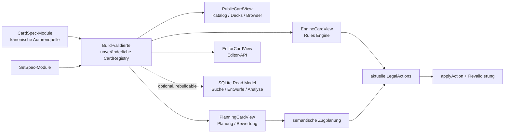

# Zentrale Kartenspezifikation und Card Registry

- Datum: 09.08.2026
- Status: **verbindliche Umsetzungsbaseline – unabhängige Prüfung eingearbeitet**
- Entscheidungsstand: für den sequenziellen Prozess CS00 bis CS13 freigegeben
- Betroffener Bereich: Kartendaten, Card Implementations, KI-Hints, Katalog,
  Decks, Karteneditor, optionale Datenbankprojektion

## 1. Architekturentscheidung

NETGRID führt die heute auf mehrere dauerhafte Quellen verteilten
kartenspezifischen Informationen in einer kanonischen, versionierten
`CardSpec` je Regelidentität zusammen.

Die zentrale Spezifikation soll:

- gedruckte und regelrelevante Kartendaten enthalten;
- die Karte durch deklarative, generische Engine-Fähigkeiten beschreiben;
- ausschließlich nicht mechanisch ableitbare Planungsinterpretation unmittelbar
  an die betreffende Fähigkeit binden;
- redaktionelle Publication-Zustände strukturiert führen und tatsächlichen
  Engine-/KI-Support aus Registry, Verträgen und Tests ableiten;
- alle Druckvarianten der Regelidentität referenzieren;
- zur Laufzeit genau einmal in eine unveränderliche In-Memory-Registry geladen
  werden;
- den Verbrauchern ausschließlich zweckgebundene, typisierte Projektionen
  liefern.

Die CardSpec wird damit die einzige kartenspezifische Autorenquelle. Ihr
Abschnitt `engine` ist die einzige mechanische Kartenwahrheit. Generische
Engine-Primitive, Tests, Szenarien, Set-Metadaten und Bilddateien bleiben
eigenständige Artefakte, weil sie keine Duplikate der Kartenbeschreibung sind.

Eine SQLite-Spiegelung kann später für Suche, Editorentwürfe oder
Massenauswertungen sinnvoll sein. Sie soll jedoch nur eine vollständig
rekonstruierbare Projektion der veröffentlichten CardSpecs sein. Die Rules
Engine darf sie weder laden noch abfragen.

## 2. Anlass und Ausgangsproblem

Der unmittelbare Anlass ist die Frage, warum die KI bei Karten wie Broker die
Installation und die anschließend möglichen Kartenaktionen nicht als
zusammenhängenden Zugplan behandelt. Der heutige Informationsbestand ist
verteilt:

| Information                             | Heutige Hauptquelle                         |    Beobachtete Größenordnung |
| --------------------------------------- | ------------------------------------------- | ---------------------------: |
| gedruckte Kartendaten und Set-Zuordnung | `data/cards/*-cards.json`                   |                   620 Karten |
| Freischaltungs- und Supportstatus       | `data/manifests/*-card-support.json`        |                 620 Einträge |
| statische KI-Funktionshinweise          | `data/ai/ai-card-hints-active.json`         |                 618 Einträge |
| ausführbare Kartenbeschreibung          | `packages/engine/src/card-implementations/` | mehrere hundert Kartenmodule |
| zentral verwendete CardDefinitions      | `packages/shared/src/card-definitions.ts`   |           große Sammelquelle |

Die Zahlen sind eine Bestandsaufnahme vom 09.08.2026 und keine Zielmetrik.
Entscheidend ist die strukturelle Folge: Um eine Karte vollständig zu
verstehen, müssen mehrere Quellen anhand einer ID zusammengeführt werden.
Neue Karten verlangen korrespondierende Einträge und Registrierungen an
mehreren Stellen. Abweichungen werden erst durch Paritäts-, Coverage- oder
Verhaltenstests sichtbar.

Die bestehende Engine-Registry ist für ihren heutigen Zweck korrekt aufgebaut:
Sie ordnet Card Implementations deterministisch nach Set, Seite und Kartentyp
und trennt Lookup von Regelausführung. Das ist in
[`docs/architecture/engine/card-registry-architecture.md`](engine/card-registry-architecture.md)
als aktueller Stand dokumentiert. Die beschlossene Zielarchitektur erhält
diese Qualitäten, entwickelt die Registry zu einer gemeinsamen
Kartenspezifikation weiter und entfernt danach die bisherigen parallelen
Autorenquellen.

## 3. Findings zum heutigen Architekturstand

### Hoch: Kartenspezifische Wahrheit hat mehrere Pflegeorte

Betroffene Quellen:

- `data/cards/`
- `data/manifests/`
- `data/ai/ai-card-hints-active.json`
- `packages/shared/src/card-definitions.ts`
- `packages/engine/src/card-implementations/`

Risiko: Eine neue oder geänderte Karte kann syntaktisch in einer Quelle
vollständig sein, fachlich aber erst durch weitere, separat gepflegte Quellen
spielbar, freigegeben oder KI-verstehbar werden. Die Paritätsprüfungen
begrenzen das Risiko, beseitigen aber nicht die mehrfache Autorenschaft.

Entscheidung: eine CardSpec als einzige kartenspezifische Autorenquelle;
Verbrauchersichten werden daraus abgeleitet.

### Hoch: Fähigkeiten besitzen noch keine überall stabile semantische Identität

Betroffene Module:

- `packages/engine/src/ability-engine/card-implementation-runtime-activated-actions.ts`
- `packages/engine/src/card-implementations/`

Aktivierte Fähigkeiten werden teilweise über ihre Position im Ability-Array
materialisiert. Für die aktuelle Ausführung kann das deterministisch sein. Für
prospektive Planung ist ein Arrayindex aber keine belastbare fachliche
Bindung: Die KI muss dieselbe Fähigkeit vor einer Installation beschreiben und
nach der Installation an der neu entstandenen `LegalAction` wiedererkennen
können.

Entscheidung: Jeder planungs- oder Action-adressierbare Capability-Knoten
erhält einen innerhalb der CardSpec eindeutigen und stabilen `capabilityKey`.
Für normale aktivierte Fähigkeiten darf `abilityKey` als typisierter Alias
verwendet werden. Der Schlüssel ist Semantik, keine zukünftige `actionId`.

### Mittel: Paketgrenzen erlauben keine unmittelbare Zusammenführung am heutigen Ort

Betroffene Quellen:

- `scripts/check-package-boundaries.mjs`
- `packages/shared/`
- `packages/catalog/`
- `packages/engine/`
- `packages/ai/`

`@netgrid/shared` darf keine anderen Pakete importieren. Die Engine darf heute
nur Shared importieren. KI und Katalog haben wiederum andere zulässige
Abhängigkeiten. Würde die vollständige CardSpec einfach in Shared oder Engine
gelegt, würden entweder Engine-Verantwortung, KI-Metadaten und
Browserverwendung vermischt oder Abhängigkeitszyklen erzeugt.

Entscheidung: ein neues, reines TypeScript-Paket `@netgrid/cards`, das nur von
`@netgrid/shared` abhängt. Engine, Katalog und KI erhalten explizite,
gerichtete Abhängigkeiten auf dieses Paket.

### Mittel: Eine zentrale Vollsicht wäre im Browser eine neue Leck- und Bundle-Grenze

Betroffene Module:

- normale Webclient-Imports von `CARD_DEFINITIONS_BY_ID`
- `apps/web/app/api/cards/catalog-data.ts`
- `apps/web/app/api/card-images/card-image-lookup.ts`

Eine vollständige CardSpec enthält künftig mechanische Semantik und nicht
mechanisch ableitbare PlanningAnnotations. Sie darf deshalb nicht als
bequemes Universalobjekt an den normalen Browser
ausgeliefert werden. Das wäre unnötiger Code-/Datenumfang und könnte interne
KI- oder Implementierungsdetails offenlegen.

Entscheidung: getrennte, statisch typisierte Exports unter `/public`,
`/engine`, `/planning` und `/editor`. Der normale Browser kann nur die
öffentliche Sicht importieren oder über eine API empfangen. Package- und
Source-Structure-Guards verbieten Vollsicht- und interne Subpath-Imports.

### Niedrig: SQLite löst die Autoren- und Konsistenzfrage nicht von selbst

Betroffenes Modul: `apps/server/src/storage-sqlite.ts`

Die bestehende SQLite-Datenbank dient Match- und Account-Laufzeitdaten. Eine
zusätzliche Kartentabelle in derselben Datenbank würde eine neue mutable
Regelquelle, Backup-Kopplung und Versionsfrage erzeugen. Für rund 620 statische
Karten ist ein In-Memory-Map-Lookup einfacher und schneller als eine
datenbankgestützte Einzelabfrage.

Entscheidung: SQLite bleibt außerhalb des ersten Architekturumbaus und der
Spiel-/Planungsruntime. Eine spätere SQLite-Nutzung ist nur als getrennte,
wegwerfbare Read-Model-Datenbank zulässig, wenn konkrete Editor-,
Volltextsuch- oder Analyseanforderungen den zusätzlichen Betriebsaufwand
rechtfertigen.

## 4. Ziele und Nicht-Ziele

### Ziele

1. Eine Karte soll an einer redaktionellen Stelle vollständig verständlich
   und erweiterbar sein.
2. Eine neue, bereits durch generische Primitive ausdrückbare Karte soll im
   Regelfall durch ein CardSpec-Modul und ihr Bild hinzukommen.
3. Engine, KI, Katalog, Decks und Editor sollen dieselben statischen Fakten
   konsumieren, ohne sie nochmals zu speichern.
4. Installierte und nach Installation mögliche Fähigkeiten sollen anhand
   stabiler Capability-Semantik vorplanbar sein.
5. LegalActions, `applyAction`, Replay, StateHash und Hidden-Info-Grenzen
   bleiben unverändert autoritativ.
6. Die Migration soll alte Quellen tatsächlich entfernen und nicht dauerhaft
   um eine weitere Schicht ergänzen.

### Nicht-Ziele

- Die KI erhält keine eigene Regelengine.
- Die CardSpec erzeugt keine zukünftigen LegalActions oder Action-IDs.
- Komplexe Verläufe mit Zufall, verdeckter Information, Choices oder
  gegnerischen Reaktionen werden nicht durch statische Hints als garantiert
  dargestellt.
- Bilder werden nicht in TypeScript oder SQLite eingebettet.
- Tests und Szenarien werden nicht in die Kartenbeschreibung verschoben.
- Unterschiedliche Drucke derselben Regelkarte werden nicht als identische
  Regeldefinitionen dupliziert.
- Die bestehende Match-/Account-Datenbank wird nicht zur Kartenautorität.

## 5. Verbindliche Architekturprinzipien

Der Umbau ist nur zulässig, wenn folgende NETGRID-Grenzen erhalten bleiben:

1. **Rules Engine als einzige Regelautorität.** CardSpecs beschreiben Regeln;
   die Engine validiert und führt sie aus.
2. **LegalAction-Disziplin.** Die KI plant semantisch, reicht aber nur aktuell
   materialisierte und erneut validierte LegalActions ein.
3. **Determinismus.** Registry-Reihenfolge, Fähigkeitsschlüssel und
   Projektionen sind unabhängig von Dateisystem- oder Importreihenfolgen.
4. **Side Safety.** Öffentliche Projektionen enthalten weder interne
   KI-Metadaten noch verdeckte Instanzdaten.
5. **Keine stille Ersatzquelle.** Fehlt eine CardSpec, Fähigkeit oder Bindung,
   scheitert der betroffene Pfad strukturiert und fail-closed.
6. **Keine per-card Sonderprogrammierung.** Neue Mechanik entsteht als
   generischer deklarativer Vertrag plus generische Engine-Ausführung; die
   Karte komponiert diese Fähigkeit nur.
7. **Keine Legacy-Pflicht.** Version-0-Daten, alte lokale Replays und Fixtures
   können bei einem bewusst gesetzten Schnitt zurückgesetzt werden. Neue
   Replays bleiben deterministisch und prüfbar.
8. **Strikte Serialisierbarkeit.** Finale CardSpecs enthalten ausschließlich
   schemaerlaubte Plain Objects, Arrays, Strings, Zahlen, Booleans und `null`;
   Funktionen, Runtimeobjekte, Zyklen und uneindeutiges `undefined` sind
   unzulässig.
9. **Konservative Longtails.** Nicht sicher statisch auswertbare Mechanik wird
   als `requires_engine_quote` oder `unknown` ausgewiesen. Vollständige
   Longtail-Normalisierung ist keine Vorbedingung der Zentralisierung.

## 6. Zielarchitektur



### 6.1 Kanonische CardSpec

Die genaue TypeScript-Oberfläche wird in CS02 typisiert. Ihre verbindliche
fachliche Gliederung lautet:

```ts
type CardSpec = {
  identity: CardIdentitySpec;
  text: CanonicalCardTextSpec;
  rules: CardRulesSpec;
  engine: CardMechanicalSpec;
  planningAnnotations?: CardPlanningAnnotations;
  printings: readonly PrintingSpec[];
  publication: CardPublicationSpec;
};
```

`engine` enthält die mechanische Wahrheit einschließlich Timing, Kosten,
Conditions, Limits, Targets, Effekten, Installationsbindungen,
Lifecycle-Folgen und sonstigen deklarativen Mechaniken.

`rules` enthält ausschließlich nicht ausführbare Regelstruktur und
Regelquellenbezug. Es enthält keine Engine-Eingaben oder mechanischen Felder
und darf `engine` weder spiegeln noch überschreiben. Sobald ein Wert
Legalität, Kosten, Timing, Condition, Limit, Target, Effekt oder
Zustandsänderung beeinflusst, liegt er allein in `engine`; öffentliche Regel-
und Katalogsichten leiten ihn von dort ab. Damit entsteht auch zwischen
`rules` und `engine` keine zweite mechanische Wahrheit.

`planningAnnotations` enthält ausschließlich nicht mechanisch ableitbare
Interpretation wie Taktiksignal, Strategy Support, strategische Rolle,
Target-Präferenz, Value-/Risk-Interpretation oder die bewusste Zuordnung zu
einem bestehenden Planowner. Kosten, Timing, Mengen, Limits, mechanische
Conditions und Targets, Zustandsänderungen sowie aktuelle Legalität dürfen
dort weder dupliziert noch überschrieben werden. Ein Strukturguard erzwingt
diese Grenze.

`publication` darf redaktionelle Zustände wie `active`, `experimental` oder
`disabled` führen. Tatsächlicher Engine-/KI-Support und Testcoverage werden
aus Registry, Verträgen und Tests abgeleitet und nicht als zweite manuelle
Statuswahrheit gespeichert.

Die Teiltypen verhindern einen unstrukturierten „God Object“-Typ und werden
einzeln validiert.

### 6.2 Serialisierbarkeitsvertrag

Eine finale CardSpec besteht ausschließlich aus Plain Objects, Arrays,
Strings, endlichen Zahlen, Booleans und `null`, soweit das Schema `null`
ausdrücklich vorsieht. Funktionen, Closures, Klasseninstanzen, `Map`, `Set`,
`Date`, RegExp, Symbole, zyklische Referenzen, umgebungsabhängige Werte und
uneindeutige `undefined`-Eigenschaften sind ausgeschlossen. Pure Helper sind
nur zulässig, wenn ihr Ergebnis den Vertrag erfüllt. JSON-Roundtrip,
kanonische Serialisierung und Deep-Freeze werden durch Tests belegt.

### 6.3 Regelidentität, Druck und Set

Die Architektur unterscheidet drei Dinge:

- `CardSpec`: eine Regelidentität mit stabiler `cardDefinitionId`;
- `PrintingSpec`: ein konkreter Druck mit `printingId`, `setId`,
  Sammlungsnummer, Seltenheit, Bildvarianten und optionalen
  druckspezifischen Textabweichungen;
- `SetSpec`: Metadaten des Sets selbst, etwa Name, Code, Reihenfolge und
  Freigabestatus.

Die Set-Zugehörigkeit einer Karte liegt damit in ihren `printings`. Das Set
bleibt eine eigene Entität, weil sein Name, seine Veröffentlichung oder seine
Sortierreihenfolge nicht pro Karte dupliziert werden sollen. Dieselbe
Regelkarte kann mehrere Printings in unterschiedlichen Sets besitzen, ohne
ihre Engine- oder Planungsbeschreibung zu kopieren.

`text.rulesText` ist der für die Regelidentität maßgebliche aktuelle
Text. Soll ein historischer oder alternativer Druck sichtbar abweichenden
Face-Text tragen, kann ausschließlich dessen Printing einen
`faceTextOverride` führen. Dieser Override verändert nicht automatisch die
ausführbare Regel; eine echte Regeländerung benötigt eine neue
`cardRulesFingerprint`-Version oder, wenn sie nicht mehr dieselbe Regelidentität
darstellt, eine neue `cardDefinitionId`.

### 6.4 Bilder

Bilddateien bleiben Assets außerhalb der CardSpec. Der Standardpfad wird aus
der stabilen `printingId` abgeleitet, nicht aus dem veränderlichen Kartentitel.
Damit sind Sonderzeichen, Umbenennungen und gleiche Titel unkritisch.

Ein Printing kann optional benannte Varianten deklarieren, zum Beispiel
`default`, `alternate-art` oder `promo`. Solange NETGRID nur eine Variante
braucht, genügt die abgeleitete Standardkonvention; es entsteht kein
Pflichtfeld pro Karte.

### 6.5 Generische Engine-Primitive bleiben eigenständig

„Eine Datei pro Karte“ bedeutet nicht, dass dieselbe Mechanik in jeder Karte
neu programmiert wird. Die heutigen generischen Helfer und deklarativen
Capability-Verträge bleiben die Grundlage. Broker würde beispielsweise in
seiner CardSpec generische Hosted-Credit-Fähigkeiten mit Betrag, Timing, Limit
und stabilem `capabilityKey` komponieren.

Die konkrete Zustandsänderung bleibt im generischen Engine-Primitive. Ist
eine neue Karte mit den vorhandenen Primitiven nicht ausdrückbar, wird zuerst
der generische Vertrag und seine Engine-Ausführung erweitert. Ein versteckter
per-card Switch oder ein KI-Sonderfall ist kein zulässiger Ersatz.

### 6.6 Deterministische Registry-Erzeugung

TypeScript entdeckt neue Dateien nicht automatisch. Laufzeit-Scanning des
Dateisystems wäre für Bundling, Engine-Reinheit und Determinismus ungeeignet.

Verbindlich ist deshalb ein buildseitig erzeugter Importindex:

1. Ein Generator findet CardSpec-Module anhand einer festen Pfadkonvention.
2. Er sortiert sie nach `cardDefinitionId`.
3. Er erzeugt ausschließlich Imports und eine deterministische Liste.
4. Validierung beweist Eindeutigkeit, Schema und referenzielle Integrität.
5. CI schlägt fehl, wenn der Index nicht zum Quellenbestand passt.

Der generierte Index enthält keine fachlichen Kartendaten und ist deshalb
keine zweite Autorenquelle. Eine manuelle produktive Importliste ist
ausgeschlossen.

### 6.7 Typisierte Projektionen statt Datenkopien

Die Registry hält pro Regelidentität genau ein unveränderliches Objekt. Daraus
werden schmale Sichten abgeleitet:

| Sicht              | Erlaubter Inhalt                                       | Ausgeschlossen                                |
| ------------------ | ------------------------------------------------------ | --------------------------------------------- |
| `PublicCardView`   | öffentliche Druck- und Regeltexte, Set-/Bildreferenzen | PlanningAnnotations, interne Handlerdaten     |
| `EngineCardView`   | Regelwerte, deklarative Abilities, Capability Keys     | Editorentwürfe, Suchindizes                   |
| `PlanningCardView` | side-sichere Regeln und PlanningAnnotations            | verdeckte Instanzdaten, zukünftige Action-IDs |
| `EditorCardView`   | editierbare CardSpec-Felder, Validierungsstatus        | Runtime-Matchzustand                          |

Die Projektionen sind pure Funktionen mit Compile-time-Typgrenzen und werden
nicht als zusätzliche JSON-Dateien dauerhaft gespeichert. Engine importiert
ausschließlich `/engine`; AI importiert `/planning` sowie ausdrücklich
erlaubte Public-/Engine-Deskriptoren. Der normale Browser importiert nur
`/public` oder erhält öffentliche API-DTOs. Exportmaps allein reichen nicht:
Package- und Source-Structure-Guards weisen verbotene Vollsicht- und
Subpath-Imports nach.

### 6.8 Abschnittsbezogene Fingerprints

Ein einzelner Hash über die vollständige CardSpec würde harmlose Bild-, Text-
oder Planungsänderungen mit Regeländerungen vermischen. Die Registry leitet
daher getrennt ab:

- `cardRulesFingerprint` für Regelwerte und mechanische CardSpec-Semantik;
- `textFingerprint` für kanonischen und druckspezifischen Text;
- `printingFingerprint` für Druck- und Bildzuordnung;
- `planningAnnotationsFingerprint` für nicht mechanische
  Planungsinterpretation;
- `publicationFingerprint` für den redaktionellen Publication-Zustand.

Der `cardRulesFingerprint` ist ausdrücklich nicht der vollständige Rules- oder
Replaykontext. Replay und Planung verwenden zusätzlich den übergreifenden
Engine-Kontext: Engine-Schema, Card-Implementation-/Primitive-Version,
Card-Pool sowie relevante Action-Semantic-/Planner-Versionen. Dadurch bleibt
eine reine Text- oder Bildkorrektur ohne Mechanikänderung replayneutral,
während eine geänderte generische Primitive-Ausführung auch bei unveränderter
CardSpec im Rules-Kontext sichtbar wird. Die Speicherung darf den StateHash
nicht von reinen Katalogänderungen abhängig machen.

### 6.9 Laufzeit-, Geschwindigkeits- und Speichermodell

Die Registry wird pro Node-Prozess einmal aufgebaut und anschließend
unveränderlich geteilt. Der einmalige Startaufwand ist linear zur Kartenzahl;
der normale Lookup über `cardDefinitionId`, `printingId` oder
`cardDefinitionId + capabilityKey` ist danach ein Map-Zugriff. Matchzustände
kopieren keine CardSpecs, sondern halten weiterhin nur Instanz- und
Definitionsreferenzen.

Für den heutigen Bestand ist deshalb ein niedriger einstelliger
Megabytebereich plausibel, aber nicht als Zusage anzunehmen. Vor der Migration
wird die aktuelle Card-/Hint-/Implementation-Baseline gemessen; nach dem
Vertikalschnitt werden Startzeit, Registry-Heap, Browserbundle und Heap pro
zusätzlichem Match erneut gemessen. Eine deutliche per-match Zunahme wäre ein
Architekturfehler, weil statische Daten dann versehentlich kopiert würden.

Für CS06 und CS13 gelten bei identischem Messskript, Node-/pnpm-Stand und
Buildkommando folgende Regressionsbudgets gegenüber dem CS00-Median:

- kumulierte Importstartzeit und statischer Heap dürfen jeweils höchstens um
  25 Prozent steigen;
- die Summe der einzeln gzip-komprimierten produktiven Browser-JavaScript-
  Chunks darf höchstens um 10 Prozent steigen;
- der Median des vorhandenen Retained-Match-Proxys darf höchstens um 10
  Prozent steigen;
- der in CS06 zusätzlich isoliert zu messende CardSpec-/Registry-Anteil darf
  höchstens 4 KiB je Match betragen.

Raw-, Brotli- und RSS-Werte bleiben zusätzliche Diagnosesignale. Eine
Budgetüberschreitung wird ursachenbezogen optimiert oder stoppt das Paket als
Architekturblocker; sie wird nicht durch einen abweichenden Messpfad oder ein
gröberes Vergleichspanel kaschiert. Eine vollständige Registrykopie pro Match
ist unabhängig vom gemessenen Heapwert unzulässig.

Statische Post-Install-Potenziale können je `cardDefinitionId` und relevanten
Abschnittsfingerprints einmal vorbereitet und geteilt werden. Nur die
Machbarkeitsbewertung gegen den aktuellen sichtbaren Zustand wird bei einer
relevanten Planentscheidung neu ausgeführt. Eine SQLite-Abfrage im Action-
oder Planungsloop wäre langsamer und fügte einen unnötigen Fehlerpfad hinzu;
sie ist daher ausdrücklich ausgeschlossen.

## 7. Capability-Identität und prospektive Fähigkeiten

Die CardSpec beseitigt die Informationslücke, ersetzt aber keine
Zugsimulation und keine aktuelle Engine-Autorisierung.

### 7.1 Stabile Capability-Identität

Jeder planungs- oder Action-adressierbare mechanische Knoten erhält einen
innerhalb der CardSpec stabilen `capabilityKey`. Für normale aktivierte
Fähigkeiten darf `abilityKey` als typisierter Alias dienen. Die kanonische
quellenweite Identität lautet:

```text
<cardDefinitionId>:<capabilityKey>
```

Sie darf in einer `CanonicalLegalActionInvocation` als `sourceAbilityId`
transportiert werden, ersetzt aber weder das `capabilityId` einer
Plan-Step-Anforderung noch die `actionId` einer aktuellen LegalAction oder die
`sourceCardInstanceId` einer konkreten Karteninstanz. Passive Knoten benötigen
nur dann einen Key, wenn Planung, Action-, Choice- oder Quote-Bindung oder eine
strukturierte Diagnose sie individuell adressieren muss.

### 7.2 Statische Prospective Capability View

`compileProspectiveCapabilities(CardSpec)` erzeugt eine
`ProspectiveCapabilityView` und leitet ohne GameState, PlayerView, LegalAction
oder AI-Plan mindestens ab:

- den Quellenzustand, in dem eine Capability existiert;
- den deklarativen Übergang dorthin, etwa `install`, `play`, `rez` oder
  `score`;
- direkte deterministische Übergangsfolgen;
- initialisierte Kartenwerte und gebundene Installationschoices;
- entstehende Verpflichtungen und Lifecycle-Liabilities;
- Kosten-, Timing-, Condition-, Limit-, Target- und Effect-Deskriptoren;
- die stabile Capability-Identität;
- die statische Unsicherheitsklasse.

Diese Sicht wird ausschließlich aus `engine`, den generischen
Primitivverträgen und nicht mechanischen `planningAnnotations` abgeleitet. Sie
ist keine separat gepflegte Quelle.

### 7.3 Zustandsbezogene side-sichere Projektion

Eine side-sichere Projektion kann die statische Sicht gegen einen sichtbaren,
geplanten Zielzustand konservativ klassifizieren:

- `available_by_spec`: Die Capability existiert nach dem deklarierten
  Übergang;
- `feasible_in_projection`: Sichtbare Kosten, Timing und bekannte Bedingungen
  erscheinen im geplanten Zug erreichbar;
- `blocked`: Eine bekannte Bedingung ist nicht erfüllt;
- `requires_engine_quote`: Nur eine exakt definierte Engine-Quote kann die
  dynamische Frage beantworten;
- `unknown`: Die statische Evidenz reicht für keine sichere Aussage.

`feasible_in_projection` ist keine Legalitätsgarantie. Aktuelle Legalität kann
nur eine aktuelle LegalAction oder eine exakt definierte Engine-Quote
beweisen. Nach einer echten Zustandsänderung bindet die AI anhand von
`sourceCardInstanceId`, kanonischer Capability-Identität und aktueller
`stateVersion` auf die exakte aktuelle LegalAction neu. Eine fehlende oder
mehrdeutige Bindung scheitert fail-closed; eine ähnliche Ersatzaktion ist
unzulässig.

### 7.4 Wann weiterhin Simulation oder Engine-Quote nötig ist

Statische CardSpec-Auswertung genügt nicht für:

- Zufallsergebnisse;
- verdeckte gegnerische Information;
- mehrstufige Choices;
- Reaktionsfenster des Gegners;
- variable Ziele oder Kosten, die erst die Engine exakt bestimmt;
- Wechselwirkungen mehrerer permanenter Effekte.

Für solche Fälle bleibt eine begrenzte, generische Engine-Quote oder spätere
Zugsimulation sinnvoll. Longtails werden bis dahin korrekt als
`requires_engine_quote` oder `unknown` klassifiziert. Sie blockieren die
Zentralisierung nicht und werden nicht durch einen Legacy-Fallback oder eine
zweite Mechanikquelle kaschiert.

## 8. Optionale SQLite-Projektion

### 8.1 Entscheidung

Die erste Zentralisierung soll ohne Datenbankabhängigkeit umgesetzt werden.
Die veröffentlichte Wahrheit bleibt in versionierten CardSpec-Modulen; die
Anwendung lädt sie einmal in eine In-Memory-Registry.

Eine spätere SQLite-Projektion ist sinnvoll, wenn mindestens eine konkrete
Anforderung vorliegt:

- Volltextsuche über Regeln, Flavor und KI-Klassifikation;
- komplexe Filter und Aggregationen im Karteneditor;
- viele getrennte Werkzeuge oder Prozesse benötigen dieselbe Abfragesicht;
- unveröffentlichte Editorentwürfe brauchen Historie und Arbeitsstände;
- Messungen zeigen einen tatsächlichen Engpass bei Registry-Projektionen.

„Der Editor benötigt weniger Felder“ ist für sich allein kein
Datenbankargument. Dafür genügt `EditorCardView`.

### 8.2 Zulässiger Datenfluss

```text
versionierte CardSpecs
→ validierte CardRegistry
→ optionale, atomar neu gebaute SQLite-Projektion
→ Editor-/Such-API
```

Die Projektion soll:

- eine eigene Datei außerhalb der Match-/Account-Datenbank verwenden;
- vollständig lösch- und rekonstruierbar sein;
- den Registry- und Schema-Fingerprint speichern;
- bei Abweichung atomar neu gebaut werden;
- bei einem fehlgeschlagenen Neuaufbau sichtbar scheitern;
- niemals still mit einem veralteten Bestand weiterarbeiten;
- nicht Teil normaler Matchdaten-Backups sein.

Ein möglicher lokaler Pfad wäre
`data/runtime/card-registry/card-index.sqlite`; Laufzeitdaten werden nicht
versioniert.

### 8.3 Editorentwürfe

Soll ein künftiger Editor Karten verändern, sind zwei Zustände sauber zu
trennen:

1. **Entwurf:** mutable, optional in SQLite, nicht spielbar;
2. **veröffentlicht:** validierte und versionierte CardSpec, alleinige Quelle
   für Registry und Spiel.

„Veröffentlichen“ erzeugt oder aktualisiert die CardSpec, formatiert sie und
führt die Card-, Engine- und KI-Gates aus. Ein Match darf nie direkt auf einen
DB-Entwurf zugreifen. Damit bleibt die Datenbank ein Arbeitsbereich und wird
nicht zur zweiten produktiven Autorität.

## 9. Erwartete Vorteile

### 9.1 Verständlichkeit und Wartbarkeit

- Eine Karte ist an einer Stelle fachlich lesbar.
- Änderungen zeigen im Diff unmittelbar Regeln, Fähigkeiten,
  PlanningAnnotations und Publication-Zustand derselben Karte.
- Navigieren und Reviewen erfordern keine gedankliche Verknüpfung mehrerer
  JSON- und TypeScript-Registries.

### 9.2 Einfachere Kartenimplementierung

- Neue Karten verwenden eine einheitliche Vorlage.
- Der generierte Importindex entfernt manuelle Sammelregistrierungen.
- Schema- und Referenzvalidierung geben sofort lokales Feedback.
- Mehrere Drucke duplizieren die Regelimplementierung nicht.

### 9.3 Bessere KI-Planung

- nicht mechanische Planungsinterpretation ist exakt an die betreffende
  Capability gebunden.
- Installieren und anschließende Fähigkeit können als zusammenhängender Plan
  modelliert werden.
- Stabile Capability Keys erlauben fail-closed Rebinding nach
  Zustandsänderungen.
- Einfache eigene Kartenfolgen brauchen keine vollständige Spielkopie.

### 9.4 Weniger Drift und weniger Konvertierung

- Card JSON, Supportmanifest, Hint-Datei und Implementierungsregistry können
  als parallele Autorensichten entfallen.
- Alle Verbraucher sehen denselben statischen Grundbestand.
- In-Memory-Projektionen werden einmal je Prozess erzeugt und wiederverwendet.

### 9.5 Bessere Werkzeuge

- Editor, Katalog und Diagnoseflächen bekommen explizite Sichten.
- Abschnittsfingerprints machen Regel-, KI- und Bildänderungen getrennt
  nachvollziehbar.
- Eine optionale Suchdatenbank kann später ohne Einfluss auf das Spiel
  ergänzt werden.

## 10. Echte Nachteile und Risiken

### 10.1 Großer Migrationsumfang

620 Karten und zahlreiche direkte Verbraucher sind betroffen. Ein
Big-Bang-Umbau wäre schwer reviewbar; eine unkontrollierte lange
Parallelphase würde dagegen neue Drift erzeugen.

Gegenmaßnahme: setweiser Wechsel mit genau einer Autorität je Set und kurzen,
explizit begrenzten Übergangsphasen.

### 10.2 Stärkere Änderungskopplung

Eine CardSpec-Änderung kann Engine-, KI-, Katalog- und Editor-Typechecks
berühren. Das ist teilweise gewollt, weil die Bereiche dieselbe Karte
beschreiben, erhöht aber Build-Fan-out und Reviewumfang.

Gegenmaßnahme: schmale Teiltypen, getrennte Projektionen, Abschnittshashes und
paketnahe Tests statt eines ungeteilten Universalexports.

### 10.3 Gefahr eines unübersichtlichen God Objects

Werden alle Felder ungegliedert in ein Interface gelegt, wird die zentrale
Datei zwar vollständig, aber nicht verständlich.

Gegenmaßnahme: namespaced Teilverträge (`identity`, `rules`, `engine`, `ai`,
`printings`, `lifecycle`), Builder nur für wiederkehrende Struktur und klare
Größen-/Komplexitätsgates.

### 10.4 TypeScript ist für externe Massendaten weniger bequem als JSON

Tabellenimporte, externe Tools oder nicht-technische Editoren können JSON oder
eine Datenbank leichter verarbeiten.

Gegenmaßnahme: validierte Exportprojektionen und später eine optionale
Editor-/SQLite-Schicht. Die Bequemlichkeit externer Werkzeuge rechtfertigt
keine zweite manuell gepflegte Runtime-Quelle.

### 10.5 Neues neutrales Paket verändert bestehende Grenzen

`@netgrid/cards` verlangt neue Abhängigkeitsregeln und möglicherweise die
Verlagerung rein deklarativer Capability-Verträge aus der Engine. Eine falsche
Grenze könnte die Rules Engine von KI- oder Servercode abhängig machen.

Gegenmaßnahme: `@netgrid/cards` bleibt pures TypeScript und hängt nur von
Shared ab. Runtime-Ausführung, GameState und LegalAction-Materialisierung
bleiben in Engine; KI-Planmodule bleiben in AI.

### 10.6 Supportstatus ist keine manuelle Karteneigenschaft

Freigabe und Testnachweis verändern sich durch Projektarbeit, nicht durch die
gedruckte Karte. Werden manuelle Statusfelder und tatsächliche Tests als
gleichwertige Wahrheiten behandelt, kann erneut Drift entstehen.

Gegenmaßnahme: Die CardSpec hält ausschließlich den redaktionellen
Publication-Zustand. Gates leiten tatsächlichen Engine-/KI-Support und
nachprüfbare Coverage aus Registry, Verträgen und Tests ab; sie kopieren
Testergebnisse nicht als zweite Faktenliste.

### 10.7 Browser- und Speicherumfang

Würde die vollständige Registry in jeden Client gebündelt, stiegen Bundle und
Leak-Risiko. Serverseitig ist der statische Bestand klein, aber mehrere
vollständige Kopien pro Match wären unnötig.

Gegenmaßnahme: eine pro Prozess geteilte immutable Registry; Matchinstanzen
halten nur `cardDefinitionId` beziehungsweise Instanzreferenzen. Der Browser
erhält ausschließlich `PublicCardView`.

## 11. Verbindlicher Migrationsplan

Jede Phase endet mit einem eigenen Review- und Integrationspunkt. Die
Reihenfolge ist bewusst so gewählt, dass die zentrale Quelle erst nach
prüfbaren Verträgen produktiv wird.

### Phase A – Architekturentscheidung und messbare Baseline

Ergebnisse:

- die unabhängigen Reviewfindings als verbindliche Architekturentscheidungen
  festschreiben;
- CardSpec-, Printing-, Set- und Capability-Key-Verträge entscheiden;
- aktuelle Karten-, Registry-, Hint- und Verbraucherparität erfassen;
- zulässige Paketabhängigkeiten und Browsergrenze festlegen;
- aktive Version-0-Replays und lokale Daten bestimmen, die beim Schnitt
  zurückgesetzt werden dürfen;
- Startzeit, statischen Registry-/Hint-Heap, Browserbundle und ungefähren
  Heapzuwachs pro Match als Vergleichsbaseline messen.

Gate:

- freigegebene Architecture Decision;
- keine offene Autoritäts- oder Paketgrenzenfrage;
- reproduzierbare Bestandsmetriken;
- dokumentierte Laufzeit- und Speicherbaseline.

### Phase B – Fundament `@netgrid/cards`

Ergebnisse:

- neues reines TypeScript-Paket;
- CardSpec-, PrintingSpec-, SetSpec- und Projektionsverträge;
- deterministischer Importindex-Generator;
- schema-, uniqueness- und referential-integrity-Validierung;
- Abschnittsfingerprints;
- aktualisierter Package-Boundary-Guard.

Gate:

- Paket hat keine Engine-, KI-, Server-, Browser-, DB- oder
  Dateisystem-Laufzeitabhängigkeit;
- doppelter `cardDefinitionId`, `printingId` oder adressierbarer
  `capabilityKey` scheitert;
- Public-Projektion enthält keine Engine-/KI-internen Felder;
- Generierung ist deterministisch und driftgeprüft.

### Phase C – Deklarative Capability-Grenze und stabile Capability Keys

Ergebnisse:

- rein deklarative Capability-Verträge liegen an einer von Cards und Engine
  gemeinsam nutzbaren, zyklenfreien Grenze;
- alle materialisierten und planungsadressierbaren Fähigkeiten tragen einen
  stabilen `capabilityKey`;
- LegalAction- und PlanExecution-Bindungen können diesen Schlüssel erhalten;
- Arrayindex bleibt höchstens interne Reihenfolge, nicht fachliche Identität.

Gate:

- gleiche CardSpec erzeugt deterministisch dieselben Capability Keys;
- `applyAction` validiert weiterhin Action, Seite, Version, Timing, Kosten,
  Ziele und Choices;
- Replay- und StateHash-Tests bleiben für den neuen Stand deterministisch;
- Choice-Resolver ändern weder Action noch Planowner.

### Phase D – Heterogener Mechanik-Stresstest

Der erste produktive Schnitt umfasst 8 bis 12 Karten und muss Broker, Loan
from Chiba, Black Widow, Morphing Tool und Sneak Preview sowie passive
Modifier-, Corp-Rez-/Variable-Rez-, Access-/Ambush-,
Scored-Agenda-Capability- und Successful-Run-/Run-Window-Familien abdecken.
Er beweist die Architektur über Set- und Mechanikgrenzen hinweg; keine Karte
darf als Sonderarchitektur implementiert werden.

Ergebnisse:

- vollständige CardSpecs für den gewählten Querschnitt;
- Engine-, Katalog-, Deck- und KI-Projektionen aus derselben Registry;
- alte Karten-, Manifest-, Hint-, Shared- und CardImplementation-Autorensicht
  für jede migrierte Karte im selben Integrationsschritt entfernt;
- bestehende generische Primitive werden weiterverwendet.

Gate:

- genau eine produktive Autorität für jede migrierte Karte und disjunkte
  Legacy-/CardSpec-Mengen;
- kein „wenn CardSpec fehlt, nimm Legacy“-Fallback;
- Regelwerte, LegalActions, Katalog und Planungssemantik entsprechen der
  Baseline;
- Startzeit, Registry-Heap und Browserbundle liegen innerhalb der in Phase A
  beschlossenen Budgets;
- fokussierte Engine-, KI-, Katalog- und Decktests grün.

### Phase E – Prospektive Kartenfähigkeiten und Broker-Planung

Ergebnisse:

- side-sichere Ableitung statischer Post-Install-Potenziale;
- Zustandsklassifikation `available_by_spec`, `feasible_in_projection`,
  `blocked`, `requires_engine_quote`, `unknown`;
- Erweiterung des bestehenden Owners `runner.credit_bank`, sodass Broker-
  Installation und Build in demselben Zugplan liegen können;
- `runner.economy` bleibt ausschließlich gebundener Funding-Support;
- Rebinding nach echter Installation über Source-Instanz, kanonische
  Capability-Identität, `stateVersion` und aktuelle LegalAction.

Gate:

- Planowner und `PlanExecutionOrigin` bleiben erhalten;
- kein zweiter Action-Chooser oder Choice-Resolver mit Strategielogik;
- Tests sichern sowohl Ergebnis als auch Ownership;
- fehlende oder mehrdeutige Capability-Bindung scheitert fail-closed;
- Broker-Verhaltensbaseline zeigt die beabsichtigte frühere Nutzung, ohne
  globale Economy-Prioritäten pauschal zu erhöhen.

### Phase F – Setweise Migration des produktiven Kartenbestands

Empfohlene Reihenfolge nach dem Testset:

1. Classic;
2. Proteus;
3. Originalset v1.

Pro Set:

- CardSpecs generieren oder manuell überführen und fachlich reviewen;
- Engine-, AI-, Katalog-, Deck- und Bildprojektion umschalten;
- alte Quellzeilen und Set-Registries im selben Paket entfernen;
- Parität und fokussierte Mechanikfamilien testen;
- erst danach das nächste Set beginnen.

Eine temporäre Migrationskomposition darf neue und alte **disjunkte Sets**
vereinigen. Sie darf nie bei einem Fehler einer migrierten Karte auf Legacy
zurückfallen. Ihre Removal Condition ist die Migration des letzten Sets.

### Phase G – Verbraucher, Werkzeuge und Guards vereinheitlichen

Ergebnisse:

- `CARD_DEFINITIONS`-Verbraucher nutzen die passende Registry-Projektion;
- Katalog, Decks und Web-API verwenden keine direkten Rohdatei-Imports mehr;
- Coverage- und Supportskripte leiten Fakten aus CardSpecs und Tests ab;
- Bildlookup verwendet `printingId` und Variantenvertrag;
- Browser-Boundary- und Bundle-Gates verhindern Vollregistry-Imports.

Gate:

- keine produktiven Importe der alten Card JSONs, Supportmanifeste oder
  Hint-Datei;
- Package-Boundary-, Cycle- und Source-Structure-Gates grün;
- öffentliche Golden-Payload- und Hidden-Info-Tests grün.

### Phase H – Alte Architektur entfernen

Zu entfernen, sobald alle Sets migriert sind:

- parallele `data/cards/*-cards.json` als produktive Autorenquelle;
- `data/manifests/*-card-support.json` als produktive Autorenquelle;
- `data/ai/ai-card-hints-active.json`;
- kartenspezifische Sammeldefinitionen in
  `packages/shared/src/card-definitions.ts`;
- alte CardImplementation-Subregistries und Coverage-Source-Listen, soweit
  ihre Informationen vollständig aus CardSpecs ableitbar sind;
- temporäre Migrationskomposition und Übergangsgates.

Generische Engine-Primitive, Runtime-Resolver, Tests, Szenarien, SetSpecs und
Bildassets bleiben bestehen.

Gate:

- Quellscan findet keine alte produktive Autorität;
- vollständige Engine-, KI-, Shared-, Katalog-, Deck-, Server- und
  Workspace-Gates an diesem Integrationscheckpoint grün;
- Architektur- und Wissensdokumentation bezeichnet nur noch die neue Registry
  als aktuellen Stand.

### Phase I – SQLite nur bei belegtem Bedarf

Vorbedingung:

- konkrete Editor-/Suchanforderung und Abfragemodell liegen vor;
- In-Memory- und API-Projektionen wurden gemessen;
- der Nutzen rechtfertigt Schema-, Rebuild- und Diagnoseaufwand.

Ergebnisse bei positiver Entscheidung:

- getrennte, rebuildbare Read-Model-Datenbank;
- atomarer Projektor mit Fingerprintprüfung;
- optional getrennte Draft-Tabellen;
- Publish-Workflow von Draft zu versionierter CardSpec;
- kein Engine- oder Matchstorage-Import.

## 12. Verifikationsmatrix

| Risiko                             | Mindestnachweis                                                            |
| ---------------------------------- | -------------------------------------------------------------------------- |
| doppelte oder fehlende Karten      | Registry-Schema-, Uniqueness- und Vollständigkeitstest                     |
| instabile Capability-Bindung       | Capability-Key-Stabilitäts- und Rebinding-Test                             |
| Regelabweichung                    | LegalAction-, Effect- und fokussierte Per-card-Parität                     |
| Replay-/StateHash-Drift            | deterministischer Replay-Wiederholungstest mit vollständigem Rules-Kontext |
| Hidden-Info-Leak                   | PublicCardView-Typtest plus Golden-Payload-Test                            |
| KI übernimmt Regelautorität        | Ownership-, Action-ID-, Executor- und PlanOrigin-Test                      |
| Browser importiert Vollsicht       | Package-/Source-Structure-Guard und Bundleprüfung                          |
| Generator ist nicht reproduzierbar | zweimalige Generierung mit bytegleichem Ergebnis                           |
| alte Quelle bleibt aktiv           | Quellscan und One-Authority-per-card/-set-Gate                             |
| veraltete SQLite-Sicht             | Fingerprint-Mismatch-Test, atomarer Rebuild, fail-closed Fehlerpfad        |

Während einer Phase werden nur die fokussierten, direkt betroffenen Tests
ausgeführt. Breite Engine-, KI- und Workspace-Gates gehören an die benannten
Integrationspunkte und an den finalen Architekturwechsel.

## 13. Abbruch-, Rücksetz- und Fallback-Regel

Jede Phase soll als sauberer, lokal integrierbarer Commit oder kleines
Commitpaket umgesetzt werden. Scheitert ein Gate, wird die Phase korrigiert
oder vollständig zurückgenommen. Ein stiller Dual-Read, Ersatzwert oder
„vorübergehend Legacy nehmen“ ist kein Abschlusszustand.

Für die Migration gilt:

- nicht migrierte Karten haben vorübergehend genau ihre alte Quelle;
- migrierte Karten haben genau ihre CardSpecs;
- Legacy- und CardSpec-Mengen sind jederzeit disjunkt;
- der Übergang endet verbindlich mit Phase H.

## 14. Aufgelöste Architekturentscheidungen

1. `@netgrid/cards` ist die neutrale Paketgrenze und hängt ausschließlich von
   Shared ab. Es entsteht kein weiteres Vertragspaket. Rein deklarative
   Verträge werden in CS02 an die kleinste zyklenfreie Cards-/Shared-Grenze
   gelegt; Runtimeausführung bleibt in Engine.
2. `publication` enthält nur redaktionelle Zustände. Tatsächlicher Engine- und
   KI-Support sowie Coverage werden aus Registry, Verträgen und Tests
   abgeleitet.
3. `printingId` ist der Standardbildschlüssel. Ein eigener `assetKey` entsteht
   nur bei einem nachgewiesenen Auseinanderfallen von Printing- und
   Assetidentität.
4. Nicht rein deklarative Card-Implementation-Longtails werden in CS01
   inventarisiert und als `statically_compilable`, `requires_engine_quote`
   oder `unknown` klassifiziert. Erforderliche generische Erweiterungen werden
   in den zuständigen Folgepaketen umgesetzt. Eine vollständige
   Vorabnormalisierung ist keine Vorbedingung des Quell-Cutovers.
5. `cardRulesFingerprint` bildet ausschließlich mechanische CardSpec-Semantik
   ab. Replay und Planung verwenden zusätzlich einen vollständigen
   Rules-/Engine-Kontext. Die konkrete Metadatenablage wird in CS03 so
   umgesetzt, dass reine Text- und Katalogänderungen den StateHash nicht
   verändern.
6. Der erste produktive Schnitt ist der heterogene Mechanik-Stresstest aus
   Phase D. Das vollständige Testset folgt anschließend als erster Set-Cutover.
7. SQLite ist weder für Zentralisierung noch Editorprojektion im aktuellen
   Prozess erforderlich und bleibt außerhalb der Spiel-/Planungsruntime.
8. Gedruckter Regeltext besitzt einen eigenen `textFingerprint`. Nur eine
   Änderung der ausführbaren Semantik verändert den
   `cardRulesFingerprint`.

## 15. Ergebnis der unabhängigen Prüfung

Die Prüfung bestätigt die Zentralisierung unter verbindlichen Schärfungen:

- `engine` ist die einzige mechanische Kartenwahrheit;
- `planningAnnotations` dürfen keine ableitbare Mechanik duplizieren;
- jede adressierbare Capability besitzt stabile semantische Identität;
- die Prospective Capability View ist eine Ableitung, keine zweite Quelle;
- Projektionsaussagen sind konservativ und niemals LegalAction-autorisierend;
- Abschnittsfingerprints ersetzen keinen vollständigen Rules-/Engine-Kontext;
- unbekannte Longtails bleiben explizit, ohne die Zentralisierung zu
  blockieren;
- der heterogene Stresstest geht dem vollständigen Set-Cutover voraus.

Damit sind keine Architekturfragen mehr als offene Alternativen formuliert.
CS01 ermittelt Tatsachen und Klassifikationen innerhalb dieser Grenzen; ein
echter Widerspruch führt zum strukturierten Prozessblocker statt zu einem
Fallback oder zweiten Datenmodell.

## 16. Gesamteinschätzung

Es gibt keinen erkennbaren grundsätzlichen Architekturgrund, die heutigen
kartenspezifischen Informationen dauerhaft auf mehrere Autorenquellen zu
verteilen. Eine zentrale CardSpec verspricht eine echte Vereinfachung und
schafft zugleich die fehlende semantische Verbindung zwischen Installation
und anschließend verfügbarer Kartenfähigkeit.

Der Umbau ist dennoch kein kleiner Broker-Fix. Er verändert Paketgrenzen,
Registries und zahlreiche Verbraucher. Sein Erfolg hängt daran, dass er alte
Quellen entfernt, die Engine autoritativ lässt, stabile Capability Keys
einführt und öffentliche Sichten strikt begrenzt. Unter diesen Bedingungen ist die
Umstellung für die Version-0-Umgebung realistisch und empfehlenswert. SQLite
sollte dabei als spätere Werkzeugprojektion offenbleiben, aber nicht den
ersten Architekturumbau oder die Spiellaufzeit bestimmen.

## 17. Herangezogene aktuelle Architekturquellen

- [`docs/architecture/README.md`](README.md)
- [`docs/architecture/engine/card-registry-architecture.md`](engine/card-registry-architecture.md)
- [`docs/reviews/engine/engine-architecture-refresh-final-review-2026-07-18.md`](../reviews/engine/engine-architecture-refresh-final-review-2026-07-18.md)
- [`docs/reviews/ai/ai-generic-capability-migration-final-review-2026-08-01.md`](../reviews/ai/ai-generic-capability-migration-final-review-2026-08-01.md)
- `packages/engine/AGENTS.md`
- `scripts/check-package-boundaries.mjs`
- `packages/shared/src/card-definitions.ts`
- `packages/engine/src/card-implementations/`
- `packages/engine/src/ability-engine/`
- `packages/catalog/src/card-set-loader.ts`
- `packages/ai/src/ai-hints.ts`
- `apps/web/app/api/cards/catalog-data.ts`
- `apps/web/app/api/card-images/card-image-lookup.ts`
- `apps/server/src/storage-sqlite.ts`
