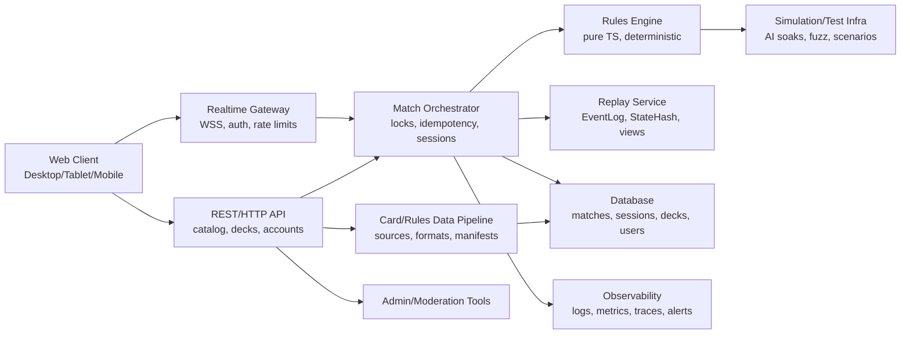

# Langfristige Produktvision und Roadmap

Status: planning
Stand: 2026-05-05
Scope: langfristige Produktvision, Roadmap, Gates und Idealarchitektur für ein quasi vollständiges Netrunner-Endprodukt

Nachtrag 2026-05-06: Die kurzfristige V1.x-Linie wurde durch den tatsächlichen Projektverlauf fortgeschrieben. V1.0.4, V1.0.5K, V1.0.6, V1.0.6K und V1.0.7 sind inzwischen umgesetzt bzw. verifiziert; V1.0.8 Storage/Backup-Härtung ist requirements-frozen und bevorzugt SQLite als privaten lokalen Storage-Pfad. Die ursprünglich skizzierte V1.0.6-Position "Private Lobby Comfort" wurde faktisch durch V1.0.6 Aktionen, Credits und Kartenanzeige ersetzt; verbleibende Lobby-Politur ist kein aktiver V1.0.8-Scope.

## Kurzfazit

Das realistische Zielbild ist kein sofort öffentliches "alles kann alles"-Netrunner, sondern ein stufenweise gehärtetes Produkt:

1. **Privat lokal sehr gut spielbar**: die heutige Basis plus V1.0.4 bis V1.0.6 stabilisiert Match-Lifecycle, Reconnect, KI-Pacing, Board-Klarheit, Aktionen, Credits und Kartenanzeige.
2. **Privat über Internet belastbar**: sicherer privater Betrieb mit HTTPS/WSS, SQLite/Postgres-Pfad, Backups, Monitoring, Rate Limits, Browser-E2E und Datenschutzgrenzen.
3. **Regel- und Kartenbreite systematisch vollständig**: alle Mechaniken, Formate, Setrotation, Banlists und Karten nur über Datenpipeline, Resolver/Ability-Gates, Hidden-Info-Tests, Replay/StateHash und Multiplayer-Smokes.
4. **Öffentliche Plattform nur mit harten Gates**: Accounts, öffentliche Lobbys, Matchmaking, Chat, Rankings, Turniere, Moderation, Anti-Abuse und Betrieb sind ein eigenes Produkt, nicht nur eine Serveroption.
5. **Quasi vollständiges Endprodukt**: vollständige Rules Engine, vollständiger rechtlich sauberer Kartendatenpfad, komfortabler Deckbuilder, Internet-Multiplayer, Replays, Tutorials, Regelhilfe, mobile/tablet/desktop UX, Accessibility, Betriebssicherheit und langfristige Wartbarkeit.

Die wichtigste Produktentscheidung bleibt: **Engine-Korrektheit, Hidden-Info-Sicherheit, deterministisches Replay, StateHash, PublicEvents und AI-Input-Sicherheit stehen über Komfort, Tempo und Kartenbreite.**

## Prüfbasis

### Repository- und Wissensbasis

Gelesen und ausgewertet wurden unter anderem:

- `AGENTS.md`
- `AGENTS.local.md`
- `KI-Wissen-Netrunner/00 Projektstart.md`
- `KI-Wissen-Netrunner/02 Wissen/00 Uebersichten/Index.md`
- `KI-Wissen-Netrunner/02 Wissen/00 Uebersichten/Aktueller Projektstatus.md`
- `KI-Wissen-Netrunner/03 Betrieb/Log 2026-05.md`
- `docs/codex/CODEX_STATUS.md`
- `docs/codex/CODEX_RUNBOOK_NETRUNNER_MVP_0_1_0_2.md`
- `docs/derived/RELEASE_PLANNING_2026-05-05.md`
- `docs/derived/V1_0_3_MATCHSTART_UX_FINAL_REVIEW.md`
- `docs/derived/V1_0_4_NEXT_RELEASE_CANDIDATES.md`
- `docs/derived/V1_0_4_PRIVATE_MATCH_LIFECYCLE_PLAN.md`
- `docs/derived/V1_0_5_ACTION_BOARD_UX_PLAN.md`
- `docs/derived/V1_0_2_OPPONENT_ACTION_PRESENTATION_PLAN.md`
- `docs/derived/V1_0_1_JOIN_DECK_HANDSHAKE_PLAN.md`
- `docs/derived/MECHANICS_COVERAGE_MATRIX.md`
- `docs/derived/MVP_0.91_REQUIREMENTS.md`
- `docs/derived/CARD_IMAGE_ASSET_GATE_0.91_SPEC.md`
- `docs/derived/MVP_0.92_REQUIREMENTS.md`
- `docs/derived/SETUP_GAME_END_0.93_SPEC.md`
- relevante V0.94 bis V0.99 Requirements, Testmatrizen und Final Reviews nach Bedarf.

### Code- und Teststand

Geprüfte Kernbereiche:

- `packages/shared/src/index.ts`
- `packages/engine/src/index.ts`
- `packages/engine/src/index.test.ts`
- `packages/ai/src/index.ts`
- `packages/ai/src/index.test.ts`
- `packages/catalog/src/index.ts`
- `packages/decks/src/index.ts`
- `apps/server/src/multiplayer.ts`
- `apps/server/src/http-server.ts`
- `apps/server/src/multiplayer.test.ts`
- `apps/web/app/page.tsx`
- `apps/web/app/chronicle.ts`
- `apps/web/app/chronicle.test.ts`
- `tests/specs/visibility-contract.test.ts`

Aktuelle Prüfläufe am 2026-05-05:

- `corepack pnpm test`: bestanden.
  - Workspace: Catalog 7, Decks 7, Engine 66, AI 25, Server 29, Web 14 Tests.
  - Root-Specs: 39 Tests.
  - Shared hat keine Testdateien und läuft mit `--passWithNoTests`.
- `corepack pnpm typecheck`: bestanden.
- `corepack pnpm lint`: bestanden.
- `corepack pnpm build`: bestanden, Next.js 16.2.4/Turbopack Build erfolgreich.

### Aktuelle externe Primärquellenprüfung

Die externe Prüfung wurde nur zur aktuellen Einordnung von Regeln, Formaten und Asset-/IP-Gates genutzt. Sie ersetzt keine Rechtsberatung.

- [Null Signal Comprehensive Rules Hub](https://nullsignal.games/rules/comp-rules/) führt Comprehensive Rules v26.03 als aktuelle Regeln und verweist auf die Webfassung.
- [Netrunner Comprehensive Rules Web](https://rules.nullsignal.games/) ist die lebende Regelreferenz.
- [Null Signal Supported Formats](https://nullsignal.games/players/supported-formats/) beschreibt aktuelle Formate, Rotation, Banlists und Legalitätsdaten. Stand der Seite: Vantage Point, Standard Ban List 26.05 und aktuelle Startup-/Standard-Informationen.
- [Null Signal Visual Assets](https://nullsignal.games/about/nsg-visual-assets/) erlaubt nur das freigegebene Visual-Assets-Pack; Card Art, Frames und Card Backs sind nicht öffentlich freigegeben.
- [Null Signal FAQ](https://nullsignal.games/about/frequently-asked-questions/) bestätigt unter anderem, dass Print-and-Play-Dateien keine Card Backs enthalten und Card Backs nicht verteilt werden.
- [NetrunnerDB API](https://netrunnerdb.com/api/doc) ist eine technische Datenquelle für Karten-, Format- und Deckdaten; die Lizenz-/Asset-Frage wird dadurch nicht automatisch gelöst.
- [Null Signal Products](https://nullsignal.games/products/) beschreibt Print-and-Play/POD-Verfügbarkeit, aber keine App-Asset-Freigabe.

## Heutiger belegter Stand im Repo

Umgesetzt und grün:

- serverautoritative private Webapp mit Human-vs-KI, KI-vs-KI und privatem Human-vs-Human.
- Engine mit `LegalActions`/`PlayerActions`, `applyAction`-Revalidierung, `PlayerView`, `PublicGameEvent`, Replay, StateHash und seedbasierter Randomness.
- V0.94 bis V0.99 als enge Mechanik-Gates: Damage/Flatline, Resources, Trace/Link/Bidding, Jack-out/Breach/Multiaccess, Identity/Modifier, Hidden-Zone-Tools, Hosting, Viren, Purge, Recurring Credits und Bad Publicity.
- lokaler Kartenkatalog, Deckeditor, Deckvalidierung, gespeicherte lokale Decks, validierte Snapshots, Matchstart und Human-vs-Human-Join-Deck-Handshake.
- S01 Ergebnisfenster, private Zwei-Spiel-Serie und opt-in Audio.
- private lokale O:NR-v1-Testumgebung als ignorierter lokaler Datenpool, nicht versioniert und nicht öffentlich.

Nicht belegbar oder bewusst offen:

- V1.0.2 Gegner-Aktionsdarstellung und V1.0.3 Matchstart-UX sind umgesetzt und auf `main` integriert.
- V1.0.4 ist umgesetzt und final geprüft; V1.0.5 besitzt Requirements/Specs und eine passende Workspace-Basis, aber keine eigenen formalen Finalartefakte; V1.0.5K, V1.0.6, V1.0.6K und V1.0.7 sind umgesetzt und lokal verifiziert; V1.0.8 Storage/Backup-Härtung ist requirements-frozen.
- Server hat seit V1.0.4 Cancel-/Leave-/Forfeit-/Recreate-APIs für private Match-Lifecycle-Fälle.
- KI-Pacing, `advance_ai`, Action-Cues und opt-in Aktionsaudio existieren seit V1.0.2; V1.0.5 soll sie gegen Regression absichern und die Spielansicht verständlicher machen.
- Gegnernamen sind seit V1.0.4 side-sicher in Payloads/UI ergänzt.
- Browser-E2E-/Screenshot-Smokes für Zwei-Tab-UX, Reconnect, Viewports und Kartenanzeige sind seit V1.0.7 als Playwright-Gate umgesetzt.
- JSON-Storage ist ausreichend für den bisherigen privaten Stand; SQLite, Migrationen, Backups und Betriebshärtung sind als V1.0.8 geplant. Postgres bleibt zurückgestellt, solange kein Public-Scale-Gate beginnt.
- Accounts, öffentliche Lobbys, öffentlicher oder moderationspflichtiger Chat, Matchmaking, Rankings, Turniere, Zuschauer, Moderation und Anti-Abuse fehlen bewusst. Der private V1.0.3-Lobbychat bleibt auf die Startlobby begrenzt.
- Vollständige offizielle Deckbuilding-/Formatregeln, vollständige Setrotation/Banlists und vollständige Karten-/Mechanikabdeckung fehlen.
- Öffentliche Nutzung offizieller Bilder, Frames, Logos, Card Backs oder vollständiger Kartendaten bleibt gesperrt, bis ein belastbarer Rechts-/Lizenzpfad existiert.

## Produktvision

### Leitbild

Das ideale Endprodukt ist eine private oder öffentlich betreibbare Netrunner-Plattform, die sich wie ein sehr guter digitaler Tisch anfühlt, aber technisch härter ist als ein normaler Tabletop-Simulator:

- Die Engine kennt und erzwingt die Regeln.
- Alle Spieler, KI, UI, Server und Tools handeln ausschließlich über erlaubte Aktionen.
- Verdeckte Information bleibt auch bei Reconnect, Undo, Replay, Spectator, Logs, Fehlern, KI und Moderation geschützt.
- Jede Partie ist deterministisch rekonstruierbar.
- Kartendaten, Formate, Banlists und Regeltexte werden nachvollziehbar versioniert.
- Komfortfunktionen erklären, führen und beschleunigen, werden aber nie Regelautorität.
- Der rechtliche Nutzungsumfang ist sichtbar, auditierbar und trennscharf zwischen privat lokal, privat online und öffentlich.

### Produktstufen

| Stufe | Ziel | Zulässiger Umfang |
|---|---|---|
| Privat lokal | Persönliche Nutzung auf einer Maschine oder im Heimnetz | Lokale Decks, lokale Daten, private Scans/Assets nur display-only, kein öffentlicher Zugriff |
| Privat über Internet | Eingeladene Spieler über private Links oder private Accounts | HTTPS/WSS, sichere Sessions, Backups, minimale Adminsicht, keine öffentliche Discovery |
| Geschlossene Community | Kleine bekannte Gruppe mit Accounts | Rollen, private Lobbys, Freundeslisten, minimaler Chat, Moderation light, Datenschutzpflichten |
| Öffentliches Produkt | Unbekannte Nutzer, öffentliche Lobbys und Matchmaking | Vollständiges Auth-/Abuse-/Moderations-/Betriebsmodell, Datenschutz, ToS, Support, Skalierung |
| Quasi vollständiges Endstadium | Regeln, Karten, Formate, Komfort und Betrieb umfassend | Nur nach Rechts-/Asset-/Daten-/Security-/Moderations-Gates |

## Kategorieanalyse

Legende:

- **Stand**: belegter Repo-Stand am 2026-05-05.
- **Lücken/Risiken**: technische, Hidden-Info-/Replay-/StateHash-, IP- und Wartungsrisiken.
- **Tests/Akzeptanz**: notwendige Testarten und harte Done-Kriterien.

| Kategorie | Stand | Lücken/Risiken | Tests/Akzeptanz |
|---|---|---|---|
| Vollständige Rules Engine | Starke Engine-Basis; V0.94-V0.99 enge Mechanik-Slices umgesetzt. | Mulligan, vollständiges Setup/Game-End, Prevention, Avoid, Interrupt, Replacement, Set Aside, Remove from Game, Ownership/Control, umfassende Timingfenster und Sonderfälle offen. Jede neue Mechanik kann Hidden Info, Replay oder StateHash brechen. | Pro Mechanik: Requirements, Spec, Resolver/Ability, Unit, Szenario, Visibility, Replay/StateHash, AI-Smoke, Multiplayer-Smoke, Regression. Akzeptanz: offizielle Regelreferenz abgedeckt oder Abweichung dokumentiert. |
| Alle Karten und Sets | Lokaler/fiktiver Starter-Slice und privater lokaler O:NR-Testpool; Import/Katalog vorhanden. | Vollständige Karten brauchen rechtlich saubere Datenquelle, Mechanikcoverage, Resolver, Errata, Formate, Übersetzungen. Kein Import darf Spielbarkeit erzeugen. | Card-by-card Manifest mit Status `imported`, `playable`, `deck_legal`; jede spielbare Karte mit Unit/Szenario/Visibility/Replay/AI/MP. |
| Setrotation, Formate, Banlists | Lokale Deckprofile/Snapshots; offizielle Formatregeln nicht vollständig. | Unterstützte Formate ändern sich. Banlists/Rotation sind lebendige Daten. Fehler kann illegale Decks zulassen. | Versionierte Formatdaten mit effective dates, Deckvalidierungstests, Regression gegen Beispieldecks, Format-Snapshot-Replay. |
| Deckbuilder | Lokale gespeicherte Decks, Validierung und Matchstart-Snapshots vorhanden. | Vollkomfort fehlt: Suche, Statistik, Influence, Agenda-Dichte, Rotation, Import/Export, Cloud-Sync, öffentliche Listen. | Deckvalidierung je Format, Diff/Save/Import/Export, invalid-but-saveable, serverseitige Revalidierung, keine gegnerischen Decklisten in Payloads. |
| Kartenimport und Kartendatenpflege | `@netrunner/catalog`, lokale Snapshots, Statusmodell vorhanden. | Vollständige Datenpipeline fehlt: Source Registry, Diff, Review, Errata, Sync, Provenienz, Rollback, Übersetzungen. | Deterministische Imports, Schema-Validierung, Hashes, Reports, Review-Gate, keine Runtime-Abhängigkeit im Match. |
| Kartentexte, Übersetzungen, Suche | Katalog und display-only Texte für aktuellen Stand; deutsche UI teilweise. | Offizielle Kartentexte können urheberrechtlich geschützt sein und ändern sich. Mehrsprachigkeit braucht versionierte Quellen und Fallbacks. | Suchindex-Tests, Text-Versionierung, locale-Fallback, keine Kartentextparser als Regelquelle. |
| Kartenbilder und Asset-Rechte | V0.91: private lokale O:NR-Frontbilder als Anzeige-Artefakte erlaubt; keine öffentlichen Assets. | Öffentliche Nutzung offizieller Card Art, Frames, Backs, Logos bleibt blockiert. Hidden Cards dürfen keine Bild-/DOM-/Asset-Spuren leaken. | Asset-Policy, Source Registry, lokale nicht versionierte Caches, Hidden-Card DOM/Payload-Leaktests, keine Bilddaten in Engine/AI/StateHash. |
| Human-vs-Human Internet-Multiplayer | Privater Multiplayer lokal, serverautoritative Actions, WebSocket, Reconnect, Undo vorhanden. | Internetbetrieb braucht HTTPS/WSS, origin/cors, rate limits, robuste Persistenz, Reconnect über Browserneustart, Betriebshärtung. | Zwei-Tab/E2E, Netzwerkunterbrechung, stale actions, duplicate idempotency, token rotation, leak scans. |
| Private Lobbys | Pending Lobby mit Join-Deck-Handshake sowie V1.0.4-Cancel, Leave, Forfeit, Recreate, Session-Recovery und Gegnernamen vorhanden. | Weitere Lobby-Politur ist möglich, aber kein aktiver V1.0.7-Scope. | V1.0.4 Tests plus V1.0.7 Browser-E2E für Host/Join/Ready/Lifecycle/Reconnect. |
| Öffentliche Lobbys | Nicht vorhanden, bewusst out of scope. | Öffentliche Discovery öffnet Spam, Abuse, Datenschutz, Moderation und Verfügbarkeit. | Erst nach Auth/Moderation/Rate-Limit-Gate; Akzeptanz: private Daten nicht sichtbar, Abuse-Meldepfad, Admin-Audit. |
| Matchmaking | Nicht vorhanden. | Braucht Accounts oder stabile Gastidentität, Rating/Queue, Abuse-Schutz, Region/Latenz, Smurfing-Gegenmaßnahmen. | Loadtests, Queue-Fairness, cancel/timeout, abuse controls, no hidden deck leakage. |
| Ranked/Casual | Nicht vorhanden. | Ranked erfordert Ratingmodell, Formatvalidierung, Cheating-/Concede-Politik, Saisonreset, Moderation. | Deterministische Ergebnisverbuchung, auditierbare Replays ohne Hidden-Leak, Rating-Regressionen. |
| Turniere/Ligen | Nur private Zwei-Spiel-Serie, keine öffentliche Turnierlogik. | Offizielle OP-Kompatibilität, Pairings, Drops, Decklisten, Judge/Admin, Zeitzonen und Streitfälle. | Turnier-Simulation, Pairing-Tests, Admin-Audit, Datenschutz für Decklisten und Teilnehmer. |
| Zuschauer | Nicht vorhanden. | Live-Spectator kann Hidden Info massiv leaken; Delay und Sichtrollen nötig. | Spectator-View getrennt von PlayerView, Delay, no hidden zones, public replay sanitization. |
| Replays | Engine Replay/StateHash vorhanden; kein voller Replay-Browser. | Öffentliche Replays brauchen Hidden-Info-Redaction, Delay, Consent, Versionierung alter Regeln. | Replay reproduziert StateHash; public replay enthält nur erlaubte Daten; private replay kann vollständig aber geschützt sein. |
| Undo/Takeback | Undo vor Hidden-Info-Barrier vorhanden. | Takeback in Internet/Public braucht Zustimmung, Timer, Abuse-Schutz, klare Barrieren. | Undo vor/nach Hidden-Info, reconnect während Undo, simultaneous requests, no hidden preview. |
| Reconnect | Tokenrotation und side-sichere Reconnect-Payload vorhanden. | UI-Recovery dünn; persistentes Merken nur Opt-in; Internetbetrieb braucht robustere Sessionverwaltung. | Tokenrotation, old-token rejection, browser reload, network drop, pending choice, no token logs. |
| Chat | Privater V1.0.3-Lobbychat existiert nur vor Matchstart und verschwindet nach Matchstart. | Öffentlicher oder persistenter Chat öffnet Moderation, Meldungen, Datenschutz, Spam, Logs. | Erweiterungen erst mit Moderations-/Retention-Modell; no deck/hidden system leak. |
| Freundeslisten | Nicht vorhanden. | Braucht Accounts, Privacy, Blocking, Presence. | Account-Privacy-Tests, friend requests, block semantics, no presence leakage without consent. |
| Accounts | Nicht vorhanden. | Harte Gate-Entscheidung: Auth-Anbieter, Passkeys/OAuth, Datenschutz, Account Recovery, Abuse. | Auth security, session revocation, CSRF/origin, passwordless/OAuth audits, deletion/export. |
| Profile | Nicht vorhanden. | Profilinhalte sind öffentliche personenbezogene Daten; Moderation und Privacy nötig. | Sichtbarkeitseinstellungen, safe display names, reporting, deletion. |
| Statistiken | Side-sichere Ergebnisstatistik lokal vorhanden. | Öffentliche Stats können Meta, Decks und Gegnerdaten offenlegen. | Aggregation ohne Hidden-Leak, consent/private toggles, ranked/casual Trennung. |
| Moderation | Nicht vorhanden. | Öffentliches Produkt braucht Rollen, Meldungen, Evidence, Sanktionen, Audit, Datenschutz. | Moderator-RBAC, audit logs, report flows, retention/deletion tests. |
| Anti-Abuse | Token/Session-Schutz vorhanden, aber keine öffentliche Abuse-Schicht. | Rate Limits, bot protection, spam, griefing, multiaccounting, DDoS, chat abuse, exploit reports. | Rate-limit tests, abuse simulations, lockout/recovery, monitoring alerts. |
| KI-Gegner | V0.9 stärkere KI, side-sichere Inputs, KI-vs-KI Soaks sowie V1.0.2-KI-Pacing/`advance_ai` vorhanden. | KI ist noch heuristisch und nicht vollständig regel-/kartenbreit. KI-Pacing muss gegen Regression gesichert werden. LLM darf keine Regelautorität sein. | AI LegalActions-only, hidden-invariance, soaks, difficulty regression, explanations leakfrei. |
| KI-Coaching | Nicht vorhanden. | Coaching kann Hidden Info oder falsche Regeln vermitteln; LLM-Risiko hoch. | Nur aus PlayerView/LegalActions/PublicEvents; Vorschläge als Beratung, nie Action außerhalb LegalActions. |
| Tutorials | Nicht vorhanden. | Tutorials brauchen geskriptete Szenarien und Regelhilfen ohne Engine-Sonderpfade. | Tutorial-Szenario-Replay, step validation, no hidden data, localized text. |
| Regelhilfe | Teilweise über UI/Chronicle/Erklärungen; kein vollständiges Regelhilfesystem. | Regeltexte ändern sich; Hilfe darf nicht vom Engineverhalten abweichen. | Rule-link mapping zu versionierter Regelquelle, per Action contextual help, docs sync. |
| Mobile/Tablet/Desktop UX | Desktop/private Web UI vorhanden; responsive Zustand nicht voll auditiert. | Touch, kleine Screens, Drag/Zoom, lange Kartentexte, Zwei-Spalten-Boards. | Screenshot-E2E für mobile/tablet/desktop, no overlap, touch controls, text fit. |
| Accessibility | V0.7-Spec vorhanden; Umsetzung muss erweitert werden. | Card game UI ist schwer für Screenreader/Keyboard/Low Vision. | Keyboard-only, ARIA landmarks, focus order, contrast, reduced motion, screenreader game summary. |
| Audio/Animation/Komfort | S01 opt-in Audio und V1.0.2-Action-Audio vorhanden. | Audio/Animation darf alte Events bei Reconnect nicht abspielen und darf nicht nerven. V1.0.5 soll Optionen, Platzierung und Regression härtbar machen. | Opt-in, volume, reduced motion, no replay after reconnect, no server/engine effect. |
| Internationalisierung | Deutsche UI teilweise; Kartendaten/Regeln vor allem englisch. | Übersetzungen brauchen Quellen, Versionierung, Fallback, Suchindex. | locale snapshots, key coverage, search normalization, mixed-language deckbuilder. |
| Betrieb/Hosting/Monitoring/Backups | Lokaler Betrieb, README-Hinweise; JSON-Storage. | Internetbetrieb braucht TLS, WSS, persistenten Storage, Migrationsstrategie, Backups, Logs, Metrics, Alerts, Disaster Recovery. | Health checks, backup/restore drill, migration tests, no token logs, load smoke. |
| Datenschutz/Security/Rate Limits | Token-Hashing, sessionStorage, Visibility-Tests vorhanden. | Öffentliche Plattform braucht Datenschutzerklärung, Löschung, Export, retention, rate limits, audit, abuse controls. | Security test suite, privacy export/delete, rate-limit tests, secret scanning, dependency audits. |
| Skalierbarkeit | Single-process private Server. | Horizontale Skalierung erfordert Match-Orchestrierung, sticky sessions oder shared pub/sub, DB locks, worker model. | Loadtests, concurrent matches, reconnect under load, deterministic per-match locks. |
| Teststrategie | Vitest stark; Specs/Acceptance vorhanden; Browser-E2E fehlt als Standard. | Vollprodukt braucht Testpyramide plus simulationsbasierte Karten-/Regelabdeckung. | Unit, property/fuzz, scenario, replay, AI soak, MP, browser E2E, visual regression, load/security. |
| Release- und Wartungsmodell | Gate-basierte Derived-Dokumente etabliert. | Langfristig braucht SemVer, LTS, Datenmigration, Regel-/Kartendaten-Updates, Release Notes, Deprecations. | Release checklist, migration/rollback, compatibility matrix, changelog, post-release soak. |

## Harte Gate-Entscheidungen

| Gate | Entscheidung | Blockiert |
|---|---|---|
| G1 Lizenz-/Rechtefreigabe | Welche Kartentexte, Bilder, Logos, Frames, Card Backs und Daten dürfen in welchem Produktmodus genutzt werden? | alle vollständigen Karten-/Asset-/öffentlichen Produktpfade |
| G2 Vollständige Kartendatenquelle | NetrunnerDB/NSG/API/ eigene Datenpflege, Caching, Attribution, Terms, Rate Limits, Datenmodell | vollständige Sets, Deckbuilder, Formate |
| G3 Offizieller vs. privater Assetpfad | Private lokale Scans, generische eigene Assets, lizenzierte offizielle Assets oder keine Bilder | Kartenbilder, Public Product, mobile UX |
| G4 Accountsystem | Kein Account, private Accounts, OAuth/Passkey, eigene Auth | Freunde, Profile, Stats, Ranked, Moderation |
| G5 Hostingmodell | Lokal, privater VPS, geschlossene Community, öffentlich skalierbar | Betrieb, Security, Datenschutz, Kosten |
| G6 Öffentliche Plattformfunktionen | Öffentliche Lobbies/Matchmaking/Chat freigeben oder weiter sperren | public multiplayer |
| G7 Turnier-/Ranking-Anspruch | Nur casual/private, ranked ladder, Ligamodell, offizieller OP-Anspruch | Rating, Pairing, Decklisten, Moderation |
| G8 Moderationsmodell | Keine Moderation, Admin light, vollständiges Trust & Safety | Chat, Profile, öffentliche Lobbys, Turniere |
| G9 Datenschutzmodell | Welche personenbezogenen Daten, Retention, Export/Löschung, Logs, Analytics | Accounts, Stats, Chat, Public Product |
| G10 Regelvollständigkeit | Welcher Regelstand gilt als "vollständig", wie werden Errata und neue Rules gepflegt? | vollständige Karten, Ranked, Turniere |
| G11 Public Replay/Specator | Live, delayed, private-only, public sanitized | Zuschauer, Coaching, Moderation Evidence |
| G12 KI/LLM-Grenze | Heuristische KI, Coaching-KI, LLM nur Beratung, nie Regelautorität | AI-Coaching, Tutorial, public trust |

## Idealarchitektur

### Zielbild

### Komponenten

| Komponente | Verantwortung | Muss-Grenzen |
|---|---|---|
| Engine | Reine deterministische Rules Engine, LegalActions, applyAction, StateHash, Replay | Keine React-, Netzwerk-, DB-, KI- oder Asset-Abhängigkeit |
| Shared Types | Versionierte Actions, Events, PlayerViews, payload schemas | Keine Engine-Interna, keine UI-Zustände, keine Secrets |
| Server API | Match-, Deck-, Catalog-, Auth-, Admin-HTTP | Validiert Eingaben, gibt keine FullState-/Hidden-Daten aus |
| Realtime Gateway | WSS, state updates, legal actions, choices, opponent status | Side-authentifiziert, rate-limited, reconnectfähig |
| Match Orchestrator | Match lifecycle, locks, idempotency, timers, AI pacing | Jede Action durch Engine; kein Regelshortcut |
| Replay Service | Private/public replay views, hash verification, export | Public Replay nur redaktiert; private Replay geschützt |
| Card/Rules Data Pipeline | Source Registry, import, diff, errata, format data, manifests | Import erzeugt keine Spielbarkeit ohne Gate |
| Database | Users, sessions, matches, decks, events, snapshots, moderation | Migrationen, Backups, encryption/secrets discipline |
| Auth | Private tokens, später Accounts/OAuth/Passkeys | Revocation, session rotation, MFA optional, no token logs |
| Web Client | PlayerView UI, deckbuilder, catalog, replay, tutorials | Kein FullState, keine Engine-Regelautorität im Browser |
| Admin/Moderation | Reports, sanctions, audit, support tools | RBAC, minimal data exposure, logged access |
| Observability | Metrics, structured logs, traces, alerts, health | Redaction by default, no tokens/hidden cards |
| Test/Simulation | Unit, scenario, property/fuzz, AI soak, E2E, load/security | Every release has gate matrix and replay hashes |

### Datenmodell-Ziel

- `rules_versions`: Comprehensive Rules version, supported deviations, migration notes.
- `card_sources`: source, license, terms, retrieval date, attribution, allowed usage.
- `card_printings`: immutable printings, text, language, set, image policy reference.
- `card_definitions`: normalized game identity used by engine.
- `card_abilities`: explicit ability/resolver definitions, not parsed from prose at runtime.
- `format_versions`: format cardpool, rotation, ban/restricted list, effective date.
- `deck_drafts`: user-editable, private.
- `deck_snapshots`: immutable, match-bound.
- `matches`: lifecycle, participants, mode, format, visibility.
- `game_events`: private authoritative event log.
- `public_event_views`: side/public projections, reproducible from event log.
- `replays`: private/full and public/sanitized projections.
- `sessions/tokens`: hashed tokens, rotation, expiration, revocation.
- `moderation_reports`: only for public/community modes.

## Releasefolge

### Leitplanken

- Kein Release darf eine neue Karte spielbar machen, wenn deren Mechaniken nicht mindestens `implemented_limited` mit dokumentierter Abweichung sind.
- Kein Release darf offizielle Assets in Git, PublicEvents, PlayerViews, Logs, Replays, AI-Input oder StateHash einführen.
- Jede Internet- oder Public-Funktion erweitert die Security-/Privacy-/Moderations-Testmatrix.
- Jede neue Regelmechanik braucht eigenes Gate; Komfortreleases dürfen keine neue Regelautorität schaffen.

### Kurzfristig: nach V1.0.4/V1.0.5

| Release | Ziel und Muss | Nicht-Ziele | Bereiche | Daten/Doku/Recht | Tests/Playtests/Ops | Akzeptanz |
|---|---|---|---|---|---|---|
| V1.0.4 Private Match Lifecycle | Pending Lobby abbrechen, Joiner leave, Forfeit, Recreate, Session-Recovery, Gegnernamen | keine neuen Regeln, keine Chaterweiterung, keine Accounts | shared, server multiplayer/http, web page, visibility tests | `V1_0_4_REQUIREMENTS`, lifecycle spec, test matrix | server lifecycle tests, two-tab cancel/forfeit/reconnect, token leak scan | stale Lobbys vermeidbar, Aufgabe side-sicher, StateHash letzter Engine-State bleibt |
| V1.0.5 Action Board UX | V1.0.2-Cues/KI-Pacing absichern, Board-/Run-/Rig-Klarheit, deutsche Run-/Board-Begriffe, kompakte Audio-/Optionen | keine neuen Karten, kein Tutorial, keine Chaterweiterung | web cue helper, page/css, chronicle, visibility tests | V1.0.5 req/spec/test matrix | cue regression tests, redaction tests, two-tab/KI playtests, build/lint | laufende Partien lesbarer, keine Hidden-Info-Leaks, Human-vs-Human nicht blockiert |
| V1.0.6 Aktionen, Credits und Kartenanzeige | sichtbare Aktionen, Aktionsslots, generische Credits, Kostenchips, kompakte Card-Display-Modi | keine Featurebreite, keine neuen Regeln, keine Karten | web page/css/helpers, visibility tests | V1.0.6 req/spec/test/final review | Web-Tests, Browser-Smoke, Hidden-Info-Stichprobe | aktive Spieloberfläche ist ressourcen- und kartenlesbarer |
| V1.0.7 Browser-E2E und Visual QA | Wiederholbare Zwei-Kontext-Browser-Smokes, Screenshot-/DOM-/Storage-/Payload-Leak-Checks, Desktop/Tablet/schmale Viewports | keine Featurebreite | tests/e2e, scripts, web QA docs | V1.0.7 req/spec/test matrix | Playwright oder gleichwertige Browser-Automation, Screenshots/Traces, text-fit checks | V1.x-Releases haben reproduzierbaren Browser-Gate |
| V1.0.8 Storage/Backup-Härtung | SQLite-Adapter oder formal gehärteter JSON-Backup/Recovery-Pfad, migrationsfähiger Storage-Port | keine Accounts, keine öffentliche Plattform | server storage, data/runtime docs | storage migration spec, backup runbook | backup/restore drill, lock/concurrency tests | privater Betrieb kann Datenverlust realistisch vermeiden |
| V1.0.9 Private Internet Hardening | HTTPS/WSS deployment path, origin/CORS, rate limits, secrets, healthchecks, basic monitoring | keine Public Discovery | server/http, deployment docs | private ops/security checklist | LAN/VPS smoke, token redaction, rate-limit tests | eingeladene Spieler können sicher über Internet spielen |

### Mittelfristig: private Internet-Nutzung und Regelkern vervollständigen

| Release | Ziel und Muss | Nicht-Ziele | Bereiche | Daten/Doku/Recht | Tests/Playtests/Ops | Akzeptanz |
|---|---|---|---|---|---|---|
| V1.1.0 Setup/Game-End M2 | explizites Setup, Mulligan, 7-Punkte-Normalisierung, Deckout/Flatline-Vertrag, Archives-facedown-Grundlage | keine Prevention/Replacement | engine/shared/server tests | M2 requirements refresh, scenarios | mulligan private choice, replay/random, MP reconnect | Setup ist deterministisch und side-sicher |
| V1.1.1 Discard/Handlimit/Core Damage | vollständiger Discard-Grundpfad, Handlimit, Core Damage als eigenes Gate | keine Damage Prevention | engine/effects/ui | spec/test matrix | random/hidden barriers, undo after damage | Damage-/Discard-Familie stabil |
| V1.1.2 Full Archives Access | faceup/facedown Archives, Access/Breach, Visibility und Undo-Barrieren | keine Spezial-Replacement | engine/visibility/ui | Archives spec | access leak tests, replay | Archives-Modell trägt spätere Karten |
| V1.2.0 Prevention/Avoid/Interrupt Foundation | Priority-/Interrupt-Modell, imminent instruction, prevent/avoid Pilotkarten | keine breite Kartenmatrix | engine effects/timing/choices | high-risk mechanic spec | property/fuzz, hidden info, stale choices | erster sicherer Event-Modification-Kern |
| V1.2.1 Replacement Effects | Replacement-Pipeline, once-per-window, legality | keine alle Karten | engine | replacement test matrix | ordering/fuzz/replay | Replacement bricht StateHash/Replay nicht |
| V1.2.2 Ownership/Control/Set Aside/RFG | Sonderzonen und Control-Wechsel | keine öffentlichen Formate | engine/state/visibility | special zones spec | zone invariants, view tests | Spezialzonen korrekt und leakfrei |
| V1.3.0 Format Engine | faction, influence, agenda density, copies, identity min deck, format profiles | kein Public Ranked | decks/catalog/server | format schema/source registry | deck validator suite | Decklegalität ist formatversioniert |
| V1.3.1 Rotation/Banlist Sync | Standard/Startup/Eternal/Snapshot Daten pipeline | keine automatische public legality ohne Review | card pipeline/decks | source/effective-date docs | sample legal/illegal decks | Formatupdates sind reproduzierbar |
| V1.4.0 Card Data Pipeline v2 | vollständiger Kartenimport mit Provenienz, Diff, Review, Errata | keine automatisierte Regelumsetzung aus Text | catalog/data/scripts | license/source gate | deterministic import, cache policy | Kartendatenpflege ist wartbar |
| V1.4.1 Search/Translations | Suchindex, Filter, locale fallback, Kartentextversionen | keine inoffiziellen Übersetzungen ohne Quelle | catalog/web | i18n policy | search tests, text snapshots | Nutzer finden Karten zuverlässig |
| V1.5.0 Private Replay Browser | private Replays mit Timeline, StateHash Verify, Export lokal | kein Public Replay | replay/web/server | replay spec | replay verification, no hidden public mode | private Analyse nutzbar |
| V1.6.0 Tutorial und Regelhilfe | geführte Szenarien, Kontext-Hilfe, Rule links | kein KI-Coaching mit LLM-Regelautorität | web/engine scenario | tutorial spec | scripted scenario replay | neue Spieler können Kernabläufe lernen |
| V1.7.0 AI v2 | stärkere Heuristik, Rollen/Archetypen, difficulty tuning, paced learning | kein FullState/LLM-Akteur | ai/server/web | AI tuning docs | holdout seeds, hidden invariance | KI ist lern- und testbar besser |

### Langfristig: öffentlich nutzbarer Multiplayer

Diese Stufe darf erst starten, wenn die privaten Internet-Gates stabil sind und G1-G9 entschieden wurden.

| Release | Ziel und Muss | Nicht-Ziele | Bereiche | Daten/Doku/Recht | Tests/Playtests/Ops | Akzeptanz |
|---|---|---|---|---|---|---|
| V2.0 Closed Accounts Alpha | Accounts, session management, private cloud decks, deletion/export | keine öffentliche Lobbies | auth/db/web/server | privacy model, ToS draft | auth/security/privacy tests | bekannte Nutzer können sicher spielen |
| V2.1 Private Friends/Invites | Freundeslisten, blockieren, private invites | kein Matchmaking | auth/social/web | privacy controls | friend/block tests | private Community funktioniert |
| V2.2 Minimal Chat Gate | Match-/Lobby-Chat nur mit Report/Block/Retention | kein öffentlicher globaler Chat | chat/moderation/db | moderation policy | abuse/report tests | Chat ist nicht unmoderiert |
| V2.3 Public Lobby Alpha | öffentliche Casual-Lobbies, filters, no ranked | kein matchmaking/ranked | lobby/server/web/mod | public platform risk review | spam/rate tests | Lobbies public, aber kontrolliert |
| V2.4 Spectator Private/Delayed | private spectator links, delayed public view | keine Live-Hidden-Leaks | replay/spectator/web | spectator visibility spec | delay, projection tests | Zuschauer sehen nur erlaubte Daten |
| V2.5 Matchmaking Casual | casual queue, region/latency, timeout | kein rating | matchmaking/server | abuse model | queue/load tests | Casual-Matches ohne öffentliche Lobbysuche |
| V2.6 Moderation Console | reports, sanctions, evidence, audit, RBAC | keine überbreiten Admin-Daten | admin/mod/db | moderator runbook | RBAC/audit tests | Moderatorzugriff kontrolliert |
| V2.7 Observability/Scale | metrics, traces, health, autoscaling-ready match workers | keine massive Public-Kampagne | infra/server/db | SLOs/runbooks | load tests, failover drills | Betrieb erkennt und behebt Störungen |
| V2.8 Public Replay | public sanitized replays, consent/privacy settings | keine full hidden data | replay/web/privacy | replay policy | projection/consent tests | Replays sind teilbar ohne Hidden-Leak |

### Endstadium: vollständige Karten-/Regel-/Komfortabdeckung

| Release | Ziel und Muss | Nicht-Ziele | Bereiche | Daten/Doku/Recht | Tests/Playtests/Ops | Akzeptanz |
|---|---|---|---|---|---|---|
| V3.0 Ranked Foundation | rating, seasons, casual/ranked separation, concede policy | keine Turniere | ranked/db/server | ranked policy | rating tests, anti-abuse | Ranked-Ergebnisse auditierbar |
| V3.1 Tournament/Liga Beta | Swiss/league, check-in, drops, decklist policy | kein offizieller OP-Anspruch ohne Freigabe | tournament/admin/web | tournament rules | pairing simulations | kleine Ligen laufen stabil |
| V3.2 Full Format Coverage | Standard/Startup/Eternal/Snapshot/Core Sets | keine unrechtmäßigen Assets | decks/catalog/rules | current source sync | legality regression | Formate sind vertrauenswürdig |
| V3.3 Full Cardpool Engine Pass | jede Karte statusgeprüft: blocked/imported/playable | keine auto parser authority | engine/card pipeline | per-card manifests | card coverage matrix | keine Karte ohne Tests spielbar |
| V3.4 Public Asset Path | nur falls G1 positiv: lizenzierte/erlaubte Bilder; sonst generische Assets | keine Card Backs/Frames ohne Freigabe | assets/web/cdn | legal approval docs | DOM/payload/cache tests | Assetpfad rechtlich sauber |
| V3.5 Mobile/Tablet Excellence | touch-first board, responsive layouts, PWA optional | keine native App Pflicht | web/ui/e2e | accessibility/mobile docs | screenshot/touch tests | Spiel auf Tablet gut nutzbar |
| V3.6 Accessibility Full Pass | screenreader summaries, keyboard, reduced motion, color/contrast | keine Komfortausrede für Hidden-Leak | web/a11y | a11y spec | automated/manual a11y | barrierearme Nutzung realistisch |
| V3.7 AI Coaching | side-sichere Beratung, Lernmodus, post-game analysis | kein LLM-Regelakteur | ai/replay/web | AI safety policy | no-hidden coaching tests | Coaching hilft ohne Cheating |
| V3.8 Long-Term Maintenance | release trains, migration policy, LTS data snapshots, deprecation | keine neue Featurebreite | all | maintenance model | upgrade/rollback drills | Updates bleiben kontrollierbar |
| V4.0 Quasi Complete Product | vollständige Regeln, Karten, Formate, Multiplayer, Betrieb, Moderation, Tests | keine ungelösten Rechtsgates | all | final product review | full regression/load/security | Endprodukt belastbar betreibbar |

## Erste drei Releases nach V1.0.5

Empfohlen:

1. **V1.0.6 Aktionen, Credits und Kartenanzeige**
   - Status: umgesetzt und lokal verifiziert.
   - Warum: Nach Lifecycle und Action-UX brauchte die aktive Spieloberfläche klarere Ressourcen- und Kartenanzeige.
2. **V1.0.7 Browser-E2E und Visual QA**
   - Status: umgesetzt und lokal verifiziert.
   - Warum: Ab jetzt werden UI, Reconnect, Cues, mobile Layouts und Zwei-Tab-Flows zu wichtig, um sie nur manuell zu prüfen.
   - Das ist die Test-Investition, die spätere Public- und Mobile-Arbeit trägt.
3. **V1.0.8 Storage/Backup-Härtung**
   - Status: requirements-frozen; nächster Schritt ist Umsetzung.
   - Warum: Bevor privater Internetbetrieb oder Accounts kommen, muss Persistenz wiederherstellbar, migrierbar und dokumentiert sein.
   - SQLite ist der naheliegende private nächste Schritt; Postgres erst, wenn Public-Scale wirklich geplant wird.

## Empfehlung

### Realistische Vision

Realistisch ist ein hervorragendes privates bis halböffentliches Netrunner-Produkt, wenn die aktuelle Gate-Disziplin beibehalten wird. Ein voll öffentliches Endprodukt ist möglich, aber nicht als direkte Fortsetzung von V1.0.x: Es braucht eigene Rechts-, Auth-, Datenschutz-, Moderations-, Abuse-, Betriebs- und Skalierungsgates.

### Zwingende Features

- vollständige serverautoritative Engine-Grenze,
- Hidden-Info-/Replay-/StateHash-/PublicEvent-/AI-Input-Sicherheit,
- deterministische Daten- und Kartenpipeline,
- privater stabiler Internet-Multiplayer,
- robuste Reconnect-/Undo-/Forfeit-/Lifecycle-Flows,
- Deckbuilder mit formatversionierter Validierung,
- automatisierte Browser-E2E- und Leaktests,
- Backup/Restore/Migration,
- klare Asset-/Lizenzpolitik.

### Luxusfeatures

- öffentliche Profile,
- Freundeslisten,
- kosmetische Animationen,
- Audio-Feinschliff,
- KI-Coaching,
- vollständige mobile PWA,
- öffentliche Replays,
- Turnier-/Liga-Komfort,
- ranked seasons.

### Gefährliche Features nur mit starkem Gate

- öffentliche Lobbys,
- Matchmaking,
- Chat,
- Ranked,
- Turniere,
- Spectator live,
- Public Replays,
- Accounts,
- vollständige offizielle Assets,
- LLM-Coaching,
- automatische Kartentext-zu-Regel-Parser.

### Beste Releasefolge aus heutiger Sicht

1. V1.0.8 Storage/Backup-Härtung umsetzen.
2. V1.0.9 Private Internet Hardening.
3. Danach erst Regelkern und Datenpipeline in V1.1 bis V1.7 weiter vervollständigen.
4. Öffentliche Plattform erst ab V2.x und nur nach harten Gates.

## Offene Punkte

- V1.0.3 ist auf `main` integriert; externe Releasekommunikation muss trotzdem klar zwischen privatem lokalem Stand und öffentlicher Produktreife unterscheiden.
- Der öffentliche Assetpfad ist blockiert, bis eine belastbare Freigabe existiert.
- Vollständige Kartendaten und Kartentexte brauchen eine eigene Source-/Lizenz-/Terms-Entscheidung.
- Der aktuelle lokale O:NR-Testzugang bleibt privat/lokal und ist nicht die Grundlage für ein öffentliches Produkt.
- Browser-E2E sollte früh kommen, weil die UI jetzt zum Hauptrisiko für Qualität und Hidden-Info wird.
