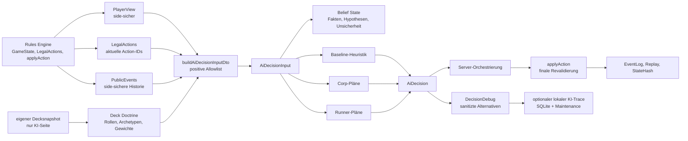

# Aktuelle NETGRID-KI-Logik, 2026-05-22

Status: Ist-Dokumentation  
Aktiver Agent: card-enablement-ai-knowledge-agent  
Scope: Dokumentation, keine Codeänderung, keine Datenänderung, keine Kartenfreigabe

## 1. Kurzfassung

Fakt aus Code: Die aktuelle NETGRID-KI ist ein deterministischer, regelgebundener Entscheider über `AiDecisionInput`. Dieser Input wird aus `PlayerView`, aktuellen `LegalActions`, side-sicheren `PublicEvents`, Schwierigkeit, Seed, `decisionId`, `actionNumber`, Profil und optional eigener `ownDeckDoctrine` gebaut (`packages/ai/src/index.ts::buildAiDecisionInput`, `packages/ai/src/input-dto.ts::buildAiDecisionInputDto`, `packages/shared/src/index.ts::AiDecisionInput`).

Fakt aus Code: Die KI ist keine Regelautorität. Sie wählt eine `actionId` und optional Choice-Auswahlen; der Server reicht diese danach als normale `PlayerAction` an `applyAction` weiter (`apps/server/src/multiplayer.ts::runAiStep`). `applyAction` bleibt die finale Revalidierung von Seite, Action, StateVersion, Timing, Kosten, Zielen und Choices.

Fakt aus Code: Die KI besteht aus Baseline-Heuristik, planbasierten Corp- und Runner-Scorern, Belief-State-Rekonstruktion, Deck Doctrine, AI-Hints, sichtbarer Runanalyse, Simulations-/Benchmark-Infrastruktur, `DecisionDebug` und optionalem lokalem KI-Trace.

Fakt aus Dokumentation: Die wichtigsten Sicherheitsgarantien sind LegalAction-Bindung, positive AI-Input-Allowlist, Hidden-Info-Barrieren, Sanitizer für `DecisionDebug`, keine normale Log-/Public-Replay-Ausgabe von `AIInput` oder `DecisionDebug`, Replay-/StateHash-Erwartungen und RNG-Trennung (`AGENTS.md`, `docs/architecture/ai/ai-controller-spec.md`, `docs/architecture/ai/ai-decision-trace-contract-2026-05-22.md`).

Ableitung: Die größte funktionale Grenze bleibt die Spielstärke. Die Planer bewerten aktuelle LegalActions unter Planabsichten; sie sind keine robuste mehrzügige Suche. Der Match-Progression-Benchmark vom 2026-05-17 zeigte Safety, aber keine bessere Abschlussdynamik gegenüber `belief_ai_v1_4_2`.

## 2. Geltungsbereich und Quellenstand

Fakt aus Dokumentation: Diese Dokumentation wurde am 2026-05-22 im lokalen Repository `C:\Projekte\NETGRID` erstellt. Der Arbeitsbaum war vor dieser Dokumentation bereits unsauber: `apps/web/app/maintenance/ai-traces/page.tsx`, `apps/web/app/maintenance/page.tsx` und `docs/reviews/ai/README.md` waren geändert; das Prompt-Artefakt `docs/reviews/ai/current-ai-logic-documentation-prompt-2026-05-22.md` war untracked.

Fakt aus Dokumentation: Pflichtquellen wurden gelesen: `AGENTS.md`, `AGENTS.local.md`, `KI-Wissen-NETGRID/00 Projektstart.md`, `KI-Wissen-NETGRID/02 Wissen/00 Uebersichten/Index.md`, `KI-Wissen-NETGRID/02 Wissen/Prozesse/Arbeitsworkflow Wissenspflege und Projektanfragen.md`, `KI-Wissen-NETGRID/00 Steuerung/Regeldatei KI-Wissenspflege.md`, `agents/card-enablement-ai-knowledge-agent.md` und `docs/codex/CODEX_STATUS.md`.

Fakt aus Code: Primär geprüfte Implementierungspfade waren `packages/ai/src/index.ts`, `packages/ai/src/input-dto.ts`, `packages/ai/src/corp-plans.ts`, `packages/ai/src/runner-plans.ts`, `packages/ai/src/belief-state.ts`, `packages/ai/src/deck-doctrine.ts`, `packages/ai/src/ai-hints.ts`, `packages/ai/src/visible-run-analysis.ts`, `packages/ai/src/index.test.ts`, `packages/shared/src/index.ts`, `apps/server/src/multiplayer.ts`, `apps/server/src/http-server.ts`, `apps/server/src/storage-sqlite.ts`, `apps/web/app/maintenance.ts`, `apps/web/app/maintenance/page.tsx` und `apps/web/app/maintenance/ai-traces/page.tsx`.

Fakt aus Dokumentation: Geprüfte Datenquellen waren unter anderem `data/ai/ai-card-hints-active.json`, `data/ai/card-role-manifest-0.9.json`, `data/ai/ai-profiles-0.9.json`, `data/ai/corp-plan-profiles-1.4.0.json`, `data/ai/runner-plan-profiles-1.4.1.json`, `data/ai/deck-role-profiles-0.9.json`, `data/ai/ai-benchmark-profiles-1.4.3.json`, `data/ai/ai-soak-seeds-1.4.3.json`, `data/ai/ai-selfplay-exploit-league-2026-05-17.json`, `data/scenarios/ai-v143-exploit-regression-fixtures.json` und `data/scenarios/ai-v09-soak-matrix.json`.

Fakt aus Dokumentation: `data/ai/ai-card-hints-active.json` enthält aktuell 410 Kartenhinweise. Eine maschinenlesbare Zählung der Datei ergab `aiSupportStatus=ai_supported` für alle 410 Einträge.

Aktualitätslücke: `docs/reviews/ai/ai-hints-role-gap-report-2026-05-17.md` nennt noch 377 `ai_supported` und 33 `hinted_only`. Das ist gegenüber dem aktuellen Dateistand überholt oder beschreibt einen älteren Schnitt. Folgeprüfer sollten die Ursache getrennt prüfen, bevor daraus Gate-Aussagen abgeleitet werden.

## 3. Quellenmatrix

| Quelle | Zweck | Verwendete Aussagen | Aktualität | Konflikt/Lücke |
| --- | --- | --- | --- | --- |
| `AGENTS.md` | globaler Projektvertrag | Engine-Autorität, LegalActions, Hidden-Info, Replay/StateHash | aktiv | keine |
| `docs/codex/CODEX_STATUS.md` | aktueller Projektstand | aktuelle AI-Fixes, V2-Redaction-Grenzen, Trace-Status | aktiv | sehr lang, teils chronologisch verdichtet |
| `docs/architecture/ai/ai-controller-spec.md` | AI-Controller-Vertrag | erlaubte/verbotene AI-Inputs, Fallback, Serverloop | frozen 2026-05-03 | älter als Trace-Erweiterungen |
| `docs/architecture/ai/ai-decision-trace-contract-2026-05-22.md` | Trace-Vertrag | `D6_ai_debug_data`, Aktivierung, Verbote, Meta/Detail/Export | aktuell | kein Codebeweis allein |
| `docs/reviews/ai/capability-deep-analysis-2026-05-17.md` | Deep Analysis | Baseline, Planer, Belief, Doctrine, Grenzen | nützlich, aber vor Trace-Paketen | Hint-Zahlen veraltet |
| `docs/activities/done/act-2026-05-22-*` | Umsetzungsnachweise | Trace-Schema, SQLite/API, Viewer, Action-Level, Live-Follow | aktuell | Paketchecks teils gezielt, nicht vollständige Suite |
| `packages/ai/src/index.ts` | zentrale KI | Inputbau, Dispatch, Baseline, Simulation, Debug | aktuell | großer Mischpfad |
| `packages/ai/src/input-dto.ts` | Sanitizing | positive Allowlist für PlayerView, LegalActions, PublicEvents, Doctrine | aktuell | muss bei neuen Payloadformen gepflegt werden |
| `packages/ai/src/corp-plans.ts` | Corp-Planer | Planarten, Kandidaten, Scoring, Alternativen | aktuell | keine echte Mehrzugplanung |
| `packages/ai/src/runner-plans.ts` | Runner-Planer | Planarten, sichtbare Runanalyse, Zwei-Zug-Intent, Action-Level | aktuell | Intent ist single-decision rekonstruiert |
| `packages/ai/src/belief-state.ts` | Belief State | Fakten, Hypothesen, Invalidation, GegnerModelle | aktuell | keine persistente Wissensdatenbank |
| `apps/server/src/multiplayer.ts` | Live-Orchestrierung | `runAiStep`, private Decksnapshots, ReplayDebug, Trace-Erzeugung | aktuell | Trace nur bei aktiviertem Modus |
| `apps/server/src/storage-sqlite.ts` | Persistenz | Tabelle `ai_decision_traces`, Maintenance DTOs | aktuell | nur SQLite-Maintenance-Pfad |
| `apps/web/app/maintenance*.tsx` | private UI | Trace-Auswahl, Details, Live-Follow, Export | aktuell, aber lokal geändert | bestehende uncommitted Änderungen beachten |

## 4. Architekturüberblick

| Komponente | Zweck | Eingaben | Ausgaben | Sicherheitsgrenze | wichtigste Dateien |
| --- | --- | --- | --- | --- | --- |
| Rules Engine | Regelautorität | `GameState`, `PlayerAction` | neuer State, Events, StateHash | validiert alles erneut | `packages/shared/src/index.ts`, Engine-Exports |
| AI-Input-Builder | sichtbaren Input bauen | State, Seite, Profil, eigener Snapshot | `AiDecisionInput` | PlayerView/LegalActions/Events-Allowlist | `packages/ai/src/index.ts`, `packages/ai/src/input-dto.ts` |
| Baseline | reaktive Einzelaktionsbewertung | `AiDecisionInput` | `AiDecision` | nur LegalActions | `packages/ai/src/index.ts` |
| Corp-Planer | Corp-Planabsichten scoren | LegalActions, Belief, Doctrine | Planentscheidung, Debug | aktuelle LegalAction bleibt Ausführung | `packages/ai/src/corp-plans.ts` |
| Runner-Planer | Runner-Planabsichten scoren | LegalActions, sichtbares Board, Belief, Doctrine | Planentscheidung, Debug | keine verdeckten Corp-Karten | `packages/ai/src/runner-plans.ts` |
| Belief State | sichtbare Historie rekonstruieren | PlayerView, EventTail, PublicEvents | Fakten, Hypothesen, Modelle | Hypothesen bleiben markiert | `packages/ai/src/belief-state.ts` |
| Deck Doctrine | eigenes Deck profilieren | eigener Decksnapshot | Rollenstatistik, Archetypen, Gewichte | keine gegnerische Deckliste | `packages/ai/src/deck-doctrine.ts` |
| AI-Hints | Kartenrollen liefern | aktive Hintdatei, Rollenmanifest | Rollen/Planrollen | Rollen geben keine Playability frei | `packages/ai/src/ai-hints.ts`, `data/ai/*` |
| Simulation/Benchmark | Safety und Qualität messen | Seeds, Decks, Profile | Metriken, Reports | keine FullState-Offenlegung als KI-Input | `packages/ai/src/index.ts`, `data/ai/*` |
| DecisionDebug | Entscheidung erklären | sanitisierbare Debugdaten | begrenzte Alternativen/Gründe | Sanitizer + Perspektivredaction | `packages/shared/src/index.ts` |
| KI-Trace | private Diagnose speichern | sanitisierter Debugkern | SQLite-Trace, Maintenance ViewModels | lokal, opt-in, D6 | `apps/server/src/*`, `apps/web/app/maintenance*` |

Fakt aus Code: `chooseAiAction` dispatcht nach Seite. `chooseCorpAction` und `chooseRunnerAction` erzeugen zuerst eine Baseline-Entscheidung und delegieren nur dann an Planer, wenn passende Planaktionen vorhanden sind und die Baseline nicht als reaktiver Sonderfall gelten soll.

Fakt aus Code: Die Planer liefern eine `AiDecision`; diese enthält `actionId`, optionale `selectedChoices`, `reasonCode`, `explanation`, `consideredActionIds`, `fallbackUsed`, optionale `confidence`, `evidence`, `decisionDebug`, `timeoutUsed`, `profileId`, `difficulty` und `reason`.

## 5. Datenfluss pro KI-Entscheidung

Fakt aus Code: `apps/server/src/multiplayer.ts::runAiStep` ist der produktive private Multiplayer-Pfad. Er bestimmt die aktive KI-Seite, holt aktuelle `getLegalActions`, liest `record.privateDeckSnapshots?.[side]`, baut `AiDecisionInput`, ruft `chooseAiAction`, findet die gewählte LegalAction erneut in den aktuellen LegalActions und ruft `applyAction`.

Fakt aus Code: `buildAiDecisionInput` nutzt `getPlayerView(state, side)`, `getLegalActions(state, side)`, `state.eventLog.slice(-12)` als EventTail und optional `buildDeckDoctrineProfile(options.ownDeckSnapshot)`.

Fakt aus Code: `buildAiDecisionInputDto` saniert `playerView`, `eventTail`, `legalActions` und `ownDeckDoctrine` über positive Kopierfunktionen. Für verschachtelte `LegalAction.payload` und `PublicEvent.publicPayload` gibt es explizite erlaubte Schlüssel.

Fakt aus Code: Nach der KI-Auswahl wird nicht die ganze KI-Entscheidung als Wahrheit übernommen. Der Server sucht die `actionId` in den aktuellen LegalActions, fällt notfalls deterministisch auf die erste sortierte LegalAction zurück und übergibt an `applyAction`.

Fakt aus Code: `applyAction` erzeugt ein Engine-Event. Der Server ergänzt daran öffentliche KI-Metadaten wie `aiReasonCode`, `aiExplanation`, optional sanitisierte `aiDecisionDebug`, `aiFallbackUsed`, `aiTimeoutUsed` und `aiConfidence`.

Ableitung: Der wichtigste No-Cheat-Schnitt liegt vor `chooseAiAction` im DTO und nach `chooseAiAction` in `applyAction`. Die KI kann keine eigene Action-ID erfinden, die die Engine anschließend ungeprüft akzeptiert.

## 6. Eingabe- und Sichtbarkeitsmodell

Fakt aus Dokumentation: Erlaubte KI-Daten sind `side`, `playerView`, `legalActions`, side-gefilterte `PublicGameEvent`-Taildaten, `difficulty`, `seed`, `decisionId`, `actionNumber`, `profileId` und eigene Deck Doctrine.

Fakt aus Dokumentation: Verboten sind `GameState`, `cardInstances`, gegnerische Hand-/Deck-/R&D-/Stack-Reihenfolgen, unrezzed Corp-Kartentitel für Runner, Runner-Grip-/Stack-Titel für Corp, Session-/Token-/Storage-/WebSocket-Interna und private Event-Payloads der Gegenseite.

Fakt aus Code: `packages/ai/src/index.ts::assertAiInputIsSideSafe` scannt serialisierten AI-Input gegen verbotene Feldnamen wie `cardInstances`, `privatePayload`, `fullGameState`, Tokens und private Deckdaten.

Fakt aus Code: `packages/ai/src/input-dto.ts` saniert `VisibleCard`, `VisibleChoiceRequest`, `LegalAction`, `Cost`, `TargetRequirement`, `ChoiceRequirement`, `ResolvedGameEffect`, `PublicGameEvent` und `AiDeckDoctrineProfile`.

Fakt aus Code: `packages/ai/src/index.test.ts` enthält rote Fixtures für versteckte Runner-Resources, nested forbidden DTO payloads, stabile Entscheidungen bei eingeschleusten verbotenen Payloadfeldern, Hidden-State-Invarianz und side-sichere Hidden-Zone-/Breach-/Special-Zone-Fälle.

Lücke: Die Allowlist muss aktiv gepflegt werden. Wenn die Engine neue legitime Payloadformen ergänzt, muss `input-dto.ts` diese bewusst erlauben; wenn sie versehentlich Hidden Info enthält, darf die KI-Schicht sie nicht durchreichen.

## 7. Baseline-Heuristik

Fakt aus Code: Die Baseline lebt in `packages/ai/src/index.ts`, insbesondere in `scoreRunnerAction`, `scoreCorpAction`, `scoreRunTarget`, `selectedChoicesForDecision`, `qualityTagsForAction` und Hilfsfunktionen wie `pumpCanLeadToBreak`.

Fakt aus Code: Runner-Baseline bewertet Setup/Mulligan, Choices, Trace-Bids, Access/Steal/Trash, Runs, Jack-out/Continue, Break/Pump, Installationen, Economy, Draw, Tags, Shell-Traders-Entscheidungen, Such-/Discard-Auswahl und stale Zentralserver-Wiederholungen.

Fakt aus Code: Corp-Baseline bewertet Mandatory Draw, Score, Rez/Decline-Rez, Advance, Installationen, Operations, Purge, Draw, Gain Credit, End Turn, Trace-Bids und Choice-Auflösung.

Fakt aus Code: Reaktive Baseline-Entscheidungen bleiben bevorzugt, wenn sie spezielle Timingfenster bedienen, etwa Trace-Bids, Post-Bid-Link-Choices, Zugriff, Jack-out, Break/Pump oder `resolve_choice`.

Ableitung: Die Baseline ist Fallback und Sicherheitsnetz für viele Timingpunkte. Ihre Grenze ist, dass sie aktuelle Einzelaktionen bewertet und keine robuste Sequenz über mehrere Züge plant.

## 8. Planbasierte Corp-KI

Fakt aus Code: `packages/ai/src/corp-plans.ts` definiert die Planarten `score_now`, `score_next_turn`, `build_scoring_remote`, `protect_hq`, `protect_rnd`, `recover_economy` und `bait_runner`.

Fakt aus Code: `generateCorpPlanCandidates` bildet Kandidaten aus aktuellen LegalActions. `evaluateCorpPlan` kombiniert Basiswert, Doctrine-Gewicht, Agenda-Risiko, Serverdruck, Credit-Reserve, ICE-Rez, Scoring-Fenster, Scoring-Fortschritt, Runner-Contest, Scoring-Horizon, Remote-Rez-Reserve, jüngste Remote-Agenda-Verluste, installierte Economy, Extra-Actions, Remote-Intent-Memory und sichtbare Risiken.

Fakt aus Code: `evaluateRunnerContestCapacity`, `assessKnownIcePathForRunnerContest` und `remoteRootActionSecurityScore` schätzen Runner-Contest side-sicher aus sichtbaren Runner-Credits, sichtbaren Breakern, bekannten/rezzed ICE-Pfaden und Remote-Struktur.

Fakt aus Code: `chooseCorpPlanDecision` respektiert ein Zeitbudget; bei Budgetüberschreitung oder fehlendem Kandidat entsteht ein markierter Fallback. Debugdaten enthalten Top-Alternativen, ScoreBreakdown, Warnings, DetailSections, LongTermPlan und Action-Level-Alternativen.

Ableitung: Corp kann geschützte Remote-Linien, Agenda-Flood und Rez-Reserve inzwischen besser gewichten als in der Deep-Analyse vom 17.05. Trotzdem bleibt die Umsetzung eine aktuelle LegalAction, keine persistente mehrzügige Remote-Bauplanung.

## 9. Planbasierte Runner-KI

Fakt aus Code: `packages/ai/src/runner-plans.ts` definiert die Planarten `pressure_rnd`, `pressure_hq`, `contest_remote`, `build_rig`, `recover_economy`, `draw_for_answers`, `trash_asset` und `safe_probe_run`.

Fakt aus Code: `generateRunnerPlanCandidates` gruppiert aktuelle LegalActions nach Runs, Remote Contest, Rig-Aufbau, Economy, Draw, Trash und sicheren Probe-/Movement-Fenstern.

Fakt aus Code: `evaluateRunnerPlan` kombiniert Basiswert, Doctrine-Gewicht, Early-Turn-Doktrin, Runner-Rig, Run-Kosten, Serverwert, Remote-Threat, Corp-Scoring-Gefahr, sichtbare Breaker-Planung, Zwei-Zug-Intent, City-Surveillance-Draw-Risiko, installierte Economy, Shell-Traders-Werte, sichtbare Risiken und Easy-Run-Bremse.

Fakt aus Code: `evaluateRunnerTwoTurnRunIntent` ist kein persistenter Plan; die Evidence nennt `two_turn_run_intent_lifetime:single_decision` und Invalidierung über Ziel, Credits, sichtbares ICE und Breaker. Er kann Economy/Draw vor einem sichtbaren Zielrun priorisieren und danach wieder auf Run umschalten.

Fakt aus Code: `actionPriority` bevorzugt bei erreichtem Server-Movement-Fenster `continue_run` gegenüber `jack_out`, während vor weiterer sichtbarer Gefahr `jack_out` sinnvoll bleiben kann. Tests decken Krash/Filter, Krash/Keeper, Remote-Trash-Affordability und R&D-Zugriff nach letztem ICE ab.

Ableitung: Runner ist stärker als am 17.05 dokumentiert, vor allem bei sichtbaren Breaker-/ICE-Kosten, Krash-Fällen, Remote-Trash-Affordability und kurzem Economy-Intent. Es bleibt aber keine generelle mehrzügige Such-KI.

## 10. Belief State und Opponent Model

Fakt aus Code: `packages/ai/src/belief-state.ts::reconstructBeliefState` rekonstruiert pro Entscheidung einen `BeliefState` aus AIInput-Historie und PlayerView. Wissensarten sind `public_fact`, `own_private_fact`, `revealed_opponent_fact`, `hypothesis` und `unknown`.

Fakt aus Code: Rekonstruiert werden unter anderem eigene private Fakten, öffentliches Board, rechtmäßig revealed gegnerische Karten, unbekannte gegnerische Hidden-Zonen, Hypothesen zu unbekannten Remote-Roots und unrezzed ICE, R&D-Top-Freshness, bekannte Positionen, bekannte HQ-Handdaten, Runner-Opponent-Model und Corp-Opponent-Model.

Fakt aus Code: Invalidation entsteht aus klassifizierten öffentlichen Events. R&D-Top-Wissen wird nach relevanten Corp-Zonenänderungen invalidiert oder als stale markiert. HQ-Handmemory wird bei bekannten Abgängen, unbekannten Ankünften oder Hidden-Zone-Reorder konservativ bereinigt.

Fakt aus Code: `beliefDebugSummary` gibt nur begrenzte Fakten, Hypothesen, Unsicherheit, Invalidations, MemoryVersion und Opponent-Model-Auszüge weiter. `DecisionDebug` nutzt diesen sanitisierbaren Auszug.

Ableitung: Der Belief State ist fair und nützlich, aber keine persistente Datenbank, keine vollständige Wahrscheinlichkeitsverteilung und kein Zugriff auf echte gegnerische Decklisten oder verdeckte Karten.

## 11. Deck Doctrine

Fakt aus Code: `packages/ai/src/deck-doctrine.ts::buildDeckDoctrineProfile` baut `AiDeckDoctrineProfile` aus einem eigenen `AiDeckDoctrineDeckSnapshot`. Es zählt Rollen, fehlende Rollen, Archetype-Tags, PlanWeights, MulliganWeights, RiskFlags, Confidence und Evidence.

Fakt aus Code: Der Live-Serverpfad übergibt in `runAiStep` nur `record.privateDeckSnapshots?.[side]` an `buildAiDecisionInput`. Der produktive private Multiplayer-Pfad ist damit doctrine-fähig, ohne gegnerische Decklisten weiterzugeben.

Fakt aus Code: `buildAiDecisionInputDto` übernimmt Doctrine nur über `sanitizeAiDeckDoctrineProfile`. Die DTO-Schicht kopiert keine Kartenliste in den KI-Input.

Fakt aus Dokumentation: `docs/reviews/ai/live-doctrine-input-path-audit-2026-05-17.md` klassifiziert doctrine-lose Pfade als Legacy-/Demo-, Baseline- oder Testpfade. Produktiver Multiplayer nutzt eigene private Snapshots.

Lücke: `deck-doctrine.ts` setzt aktuell `deckHash` aus `snapshot.publicMetadata?.deckHash` oder einem `unknown:<snapshotId>`-Fallback in das Profil. Der AI-Input-DTO sanitizt das Profil; die Trace-/Debugprojektion gibt nur Confidence, ArchetypeTags und RiskFlags aus. Folgeprüfer sollten trotzdem prüfen, ob `deckHash` künftig aus allen nicht-debuggenden KI-Payloads fernbleibt.

## 12. AI-Hints und Kartenrollen

Fakt aus Code: `packages/ai/src/ai-hints.ts` lädt `data/ai/ai-card-hints-active.json`, `data/ai/card-role-manifest-0.9.json` und Runtime-Karten aus dem Catalog. `createAiHintsByCard` liefert eine Map von `cardId` zu Rollen, Planrollen und `aiSupportStatus`.

Fakt aus Dokumentation: `docs/architecture/ai/ai-hints-structure-decision-2026-05-15.md` legt fest, dass historische Release-/Batch-Hintdateien nicht mehr primäre Runtime-Quelle sind. Die aktive Runtime-Quelle ist `data/ai/ai-card-hints-active.json`.

Fakt aus Dokumentation: `data/ai/card-role-manifest-0.9.json` ist ein historischer manueller Basisschnitt mit 34 Karten und GateAssertions wie `manualRolesOnly`, `noCardTextParsing`, `noHiddenOpponentDecklists` und `rolesDoNotGrantPlayability`.

Fakt aus Dokumentation: Die aktive Hintdatei enthält aktuell 410 Einträge und alle sind als `ai_supported` markiert. Das unterscheidet sich vom Role-Gap-Report vom 17.05.

Ableitung: AI-Hints verbessern Bewertung und Doctrine, geben aber keine Engine-, Decklegalitäts- oder Playability-Freigabe. Legalität entsteht weiterhin über Katalog-/Deck-/Engine-Gates und LegalActions.

## 13. Simulation, Selfplay, Benchmarks und Exploit-Regressionen

Fakt aus Code: `packages/ai/src/index.ts` enthält `simulateAiGame`, `simulateAiSoak`, `createBeliefSimulationWorld`, `runV143SimulationLeague`, `runDoctrineQualityBenchmark`, `runMatchProgressionBenchmark`, `evaluateDoctrineQualityGate`, `format*Report`, `analyzeDoctrineQualityCases` und `runV143ExploitRegressionFixtures`.

Fakt aus Code: Simulationen bauen pro Schritt AIInputs, prüfen `assertAiInputIsSideSafe`, wählen je nach Profilmodus eine Entscheidung, wenden `applyAction` an und replayen das EventLog. `createBeliefSimulationWorld` erzeugt nur redaction-sichere Hypothesen aus Belief-Einträgen.

Fakt aus Dokumentation: `data/ai/ai-benchmark-profiles-1.4.3.json` definiert sieben Profile: `random_legal_bot`, `basic_corp_ai`, `basic_runner_ai`, `plan_corp_v1_4_0`, `plan_runner_v1_4_1`, `belief_ai_v1_4_2` und `current_candidate`.

Fakt aus Dokumentation: `data/ai/ai-soak-seeds-1.4.3.json` enthält sechs Tuning- und drei Holdout-Seeds. `data/scenarios/ai-v143-exploit-regression-fixtures.json` enthält zwei Fixtures.

Fakt aus Dokumentation: Der Match-Progression-Benchmark vom 17.05 zeigte für Baseline und Candidate `illegalActions=0`, `replayFailures=0`, `timeoutRate=0`, aber `actionLimitRate=1` und keine Korp-Scores oder Remote-Advances im kurzen Diagnosefenster.

Ableitung: Diese Infrastruktur beweist vor allem Safety, Determinismus, Replay-Stabilität und regressionsarme lokale Verbesserungen. Sie beweist noch keine breite O:NR-Spielstärke.

## 14. DecisionDebug

Fakt aus Code: `packages/shared/src/index.ts` definiert `AI_DECISION_DEBUG_SCHEMA_VERSION = "ai-decision-debug-v1"`, `AiDecisionDebug` und `sanitizeAiDecisionDebug`.

Fakt aus Code: `AiDecisionDebug` kann `summary`, `planId`, `planKind`, `selectedActionType`, `score`, `confidence`, `visibleReasons`, `rankedAlternatives`, `actionAlternatives`, `scoreBreakdown`, `whyNot`, `longTermPlan`, `warnings`, `detailSections`, `uncertainty`, `evidence`, `fallbackUsed`, `seed`, `profileId`, `timeBudgetMs`, `timeoutUsed`, `memoryVersion`, `facts`, `hypotheses`, `invalidations`, `beliefUncertainty`, `opponentModel`, `ownDeckDoctrine` und `doctrinePlanWeight` enthalten.

Fakt aus Code: Der Sanitizer begrenzt Listen, rekursives JSON und Tiefe. Er redigiert verbotene Keys und Werte über Muster für `privatePayload`, `cardInstances`, `fullGameState`, Tokens, private Decksnapshots, Decklisten, Gegnerhand-/HQ-/R&D-/Stack-Inhalte und ähnliche Felder.

Fakt aus Code: `apps/server/src/multiplayer.ts::replayDecisionDebugForPerspective` redigiert `DecisionDebug` in Replay-Perspektiven: Wenn die Perspektive nicht `local_analysis` und nicht die Actor-Seite ist, wird nur `{ schemaVersion, redacted: true, reason: "side_private_ai_debug" }` geliefert.

Fakt aus Code: `packages/ai/src/index.test.ts` enthält Snapshot- und Redaction-Tests für Runner/Korp-DecisionDebug, ranked alternatives, action alternatives, score breakdown und verbotene Key-/Value-Muster. `apps/server/src/multiplayer.test.ts` prüft side-sichere Replay-DecisionDebug-Projektion.

## 15. KI-Entscheidungstrace und Wartungsansicht

Fakt aus Dokumentation: `docs/architecture/ai/ai-decision-trace-contract-2026-05-22.md` klassifiziert `AiDecisionTrace` als lokale private Wartungs- und Analysedatenklasse `D6_ai_debug_data`. Der Trace ist standardmäßig aus und darf pro Match als `summary` oder `detailed` aktiviert werden.

Fakt aus Code: `apps/server/src/multiplayer.ts` kennt `AiDecisionTraceMode = "off" | "summary" | "detailed"`. `createMatch` speichert `aiTraceMode` nur, wenn er nicht `off` ist; `enableStorageMaintenanceAiDecisionTrace` kann laufende nicht-terminale KI-Matches nachträglich auf `summary` oder `detailed` setzen.

Fakt aus Code: `aiDecisionTraceFor` erzeugt nur dann einen Trace, wenn Trace nicht `off` ist und ein sanitisierbarer `decisionDebug` existiert. Das `traceJson` entsteht aus `aiDecisionTraceJson`, nicht aus FullState oder AIInput.

Fakt aus Code: `apps/server/src/storage-sqlite.ts` speichert Traces in `ai_decision_traces` mit `match_id`, `trace_id`, `event_id`, `state_version`, `match_version`, `side`, `turn`, `decision_index`, `selected_action_id`, `selected_action_type`, `plan_kind`, `score`, `confidence`, `created_at`, `schema_version` und `trace_json`.

Fakt aus Code: Private Maintenance-Endpunkte in `apps/server/src/http-server.ts` liefern Matchliste, Trace-Index, Trace-Detail und Enable-API unter `/api/storage/maintenance/ai-decision-traces/*`. `ensureMaintenanceAccess` beschränkt sie auf lokales Profil und erlaubte lokale/private Adressen.

Fakt aus Code: `apps/web/app/maintenance.ts`, `apps/web/app/maintenance/page.tsx` und `apps/web/app/maintenance/ai-traces/page.tsx` stellen Matchauswahl, Timeline, Metaebene, Detailansicht, Action-Level-Alternativen, Live-Follow per Polling, Pause/Fortsetzen, Sprung zur neuesten Entscheidung und NDJSON-Export bereit.

Fakt aus Code: `buildMaintenanceAiTraceNdjsonExport` exportiert nur die redigierte Trace-Index-Projektion und wirft bei verbotenen Markern wie `AIInput`, `DecisionDebug`, `cardInstances`, `privatePayload`, Decklisten oder lokalen Pfaden.

## 16. Server-, Web- und Multiplayer-Orchestrierung

Fakt aus Code: `advance_ai` läuft über `apps/server/src/http-server.ts`, delegiert an `MultiplayerService.advanceAi` und endet in `runAiStep`.

Fakt aus Code: `advanceAi` unterscheidet Single-Step und Until-Human über die interne Schleife. Der Loop stoppt bei Human-Turn, Winner, fehlenden LegalActions oder Limits.

Fakt aus Code: Normale Spielpayloads und Replay-Perspektiven verwenden side-sichere Projektionen. `local_analysis` ist eine explizite private Replay-Perspektive; normaler Export von `local_analysis` wird blockiert.

Fakt aus Code: Die Maintenance-KI-Trace-Ansicht ist getrennt vom normalen Matchscreen. Der normale Matchscreen erhält keine Trace-Timeline und keine vollständigen Trace-Details.

Ableitung: KI-Pacing und Gegner-Cues sind Präsentations-/Orchestrierungsschichten. Sie ändern nicht die KI-Entscheidungslogik und nicht die Engine-Regeln.

## 17. Determinismus, Replay, StateHash und Zufall

Fakt aus Code: AIInputs enthalten `seed`, `decisionId` und `actionNumber`. Simulationen nutzen zusätzlich `simulationRngSeed` und `createSimulationRng` mit eigenem Counter.

Fakt aus Code: `simulateAiGame` replayt am Ende `replayEvents(initial, state.eventLog)` und vergleicht den replayten StateHash mit dem aktuellen StateHash. Metriken erfassen `replayFailures`, `illegalActions`, Fallbacks und Timeouts.

Fakt aus Code: Engine-Zufall bleibt in `randomDrawRecords` mit Counter, Purpose und Hash/StateHash verankert. Replay-Projektionen zeigen RandomDraw-Einträge nur gehasht.

Fakt aus Code: `packages/ai/src/index.test.ts` prüft deterministische Entscheidungen, Simulation-RNG-Isolation und dass Belief-Aufbau/Aktionswahl den echten GameState-Hash nicht mutiert.

Ableitung: KI-Entscheidungen sollen bei gleichem sichtbarem Input stabil sein. Engine-Zufall bleibt Engine-Zufall; Simulation-RNG ist Diagnose-/Benchmark-Zufall und darf nicht echte Hidden-Karten offenlegen.

## 18. Test- und Evidence-Landkarte

Fakt aus Code: `packages/ai/src/index.test.ts` ist die wichtigste AI-Testdatei. Sie deckt AI-Controller-Vertrag, Side-Safety, nested Payload-Allowlist, aktive AI-supported Karten, sichtbare Runanalyse, Fallback, Choices, Discard, Trace-Bids, Hidden-Zonen, Runner- und Corp-Baseline, V1.4.0 Corp-Planung, V1.4.1 Runner-Planung, V1.4.2 Belief State, V1.4.3 Simulation/Selfplay/Exploit, Doctrine und viele konkrete Regressionen ab.

Fakt aus Code: `apps/server/src/multiplayer.test.ts` deckt private Storage-Maintenance, KI-Trace-SQLite/API, Cursor-Abfrage, Enable-API, replay DecisionDebug, Replay-Export-Redaction und Multiplayer-spezifische Sichtbarkeit ab.

Fakt aus Code: `apps/web/app/maintenance.test.ts` deckt Maintenance-Helper, verbotene Marker, AI-Trace-Titel/Meta, Action-Level-Broker-Fall, Merge/Index-Pfade und redigierten NDJSON-Export ab.

Fakt aus Dokumentation: Die 2026-05-22-Activity-Artefakte nennen gezielte grüne Checks für Shared/AI/Server/Web-Typechecks und fokussierte Vitest-Läufe. Mehrere Pakete dokumentieren, dass ein vollständiger `packages/ai/src/index.test.ts`-Lauf wegen bekannter Simulations-Smoke-Fehler `No legal action for runner at 65/13` rot blieb.

Lücke: Die gezielten Trace- und Redaction-Checks sind grün, aber der dokumentierte vollständige AI-Testlauf war zum Zeitpunkt der Trace-Pakete nicht komplett grün. Das ist eine echte Restlücke für Folge-Reviewer.

## 19. Aktuelle bekannte Schwächen und offene Prüffragen

Engine-Risiken:

- Fakt aus Dokumentation: Keine aktuelle Quelle behauptet, dass die KI Engine-Regeln erweitert. Prüffrage: Decken die Tests jede neue LegalAction-Payloadform ab, bevor sie in `input-dto.ts` erlaubt wird?

Hidden-Info-Risiken:

- Lücke: Die AI-Input-Allowlist und `DecisionDebug`-Sanitizer sind stark, aber musterbasiert. Prüffrage: Sollte zusätzlich ein Snapshot-/Schema-Gate für alle erlaubten AIInput-DTO-Formen eingeführt werden?
- Lücke: Der aktuelle Hint-Zahlenstand widerspricht dem alten Role-Gap-Report. Prüffrage: Wurde `hinted_only` bewusst aufgelöst oder ist die aktuelle Datei zu breit auf `ai_supported` gesetzt?

KI-Qualitätsrisiken:

- Ableitung: Die KI plant überwiegend current-action-basiert. Mehrzügige Remote-Bau-, Rig-/Economy- und Matchabschluss-Linien bleiben begrenzt.
- Fakt aus Dokumentation: Match-Progression war im 17.05-Benchmark nicht besser als Baseline und lief in Action-Limits.

Trace-/Debug-Risiken:

- Fakt aus Code: Trace-Persistenz hängt von `decision.decisionDebug` ab. Entscheidungen ohne Debug erzeugen keinen Trace.
- Prüffrage: Braucht `ai-decision-trace-v1` ein formales Shared-Type-Exportobjekt statt ad hoc `Record<string, unknown>` in Servercode?

Testlücken:

- Fakt aus Dokumentation: Vollständiger AI-Testlauf war bei Trace-Paketen nicht grün. Prüffrage: Sind die `No legal action for runner`-Smokes inzwischen gefixt oder als bekannte separate Regression offen?
- Lücke: Browser-Check für `/maintenance/ai-traces` ist dokumentiert, aber diese Dokumentation hat ihn nicht erneut ausgeführt.

Wartbarkeitsrisiken:

- Ableitung: `packages/ai/src/index.ts` ist sehr breit und mischt Baseline, Simulation, Benchmarks, Discard, Search, Trace-Kontexte und viele Spezialfälle. Eine spätere Strukturprüfung könnte sinnvoll sein, ohne die Sicherheitsgrenzen zu ändern.

## 20. Verbesserungskandidaten

| Risiko/Schwäche | Beleg | Schwere | Verbesserungskandidat | Testbedarf |
| --- | --- | --- | --- | --- |
| Vollständiger AI-Testlauf dokumentiert rot | Activity-Notizen 2026-05-22 zu `No legal action for runner at 65/13` | hoch | Simulations-Smokes isolieren und entweder fixen oder als bekanntes XFail-freies Paket dokumentieren | vollständiger `@netgrid/ai`-Lauf, Regression-Fixtures |
| Hint-Zahlen widersprechen altem Report | aktuelle Zählung 410 `ai_supported`, Report 377/33 | mittel | AI-Hints-Count-Contract aktualisieren | Script/Test für aktive Hints, Runtime, Approval |
| Keine echte Mehrzugplanung | Deep Analysis, Runner/Corp-Code | mittel | kleine side-sichere Planhorizonte für Runner Rig/Economy und Corp Remote/Rezreserve | Hidden-State-Invarianz, Progression-Benchmark |
| AIInput-Allowlist-Pflegeaufwand | `input-dto.ts` positive Keys | hoch | DTO-Schema-Snapshots pro Action-/Eventfamilie | nested forbidden fixtures, erlaubte Payload-Fixtures |
| Trace-Schema serverlokal | `aiDecisionTraceJson` als `Record<string, unknown>` | mittel | Shared Trace-Typ und Versionsexport | Server/Web Typecheck, redaction snapshots |
| Maintenance-Export nur Index, nicht Detail | `buildMaintenanceAiTraceNdjsonExport` | niedrig | optionaler Detail-Export mit gleicher ViewModel-Redaction | Export-Redaction gegen Details |
| Strategische Stagnation | Match-Progression-Report | mittel | längere Holdout-Progression-Liga nach Safety-Gate | Safety + Progression + Replay |

## 21. Prüffragen für Folge-Reviewer

1. Prüffrage: Ist `data/ai/ai-card-hints-active.json` mit 410 `ai_supported`-Einträgen fachlich beabsichtigt, und sind die alten `hinted_only`-Karten bewusst promotet?
2. Prüffrage: Sind die dokumentierten vollständigen AI-Testfehler `No legal action for runner at 65/13` noch reproduzierbar?
3. Prüffrage: Gibt es LegalAction- oder PublicEvent-Payloadformen, die seit der Allowlist-Erweiterung hinzugekommen sind und nicht in `packages/ai/src/input-dto.ts` abgebildet sind?
4. Prüffrage: Sollte `AiDecisionTrace` als eigener Shared-Typ neben `AiDecisionDebug` definiert werden, damit Server/Web nicht nur über lose Records gekoppelt sind?
5. Prüffrage: Bleiben `aiDecisionDebug` und Trace-Daten wirklich aus normalen WebSocket-Spielpayloads, Public Replay, Exporten und Observability-Logs, wenn neue UI-/Replay-Flächen ergänzt werden?
6. Prüffrage: Welche kleine Progression-Metrik ist als nächstes Gate am wertvollsten: Korp-Remote-Advances, Runner-Steals, Score-Windows oder Action-Limit-Rate?
